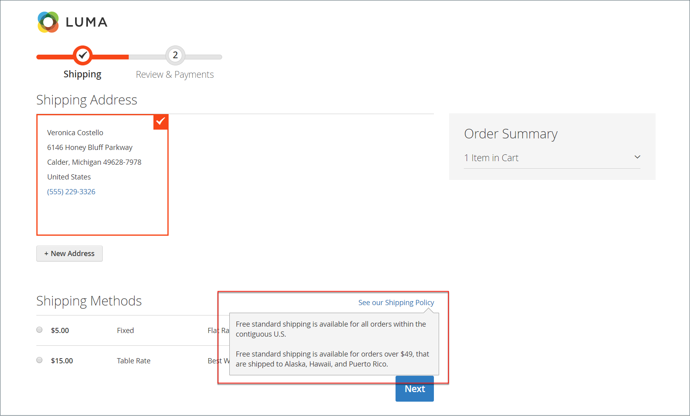

# Paramètres d&#39;expédition

La configuration de l’expédition établit le point d’origine de tous les envois, votre politique d’expédition et le traitement des envois à plusieurs adresses.

## Point d’origine

Le point d’origine sert à calculer les frais pour les envois effectués à partir de votre magasin ou de votre entrepôt, ainsi qu’à déterminer le taux de taxe pour les produits vendus. Lors du calcul [Impôts de l&#39;UE](international-tax-guidelines.md#eu-tax-configuration), assurez-vous que la variable [Calcul de la destination de la taxe par défaut](../configuration-reference/sales/tax.md) pour chaque vue de magasin correspond au point d’origine Paramètres d’expédition.

{width="600" zoomable="yes"}

1. Sur le _Administration_ barre latérale, accédez à **[!UICONTROL Stores]** > _[!UICONTROL Settings]_>**[!UICONTROL Configuration]**.

1. Dans le panneau de gauche, développez **[!UICONTROL Sales]** et choisissez **[!UICONTROL Shipping Settings]**.

1. Développer  la valeur **[!UICONTROL Origin]** et procédez comme suit :

   - [!UICONTROL Country]
   - [!UICONTROL Region / State]
   - [!UICONTROL ZIP / Postal Code]
   - [!UICONTROL City]
   - [!UICONTROL Street Address] (et ligne 2, si nécessaire)

1. Cliquez sur **[!UICONTROL Save Config]**.

## Politique d&#39;expédition

Une politique d’expédition doit expliquer les règles commerciales et les directives de votre société concernant les envois. Par exemple, si des règles de prix entraînent la livraison gratuite, vous pouvez expliquer les conditions de votre politique de livraison.

{width="700" zoomable="yes"}

Pour afficher votre politique de livraison lors du passage en caisse, renseignez les Paramètres de la politique de livraison dans la configuration. Le texte s’affiche lorsque les clients cliquent _Voir notre politique de livraison_ pendant le passage en caisse.

1. Sur le _Administration_ barre latérale, accédez à **[!UICONTROL Stores]** > _[!UICONTROL Settings]_>**[!UICONTROL Configuration]**.

1. Dans le panneau de gauche, développez **[!UICONTROL Sales]** et choisissez **[!UICONTROL Shipping Settings]**.

1. Développer  la valeur **[!UICONTROL Shipping Policy Parameters]** .

1. Définir **[!UICONTROL Apply Custom Shipping Policy]** to `Yes`.

1. Effectuez un collage ou saisissez votre **[!UICONTROL Shipping Policy]** dans la zone de texte.

   >[!NOTE]
   >
   >Si vous utilisez un traitement de texte pour composer le texte, veillez à enregistrer le document sous la forme d’un fichier .txt afin de supprimer les caractères de contrôle du texte. Ensuite, copiez et collez le texte dans la zone de texte Politique de livraison .

   {width="600" zoomable="yes"}

1. Cliquez sur **[!UICONTROL Save Config]**.

## Plusieurs adresses

Les options d’expédition multi-adresses permettent aux clients d’envoyer une commande à plusieurs adresses lors de l’extraction et de déterminer le nombre maximal d’adresses auxquelles une commande peut être expédiée.

1. Sur le _Administration_ barre latérale, accédez à **[!UICONTROL Stores]** > _[!UICONTROL Settings]_>**[!UICONTROL Configuration]**.

1. Dans le panneau de gauche, développez **[!UICONTROL Sales]** et choisissez **[!UICONTROL Multishipping Settings]**.

1. Développer  la valeur **[!UICONTROL Options]** .

   {width="600" zoomable="yes"}

1. Définir **[!UICONTROL Allow Shipping to Multiple Addresses]** to `Yes`.

1. Saisissez le **[!UICONTROL Maximum Qty Allowed for Shipping to Multiple Addresses]**.

1. Cliquez sur **[!UICONTROL Save Config]**.

>[!NOTE]
>
> (B2B pour Adobe Commerce) Pour les commandes comportant plusieurs adresses de livraison, la variable [Paiement sur compte](../b2b/enable-basic-features.md#configure-payment-on-account) le mode de paiement, même s’il est activé, n’est pas disponible pendant le passage en caisse.
