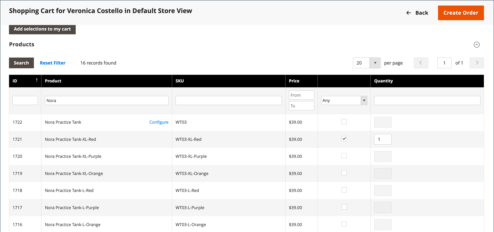

# Gestion d’un panier

{{ee-feature}}

Pour démarrer une session d’achat assistée, le client doit être connecté à son compte à partir du storefront afin de rendre les informations disponibles. Si le client n&#39;a pas de compte, vous pouvez [en créer un](../customers/account-create.md).

{width="600" zoomable="yes"}

## Contrôle des actions

| Option | Description |
|--- |--- |
| [!UICONTROL Remove] | Supprime des articles du panier actuel. |
| [!UICONTROL Move to Wish List] | Déplace les éléments vers la liste des souhaits de client sélectionnée. |

{style="table-layout:auto"}

## Boutons de contrôle

| Bouton | Description |
|--- |--- |
| [!UICONTROL Clear my shopping cart] | Efface le panier actuel de tous les produits. |
| [!UICONTROL Update Items and Quantities|]Saisissez la quantité requise dans le champ **[!UICONTROL Qty]** et mettez à jour le nombre d’articles dans le panier. |
| [!UICONTROL Add selections to my cart] | Ajoute les produits de toutes les sections au panier. |

{style="table-layout:auto"}

## Vérification de la connexion du client

1. Sur la barre latérale _Admin_, accédez à **[!UICONTROL Customers]** > **[!UICONTROL Now Online]**.

   Tous les visiteurs du magasin et les clients connectés apparaissent dans la liste.

   {width="700" zoomable="yes"}

## Offrir des achats assistés

1. Sur la barre latérale _Admin_, accédez à **[!UICONTROL Customers]** > **[!UICONTROL All Customers]**.

1. Dans la liste, ouvrez l’enregistrement du client en mode d’édition.

   >[!TIP]
   >
   >Pour rechercher l’enregistrement du client en urgence, utilisez le contrôle [Filtres](../getting-started/admin-grid-controls.md).

   Dans le profil du client sous _[!UICONTROL Personal Information]_, la date et l’heure&#x200B;_[!UICONTROL Last Logged In]_ indiquent que le client est en ligne.

   {width="600" zoomable="yes"}

1. Pour passer en mode d’achat assisté, cliquez sur **[!UICONTROL Manage Shopping Cart]** dans la barre de boutons supérieure.

   {width="600" zoomable="yes"}

## Ajout de produits au panier par attribut

1. Développez la section  sur **[!UICONTROL Products]** .

1. Recherchez un produit à l’aide des filtres situés en haut de chaque colonne.

1. Cliquez sur **[!UICONTROL Search]**.

1. Suivez l’une des étapes suivantes en fonction du type de produit :

### Ajout d’un produit simple

1. Cliquez sur le produit que vous souhaitez commander.

   Cette action sélectionne l’enregistrement et définit **[!UICONTROL Quantity]** sur la valeur par défaut `1`.

1. Si nécessaire, mettez à jour la quantité commandée.

1. Sur la gauche au-dessus de la grille, cliquez sur **[!UICONTROL Add selections to my cart]**.

   {width="600" zoomable="yes"}

   L’article est ajouté au panier en haut de la page.

   {width="600" zoomable="yes"}

### Ajout d’un produit avec configuration

Il existe trois types de produits qui doivent être configurés avant d’être ajoutés au panier : `Bundle Product`, `Configurable Product` et `Grouped Product`.

1. Dans la grille, cliquez sur **[!UICONTROL Configure]** en regard du nom du produit.

   {width="600" zoomable="yes"}

1. Dans la boîte de dialogue _Produits associés_, sélectionnez chaque option de produit pour décrire l’élément à commander, saisissez le **[!UICONTROL Quantity]**, puis cliquez sur **[!UICONTROL OK]**.

   Le produit est sélectionné avec une coche et la quantité commandée apparaît dans la grille.

1. Pour ajouter le produit au panier, cliquez sur **[!UICONTROL Add selections to my cart]**.

   {width="600" zoomable="yes"}

1. Au besoin, mettez à jour les options de produit dans le panier :

   - Cliquez sur **[!UICONTROL Configure]**.

   - Mettez à jour les options, puis cliquez sur **[!UICONTROL OK]**.

## Ajouter un produit par SKU

1. Développez la section  sur **[!UICONTROL Add to Shopping Cart by SKU]** .

1. Ajoutez des produits individuellement par **[!UICONTROL SKU]** ou ajoutez des produits en chargeant un fichier CSV.

### Ajouter des éléments individuellement par SKU

1. Saisissez les **[!UICONTROL SKU]** et **[!UICONTROL Qty]** de l’élément à commander.

1. Pour commander un autre produit, cliquez sur **[!UICONTROL Add another]**.

   {width="600" zoomable="yes"}

1. Cliquez sur **[!UICONTROL Add selections to my cart]**.

1. Si l’élément est un produit configurable, sélectionnez les options de produit lorsque vous y êtes invité, puis cliquez sur **[!UICONTROL Add to Shopping Cart]**.

### Ajout de produits en chargeant un fichier CSV

1. Préparez un [fichier csv](../systems/data-csv.md) avec les éléments à ajouter au panier.

   Le fichier ne doit contenir que deux colonnes, `sku` et `qty` dans l’en-tête.

1. Téléchargez le fichier préparé :

   - Cliquez sur **[!UICONTROL Choose File]**.

   - Sélectionnez le fichier à charger dans votre répertoire.

## Transfert d’un élément

Vous pouvez transférer des articles vers le panier à partir de la liste de souhaits d’un client, ainsi que des articles récemment consultés, comparés ou commandés. Le nombre d’éléments dans chaque section apparaît entre parenthèses après l’en-tête de section.

1. Développez  dans l’une des sections suivantes :

   - [!UICONTROL Wish List]
   - [!UICONTROL Products in the Comparison List]
   - [!UICONTROL Recently Compared Products]
   - [!UICONTROL Recently Viewed Products]
   - [!UICONTROL Last Ordered Items]

1. Dans la grille, sélectionnez chaque produit à commander et saisissez le **[!UICONTROL Quantity]**.

1. Pour entrer les options d&#39;un produit configurable, cliquez sur **[!UICONTROL Configure]** et définissez les options du produit selon vos besoins.

1. Cliquez sur **[!UICONTROL Add selections to my cart]**.

1. Appliquez un ou plusieurs codes de coupon, le cas échéant :

   - Pour **[!UICONTROL Apply Coupon Code]**, saisissez un code de bon valide.

   - Cliquez sur la flèche _Appliquer_ (  ).

1. Ajustez la quantité commandée selon les besoins :

   - Dans la colonne **[!UICONTROL Qty]** du produit à ajuster, saisissez la quantité correcte.

   - Cliquez sur **[!UICONTROL Update Items and Quantities]**.

## Création de la commande

1. Cliquez sur **[!UICONTROL Create Order]**.

   La page _[!UICONTROL Create New Order]_&#x200B;affiche les articles du panier, suivis des informations d’expédition et de paiement.

1. Renseignez les informations d’expédition et de paiement.

1. Cliquez sur **[!UICONTROL Submit Order]**.

Pour en savoir plus, voir [Création d’une commande](customer-account-create-order.md).
