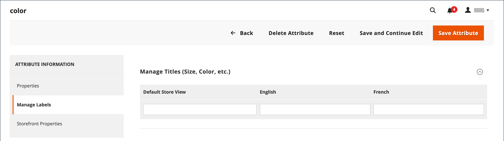
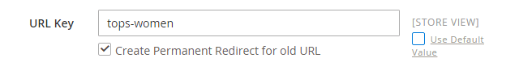

# Localisation de la boutique

La plupart du texte qui semble être codé en dur sur les pages de votre boutique peut être instantanément remplacé par une autre langue en modifiant les paramètres régionaux de l’affichage. La modification du paramètre régional ne traduit pas réellement le texte mot pour mot, mais fait simplement référence à une table de traduction différente qui fournit le texte de l’interface utilisé dans l’ensemble du magasin. Le texte qui peut être modifié inclut des titres de navigation, des libellés, des boutons et des liens tels que _Mon panier_ et _Mon compte_. Vous pouvez également utiliser l’outil [Traduction en ligne](../configuration-reference/advanced/developer.md) pour retoucher le texte dans l’interface.

Les modules linguistiques se trouvent sous [Traductions et localisation](https://marketplace.magento.com/extensions/content-customizations/translations-localization.html){:target="_blank"} sur Commerce Marketplace. De nouvelles extensions sont ajoutées en permanence à Marketplace, alors revenez souvent.

## Étape 1 : installer un module linguistique

Suivez les instructions standard pour installer l’extension du module linguistique. Pour plus d’informations sur l’installation d’une extension, voir [Installation de l’interface de ligne de commande générale](https://experienceleague.adobe.com/docs/commerce-operations/installation-guide/tutorials/extensions.html) dans le _Guide des extensions_.

## Étape 2 : créer une vue de magasin pour la langue

1. Dans la barre latérale _Admin_, accédez à **[!UICONTROL Stores]** > _[!UICONTROL Settings]_>**[!UICONTROL All Stores]**.

1. Cliquez sur **[!UICONTROL Create Store View]**.

1. Définissez les options de la nouvelle vue de magasin :

   - **[!UICONTROL Store]** — Choisissez le magasin qui est le parent de la vue.

   - **[!UICONTROL Name]** — Saisissez un nom pour la vue du magasin. Par exemple : portugais.

     Dans l’en-tête du magasin, le nom apparaît dans le _sélecteur de langue_.

   - **[!UICONTROL Code]** — Saisissez un code en minuscules pour identifier la vue. Par exemple : `portuguese`.

   - **[!UICONTROL Status]** : pour activer la vue, définissez sur `Enabled`.

   - **[!UICONTROL Sort Order]** — (Facultatif) Entrez un nombre pour déterminer l&#39;ordre dans lequel cette vue est répertoriée avec d&#39;autres vues.

1. Cliquez ensuite sur **[!UICONTROL Save Store View]**.

## Étape 3 : modifier les paramètres régionaux de l’affichage du magasin

1. Dans la barre latérale _Admin_, accédez à **[!UICONTROL Stores]** > _[!UICONTROL Settings]_>**[!UICONTROL Configuration]**.

1. Dans la liste déroulante **[!UICONTROL Scope]**, sélectionnez la vue de magasin à configurer, puis cliquez sur **[!UICONTROL OK]** lorsque vous y êtes invité.

1. Sur la page de configuration du *[!UICONTROL General]*, développez  la section **[!UICONTROL Locale Options]** .

1. Décochez la case **[!UICONTROL Use Website]** et définissez **[!UICONTROL Locale]** sur la langue à affecter à la vue.

   S’il existe plusieurs variantes de la langue disponible, veillez à choisir celle qui correspond à la région ou au dialecte en question.

1. Cliquez ensuite sur **[!UICONTROL Save Config]**.

   Après avoir modifié la langue du paramètre régional, le contenu restant que vous avez créé, y compris les noms et descriptions des produits, les catégories, les pages  et les blocs, doit être traduit séparément pour chaque affichage de magasin.

## Localisation de produits

Si votre boutique propose plusieurs vues dans différentes langues, les mêmes produits sont disponibles dans chaque vue de la boutique. Vous pouvez utiliser les mêmes informations de base sur les produits, telles que le SKU, le prix et le niveau de stock, quelle que soit la langue. Ensuite, traduisez uniquement le nom du produit, les champs de description et les métadonnées selon les besoins pour chaque langue.

### Étape 1 : traduire les champs de produit

1. Dans la barre latérale _Admin_, accédez à **[!UICONTROL Catalog]** > **[!UICONTROL Products]**.

1. Dans la grille, recherchez le produit à traduire et ouvrez-le en mode d’édition.

1. Dans le coin supérieur gauche, définissez **[!UICONTROL Store View]** à la vue pour la traduction et cliquez sur **[!UICONTROL OK]** lorsque vous êtes invité à confirmer.

1. Pour chaque champ à éditer, procédez comme suit :

   - Décochez la case **[!UICONTROL Use Default Value]** située à droite du champ.

   - Collez ou saisissez le texte traduit dans le champ.

   Veillez à traduire tous les champs de texte, y compris les champs [image](../catalog/catalog-images-video.md) libellés et Texte de remplacement, [Optimisation du moteur de recherche](../catalog/product-search-engine-optimization.md) et toute information [Options personnalisées](../catalog/settings-advanced-custom-options.md).

1. Cliquez ensuite sur **[!UICONTROL Save]**.

### Étape 2 : traduire les libellés des champs

1. Dans la barre latérale _Admin_, accédez à **[!UICONTROL Stores]** > _[!UICONTROL Attributes]_>**[!UICONTROL Product]**.

1. Dans la liste, recherchez l’attribut à traduire et ouvrez en mode d’édition.

1. Dans le panneau de gauche, choisissez **[!UICONTROL Manage Labels]**.

1. Dans la section _[!UICONTROL Manage Titles]_, saisissez un libellé traduit pour chaque vue de magasin.

   {width="600" zoomable="yes"}

1. Cliquez ensuite sur **[!UICONTROL Save Attribute]**.

### Etape 3 : Traduire toutes les catégories

1. Dans la barre latérale _Admin_, accédez à **[!UICONTROL Catalog]** > **Catégories**.

1. Dans le coin supérieur gauche, définissez **[!UICONTROL Store View]** à la vue pour la traduction et cliquez sur **[!UICONTROL OK]** lorsque vous êtes invité à confirmer.

1. Dans l’arborescence, recherchez la catégorie à traduire et ouvrez-la en mode d’édition.

1. Pour _Informations de base_, traduisez **[!UICONTROL Category Name]**.

1. Développez  la section _[!UICONTROL Content]_et traduisez **[!UICONTROL Description]**.

1. Développez  la section **[!UICONTROL Search Engine Optimization Settings]** et traduisez les champs suivants :

   - **[!UICONTROL Meta Title]**
   - **[!UICONTROL Meta Keywords]**
   - **[!UICONTROL Meta Description]**

1. Dans la section _[!UICONTROL Search Engine Optimization Settings]_, procédez comme suit pour traduire le **[!UICONTROL URL Key]**:

   - Décochez la case **[!UICONTROL Use Default Value]** située à droite du champ.

   - Saisissez le texte traduit.

   - Assurez-vous que la case **[!UICONTROL Create Permanent Redirect for old URL]** est cochée.

   

1. Cliquez ensuite sur **[!UICONTROL Save Category]**.

1. Répétez le processus pour toutes les catégories utilisées dans le magasin.

### Étape 4 : traduire les attributs de produit et les options d’attributs

1. Dans la barre latérale _Admin_, accédez à **[!UICONTROL Stores]** > _[!UICONTROL Attributes]_>**[!UICONTROL Product]**.

1. Sélectionnez l’attribut à traduire.

1. Sélectionnez **[!UICONTROL Manage Labels]** à gauche et définissez les options de **[!UICONTROL Managed Titles]** pour définir les traductions des titres d’attribut.

1. Sélectionnez **[!UICONTROL Properties]** à gauche et saisissez les options d’attribut traduit dans la section **[!UICONTROL Manage Options]** .

   {width="600" zoomable="yes"}

1. Cliquez ensuite sur **[!UICONTROL Save Attribute]**.
