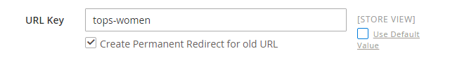

# Localisation de la boutique

La plupart du texte qui semble codé en dur sur les pages de votre magasin peut être instantanément remplacé par une autre langue en modifiant les paramètres régionaux de la vue. La modification du paramètre régional ne traduit pas réellement le texte mot à mot, mais fait simplement référence à une autre table de traduction qui fournit le texte de l’interface utilisé dans tout le magasin. Le texte qui peut être modifié comprend des titres de navigation, des libellés, des boutons et des liens tels que _Mon panier_ et _Mon compte_. Vous pouvez également utiliser la variable [Traduction en ligne](../configuration-reference/advanced/developer.md) pour toucher du texte dans l’interface.

Les packs de langue se trouvent sous [Traductions et localisation][1]{:target=&quot;_blank&quot;} en Commerce Marketplace. Les nouvelles extensions sont continuellement ajoutées à Marketplace. Par conséquent, revenez souvent en arrière.

## Étape 1 : installation d’un module de langue

Suivez les instructions standard d’installation de l’extension du pack de langue. Pour plus d’informations sur l’installation d’une extension, voir [Installation de l’interface de ligne de commande générale][2] dans le _Guide des extensions_.

## Étape 2 : création d’une vue de magasin pour la langue

1. Sur le _Administration_ barre latérale, accédez à **[!UICONTROL Stores]** > _[!UICONTROL Settings]_>**[!UICONTROL All Stores]**.

1. Cliquez sur **[!UICONTROL Create Store View]**.

1. Définissez les options de la nouvelle vue de magasin :

   - **[!UICONTROL Store]** — Sélectionnez le magasin qui est le parent de la vue.

   - **[!UICONTROL Name]** — Saisissez un nom pour la vue magasin. Par exemple : le portugais.

     Dans l’en-tête du magasin, le nom apparaît dans la variable _sélecteur de langues_.

   - **[!UICONTROL Code]** — Saisissez un code en minuscules pour identifier la vue. Par exemple: `portuguese`.

   - **[!UICONTROL Status]** — Pour activer la vue, définissez sur `Enabled`.

   - **[!UICONTROL Sort Order]** — (Facultatif) Saisissez un nombre pour déterminer l’ordre dans lequel cette vue est répertoriée avec d’autres vues.

1. Lorsque vous avez terminé, cliquez sur **[!UICONTROL Save Store View]**.

## Étape 3 : modification des paramètres régionaux de la vue de magasin

1. Sur le _Administration_ barre latérale, accédez à **[!UICONTROL Stores]** > _[!UICONTROL Settings]_>**[!UICONTROL Configuration]**.

1. Dans le coin supérieur gauche, définissez **[!UICONTROL Store View]** à la vue spécifique dans laquelle la configuration doit s’appliquer.

1. Lorsque vous êtes invité à confirmer le changement de portée, cliquez sur **[!UICONTROL OK]**.

1. Développer  la valeur **[!UICONTROL Locale Options]** .

1. Effacez la variable **[!UICONTROL Use Website]** case à cocher et définition **[!UICONTROL Locale]** dans la langue que vous souhaitez affecter à la vue.

   S’il existe plusieurs variantes de la langue, veillez à choisir celle de la région ou du dialecte spécifique.

1. Lorsque vous avez terminé, cliquez sur **[!UICONTROL Save Config]**.

   Après avoir modifié la langue des paramètres régionaux, le contenu restant que vous avez créé, y compris les noms et descriptions des produits, les catégories et les [CMS](../content-design/page-translate.md) les pages et les blocs doivent être traduits séparément pour chaque vue de magasin.

## Localisation des produits

Si votre boutique comporte plusieurs vues dans différentes langues, les mêmes produits sont disponibles dans chaque vue de magasin. Vous pouvez utiliser les mêmes informations de base sur les produits, telles que le SKU, le prix et le niveau de stock, quelle que soit la langue. Ensuite, traduisez uniquement le nom du produit, les champs de description et les métadonnées selon les besoins pour chaque langue.

### Étape 1 : Traduire les champs de produit

1. Sur le _Administration_ barre latérale, accédez à  **[!UICONTROL Catalog]** > **[!UICONTROL Products]**.

1. Dans la grille, recherchez le produit à traduire et ouvrez-le en mode d’édition.

1. Dans le coin supérieur gauche, définissez **[!UICONTROL Store View]** dans la vue pour la traduction, puis cliquez sur **[!UICONTROL OK]** lorsque vous y êtes invité pour confirmer.

1. Pour chaque champ à éditer, procédez comme suit :

   - Désélectionnez l’option **[!UICONTROL Use Default Value]** à droite du champ.

   - collez ou saisissez le texte traduit dans le champ .

   Veillez à traduire tous les champs de texte, y compris [image](../catalog/catalog-images-video.md) les libellés et le texte de remplacement, [Optimisation du moteur de recherche](../catalog/product-search-engine-optimization.md) champs et tout [Options personnalisées](../catalog/settings-advanced-custom-options.md) informations.

1. Lorsque vous avez terminé, cliquez sur **[!UICONTROL Save]**.

### Étape 2 : Traduire les libellés de champ

1. Sur le _Administration_ barre latérale, accédez à **[!UICONTROL Stores]** > _[!UICONTROL Attributes]_>**[!UICONTROL Product]**.

1. Dans la liste, recherchez l’attribut à traduire et ouvrez-le en mode d’édition.

1. Dans le panneau de gauche, choisissez **[!UICONTROL Manage Labels]**.

1. Dans le _[!UICONTROL Manage Titles]_, saisissez un libellé traduit pour chaque vue de magasin.

   {width="600" zoomable="yes"}

1. Lorsque vous avez terminé, cliquez sur **[!UICONTROL Save Attribute]**.

### Etape 3 : Traduire toutes les catégories

1. Sur le _Administration_ barre latérale, accédez à **[!UICONTROL Catalog]** > **Catégories**.

1. Dans le coin supérieur gauche, définissez **[!UICONTROL Store View]** dans la vue pour la traduction, puis cliquez sur **[!UICONTROL OK]** lorsque vous y êtes invité pour confirmer.

1. Dans l&#39;arborescence, recherchez la catégorie à traduire et ouvrez-la en mode d&#39;édition.

1. Pour _Informations de base_, traduire **[!UICONTROL Category Name]**.

1. Développer  la valeur _[!UICONTROL Content]_section et traduction **[!UICONTROL Description]**.

1. Développer  la valeur **[!UICONTROL Search Engine Optimization Settings]** et traduisez les champs suivants :

   - **[!UICONTROL Meta Title]**
   - **[!UICONTROL Meta Keywords]**
   - **[!UICONTROL Meta Description]**

1. Sous , _[!UICONTROL Search Engine Optimization Settings]_, procédez comme suit pour traduire la **[!UICONTROL URL Key]**:

   - Effacez la variable **[!UICONTROL Use Default Value]** à droite du champ.

   - Saisissez le texte traduit.

   - Assurez-vous que la variable **[!UICONTROL Create Permanent Redirect for old URL]** est sélectionnée.

   

1. Lorsque vous avez terminé, cliquez sur **[!UICONTROL Save Category]**.

1. Répétez le processus pour toutes les catégories utilisées dans le magasin.

### Étape 4 : traduction des options d’attributs et d’attributs de produit

1. Sur le _Administration_ barre latérale, accédez à **[!UICONTROL Stores]** > _[!UICONTROL Attributes]_>**[!UICONTROL Product]**.

1. Sélectionnez l’attribut à traduire.

1. Choisir **[!UICONTROL Manage Labels]** sur la gauche et définissez la variable **[!UICONTROL Managed Titles]** pour définir les traductions du titre de l’attribut.

1. Choisir **[!UICONTROL Properties]** sur la gauche et saisissez les options d’attribut traduites dans la variable **[!UICONTROL Manage Options]** .

   {width="600" zoomable="yes"}

1. Lorsque vous avez terminé, cliquez sur **[!UICONTROL Save Attribute]**.

[1]: https://marketplace.magento.com/extensions/content-customizations/translations-localization.html
[2]: https://experienceleague.adobe.com/docs/commerce-operations/installation-guide/tutorials/extensions.html
