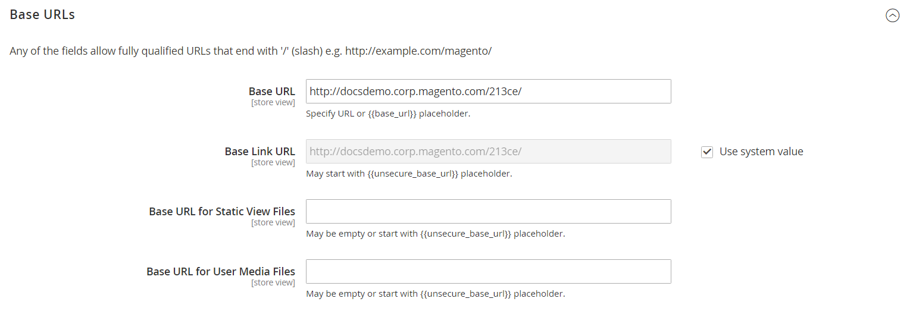

# Stocker les URL

Chaque site web d’une installation Adobe Commerce ou Magento Open Source comporte une URL de base attribuée au storefront et une autre URL attribuée à l’administrateur. Adobe utilise des variables pour définir des liens internes par rapport à l’URL de base, ce qui permet de déplacer l’ensemble d’un magasin d’un emplacement à un autre sans mettre à jour les liens. Les URL de base standard commencent par `http` et les URL de base sécurisées commencent par `https`.

- **URL de base** — `http://www.yourdomain.com/magento/`
- **URL de base sécurisée** — `https://www.yourdomain.com/magento/`
- **URL avec adresse IP** — `http://###.###.###.###/magento/` ou `https://###.###.###.###/magento/`

>[!IMPORTANT]
>
>Ne modifiez pas l’URL d’administration à partir de la configuration d’URL de base par défaut. Pour modifier l’URL ou le chemin d’accès d’administration, voir [&#x200B; Utiliser une URL d’administration personnalisée &#x200B;](#use-a-custom-admin-url).

## Utiliser un protocole sécurisé

Les URL de base de votre boutique ont été initialement configurées lors de votre installation d’Adobe Commerce. Si un certificat de sécurité était disponible à ce moment-là, vous pouviez indiquer les URL `HTTPS` à utiliser pour le magasin, l’administrateur ou les deux. Si votre installation d’Adobe Commerce comprend plusieurs magasins ou si vous prévoyez d’en ajouter d’autres ultérieurement, vous pouvez inclure le code du magasin dans l’URL. Toutes les ressources et opérations d’Adobe peuvent être utilisées avec un protocole sécurisé.

Si aucun certificat de sécurité n’était disponible pour le domaine au moment de l’installation, veillez à mettre à jour la configuration avant de lancer votre boutique. [ Une fois qu’un certificat de sécurité est établi pour votre domaine, vous pouvez configurer les URL de base, ou les deux, pour qu’elles fonctionnent avec le protocole SSL (Secure Sockets Layer) et TLS (Transport Layer Security][1] chiffré.

>[!IMPORTANT]
>
>Adobe recommande vivement de transmettre toutes les pages d’un site de production, y compris les pages de contenu et de produits, à l’aide d’un protocole sécurisé.

Par défaut, Adobe Commerce et Magento Open Source peuvent être configurés pour diffuser toutes les pages sur `HTTPS`. Si votre boutique fonctionne avec le protocole standard, vous pouvez améliorer la sécurité en activant [HTTP Strict Transport Security][2] (HSTS) et en mettant à niveau toutes les requêtes de page non sécurisées. HSTS est un protocole d’accord préalable qui empêche les navigateurs de rendre des pages `HTTP` standard qui sont transmises avec un protocole non sécurisé pour le domaine spécifié. Comme les moteurs de recherche peuvent avoir déjà indexé chaque page de votre boutique avec des URL `HTTP` standard, vous pouvez configurer Commerce pour mettre à niveau toutes les requêtes de page non sécurisées vers `HTTPS` automatiquement , afin de ne pas perdre de trafic. Lorsque Commerce est configuré pour utiliser des URL sécurisées pour le storefront et l’admin, deux champs supplémentaires s’affichent pour vous permettre d’activer `HSTS`.

## Configuration de l’URL de base

1. Dans la barre latérale _Admin_, accédez à **[!UICONTROL Stores]** > _[!UICONTROL Settings]_>**[!UICONTROL Configuration]**.

1. Sous _Général_ dans le panneau de gauche, choisissez **[!UICONTROL Web]**.

1. Développez  la section **[!UICONTROL Base URL]** .

   - **[!UICONTROL Base URL]** — Saisissez l&#39;URL de base complète de votre boutique. Veillez à terminer l’URL par une barre oblique afin qu’elle puisse être étendue avec des clés d’URL supplémentaires provenant de votre boutique. Par exemple : `http://yourdomain.com/`

     >[!NOTE]
     >
     >Ne modifiez pas l’espace réservé dans le champ _[!UICONTROL Base Link URL]_. Il s’agit d’un espace réservé utilisé pour créer des liens relatifs à l’URL de base.

   - **[!UICONTROL Base URL for Static View Files]** — (Facultatif) Spécifiez un autre emplacement pour l&#39;URL de base des fichiers de vue statiques en saisissant le chemin commençant par l&#39;espace réservé suivant :

     \{\{unsecure_base_url}}

   - **[!UICONTROL Base URL for User Media Files]** — (Facultatif) Spécifiez un autre emplacement pour l’URL de base des fichiers multimédias utilisateur en saisissant le chemin d’accès commençant par l’espace réservé suivant :

     \{\{unsecure_base_url}}

     Dans le cas d’une installation standard, il n’est pas nécessaire de mettre à jour les chemins d’accès aux fichiers de vues statiques ou aux fichiers multimédias, car ils sont relatifs à l’URL de base.

   {width="600" zoomable="yes"}

   >[!NOTE]
   >
   >Les espaces réservés placés entre doubles accolades sont des balises de mise en forme pour les variables.

1. Cliquez ensuite sur **[!UICONTROL Save Config]**.

## Configurer l’URL de base sécurisée

Si votre domaine dispose d’un certificat de sécurité valide, vous pouvez configurer les URL du storefront et de l’administrateur pour transmettre les données sur un canal sécurisé (https). Sans certificat de sécurité valide, votre boutique ne peut pas fonctionner avec un protocole sécurisé (SSL/TLS).

1. Développez la section  le _[!UICONTROL Base URLs (Secure])_ puis procédez comme suit :

   {width="600" zoomable="yes"}

   - **[!UICONTROL Secure Base URL]** — Saisissez l&#39;URL de base sécurisée complète, suivie d&#39;une barre oblique. Par exemple : `https://yourdomain.com/`

   - **[!UICONTROL Secure Base Link URL]** — Ne modifiez pas l&#39;espace réservé dans le champ URL du lien de base sécurisé. Il est utilisé pour créer des liens relatifs à l’URL de base sécurisée.

   - **[!UICONTROL Secure Base URL for Static View Files]** — (Facultatif) Spécifiez un autre emplacement pour l&#39;URL de base sécurisée pour les fichiers de vue statiques en saisissant le chemin commençant par l&#39;espace réservé suivant :

     \{\{secure_base_url}}

   - **[!UICONTROL Secure Base URL for User Media Files]** — (Facultatif) Spécifiez un autre emplacement pour l&#39;URL de base sécurisée des fichiers multimédias utilisateur en saisissant le chemin commençant par l&#39;espace réservé suivant :

     \{\{secure_base_url}}

1. Pour améliorer la sécurité, définissez les deux options suivantes sur `Yes`.

   - **[!UICONTROL Use Secure URLs on Storefront]**
   - **[!UICONTROL Use Secure URLs in Admin]**

1. Par _[!UICONTROL Enhanced Security Settings]_, procédez comme suit :

   - **[!UICONTROL Enable HTTP Strict Transport Security (HSTS)]** — Si vous souhaitez que votre boutique affiche uniquement les requêtes de page HTTPS sécurisées, définissez sur `Yes`.

   - **[!UICONTROL Upgrade Insecure Requests]** — Pour mettre à niveau des requêtes de pages HTTP standard non sécurisées vers HTTPS sécurisé, définissez sur `Yes`.

1. Définissez la **[!UICONTROL Offloader Header]** de votre serveur .

   La plupart des installations Commerce utilisent le `X-Forward-Proto` par défaut pour identifier le protocole comme étant `HTTP` ou `HTTPS`. Si la configuration de votre serveur utilise un offloader_header différent, saisissez-le ici.

1. Cliquez ensuite sur **[!UICONTROL Save Config]**.

## Inclure le code de magasin dans les URL

>[!NOTE]
>
>Lorsque l’option _Ajouter le code de boutique aux URL_ est définie sur `Yes`, vous devez inclure les codes de boutique dans les URL de votre navigateur. Ce paramètre garantit que les réécritures d’URL sont correctement mappées et que toutes les pages sont ouvertes avec succès, sans erreurs _« Page 404 introuvable »_.

1. Dans la barre latérale _Admin_, accédez à **[!UICONTROL Stores]** > _[!UICONTROL Settings]_>**[!UICONTROL Configuration]**.

1. Sous _[!UICONTROL General]_&#x200B;dans le panneau de gauche, choisissez **[!UICONTROL Web]**.

1. Développez  la section **[!UICONTROL URL Options]** .

1. Définissez **[!UICONTROL Add Store Code]** sur votre préférence :

   - **[!UICONTROL URL with Store Code]** : `http://www.yourdomain.com/magento/[store-code]/index.php/url-identifier`
   - **[!UICONTROL URL without Store Code]** : `http://www.yourdomain.com/magento/index.php/url-identifier`

   {width="600" zoomable="yes"}

1. Cliquez ensuite sur **[!UICONTROL Save Config]**.

1. Cliquez sur le lien **[!UICONTROL Cache Management]** dans le message en haut de l’espace de travail. Suivez ensuite les instructions pour actualiser le cache.

   

## Résolution des problèmes liés aux URL

Si, après avoir suivi les instructions de configuration, certaines pages continuent à être diffusées avec l’URL non sécurisée (`http://`), procédez comme suit :

- Remplacez l’URL de base (non sécurisée) par l’URL HTTPS sécurisée.
- Sur le serveur , modifiez le fichier `.htaccess` (ou la répartition de charge) afin que l’URL non sécurisée soit redirigée vers l’URL sécurisée.

## Utiliser une URL d’administration personnalisée

En tant que [bonne pratique en matière de sécurité](https://experienceleague.adobe.com/docs/commerce-operations/implementation-playbook/best-practices/launch/security-best-practices.html?lang=fr), Adobe vous recommande d’utiliser une URL d’administration unique au lieu de la valeur par défaut _admin_ ou un terme courant tel que _backend_. Bien qu’il ne protège pas directement votre site d’un acteur malveillant déterminé, il peut réduire l’exposition aux scripts qui tentent d’obtenir un accès non autorisé.

>[!NOTE]
>
>Consultez votre fournisseur d’hébergement avant d’implémenter une URL d’administration personnalisée. Certains fournisseurs d’hébergement requièrent une URL standard pour respecter les règles de protection par pare-feu.

Dans une installation standard, l’URL d’administration et le chemin d’accès suivent immédiatement l’URL de base. Le chemin d’accès Admin correspond à un répertoire sous la racine.

- **URL de base par défaut** : `http://yourdomain.com/magento/`
- **Chemin d’administration par défaut** : `admin`
- **URL et chemin d’administration par défaut** : `http://yourdomain.com/magento/admin`

Bien qu’il soit possible de modifier l’URL et le chemin d’accès de l’administrateur vers un autre emplacement, toute erreur supprime l’accès à l’administrateur et doit être corrigée à partir du serveur.

>[!NOTE]
>
>Par mesure de précaution, n’essayez pas de modifier vous-même l’URL d’administration, sauf si vous savez comment modifier les fichiers de configuration sur le serveur. Pour les projets Adobe Commerce déployés sur une infrastructure cloud, modifiez l’URL d’administration en suivant les [instructions](https://experienceleague.adobe.com/docs/commerce-cloud-service/user-guide/configure/env/stage/variables-admin.html?lang=fr#admin-url) dans le *Guide d’Adobe Commerce sur une infrastructure cloud*.

### Méthode 1 : changement à partir de l’administrateur

1. Dans la barre latérale _Admin_, accédez à **[!UICONTROL Stores]** > _[!UICONTROL Settings]_>**[!UICONTROL Configuration]**.

1. Dans le panneau de gauche, développez **[!UICONTROL Advanced]** et choisissez **[!UICONTROL Admin]**.

1. Développez  la section **[!UICONTROL Admin Base URL]** .

1. Définissez les options de configuration de l’URL personnalisée :

   {width="600" zoomable="yes"}

   Si nécessaire, décochez la case **[!UICONTROL Use system value]** pour modifier le paramètre.

   - Définissez **[!UICONTROL Use Custom Admin URL]** sur `Yes`.

   - Saisissez le **[!UICONTROL Custom Admin URL]** : `http://yourdomain.com/magento/`

     >[!NOTE]
     >
     >L’URL d’administration doit se trouver dans la même installation de Commerce et avoir la même racine de document que le storefront.

   - Définissez **[!UICONTROL Custom Admin Path]** sur `Yes`.

   - Par **[!UICONTROL Custom Admin Path]**, saisissez le chemin d’accès à utiliser comme nom de dossier d’administration personnalisé.

     Exemple : `sample_custom_admin`

1. Cliquez ensuite sur **[!UICONTROL Save Config]**.

1. Une fois les modifications enregistrées, déconnectez-vous de l’administrateur et reconnectez-vous à l’aide de la nouvelle URL d’administrateur et du nouveau chemin d’accès.

### Méthode 2 : modifier le chemin d’accès Admin à partir de la ligne de commande du serveur

1. Ouvrez le fichier `app/etc/env.php` dans un éditeur de texte et modifiez la valeur du paramètre `frontName` de la section `backend`. Enregistrez ensuite le fichier.

   Veillez à n’utiliser que des caractères minuscules.

   >[!NOTE]
   >
   >   Cette méthode vous permet de modifier le chemin d’accès d’administration, mais pas l’URL d’administration.

   >[!TIP]
   >
   >Pour Adobe Commerce sur les infrastructures cloud, vous pouvez configurer un chemin d’administration personnalisé à l’aide de la variable `ADMIN_URL` dans l’interface utilisateur Cloud. Voir la rubrique [Variables d’administration](https://experienceleague.adobe.com/docs/commerce-cloud-service/user-guide/configure/env/stage/variables-admin.html?lang=fr) dans le guide _Commerce sur les infrastructures cloud_.

   - **Chemin d’accès administrateur par défaut**

     ```php?start_inline=1
     'backend' => [
      'frontName' => 'admin'
     ],
     ```

   - **Nouveau chemin d’accès d’administration**

     ```php?start_inline=1
     'backend' => [
         'frontName' => 'backend'
     ],
     ```

1. Utilisez l’une des méthodes suivantes pour effacer le cache :

   - Dans la barre latérale _Admin_, accédez à **[!UICONTROL System]** > _[!UICONTROL Tools]_>**[!UICONTROL Cache Management]**. Cliquez ensuite sur **[!UICONTROL Flush Magento Cache]**.
   - Sur le serveur , exécutez la commande suivante :

     ```bash
     php bin/magento cache:flush
     ```

   >[!NOTE]
   >
   >Les modifications effectuées à l’aide de la méthode 1 ont la priorité sur les modifications effectuées dans le fichier `app/etc/env.php`.

### Méthode 3 : modifier le chemin d’accès administrateur à l’aide de l’interface de ligne de commande Commerce

Vous pouvez utiliser la commande CLI `setup:config:set` pour modifier le chemin d’accès d’administration. L’exemple suivant utilise l’option `--backend-frontname` pour remplacer le chemin d’accès racine Commerce par un nouveau chemin d’accès administrateur :

```bash
bin/magento setup:config:set --backend-frontname="backend_front_name"
```

Cette commande met à jour l&#39;option de configuration `backend` > `frontName` dans le fichier `app/etc/env.php`.

## Restaurer l’URL d’administration et le chemin d’accès d’administration par défaut

Si vous avez défini une URL d’administration non valide ou un chemin d’accès d’administration et perdu l’accès au serveur principal, il existe un moyen de corriger ce problème à partir de la ligne de commande.

1. Pour rétablir l’URL d’administration par défaut, exécutez la commande suivante :

   ```bash
   php bin/magento config:set admin/url/use_custom 0
   ```

1. Pour revenir au chemin d’administration par défaut (défini dans le `app/etc/env.php` comme décrit dans la méthode 2), exécutez la commande suivante :

   ```bash
   php bin/magento config:set admin/url/use_custom_path 0
   ```

1. Utilisez l’une des méthodes suivantes pour effacer le cache :

   - Dans la barre latérale _Admin_, accédez à **[!UICONTROL System]** > _[!UICONTROL Tools]_>**[!UICONTROL Cache Management]**. Cliquez ensuite sur **[!UICONTROL Flush Magento Cache]**.
   - Sur le serveur , exécutez la commande suivante :

     ```bash
     php bin/magento cache:flush
     ```


[1]: https://en.wikipedia.org/wiki/Transport_Layer_Security
[2]: https://en.wikipedia.org/wiki/HTTP_Strict_Transport_Security
