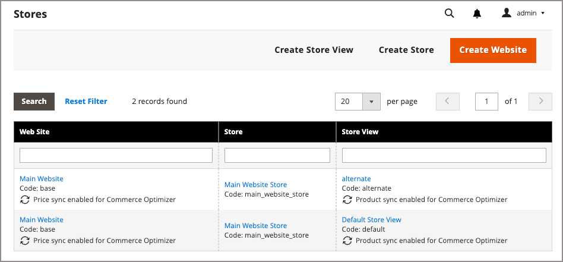

# Vues de la boutique

Les vues de magasin sont généralement utilisées pour rendre le magasin disponible dans différents paramètres régionaux. Les acheteurs peuvent utiliser le sélecteur de langue dans l’en-tête du magasin pour modifier l’affichage du magasin.

{width="550"}

## Statut de synchronisation [!DNL Adobe Commerce Optimizer] {#optimizer-sync-status}

Si le [!DNL Adobe Commerce Optimizer Connector] est installé et activé pour une vue de site web ou de boutique, la grille de [!UICONTROL All Stores] affiche un indicateur de statut de synchronisation. Si le [!DNL Adobe Commerce Optimizer Connector for B2B] est installé, les données sont également synchronisées pour les catalogues partagés B2B disponibles. Voir [Gérer les vues de catalogue](../b2b/catalog-views-manage.md).

| Colonne | Indicateur | Description |
| ----- | ----- | ----- |
| [!UICONTROL Web Site] | [!UICONTROL Price sync enabled for Commerce Optimizer] | Les prix et les catalogues de prix de ce site Web sont synchronisés avec [!DNL Adobe Commerce Optimizer]. |
| [!UICONTROL Store View] | [!UICONTROL Product sync enabled for Commerce Optimizer] | Les produits et attributs de cette vue de magasin sont synchronisés avec [!DNL Adobe Commerce Optimizer]. |

{width="700" zoomable="yes"}

Pour activer ou désactiver la synchronisation, modifiez le **[!UICONTROL Adobe Commerce Optimizer exporter settings]** lorsque vous [créez un site web](stores.md#step-1-create-a-website) ou [ajoutez une vue de magasin](#add-a-store-view), ou lorsque vous mettez à jour un site web ou une vue de magasin existant.

## Ajouter une vue de magasin

1. Dans la barre latérale _Admin_, accédez à **[!UICONTROL Stores]** > _[!UICONTROL Settings]_>**[!UICONTROL All Stores]**.

   {width="700" zoomable="yes"}

1. Cliquez sur **[!UICONTROL Create Store View]**.

   {width="600" zoomable="yes"}

1. Définissez **[!UICONTROL Store]** sur le magasin parent de cette vue.

1. Saisissez un **[!UICONTROL Name]** pour cette vue de magasin.

   Le nom apparaît dans le sélecteur de langue dans l’en-tête du magasin. Par exemple : `Spanish`.

1. Par **[!UICONTROL Code]**, saisissez le code qui identifie la vue (en minuscules).

   Par exemple : `spanish`.

1. Pour activer la vue, définissez **[!UICONTROL Status]** sur `Enabled`.

1. (Facultatif) Saisissez un numéro de **[!UICONTROL Sort Order]** pour déterminer l&#39;ordre dans lequel cette vue est répertoriée avec d&#39;autres vues.

1. (Facultatif) Si la [!DNL Adobe Commerce Optimizer Connector] est installée, sélectionnez **[!UICONTROL Sync products and attributes]** dans la section **[!UICONTROL Adobe Commerce Optimizer exporter settings]** pour synchroniser les produits et attributs de cette vue de magasin avec [!DNL Adobe Commerce Optimizer]. Si le [!DNL Adobe Commerce Optimizer Connector for B2B] est également installé, ce paramètre synchronise également les données de catalogue partagées B2B avec [!DNL Adobe Commerce Optimizer]. Voir [Gérer les vues de catalogue](../b2b/catalog-views-manage.md).

   {width="600" zoomable="yes"}

   La modification de ce paramètre après la synchronisation initiale déclenche une réindexation complète. Voir [Personnalisation de la configuration d’exportation des portées de Commerce](https://experienceleague.adobe.com/en/docs/commerce/aco-optimizer-connector/get-started#customize-the-commerce-scopes-export-configuration) dans le *Guide du connecteur Adobe Commerce Optimizer*.

1. Cliquez sur **[!UICONTROL Save Store View]**.

## Modification de la vue d’un magasin

Étant donné que le nom de la vue s’affiche dans le sélecteur de langue, vous souhaiterez peut-être éventuellement modifier le nom de la vue par défaut pour le rendre plus explicite. Le champ _Nom_ est simplement un libellé et peut être facilement modifié.

Si votre installation Adobe Commerce ou Magento Open Source comporte une configuration multisite ou multi-magasin, ne modifiez pas le champ Code de magasin sans vérifier que la valeur n’est pas référencée dans le fichier `index.php`. Si vous n’avez pas accès au serveur pour examiner le fichier, demandez de l’aide à un développeur.

| Champ | Valeur d’origine | Valeur mise à jour |
| ----- | -------------- | ------------- |
| [!UICONTROL Name] | `Default Store View` | `English` |
| [!UICONTROL Code] | `default` | `english` |

{style="table-layout:auto"}

1. Dans la barre latérale _Admin_, accédez à **[!UICONTROL Stores]** > _[!UICONTROL Settings]_>**[!UICONTROL All Stores]**.

1. Dans la colonne _[!UICONTROL Store View]_&#x200B;de la grille, cliquez sur le nom de la vue à modifier.

   Lors de la modification de la vue par défaut, les champs _[!UICONTROL Store]_&#x200B;et&#x200B;_[!UICONTROL Status]_ ne sont pas disponibles.

   {width="600" zoomable="yes"}

1. Mettez à jour les champs suivants si nécessaire :

   - **[!UICONTROL Store]** (vues non par défaut uniquement)
   - **[!UICONTROL Name]**
   - **[!UICONTROL Code]** (uniquement si non utilisé dans `index.php`)
   - **[!UICONTROL Status]** (vues non par défaut uniquement)
   - **[!UICONTROL Sort Order]**
   - **[!UICONTROL Sync products and attributes]** (uniquement si le [!DNL Adobe Commerce Optimizer Connector] est installé)

   {width="600" zoomable="yes"}

1. Cliquez sur **[!UICONTROL Save Store View]**.
