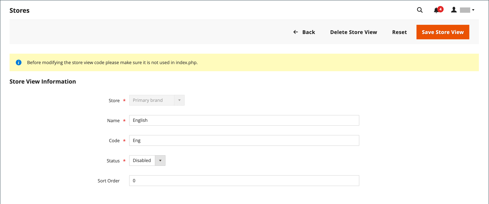

# Vues du magasin

Les vues de magasin sont généralement utilisées pour rendre le magasin disponible dans différents paramètres régionaux. Les acheteurs peuvent utiliser le sélecteur de langues dans l’en-tête du magasin pour modifier la vue du magasin.

{width="550"}

## Ajout d’une vue de magasin

1. Sur la barre latérale _Admin_, accédez à **[!UICONTROL Stores]** > _[!UICONTROL Settings]_>**[!UICONTROL All Stores]**.

   {width="700" zoomable="yes"}

1. Cliquez sur **[!UICONTROL Create Store View]**.

   {width="600" zoomable="yes"}

1. Définissez **[!UICONTROL Store]** sur le magasin parent de cette vue.

1. Saisissez un **[!UICONTROL Name]** pour cette vue de magasin.

   Le nom apparaît dans le sélecteur de langues de l’en-tête du magasin. Par exemple : `Spanish`.

1. Pour **[!UICONTROL Code]**, saisissez le code qui identifie la vue (en minuscules).

   Par exemple : `spanish`.

1. Pour activer la vue, définissez **[!UICONTROL Status]** sur `Enabled`.

1. (Facultatif) Saisissez un nombre **[!UICONTROL Sort Order]** pour déterminer la séquence dans laquelle cette vue est répertoriée avec d’autres vues.

1. Cliquez sur **[!UICONTROL Save Store View]**.

## Modifier une vue de magasin

Comme le nom de la vue s’affiche dans le sélecteur de langues, vous pouvez éventuellement modifier le nom de la vue par défaut pour le rendre plus explicite. Le champ _Nom_ est simplement un libellé qui peut être facilement modifié.

Si votre installation Adobe Commerce ou Magento Open Source comporte une configuration multi-site ou multi-magasin, ne modifiez pas le champ de code de magasin sans vérifier que la valeur n’est pas référencée dans le fichier `index.php`. Si vous n’avez pas accès au serveur pour examiner le fichier, demandez de l’aide à un développeur.

| Champ | Valeur d’origine | Valeur mise à jour |
| ----- | -------------- | ------------- |
| [!UICONTROL Name] | `Default Store View` | `English` |
| [!UICONTROL Code] | `default` | `english` |

{style="table-layout:auto"}

1. Sur la barre latérale _Admin_, accédez à **[!UICONTROL Stores]** > _[!UICONTROL Settings]_>**[!UICONTROL All Stores]**.

1. Dans la colonne _[!UICONTROL Store View]_&#x200B;de la grille, cliquez sur le nom de la vue que vous souhaitez modifier.

   Lors de la modification de la vue par défaut, les champs _[!UICONTROL Store]_&#x200B;et&#x200B;_[!UICONTROL Status]_ ne sont pas disponibles.

   {width="600" zoomable="yes"}

1. Mettez à jour les champs suivants si nécessaire :

   - **[!UICONTROL Store]** (vues non par défaut uniquement)
   - **[!UICONTROL Name]**
   - **[!UICONTROL Code]** (uniquement s’il n’est pas utilisé dans `index.php`)
   - **[!UICONTROL Status]** (vues non par défaut uniquement)
   - **[!UICONTROL Sort Order]**

1. Cliquez sur **[!UICONTROL Save Store View]**.
