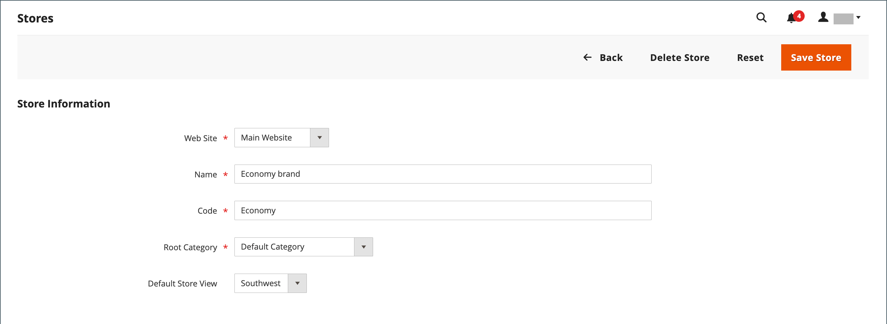
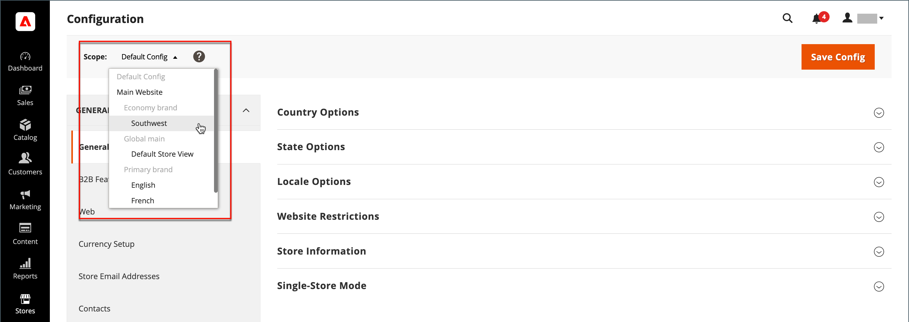

# Structure du magasin et du site

Lors de l’installation d’Adobe Commerce ou de Magento Open Source, une hiérarchie comprenant un site web, un magasin et une vue de magasin principaux est créée. Vous pouvez créer d’autres sites web, boutiques et vues de boutique, selon vos besoins. Par exemple, en plus de votre site web principal, vous pouvez avoir d’autres sites web avec un domaine différent. Dans chaque site web, vous pouvez avoir plusieurs magasins et, dans chaque magasin, des vues de magasin distinctes. De nombreuses installations comportent un site web et un magasin, mais avec plusieurs vues de magasin pour prendre en charge différentes langues.

Avant de commencer, planifiez à l’avance la hiérarchie de votre catalogue de magasin, car elle est référencée tout au long de la configuration. Chaque magasin peut avoir une [catégorie racine](../catalog/category-root.md) distincte, ce qui permet d’avoir un ensemble entièrement différent d’options de menu principal pour chaque magasin.

{width="550"}

## Ajouter des magasins

Une seule installation d’Adobe Commerce ou de Magento Open Source peut comporter plusieurs magasins partageant un même administrateur. Les magasins qui se trouvent sous le même site web ont la même adresse IP et le même domaine, utilisent le même certificat de sécurité et partagent un seul processus de passage en caisse.

Il est important de comprendre que les magasins utilisent le même code et partagent un administrateur. Chaque magasin peut avoir un catalogue distinct ou les magasins peuvent partager un catalogue. Chaque magasin peut avoir une [catégorie racine](../catalog/category-root.md) distincte, ce qui permet d’avoir un menu principal différent pour chaque magasin. Les magasins peuvent également avoir différentes marques, présentations et contenus. Avant de commencer, prenez le temps de planifier la hiérarchie de votre boutique en tenant compte de la croissance future, car elle est utilisée tout au long de la configuration.

{width="550"}

Voici quelques exemples de configuration d’URL pour plusieurs magasins :

| URL | Description |
| --- | ----------- |
| `yourdomain.com/store1` `yourdomain.com/store2` | Chaque magasin possède un chemin d’accès différent, mais partage un domaine. |
| `store1.yourdomain.com` `store2.yourdomain.com` | Chaque magasin possède un sous-domaine différent du domaine principal. |

Les installations multi-magasin d’Adobe Commerce doivent être configurées à partir de l’Admin, mais également à partir de la ligne de commande du serveur. Le [&#x200B; Guide de configuration d’Adobe Commerce &#x200B;](https://experienceleague.adobe.com/docs/commerce-operations/configuration-guide/multi-sites/ms-overview.html) fournit des instructions détaillées sur la configuration de l’environnement du serveur.

### Étape 1 : choisir le domaine du magasin

La première étape consiste à choisir la façon dont vous souhaitez positionner le magasin. Les magasins doivent-ils partager un domaine, chacun avoir un sous-domaine ou avoir des domaines distincts ? Pour chaque magasin, effectuez l’une des opérations suivantes :

- Pour placer le magasin un niveau en dessous du domaine principal, vous n’avez rien à faire.
- Configurez un sous-domaine de votre domaine principal.
- Configurez un autre domaine principal.

### Étape 2 : créer le magasin

1. Dans la barre latérale _Admin_, accédez à **[!UICONTROL Stores]** > _[!UICONTROL Settings]_>**[!UICONTROL All Stores]**.

1. Cliquez sur **[!UICONTROL Create Store]** et définissez les options du nouveau magasin :

   - **[!UICONTROL Web Site]** — Choisissez un site Web qui sera le parent du nouveau magasin. Si l’installation ne comporte qu’un seul site web, acceptez la valeur par défaut (`Main Website`).

   - **[!UICONTROL Name]** — Saisissez un nom pour le nouveau magasin. Le nom est uniquement fourni à titre de référence interne.

   - **[!UICONTROL Code]** — Saisissez un code en minuscules pour identifier le magasin. Par exemple : `mainstore`.

   - **[!UICONTROL Root Category]** — Définit sur la [catégorie racine](../catalog/category-root.md) qui définit la structure de catégorie pour le menu principal du nouveau magasin. Si vous avez déjà créé une catégorie racine spécifique pour le magasin, sélectionnez-la. Sinon, sélectionnez `Default Category`. Vous pouvez revenir ultérieurement et mettre à jour le paramètre .

   {width="600" zoomable="yes"}

1. Cliquez sur **[!UICONTROL Save Store]**.

### Étape 3 : Créer une vue de magasin par défaut

1. Cliquez sur **[!UICONTROL Create Store View]** et définissez les options d’affichage du magasin :

   - **[!UICONTROL Store]** — Définissez sur le nouveau magasin que vous avez créé.

   - **[!UICONTROL Name]** — Saisissez un nom pour la vue. Par exemple, `English`.

   - **[!UICONTROL Code]** — Saisissez un code pour la vue en minuscules.

   - **[!UICONTROL Status]** — Régler sur `Enabled`.

   - **[!UICONTROL Sort Order]** — Entrez un nombre pour déterminer la position du magasin lorsqu&#39;il est répertorié avec d&#39;autres magasins.

1. Cliquez sur **[!UICONTROL Save Store View]**.

   Si vous ouvrez votre boutique en mode d’édition, vous pouvez constater qu’elle dispose désormais d’une vue par défaut.

   {width="600" zoomable="yes"}

### Étape 4 : configurer l’URL de la boutique

1. Sur la barre latérale _Admin_, cliquez sur **[!UICONTROL Stores]** > _[!UICONTROL Settings]_>**[!UICONTROL Configuration]**.

1. Sous _[!UICONTROL General]_&#x200B;dans le panneau de gauche, choisissez **[!UICONTROL Web]**.

1. Dans le coin supérieur gauche, définissez **[!UICONTROL Store View]** sur l’affichage que vous avez créé pour le nouveau magasin.

1. Lorsque vous êtes invité à confirmer le changement de [portée](../getting-started/websites-stores-views.md#scope-settings), cliquez sur **[!UICONTROL OK]**.

   {width="600" zoomable="yes"}

1. Développez  la section **[!UICONTROL Base URLs]** et saisissez l’URL de base du magasin.

   Si nécessaire, décochez la case **[!UICONTROL Use system value]** pour modifier le paramètre.

   {width="600" zoomable="yes"}

1. Développez  la section **[!UICONTROL Secure Base URLs]** et répétez l’étape précédente si vous souhaitez configurer le magasin [URL sécurisée](store-urls.md).

1. Cliquez sur **[!UICONTROL Save Config]**.

### Étape 5 : configuration du serveur

Pour configurer votre serveur de sorte qu’il prenne en charge plusieurs sites web, consultez [Sites web ou magasins multiples](https://experienceleague.adobe.com/docs/commerce-operations/configuration-guide/multi-sites/ms-overview.html) dans le _Guide de configuration_.

Pour obtenir de l’aide sur la configuration de votre serveur web, consultez les ressources suivantes :

- [Configuration de plusieurs sites web avec NGNX](https://experienceleague.adobe.com/docs/commerce-operations/configuration-guide/multi-sites/ms-nginx.html)
- [Configuration de plusieurs sites web avec Apache](https://experienceleague.adobe.com/docs/commerce-operations/configuration-guide/multi-sites/ms-apache.html)

Pour Adobe Commerce sur les infrastructures cloud, voir [Configuration de plusieurs sites web ou magasins](https://experienceleague.adobe.com/docs/commerce-cloud-service/user-guide/configure-store/multiple-sites.html).

## Ajouter des sites web

Plusieurs sites web peuvent être configurés à partir d’une seule installation d’Adobe Commerce ou de Magento Open Source avec le même domaine ou des domaines différents. Par défaut, les magasins qui se trouvent sous le même site web ont la même adresse IP et le même domaine, utilisent le même certificat de sécurité et partagent un seul processus de passage en caisse. Si vous souhaitez que chaque magasin dispose d’un processus de passage en caisse dédié sous son propre domaine, chaque magasin doit disposer d’une adresse IP distincte et d’un certificat de sécurité distinct.

Les installations multi-sites d’Adobe Commerce ou de Magento Open Source doivent être configurées à partir de l’Admin, mais aussi à partir de la ligne de commande du serveur. Le [&#x200B; Guide de configuration de Commerce &#x200B;](https://experienceleague.adobe.com/docs/commerce-operations/configuration-guide/multi-sites/ms-overview.html) fournit des instructions détaillées sur la configuration de l’environnement du serveur.

{width="550"}

### Étape 1 : créer un site web

1. Dans la barre latérale _Admin_, accédez à **[!UICONTROL Stores]** > _[!UICONTROL Settings]_>**[!UICONTROL All Stores]**.

1. Dans le coin supérieur droit, cliquez sur **[!UICONTROL Create Website]**.

1. Définissez les options de **[!UICONTROL Web Site Information]** :

   {width="600" zoomable="yes"}

   - **[!UICONTROL Name]** — Entrez le domaine du nouveau site Web. Par exemple, `domain.com`.

   - **[!UICONTROL Code]** — Saisissez un code utilisé sur le serveur pour pointer vers le domaine.

     Le code doit commencer par une lettre minuscule (a-z) et peut inclure n’importe quelle combinaison de lettres (a-z), de chiffres (0-9) et du trait de soulignement (_).

   - **[!UICONTROL Sort Order]** — _(Facultatif)_ Entrez un nombre pour déterminer l&#39;ordre dans lequel ce site est répertorié avec d&#39;autres sites. Pour que ce site apparaisse en haut de la liste, saisissez un zéro (`0`).

1. Cliquez sur **[!UICONTROL Save Web Site]**.

1. Configurez chaque [magasin](#add-stores) et [vue de magasin](store-views.md) nécessaire pour le nouveau site web.

   Vous pouvez ensuite ouvrir le site web en mode d’édition pour définir le magasin par défaut.

### Étape 2 : configurer l’URL du magasin

Pour configurer les [URL de magasin](store-urls.md), suivez les instructions.

### Étape 3 : configuration du serveur

Pour configurer votre serveur de sorte qu’il prenne en charge plusieurs sites web, consultez [Sites web ou magasins multiples](https://experienceleague.adobe.com/docs/commerce-operations/configuration-guide/multi-sites/ms-overview.html) dans le _Guide de configuration_.

Pour obtenir de l’aide sur la configuration de votre serveur web, consultez les tutoriels suivants :

- [Configuration de plusieurs sites web avec NGNX](https://experienceleague.adobe.com/docs/commerce-operations/configuration-guide/multi-sites/ms-nginx.html)
- [Configuration de plusieurs sites web avec Apache](https://experienceleague.adobe.com/docs/commerce-operations/configuration-guide/multi-sites/ms-apache.html)

Pour Adobe Commerce sur les infrastructures cloud, voir [Configuration de plusieurs sites web ou magasins](https://experienceleague.adobe.com/docs/commerce-cloud-service/user-guide/configure-store/multiple-sites.html).
