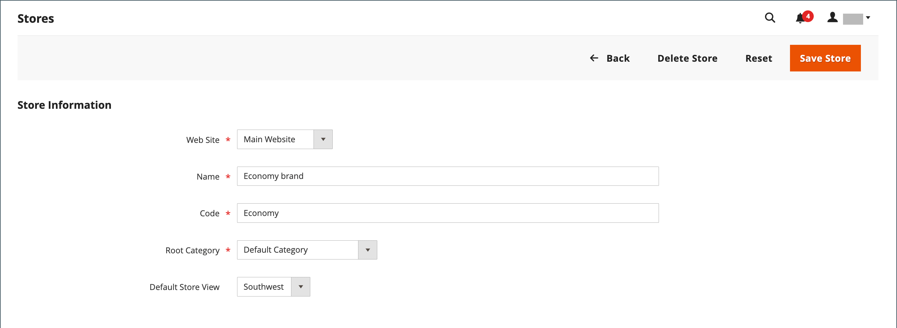

# Structure du magasin et du site

Lorsque Adobe Commerce ou Magento Open Source est installé, une hiérarchie contenant un site web principal, un magasin et une vue de magasin est créée. Vous pouvez créer d’autres sites web, magasins et vues de magasin, si nécessaire. Par exemple, en plus de votre site web principal, vous pouvez avoir d’autres sites web avec un domaine différent. Dans chaque site web, vous pouvez avoir plusieurs magasins, et dans chaque magasin, des vues de magasin distinctes. De nombreuses installations disposent d’un site web et d’un magasin, mais avec plusieurs vues de magasin pour prendre en charge différentes langues.

Avant de commencer, planifiez votre hiérarchie de catalogues de magasins à l’avance, car elle est référencée tout au long de la configuration. Chaque magasin peut avoir une [catégorie racine](../catalog/category-root.md) distincte, ce qui permet d’avoir un ensemble entièrement différent d’options de menu principal pour chaque magasin.

{width="550"}

## Ajouter des magasins

Une seule installation d’Adobe Commerce ou de Magento Open Source peut comporter plusieurs magasins qui partagent un administrateur. Les magasins qui se trouvent sur le même site web ont la même adresse IP et le même domaine, utilisent le même certificat de sécurité et partagent un seul processus de passage en caisse.

L’important à comprendre est que les magasins utilisent le même code et partagent un administrateur. Chaque magasin peut avoir un catalogue distinct ou les magasins peuvent partager un catalogue. Chaque magasin peut avoir une [catégorie racine](../catalog/category-root.md) distincte, ce qui permet d’avoir un menu principal différent pour chaque magasin. Les magasins peuvent également avoir des marques, une présentation et un contenu différents. Prenez le temps de planifier votre hiérarchie de magasins en gardant à l’esprit la croissance future avant de commencer, car elle est utilisée tout au long de la configuration.

{width="550"}

Voici quelques exemples de configuration des URL pour plusieurs magasins :

| URL | Description |
| --- | ----------- |
| `yourdomain.com/store1` `yourdomain.com/store2` | Chaque magasin possède un chemin d’accès différent, mais partage un domaine. |
| `store1.yourdomain.com` `store2.yourdomain.com` | Chaque magasin possède un sous-domaine différent du domaine principal. |

Les installations multi-magasin d’Adobe Commerce doivent être configurées à partir de l’administrateur et également à partir de la ligne de commande du serveur. Le [Guide de configuration](https://experienceleague.adobe.com/docs/commerce-operations/configuration-guide/multi-sites/ms-overview.html) d’Adobe Commerce fournit des instructions détaillées sur la configuration de l’environnement du serveur.

### Étape 1 : Sélection du domaine de magasin

La première étape consiste à choisir la position du magasin. Les magasins doivent-ils partager un domaine, chacun avoir un sous-domaine ou des domaines distincts ? Pour chaque magasin, effectuez l’une des opérations suivantes :

- Pour placer le magasin un niveau sous le domaine principal, il n’est pas nécessaire de faire quoi que ce soit.
- Configurez un sous-domaine de votre domaine principal.
- Configurez un autre domaine principal.

### Étape 2 : création du magasin

1. Sur la barre latérale _Admin_, accédez à **[!UICONTROL Stores]** > _[!UICONTROL Settings]_>**[!UICONTROL All Stores]**.

1. Cliquez sur **[!UICONTROL Create Store]** et définissez les options du nouveau magasin :

   - **[!UICONTROL Web Site]** — Sélectionnez un site web qui doit être le parent du nouveau magasin. Si l’installation ne comporte qu’un seul site web, acceptez la valeur par défaut (`Main Website`).

   - **[!UICONTROL Name]** — Saisissez le nom du nouveau magasin. Le nom est à titre de référence interne uniquement.

   - **[!UICONTROL Code]** — Entrez un code en minuscules pour identifier le magasin. Par exemple : `mainstore`.

   - **[!UICONTROL Root Category]** — Défini sur la [catégorie racine](../catalog/category-root.md) qui définit la structure de catégorie pour le menu principal du nouveau magasin. Si vous avez déjà créé une catégorie racine spécifique pour le magasin, sélectionnez-la. Sinon, sélectionnez `Default Category`. Vous pouvez revenir plus tard et mettre à jour le paramètre .

   {width="600" zoomable="yes"}

1. Cliquez sur **[!UICONTROL Save Store]**.

### Étape 3 : création d’une vue de magasin par défaut

1. Cliquez sur **[!UICONTROL Create Store View]** et définissez les options de vue du magasin :

   - **[!UICONTROL Store]** — Définissez sur le nouveau magasin que vous avez créé.

   - **[!UICONTROL Name]** — Saisissez un nom pour la vue. Par exemple, `English`.

   - **[!UICONTROL Code]** — Entrez un code pour la vue en minuscules.

   - **[!UICONTROL Status]** — Défini sur `Enabled`.

   - **[!UICONTROL Sort Order]** — Entrez un nombre pour déterminer la position du magasin lorsqu’il est répertorié avec d’autres magasins.

1. Cliquez sur **[!UICONTROL Save Store View]**.

   Si vous ouvrez votre magasin en mode d’édition, vous pouvez constater qu’il dispose désormais d’une vue par défaut.

   {width="600" zoomable="yes"}

### Étape 4 : configuration de l’URL du magasin

1. Dans la barre latérale _Admin_, cliquez sur **[!UICONTROL Stores]** > _[!UICONTROL Settings]_>**[!UICONTROL Configuration]**.

1. Sous _[!UICONTROL General]_&#x200B;dans le panneau de gauche, sélectionnez **[!UICONTROL Web]**.

1. Dans le coin supérieur gauche, définissez **[!UICONTROL Store View]** sur la vue que vous avez créée pour le nouveau magasin.

1. Lorsque vous êtes invité à confirmer le changement de [portée](../getting-started/websites-stores-views.md#scope-settings), cliquez sur **[!UICONTROL OK]**.

   {width="600" zoomable="yes"}

1. Développez la section  et saisissez l’URL de base du magasin.**[!UICONTROL Base URLs]**

   Si nécessaire, décochez la case **[!UICONTROL Use system value]** pour modifier le paramètre.

   {width="600" zoomable="yes"}

1. Développez la section  et répétez l’étape précédente si vous souhaitez configurer le magasin [URL sécurisée](store-urls.md).**[!UICONTROL Secure Base URLs]**

1. Cliquez sur **[!UICONTROL Save Config]**.

### Etape 5 : Configuration du serveur

Pour configurer votre serveur de manière à prendre en charge plusieurs sites Web, reportez-vous à la section [Plusieurs sites Web ou magasins](https://experienceleague.adobe.com/docs/commerce-operations/configuration-guide/multi-sites/ms-overview.html) du _Guide de configuration_.

Pour obtenir de l’aide sur la configuration de votre serveur web, consultez les ressources suivantes :

- [Configuration de plusieurs sites web avec NGNX](https://experienceleague.adobe.com/docs/commerce-operations/configuration-guide/multi-sites/ms-nginx.html)
- [Configuration de plusieurs sites web avec Apache](https://experienceleague.adobe.com/docs/commerce-operations/configuration-guide/multi-sites/ms-apache.html)

Pour Adobe Commerce sur l’infrastructure cloud, voir [Configuration de plusieurs sites web ou magasins](https://experienceleague.adobe.com/docs/commerce-cloud-service/user-guide/configure-store/multiple-sites.html).

## Ajouter des sites web

Plusieurs sites web peuvent être configurés à partir d’une installation Adobe Commerce ou d’un Magento Open Source unique avec le même domaine ou des domaines différents. Par défaut, les magasins situés sous le même site web ont les mêmes adresse IP et domaine, utilisent le même certificat de sécurité et partagent un seul processus de passage en caisse. Si vous souhaitez que chaque magasin dispose d’un processus de passage en caisse dédié sous son propre domaine, chaque magasin doit disposer d’une adresse IP distincte et d’un certificat de sécurité distinct.

Les installations multi-site d’Adobe Commerce ou de Magento Open Source doivent être configurées à partir de l’administrateur et également à partir de la ligne de commande du serveur. Le [Guide de configuration](https://experienceleague.adobe.com/docs/commerce-operations/configuration-guide/multi-sites/ms-overview.html) de Commerce fournit des instructions détaillées sur la configuration de l’environnement du serveur.

{width="550"}

### Étape 1 : création d’un site web

1. Sur la barre latérale _Admin_, accédez à **[!UICONTROL Stores]** > _[!UICONTROL Settings]_>**[!UICONTROL All Stores]**.

1. Dans le coin supérieur droit, cliquez sur **[!UICONTROL Create Website]**.

1. Définissez les options **[!UICONTROL Web Site Information]** :

   {width="600" zoomable="yes"}

   - **[!UICONTROL Name]** — Entrez le domaine du nouveau site web. Par exemple, `domain.com`.

   - **[!UICONTROL Code]** — Entrez un code utilisé sur le serveur pour pointer vers le domaine.

     Le code doit commencer par une lettre minuscule (a-z) et peut inclure n’importe quelle combinaison de lettres (a-z), de nombres (0-9) et du caractère de soulignement (_).

   - **[!UICONTROL Sort Order]** — _(Facultatif)_ Saisissez un nombre pour déterminer la séquence dans laquelle ce site est répertorié avec d’autres sites. Pour que ce site apparaisse en haut de la liste, saisissez un zéro (`0`).

1. Cliquez sur **[!UICONTROL Save Web Site]**.

1. Configurez chaque [magasin](#add-stores) et [vue de magasin](store-views.md) nécessaires pour le nouveau site web.

   Vous pouvez ensuite ouvrir le site web en mode d’édition pour définir le magasin par défaut.

### Étape 2 : configuration de l’URL du magasin

Pour configurer les [URL de magasin](store-urls.md), suivez les instructions.

### Etape 3 : Configuration du serveur

Pour configurer votre serveur de manière à prendre en charge plusieurs sites Web, reportez-vous à la section [Plusieurs sites Web ou magasins](https://experienceleague.adobe.com/docs/commerce-operations/configuration-guide/multi-sites/ms-overview.html) du _Guide de configuration_.

Pour obtenir de l’aide sur la configuration de votre serveur web, consultez les tutoriels suivants :

- [Configuration de plusieurs sites web avec NGNX](https://experienceleague.adobe.com/docs/commerce-operations/configuration-guide/multi-sites/ms-nginx.html)
- [Configuration de plusieurs sites web avec Apache](https://experienceleague.adobe.com/docs/commerce-operations/configuration-guide/multi-sites/ms-apache.html)

Pour Adobe Commerce sur l’infrastructure cloud, voir [Configuration de plusieurs sites web ou magasins](https://experienceleague.adobe.com/docs/commerce-cloud-service/user-guide/configure-store/multiple-sites.html).
