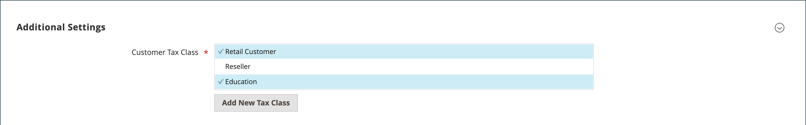

# Classes d&#39;impôts

Les classes de taxe peuvent être attribuées aux clients, aux produits et aux frais d&#39;expédition. Commerce analyse le panier de chaque client et calcule la taxe appropriée en fonction de la classe du client, de la classe des produits du panier et de la région. La région est déterminée par l’adresse de livraison, l’adresse de facturation ou l’origine de livraison du client. De nouvelles classes de taxe peuvent être créées lorsqu&#39;une [règle de taxe](tax-rules.md) est définie.

- **Client** — Vous pouvez créer autant de classes de taxe client que nécessaire et les affecter à des [groupes de clients](../customers/customer-groups.md). Par exemple, dans certaines juridictions, les transactions de gros ne sont pas taxées, mais les transactions de détail le sont. Vous pouvez associer les membres du groupe de clients en gros à la classe de taxe en gros.

- **Produit** — Les classes de produits sont utilisées dans les calculs pour déterminer le taux de taxe correct appliqué au panier. Lorsque vous créez un produit, il est affecté à une classe de taxe spécifique. Par exemple, les aliments peuvent ne pas être taxés ou l&#39;être à un taux différent.

- **Expédition** — Si votre magasin facture une taxe supplémentaire sur l&#39;expédition, vous devez désigner une classe de taxe de produit spécifique pour l&#39;expédition. Ensuite, dans la configuration, spécifiez-la comme classe de taxe utilisée pour l’expédition.

## Configurer les classes de taxe

La classe de taxe utilisée pour l&#39;expédition et les classes de taxe par défaut pour les [produits et clients](#add-a-product-tax-class) sont définies dans la configuration _[!UICONTROL Sales]_.

1. Dans la barre latérale _Admin_, accédez à **[!UICONTROL Stores]** > _[!UICONTROL Settings]_>**[!UICONTROL Configuration]**.

1. Dans le panneau de gauche, développez **[!UICONTROL Sales]** et choisissez **[!UICONTROL Tax]**.

1. Développez  la section **[!UICONTROL Tax Classes]** .

   {width="600" zoomable="yes"}

1. Choisissez la classe de taxe pour chacun des éléments suivants :

   - **[!UICONTROL Set Tax Class for Shipping]**
   - **[!UICONTROL Tax Class for Gift Options]**
   - **[!UICONTROL Default Tax Class for Product]**
   - **[!UICONTROL Default Tax Class for Customer]**

1. Cliquez ensuite sur **[!UICONTROL Save Config]**.

## Ajouter des classes de taxe

Les classes de taxe pour les clients et les produits peuvent être facilement ajoutées, puis affectées à des clients et des produits individuels, et utilisées dans les règles de taxe.

1. Dans la barre latérale _Admin_, accédez à **[!UICONTROL Stores]** > _[!UICONTROL Taxes]_>**[!UICONTROL Tax Rules]**.

1. Cliquez sur **[!UICONTROL Add New Tax Rule]**.

1. Développez  la section **[!UICONTROL Additional Settings]** .

   {width="600" zoomable="yes"}

1. Sous _Classe de taxe client_, cliquez sur **[!UICONTROL Add New Tax Class]**.

1. Saisissez le **[!UICONTROL Name]** de la nouvelle classe de taxe dans la zone de texte.

   {width="600" zoomable="yes"}

1. Pour ajouter la nouvelle classe à la liste des classes de taxe client disponibles, cliquez sur la coche.

   {width="600" zoomable="yes"}

## Ajouter une classe de taxe de produit

1. Sous _Classe de taxe de produit_, cliquez sur **[!UICONTROL Add New Tax Class]**.

1. Saisissez le **[!UICONTROL Name]** de la nouvelle classe de taxe dans la zone de texte.

1. Pour ajouter la nouvelle classe à la liste des classes de taxe sur les produits disponibles, cliquez sur la coche.

1. Une fois l’opération terminée, cliquez sur **[!UICONTROL Back]** dans la barre de boutons pour revenir à la grille _Règles fiscales_.

## Destination fiscale par défaut

Les paramètres de destination de taxe par défaut déterminent le pays, l’État et le code postal utilisés comme base de calcul des taxes.

**_Pour configurer la destination de taxe par défaut pour les calculs:_**

1. Dans la barre latérale _Admin_, accédez à **[!UICONTROL Stores]** > _[!UICONTROL Settings]_>**[!UICONTROL Configuration]**.

1. Dans le panneau de gauche, développez **[!UICONTROL Sales]** et choisissez **[!UICONTROL Tax]**.

1. Développez  la section **[!UICONTROL Default Tax Destination Calculation]** .

   {width="600" zoomable="yes"}

1. Définissez **[!UICONTROL Default Country]** sur le pays sur lequel les calculs de taxe sont basés.

1. Définissez **[!UICONTROL Default State]** sur l’État ou la province utilisé(e) comme base de calcul des taxes.

1. Définissez **[!UICONTROL Default Post Code]** sur le code postal utilisé comme base de calcul des taxes locales.

1. Cliquez ensuite sur **[!UICONTROL Save Config]**.
