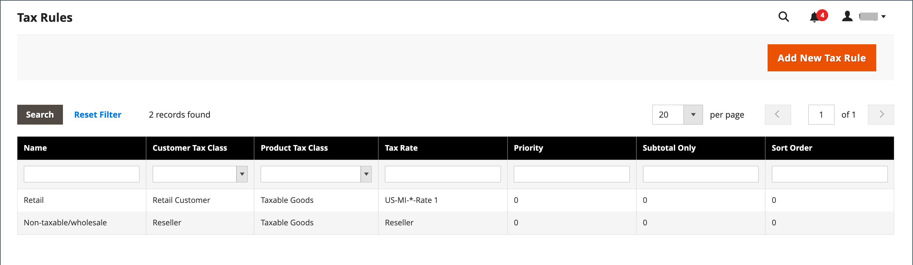
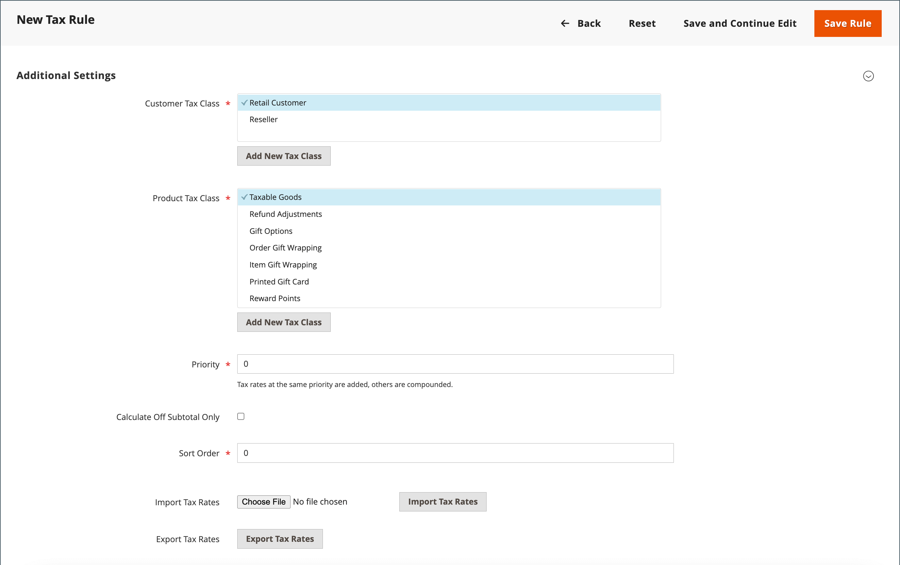

# Règles fiscales

Les règles fiscales intègrent une combinaison de classe de produits, de classe de clients et de taux de taxe. Chaque client est affecté à une classe de clients et chaque produit est affecté à une classe de produits. Commerce analyse le panier de chaque client et calcule la taxe appropriée en fonction des classes de client et de produit, ainsi que de la région. La région est basée sur l’adresse de livraison, l’adresse de facturation ou l’origine de livraison du client.

>[!NOTE]
>
>Lorsque de nombreux taux de taxe doivent être définis, vous pouvez simplifier le processus en les important.

{width="600" zoomable="yes"}

## Etape 1 : Renseigner les informations sur les règles fiscales

1. Dans la barre latérale _Admin_, accédez à **[!UICONTROL Stores]** > _[!UICONTROL Taxes]_>**[!UICONTROL Tax Rules]**.

1. Dans le coin supérieur droit, cliquez sur **[!UICONTROL Add New Tax Rule]**.

1. Sous _Informations sur la règle de taxe_, saisissez un **[!UICONTROL Name]** pour la nouvelle règle.

   {width="600" zoomable="yes"}

1. Sélectionnez la **[!UICONTROL Tax Rate]** qui s’applique à la règle.

   Pour modifier un taux de taxe existant, procédez comme suit :

   - Survolez le taux de taxe et cliquez sur l’icône _Modifier_ .

   - Mettez le formulaire à jour selon vos besoins, puis cliquez sur **[!UICONTROL Save]**.

1. Pour saisir des taux de taxe, utilisez l&#39;une des méthodes suivantes :

### Méthode 1 : saisir manuellement les taux de taxe

1. Cliquez sur **[!UICONTROL Add New Tax Rate]**.

1. Complétez le formulaire selon vos besoins (voir [Zones fiscales et taux](tax-zones-rates.md)).

1. Cliquez ensuite sur **[!UICONTROL Save]**.

   {width="600" zoomable="yes"}

### Méthode 2 : Taux de taxe à l&#39;importation

1. Faites défiler la page jusqu’à la section située en bas.

1. Pour importer des taux de taxe, procédez comme suit :

   - Cliquez sur **[!UICONTROL Choose File]** et accédez au fichier CSV contenant les taux de taxe à importer.

   - Cliquez sur **[!UICONTROL Import Tax Rates]**.

1. Pour exporter des taux de taxe, cliquez sur **[!UICONTROL Export Tax Rates]** (voir [&#x200B; Taux de taxe d&#39;importation/exportation &#x200B;](../systems/data-transfer-tax-rates.md)).

{width="600" zoomable="yes"}

## Étape 2 : définition des paramètres supplémentaires

1. Pour ouvrir la section, cliquez sur **[!UICONTROL Additional Settings]**.

   {width="600" zoomable="yes"}

1. Sélectionnez le **[!UICONTROL Customer Tax Class]** auquel la règle s’applique.

   - Pour modifier une classe de taxe de client, cliquez sur l’icône _Modifier_ , mettez à jour le formulaire si nécessaire, puis cliquez sur **[!UICONTROL Save]**.

   - Pour créer une classe de taxe, cliquez sur **[!UICONTROL Add New Tax Class]**, remplissez le formulaire selon vos besoins, puis cliquez sur **[!UICONTROL Save]**.

1. Sélectionnez le **[!UICONTROL Product Tax Class]** auquel la règle s’applique.

   - Pour modifier une classe de taxe de produit, cliquez sur l’icône _Modifier_ , mettez à jour le formulaire si nécessaire, puis cliquez sur **[!UICONTROL Save]**.

   - Pour créer une classe de taxe, cliquez sur **[!UICONTROL Add New Tax Class]**, remplissez le formulaire selon vos besoins, puis cliquez sur **[!UICONTROL Save]**.

1. Lorsque plusieurs taxes s&#39;appliquent, entrez un nombre pour indiquer la priorité de cette taxe pour **[!UICONTROL Priority]**.

   Si deux règles fiscales de même priorité s&#39;appliquent, les taxes sont ajoutées. Si deux taxes avec des paramètres de priorité différents s’appliquent, les taxes sont composées.

1. Si vous souhaitez que les taxes soient basées sur le sous-total de commande, cochez la case **[!UICONTROL Calculate off Subtotal Only]**.

1. Par **[!UICONTROL Sort Order]**, saisissez un nombre pour indiquer l&#39;ordre de cette règle de taxe lorsqu&#39;elle est cotée avec d&#39;autres.

1. Cliquez ensuite sur **[!UICONTROL Save Rule]**.

## Démonstration des règles de devise et de taxe

Découvrez la gestion des règles monétaires et fiscales en regardant cette vidéo :

>[!VIDEO](https://video.tv.adobe.com/v/3410211/?captions=fre_fr&quality=12&learn=on)
