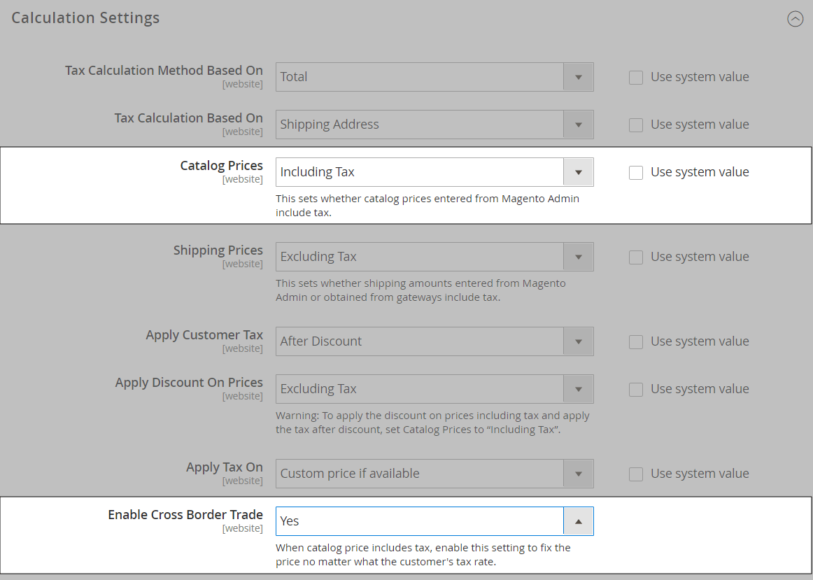

# Paramètres de configuration des taxes

Les instructions suivantes décrivent la configuration de base des taxes pour votre instance Commerce. Avant de configurer vos taxes, assurez-vous de connaître les exigences fiscales de votre [locale](store-localize.md#step-3-change-the-locale-of-the-store-view). Ensuite, effectuez le paramétrage fiscal en fonction de vos besoins.

L&#39;administrateur [permissions](../systems/permissions.md) peut être défini pour restreindre l&#39;[accès](../systems/permissions-user-roles.md) aux ressources fiscales, en fonction de l&#39;entreprise _nécessaire pour connaître_. Pour créer un rôle d’administrateur avec accès aux paramètres de taxe, sélectionnez les ressources Ventes/Taxe et Système/Taxe . Si vous configurez un site web pour une région qui diffère de votre point d’origine d’expédition par défaut, vous devez également autoriser l’accès aux ressources système/d’expédition pour le rôle . Les paramètres d’expédition déterminent le taux de taxe de magasin utilisé pour les prix du catalogue.

## Configuration des paramètres généraux de taxe

1. Sur la barre latérale _Admin_, accédez à **[!UICONTROL Stores]** > _[!UICONTROL Settings]_>**[!UICONTROL Configuration]**.

1. Pour une configuration multisite, définissez **[!UICONTROL Store View]** sur le site web et le magasin qui est la cible de la configuration.

1. Dans le panneau de gauche, développez **[!UICONTROL Sales]** et choisissez **[!UICONTROL Tax]**.

1. Définissez les paramètres de configuration suivants.

   Si nécessaire, décochez la case **[!UICONTROL Use system value]** des paramètres grisés.

### [!UICONTROL Tax Classes]

1. Développez la section  sur **[!UICONTROL Tax Classes]** .

   {width="600" zoomable="yes"}

   - **Classe fiscale pour l’expédition** — Défini sur la classe appropriée. Les classes par défaut sont : `None` et `Taxable Goods`
   - **Classe fiscale pour les options de cadeau** —  (Adobe Commerce uniquement) Défini sur la classe appropriée. Les classes par défaut sont : `None` et `Taxable Goods`
   - **Classe fiscale par défaut du produit** — Défini sur la classe appropriée. Les classes par défaut sont : `None` et `Taxable Goods`
   - **Classe fiscale par défaut pour le client** — Défini sur la classe appropriée. La classe par défaut est : `Retail Customer` et `Wholesale Customer`

1. Une fois l’opération terminée, cliquez sur **[!UICONTROL Save Config]**.

### [!UICONTROL Calculation Settings]

1. Développez la section **[!UICONTROL Calculation Settings]** .

   {width="600" zoomable="yes"}

1. Définissez **[!UICONTROL Tax Calculation Method Based On]** sur l’une des options suivantes :

   - `Unit Price` - Le prix de chaque produit
   - `Row Total` - Total de l’article dans la commande, moins remises
   - `Total` - Total de la commande

1. Définissez **[!UICONTROL Tax Calculation Based On]** sur l’une des options suivantes :

   - `Shipping Address` - Adresse à laquelle la commande doit être expédiée
   - `Billing Address` - Adresse de facturation du client ou de la société
   - `Shipping Origin` - Adresse spécifiée comme [point d’origine](shipping-settings.md#point-of-origin) pour votre boutique

1. Définissez **[!UICONTROL Catalog Prices]** sur `Excluding Tax` ou `Including Tax`.

1. Définissez **[!UICONTROL Shipping Prices]** sur `Excluding Tax` ou `Including Tax`.

1. Définissez **[!UICONTROL Apply Customer Tax]** sur l&#39;une des valeurs suivantes pour déterminer si la taxe est appliquée au prix d&#39;origine ou au prix escompté : `After Discount` ou `Before Discount`

1. Définissez **[!UICONTROL Apply Discount on Prices]** sur l’une des valeurs suivantes pour déterminer si les remises incluent ou excluent la taxe : `Excluding Tax` ou `Including Tax`

1. Définissez **[!UICONTROL Apply Tax On]** sur `Custom price if available` ou `Original price only`.

1. Définissez **[!UICONTROL Enable Cross-Border Trade]** sur l’une des options suivantes :

   - `Yes` - Utilisez des prix cohérents pour différents taux d’imposition. Si le prix du catalogue inclut la taxe, choisissez ce paramètre pour fixer le prix, quel que soit le taux d’imposition du client.
   - `No` - Varier le prix en fonction du taux d’imposition.

   >[!IMPORTANT]
   >
   >Si le [commerce transfrontalier](#cross-border-price-consistency) est activé, la marge bénéficiaire change par taux d&#39;imposition. Le profit est déterminé par la formule (`Revenue - CustomerVAT - CostOfGoodsSold`). Pour permettre le commerce transfrontalier, les prix doivent être fixés de manière à inclure les taxes.

### [!UICONTROL Default Tax Destination Calculation]

1. Développez la section  sur **[!UICONTROL Default Tax Destination Calculation]** .

   {width="600" zoomable="yes"}

1. Spécifiez le **[!UICONTROL Default Country]** pour le calcul des taxes.

1. Le cas échéant, indiquez le **[!UICONTROL Default State]** pour le calcul des impôts.

1. Le cas échéant, indiquez le **[!UICONTROL Default Post Code]** pour le calcul des impôts.

1. Une fois l’opération terminée, cliquez sur **[!UICONTROL Save Config]**.

### [!UICONTROL Price Display Settings]

>[!IMPORTANT]
>
>Certaines combinaisons de paramètres liés à un affichage de prix qui incluent et excluent des taxes peuvent dérouter le client. Pour éviter de déclencher un message d’avertissement, consultez les [paramètres recommandés](taxes.md#warning-messages).

1. Développez la section  sur **[!UICONTROL Price Display Settings]** .

   {width="600" zoomable="yes"}

1. Définissez **[!UICONTROL Display Product Prices in Catalog]** sur l’une des options suivantes :

   - `Excluding Tax` - Les prix du catalogue qui apparaissent sur le storefront ne comprennent pas de taxe.
   - `Including Tax` - Les prix du catalogue dans le storefront incluent la taxe uniquement si une règle de taxe correspond à l’origine de la taxe ou si l’adresse du client correspond à la règle de taxe. Cela peut se produire lorsqu’un client crée un compte, se connecte ou utilise l’outil Estimer les impôts et l’expédition dans le panier.
   - `Including and Excluding Tax` - Les prix du catalogue qui apparaissent dans le storefront s’affichent avec et sans taxe.

1. Définissez **[!UICONTROL Display Shipping Prices]** sur `Excluding Tax`, `Including Tax` ou `Including and Excluding Tax`.

1. Une fois l’opération terminée, cliquez sur **[!UICONTROL Save Config]**.

### [!UICONTROL Shopping Cart Display Settings]

1. Développez la section  sur **[!UICONTROL Shopping Cart Display Settings]** .

   {width="600" zoomable="yes"}

1. Pour chacun des paramètres suivants, choisissez la manière dont vous souhaitez que les taxes et les prix apparaissent dans le panier, en fonction des exigences de votre boutique et de vos paramètres régionaux :

   - Définissez **[!UICONTROL Display Prices]** sur `Excluding Tax`, `Including Tax` ou `Including and Excluding Tax`.

   - Définissez **[!UICONTROL Display Subtotal]** sur `Excluding Tax`, `Including Tax` ou `Including and Excluding Tax`.

   - Définissez **[!UICONTROL Display Shipping Amount]** sur `Excluding Tax`, `Including Tax` ou `Including and Excluding Tax`.

   -  (Adobe Commerce uniquement) Définissez **[!UICONTROL Display Gift Wrapping Prices]** sur `Excluding Tax`, `Including Tax` ou `Including and Excluding Tax`.

   -  (Adobe Commerce uniquement) Définissez **[!UICONTROL Display Printed Card Prices]** sur `Excluding Tax`, `Including Tax` ou `Including and Excluding Tax`.

1. Définissez les options d’affichage suivantes sur `Yes` ou `No`, selon vos besoins :

   - **[!UICONTROL Include Tax in Order Total]**
   - **[!UICONTROL Display Full Tax Summary]**
   - **[!UICONTROL Display Zero Tax Subtotal]**

1. Une fois l’opération terminée, cliquez sur **[!UICONTROL Save Config]**.

### [!UICONTROL Orders, Invoices, Credit Memos Display Settings]

1. Développez  de la section **[!UICONTROL Orders, Invoices, Credit Memos Display Settings]** .

   {width="600" zoomable="yes"}

1. Indiquez le mode d’affichage des prix et des taxes dans les commandes, les factures et les notes de crédit :

   - Définissez **[!UICONTROL Display Prices]** sur `Excluding Tax`, `Including Tax` ou `Including and Excluding Tax`.

   - Définissez **[!UICONTROL Display Subtotal]** sur `Excluding Tax`, `Including Tax` ou `Including and Excluding Tax`.

   - Définissez **[!UICONTROL Display Shipping Amount]** sur `Excluding Tax`, `Including Tax` ou `Including and Excluding Tax`.

   -  (Adobe Commerce uniquement) Définissez **[!UICONTROL Display Gift Wrapping Prices]** sur `Excluding Tax`, `Including Tax` ou `Including and Excluding Tax`.

   -  (Adobe Commerce uniquement) Définissez **[!UICONTROL Display Printed Card Prices]** sur `Excluding Tax`, `Including Tax` ou `Including and Excluding Tax`.

1. Définissez les options d’affichage suivantes sur `Yes` ou `No`, selon vos besoins :

   - **[!UICONTROL Include Tax in Order Total]**
   - **[!UICONTROL Display Full Tax Summary]**
   - **[!UICONTROL Display Zero Tax Subtotal]**

1. Une fois l’opération terminée, cliquez sur **[!UICONTROL Save Config]**.

### [!UICONTROL Fixed Product Taxes]

1. Développez la section  sur **[!UICONTROL Fixed Product Taxes]** .

   {width="600" zoomable="yes"}

1. Définissez **[!UICONTROL Enable FPT]** sur `Yes` ou `No`, selon vos besoins.

1. Si FPT est activé, spécifiez les options d’affichage FPT :

   - **[!UICONTROL Display Prices in Product Lists]**
   - **[!UICONTROL Display Price On Product view Page]**
   - **[!UICONTROL Display Prices in Sales Modules]**
   - **[!UICONTROL Display Prices in Emails]**

   - `Including FPT Only` - Les prix affichés incluent les taxes sur les produits fixes. Le montant FPT n’est pas affiché séparément.
   - `Including FPT and FPT description` - Les prix affichés incluent les taxes sur les produits fixes. Le montant FPT est affiché séparément.
   - `Excluding FPT. Including FPT description and final price` - Les prix affichés ne comprennent pas les taxes sur les produits fixes. Le montant FPT est affiché séparément.
   - `Excluding FPT` - Les prix affichés ne comprennent pas les taxes sur les produits fixes. Le montant FPT n’est pas affiché séparément.

1. Définissez **[!UICONTROL Apply Discounts to FPT]** sur `Yes` ou `No`, selon vos besoins.

1. Définissez **[!UICONTROL FPT Tax Configuration]** pour déterminer comment FPT est calculé.

   - `Not Taxed` - Sélectionnez cette option si votre juridiction fiscale n’impose pas le FPT. (Par exemple, la Californie.)
   - `Taxed` - Sélectionnez cette option si votre juridiction fiscale applique le FPT d’impôt. (Par exemple, Canada.)
   - `Loaded and Displayed with Tax` - Cliquez sur cette option si FPT est ajouté au total de la commande avant d’appliquer la taxe. (Par exemple, les pays de l&#39;UE.)

1. Définissez **[!UICONTROL Include FPT in Subtotal]** sur `Yes` ou `No`, selon vos besoins.

1. Une fois l’opération terminée, cliquez sur **[!UICONTROL Save Config]**.

## Cohérence transfrontalière des prix

Le commerce transfrontalier (également appelé cohérence des prix) soutient l&#39;Union européenne (UE) et d&#39;autres commerçants qui veulent maintenir des prix cohérents pour les clients dont les taux d&#39;imposition sont différents du taux d&#39;imposition des magasins.

Les commerçants opérant dans plusieurs régions et zones géographiques peuvent afficher un seul prix en incluant la taxe dans le prix du produit. Les prix sont propres et ordonnés indépendamment des structures et des taux d&#39;imposition qui varient d&#39;un pays à l&#39;autre. Ces paramètres nécessitent qu’une extension de calcul des taxes soit installée à partir de [Marketplace](../getting-started/commerce-marketplace.md), par exemple _Vertex Cloud_.

>[!NOTE]
>
>Lorsque le commerce transfrontalier est activé, votre marge bénéficiaire change par taux d’imposition. Le profit est déterminé par la formule : 
>`Revenue - CustomerVAT - CostOfGoodsSold`

**_Pour activer la cohérence des prix transfrontaliers :_**

1. Sur la barre latérale _Admin_, accédez à **[!UICONTROL Stores]** > _[!UICONTROL Settings]_>**[!UICONTROL Configuration]**.

1. Pour une configuration multisite, définissez **[!UICONTROL Store View]** sur le site web et le magasin qui est la cible de la configuration.

1. Dans le panneau de gauche, développez **[!UICONTROL Sales]** et choisissez **[!UICONTROL Tax]**.

1. Développez la section  sur **[!UICONTROL Calculation Settings]** .

1. Définissez **[!UICONTROL Catalog Prices]** sur `Including Tax`.

1. Pour activer la cohérence des prix transfrontaliers, définissez **[!UICONTROL Enable Cross Border Trade]** sur `Yes`.

   {width="600" zoomable="yes"}

1. Une fois l’opération terminée, cliquez sur **[!UICONTROL Save Config]**.
