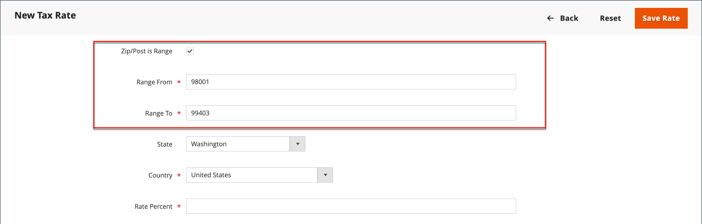

# Zones et taux d&#39;imposition

Les taux d&#39;imposition s&#39;appliquent généralement aux transactions qui ont lieu dans une zone géographique donnée. Utilisez l’outil _Zones fiscales et taux_ pour spécifier le taux d’imposition de chaque zone géographique à partir de laquelle vous collectez et remettez des impôts. Chaque zone et chaque taux d’imposition ayant un identifiant unique, vous pouvez avoir plusieurs taux d’imposition pour une zone géographique donnée (par exemple, des endroits qui ne taxent pas la nourriture ou les médicaments, mais qui taxent d’autres articles).

La taxe de magasin est calculée en fonction de l’adresse du magasin. La taxe réelle du client pour une commande est calculée une fois que le client a renseigné les informations de commande. Commerce calcule ensuite la taxe en fonction de la configuration fiscale du magasin.

{width="600" zoomable="yes"}

## Définition d’un nouveau taux de taxe

1. Sur la barre latérale _Admin_, accédez à **[!UICONTROL Stores]** > _[!UICONTROL Taxes]_>**[!UICONTROL Tax Zones and Rates]**.

1. Dans le coin supérieur droit, cliquez sur **[!UICONTROL Add New Tax Rate]**.

   {width="600" zoomable="yes"}

1. Saisissez un **[!UICONTROL Tax Identifier]**.

1. Pour appliquer le taux de taxe à un seul code postal, saisissez le code pour **[!UICONTROL Zip/Post Code]**.

   Le caractère générique astérisque (`*`) peut être utilisé pour faire correspondre jusqu’à dix caractères du code. Par exemple, `90*` représente tous les codes postaux de 90000 à 90999.

1. Pour appliquer le taux de taxe à une plage de codes postaux, procédez comme suit :

   - Cochez la case **[!UICONTROL Zip/Post is Range]** et définissez la plage en saisissant le premier et le dernier code postal pour **[!UICONTROL Range From]** et **[!UICONTROL Range To]**.

     {width="600" zoomable="yes"}

   - Sélectionnez le **[!UICONTROL State]** où s&#39;applique le taux de taxe.

   - Sélectionnez le **[!UICONTROL Country]** où s&#39;applique le taux de taxe.

   - Saisissez le **[!UICONTROL Rate Percent]** utilisé pour le calcul du taux d&#39;imposition.

1. Si vous avez plusieurs magasins, vous pouvez définir **[!UICONTROL Tax Titles]** pour chaque vue de magasin.

   >[!NOTE]
   >
   >Laissez ce champ vide si vous souhaitez utiliser l&#39;identifiant de la taxe.

1. Une fois l’opération terminée, cliquez sur **[!UICONTROL Save Rate]**.

## Modification d’un taux de taxe existant

1. Sur la barre latérale _Admin_, accédez à **[!UICONTROL Stores]** > _[!UICONTROL Taxes]_>**[!UICONTROL Tax Zones and Rates]**.

1. Recherchez le taux d’imposition dans la grille _[!UICONTROL Tax Zones and Rates]_et ouvrez l’enregistrement en mode d’édition.

   S&#39;il existe de nombreux taux dans la liste, utilisez les [contrôles de filtre](../getting-started/admin-grid-controls.md) pour trouver le taux dont vous avez besoin.

1. Apportez les modifications nécessaires au **[!UICONTROL Tax Rate Information]**.

1. Mettez à jour **[!UICONTROL Tax Titles]** si nécessaire.

1. Une fois l’opération terminée, cliquez sur **[!UICONTROL Save Rate]**.

## Supprimer le taux d&#39;imposition

1. Sur la barre latérale _Admin_, accédez à **[!UICONTROL Stores]** > _[!UICONTROL Taxes]_>**[!UICONTROL Tax Zones and Rates]**.

1. Recherchez le taux de taxe à supprimer et ouvrez-le en mode d&#39;édition.

1. Dans la barre de menus, cliquez sur **[!UICONTROL Delete Rate]**.

1. Pour confirmer l’action, cliquez sur **[!UICONTROL OK]**.
