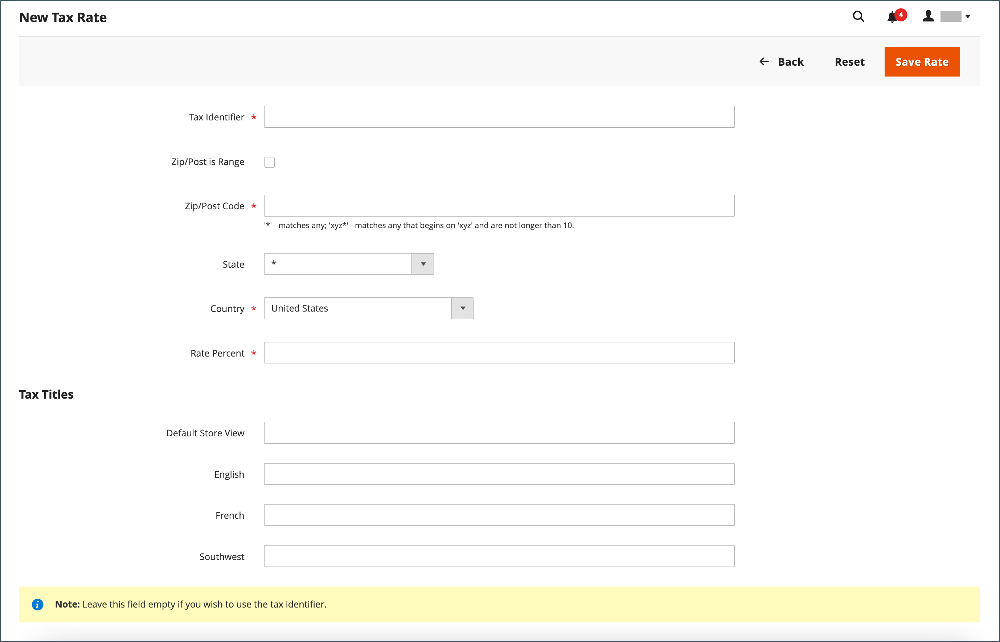

# Zones fiscales et taux

Les taux d’imposition s’appliquent généralement aux transactions qui ont lieu dans une zone géographique spécifique. Utilisez l&#39;outil _Zones et taux de taxe_ pour spécifier le taux de taxe pour chaque zone géographique à partir de laquelle vous collectez et remettez les taxes. Comme chaque zone et taux de taxe possède un identifiant unique, vous pouvez avoir plusieurs taux de taxe pour une zone géographique donnée (par exemple, les endroits qui ne taxent pas les aliments ou les médicaments, mais taxent d’autres éléments).

La taxe au magasin est calculée en fonction de l’adresse du magasin. La taxe client réelle pour une commande est calculée une fois que le client a renseigné les informations de la commande. Commerce calcule ensuite la taxe en fonction de la configuration de taxe du magasin.

{width="600" zoomable="yes"}

## Définir un nouveau taux de taxe

1. Dans la barre latérale _Admin_, accédez à **[!UICONTROL Stores]** > _[!UICONTROL Taxes]_>**[!UICONTROL Tax Zones and Rates]**.

1. Dans le coin supérieur droit, cliquez sur **[!UICONTROL Add New Tax Rate]**.

   {width="600" zoomable="yes"}

1. Saisissez un **[!UICONTROL Tax Identifier]**.

1. Pour appliquer le taux de taxe à un seul code postal, saisissez le code correspondant à **[!UICONTROL Zip/Post Code]**.

   Le caractère générique (`*`) peut être utilisé pour faire correspondre jusqu’à dix caractères dans le code. Par exemple, `90*` représente tous les codes postaux, du 90000 au 90999.

1. Pour appliquer le taux de taxe à une plage de codes postaux, procédez comme suit :

   - Cochez la case **[!UICONTROL Zip/Post is Range]** et définissez la plage en saisissant le premier et le dernier code postal pour **[!UICONTROL Range From]** et **[!UICONTROL Range To]**.

     {width="600" zoomable="yes"}

   - Choisissez le **[!UICONTROL State]** auquel le taux de taxe s’applique.

   - Choisissez le **[!UICONTROL Country]** auquel le taux de taxe s’applique.

   - Permet d&#39;entrer le **[!UICONTROL Rate Percent]** utilisé pour le calcul du taux de taxe.

1. Si vous disposez de plusieurs magasins, vous pouvez définir des **[!UICONTROL Tax Titles]** pour chaque vue de magasin.

   >[!NOTE]
   >
   >Laissez ce champ vide si vous souhaitez utiliser l&#39;identifiant de taxe.

1. Cliquez ensuite sur **[!UICONTROL Save Rate]**.

## Modifier un taux de taxe existant

1. Dans la barre latérale _Admin_, accédez à **[!UICONTROL Stores]** > _[!UICONTROL Taxes]_>**[!UICONTROL Tax Zones and Rates]**.

1. Recherchez le taux de taxe dans la grille de _[!UICONTROL Tax Zones and Rates]_&#x200B;et ouvrez l&#39;enregistrement en mode d&#39;édition.

   Si la liste contient de nombreux taux, utilisez les [contrôles de filtre](../getting-started/admin-grid-controls.md) pour trouver le taux dont vous avez besoin.

1. Apportez les modifications nécessaires au **[!UICONTROL Tax Rate Information]** .

1. Mettez à jour le **[!UICONTROL Tax Titles]** selon les besoins.

1. Cliquez ensuite sur **[!UICONTROL Save Rate]**.

## Supprimer le taux de taxe

1. Dans la barre latérale _Admin_, accédez à **[!UICONTROL Stores]** > _[!UICONTROL Taxes]_>**[!UICONTROL Tax Zones and Rates]**.

1. Recherchez le taux de taxe à supprimer et ouvrez-le en mode d&#39;édition.

1. Dans la barre de menus, cliquez sur **[!UICONTROL Delete Rate]**.

1. Pour confirmer l’action, cliquez sur **[!UICONTROL OK]**.
