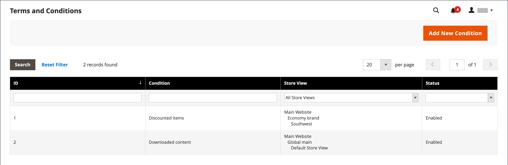

# Conditions générales du passage en caisse

Lorsqu’il est manuel _Termes et conditions_ est activée, les clients doivent accepter les conditions générales de la vente avant que l’achat ne soit finalisé. Les Conditions générales de la vente incluent généralement des informations de divulgation qui peuvent être requises par la loi pour les sites B2C ou B2B, et qui définissent les droits de l’acheteur et du vendeur. Le message Conditions générales s’affiche après les informations de paiement, juste avant le _Passer commande_ bouton .

{width="700" zoomable="yes"}

## Étape 1 : activation des conditions générales pour l’extraction

1. Sur le _Administration_ barre latérale, accédez à **[!UICONTROL Stores]** > _[!UICONTROL Settings]_>**[!UICONTROL Configuration]**.

1. Dans le panneau de gauche, développez **[!UICONTROL Sales]** et choisissez **[!UICONTROL Checkout]**.

1. Développer  la valeur **[!UICONTROL Checkout Options]** .

   {width="600" zoomable="yes"}

1. Vérifiez que **[!UICONTROL Enable Onepage Checkout]** est défini sur `Yes`.

1. Définir **[!UICONTROL Enable Terms and Conditions]** to `Yes`.

1. Cliquez sur **[!UICONTROL Save Config]**.

## Étape 2 : Ajout de vos propres informations sur les conditions générales

1. Sur le _Administration_ barre latérale, accédez à **[!UICONTROL Stores]** > _[!UICONTROL Settings]_>**[!UICONTROL Terms and Conditions]**.

   {width="600" zoomable="yes"}

1. Dans le coin supérieur droit, cliquez sur **[!UICONTROL Add New Condition]**.

1. Saisissez le **[!UICONTROL Condition Name]** pour référence interne.

   {width="600" zoomable="yes"}

1. Définir **[!UICONTROL Status]** to `Enabled`.

1. Définir **[!UICONTROL Applied]** à l’une des options suivantes :

   - `Automatically` - Les conditions sont automatiquement acceptées lors du passage en caisse.
   - `Manually` - Les clients doivent accepter manuellement les conditions pour passer une commande.

1. Définir **[!UICONTROL Show Content as]** à l’une des options suivantes :

   - `Text` : affiche le contenu des termes et conditions sous forme de texte non formaté.
   - `HTML` : affiche le contenu sous la forme d’un HTML pouvant être formaté.

1. Sélectionner chaque **[!UICONTROL Store View]** où vous souhaitez que ces conditions générales soient utilisées.

1. Faites défiler l’écran vers le bas et renseignez les informations à afficher :

   - Saisissez le **[!UICONTROL Checkbox Text]** à utiliser comme texte pour le lien Conditions générales . Par exemple, `I understand and accept the terms and conditions of the sale`.

   - Dans le **[!UICONTROL Content]** , saisissez le texte intégral des conditions générales de la vente.

1. (Facultatif) Saisissez la variable **[!UICONTROL Content Height (css)]** en pixels pour déterminer la hauteur de la zone de texte dans laquelle l’instruction conditions s’affiche lors de l’extraction.

   Par exemple, pour que la zone de texte ait une hauteur de 1 pouce sur un affichage de 96 ppp, saisissez `96`. Une barre de défilement s’affiche si le contenu s’étend au-delà de la hauteur de la zone.

1. Cliquez sur **[!UICONTROL Save Condition]**.
