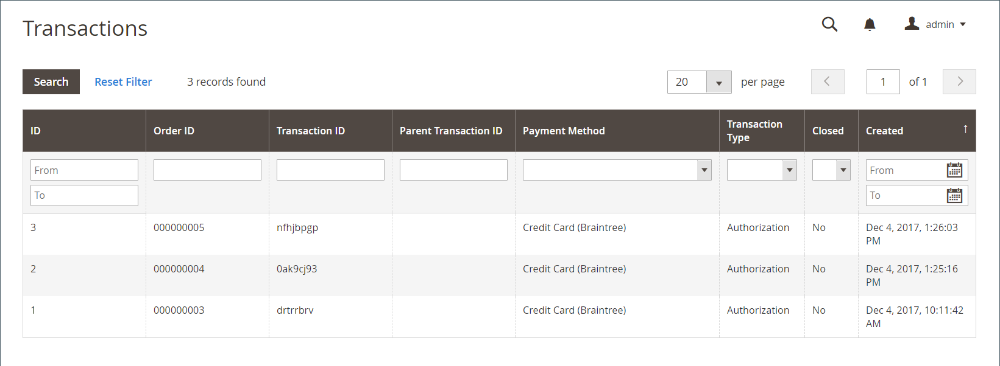

# Transactions

La page _Transactions_ répertorie toutes les activités de paiement qui ont eu lieu entre votre boutique et un système de paiement, et permet d’accéder à des informations plus détaillées.

## Afficher les transactions

Sur la barre latérale _Admin_, accédez à **[!UICONTROL Sales]** > _[!UICONTROL Operations]_>**[!UICONTROL Transactions]**.

{width="600" zoomable="yes"}

| Colonne | Description |
|--- |--- |
| [!UICONTROL ID] | Identifiant numérique unique attribué à chaque transaction. |
| [!UICONTROL Order ID] | Identifiant unique attribué lorsqu’un client commande. |
| [!UICONTROL Transaction ID] | Identifiant numérique unique attribué lorsqu’une transaction se produit lorsqu’un client passe une commande. |
| [!UICONTROL Parent Transaction ID] | Numéro d’identifiant de la transaction parente. |
| [!UICONTROL Payment Method] | Mode de paiement associé à une transaction. |
| [!UICONTROL Transaction Type] | Type de transaction, qui peut être Commande, Autorisation, Capture, Void ou Remboursement. |
| [!UICONTROL Closed] | qu’une transaction soit clôturée ou non. |
| [!UICONTROL Created] | Heure et date de création de la transaction. |

{style="table-layout:auto"}

## Afficher les détails des transactions

Cliquez sur l’entrée à afficher.

Sur la page des détails de la transaction, vous pouvez afficher la grille des détails de la transaction et des transactions enfants.

### Données de transaction

Cette section contient des informations sur la transaction et fournit un lien vers la page de commande dans la colonne **ID de commande**.

| Colonne | Description |
|--- |--- |
| [!UICONTROL Transaction ID] | Numéro d’ID de transaction. |
| [!UICONTROL Parent Transaction ID] | Un numéro d’identification correspondant à la transaction parente, le cas échéant. |
| [!UICONTROL Transaction Type] | Type de transaction, qui peut être Commande, Autorisation, Capture, Void ou Remboursement. |
| [!UICONTROL Is Closed] | qu’une transaction soit clôturée ou non. |
| [!UICONTROL Created At] | Heure et date de création de la transaction. |

{style="table-layout:auto"}

### Transactions enfants

Les transactions enfants s’affichent dans la grille après la création de factures pour [commandes](orders.md). Ce format permet de suivre l’historique des transactions, selon une hiérarchie de transactions.

### [!UICONTROL Transaction Details]

Cette section contient les informations supplémentaires relatives à une transaction donnée. Les informations sont affichées sous la forme de clés et de valeurs. Les clés disponibles sont les suivantes :

- authAmount
- authCode
- aVSResponse
- billTo
- cardCodeResponse
- client
- customerIP
- lineItems
- marketType
- order
- payment
- product
- recurringBilling
- responseCode
- responseReasonCode
- responseReasonDescription
- resetAmount
- solution
- submitTimeLocal
- submitTimeUTC
- taxexempt
- transactionStatus

>[!NOTE]
>
>Si les détails de la transaction ne sont pas disponibles ou sont obsolètes, cliquez sur **[!UICONTROL Fetch]** dans la barre de boutons pour les mettre à jour.
