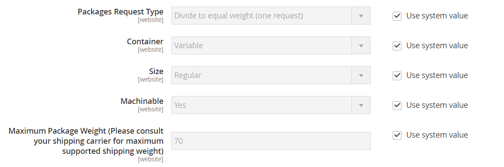

# Service postal des États-Unis (USPS)

Le Service postal des États-Unis est le service postal indépendant du gouvernement des États-Unis, qui offre des services de transport intérieur et international par voie terrestre et aérienne.

## Étape 1 : Ouvrir un compte d&#39;expédition USPS

Ouvrir un [Outils Web USPS][1] compte. Une fois le processus d’enregistrement terminé, vous recevrez votre identifiant utilisateur et une URL vers le serveur de test USPS.

Tu peux également ouvrir un [Outils Web USPS][1] compte. Une fois le processus d’enregistrement terminé, vous recevrez votre identifiant utilisateur et une URL vers le serveur de test USPS. Pour en savoir plus sur les outils Web d&#39;USPS, voir leur [Documentation technique][2].

## Étape 2 : Activer USPS pour votre boutique

1. Le _Admin_ barre latérale, accéder à **[!UICONTROL Stores]** > _[!UICONTROL Settings]_>**[!UICONTROL Configuration]**.

1. Dans le panneau de gauche, développez **[!UICONTROL Sales]** et choisissez **[!UICONTROL Delivery Methods]**.

1. Développer  le **[!UICONTROL USPS]** section.

   >[!NOTE]
   >
   >Si nécessaire, désélectionnez d’abord l’ **[!UICONTROL Use system value]** pour modifier les paramètres suivants comme décrit.

1. Définir **[!UICONTROL Enabled for Checkout]** vers `Yes`.

1. Si nécessaire, saisissez **[!UICONTROL Gateway URL]** pour accéder aux tarifs d&#39;expédition USPS.

   >[!IMPORTANT]
   >
   >À compter du 24 juin 2021, les outils web USPS supprimeront la prise en charge de tous les points d’entrée HTTP non sécurisés. Après cette modification, toutes les requêtes d’API des outils web qui sont envoyées à un point d’entrée HTTP non sécurisé échouent. Assurez-vous que vos **[!UICONTROL Gateway URL]** utilise le point d’entrée HTTPS sécurisé.

   Le champ est prédéfini par défaut et n’a normalement pas besoin d’être modifié.

1. Saisir un **[!UICONTROL Title]** pour ce mode d’expédition qui s’affiche lors du passage en caisse.

1. Saisir le **[!UICONTROL User ID]** et **[!UICONTROL Password]** pour votre compte USPS.

1. Définir **[!UICONTROL Mode]** à l’un des éléments suivants :

   - `Development` - Exécute USPS dans un environnement de test. Après avoir exécuté USPS dans un environnement de développement, veillez à revenir ultérieurement et à définir le mode sur . `Live`.
   - `Live` - Exécute USPS dans un environnement de production actif.

## Étape 3 : remplir la description de l&#39;emballage

1. Pour déterminer comment la commande est gérée si elle est envoyée sous la forme de plusieurs packages, définissez **[!UICONTROL Packages Request Type]** à l’un des éléments suivants :

   - `Divide to Equal Weight` - (Une demande) L&#39;expédition de plusieurs colis peut être soumise en une seule demande si les colis sont divisés par un poids égal.
   - `Use Origin Weight` - (Demandes multiples) Plusieurs colis doivent être soumis en tant que demandes distinctes si le poids d&#39;origine est utilisé comme base de calcul des frais de livraison.

1. Définir **[!UICONTROL Container]** au type d&#39;emballage normalement utilisé pour expédier les produits commandés pour votre magasin.

1. Définir le **[!UICONTROL Size]** du colis type expédié à partir de votre magasin.

1. Définir **[!UICONTROL Machinable]** à l’un des éléments suivants :

   - `Yes` - Si votre colis type peut être traité par une machine.
   - `No` - Si votre package type doit être traité manuellement.

1. Saisir le **[!UICONTROL Maximum Package Weight]** selon les exigences du transporteur.

   {width="600" zoomable="yes"}

## Étape 4 : configurer les frais de gestion

Les frais de manutention sont facultatifs et apparaissent comme des frais supplémentaires qui sont ajoutés aux frais d&#39;expédition DHL. Si vous souhaitez inclure des frais de manutention, procédez comme suit :

1. Définir **[!UICONTROL Calculate Handling Fee]** selon l’une des méthodes suivantes :

   - `Fixed`
   - `Percent`

1. Pour déterminer comment les frais de gestion sont appliqués, définissez **[!UICONTROL Handling Applied]** à l’un des éléments suivants :

   - `Per Order`
   - `Per Package`

1. Saisir le montant de **[!UICONTROL Handling Fee]** à facturer.

   Pour saisir un pourcentage, utilisez le format décimal. Par exemple, saisissez . `0.25` pour 25 %.

   {width="600" zoomable="yes"}

## Étape 5 : spécifier les méthodes autorisées et les pays applicables

1. Pour **[!UICONTROL Allowed Methods]**, choisissez chaque méthode d&#39;expédition USPS disponible pour vos clients.

   Les méthodes s’affichent sous USPS lors du passage en caisse. Pour sélectionner plusieurs méthodes, maintenez la touche Ctrl (PC) ou Commande (Mac) enfoncée et cliquez sur chaque option.

1. Si vous souhaitez fournir un [Livraison gratuite](shipping-free.md) via USPS, définissez les options de livraison gratuite :

   - Définir **[!UICONTROL Free Method]** à la méthode que vous souhaitez utiliser pour la livraison gratuite. Si vous ne souhaitez pas offrir d&#39;expédition gratuite via USPS, choisissez `None`.

   - Pour exiger un montant de commande minimum qui qualifie une commande pour une livraison gratuite avec USPS, définissez **[!UICONTROL Enable Free Shipping Threshold]** vers `Enable`. Saisissez ensuite la valeur minimale en . **[!UICONTROL Free Shipping Amount Threshold]**.

1. Si nécessaire, modifiez le **[!UICONTROL Displayed Error Message]**.

   Cette zone de texte est prédéfinie avec un message par défaut, mais vous pouvez saisir un message différent que vous souhaitez afficher si USPS n&#39;est plus disponible.

   {width="600" zoomable="yes"}

1. Définir **[!UICONTROL Ship to Applicable Countries]** à l’un des éléments suivants :

   - `All Allowed Countries` - Clients de tous les [pays](../getting-started/store-details.md#country-options) spécifiée dans la configuration de votre boutique peut utiliser cette méthode de diffusion.
   - `Specific Countries` - Lorsque vous choisissez cette option, le _Expédition vers des pays spécifiques_ La liste s’affiche. Sélectionnez dans la liste les pays où cette méthode de diffusion peut être utilisée.

   {width="600" zoomable="yes"}

1. Définir **[!UICONTROL Show Method if Not Applicable]** à l’un des éléments suivants :

   - `Yes` - Répertorie toutes les méthodes d&#39;expédition USPS disponibles lors du passage en caisse, y compris les méthodes qui ne s&#39;appliquent pas à l&#39;expédition.
   - `No` - Répertorie uniquement les méthodes d&#39;expédition USPS applicables à l&#39;expédition.

1. Pour créer un fichier journal contenant les détails des expéditions USPS effectuées à partir de votre magasin, définissez **[!UICONTROL Debug]** vers `Yes`.

1. Pour **[!UICONTROL Sort Order]**, saisissez un nombre permettant de déterminer l&#39;ordre dans lequel le fournisseur apparaît lorsqu&#39;il est répertorié avec d&#39;autres méthodes de diffusion lors du passage en caisse.

   `0` = first, `1` = seconde, `2` = troisième, etc.

1. Clic **[!UICONTROL Save Config]**.

[1]: https://secure.shippingapis.com/registration/
[2]: https://www.usps.com/business/web-tools-apis/welcome.htm
