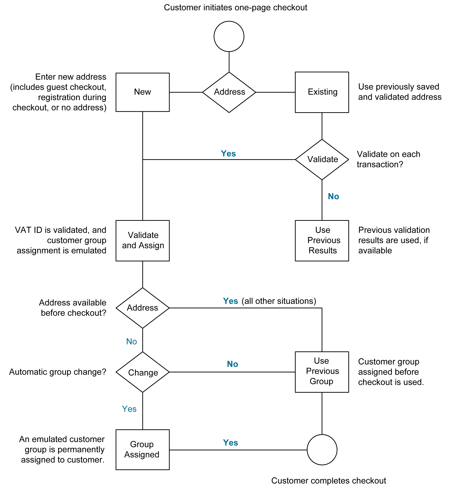

# TVA

Certains pays appliquent une taxe sur la valeur ajoutée, ou TVA, sur les biens et services. Il peut y avoir différents taux de TVA en fonction de l’étape du processus de fabrication ou de distribution, des matériaux ou des services que vous vendez à vos clients. Vous pouvez appliquer plusieurs taux de TVA pour calculer correctement la taxe à payer.

Commerce peut être configuré pour facturer une taxe sur la valeur ajoutée en fonction de l’adresse du commerçant ou du client, si les deux se trouvent dans le même pays. Les calculs de la TVA sont généralement basés sur la destination de l&#39;expédition, plutôt que sur son point d&#39;origine. Pour la plupart des scénarios, un paramètre de configuration qui calcule la TVA en fonction de l’adresse de livraison du client est suffisant.

## Exemples de scénarios

- Pour une entreprise enregistrée en TVA dans un pays de l&#39;UE qui fournit des marchandises à un particulier dans un autre pays de l&#39;UE, la TVA est calculée comme une &quot;vente à distance&quot; basée sur la localisation du marchand.

- Une entreprise aux Pays-Bas qui effectue un achat dans un magasin au Royaume-Uni qui expédie à une adresse au Royaume-Uni est tenue de payer le taux de TVA du Royaume-Uni.

- Pour la vente de [produits téléchargeables](../catalog/product-create-downloadable.md) ou de _produits numériques_, le taux de TVA est basé sur la destination de livraison, plutôt que sur la localisation du marchand. Voir [Lieu d’approvisionnement des produits numériques](taxes.md#place-of-supply-for-digital-goods-eu).

>[!TIP]
>
>Certains envois transfrontaliers et B2B ont des exigences fiscales plus complexes. Pour étendre les fonctionnalités natives de votre installation Commerce, pensez à ajouter une solution de gestion des impôts à partir de [Marketplace](https://marketplace.magento.com/extensions/accounting-finance/taxes.html).

## Configurer la TVA

Les instructions suivantes incluent un exemple de procédure pour configurer une TVA de 20 % au Royaume-Uni pour les ventes aux clients de détail. Pour les autres taux d&#39;imposition et pays, suivez la procédure générale, mais saisissez des informations spécifiques qui correspondent à votre pays, taux de TVA, types de clients, etc.

>[!NOTE]
>
>Avant de poursuivre, vérifiez quelles règles et réglementations s&#39;appliquent à la TVA dans votre zone.

Dans certaines transactions entre entreprises, la TVA n&#39;est pas perçue. Commerce peut valider l’ID de TVA d’un client pour s’assurer que la TVA est correctement évaluée (ou non évaluée). Voir [Validation de l’ID de TVA](#vat-id-validation).

### Étape 1 : configuration des classes de taxe client

Le processus de création d&#39;une règle fiscale commence par l&#39;ajout d&#39;un taux d&#39;imposition.

1. Sur la barre latérale _Admin_, accédez à **[!UICONTROL Stores]** > _[!UICONTROL Taxes]_>**[!UICONTROL Tax Zones and Rates]**.

   {width="600" zoomable="yes"}

1. Assurez-vous qu’il existe une classe d’impôt client appropriée à utiliser avec la TVA.

   Pour cet exemple, assurez-vous qu’il existe une classe d’impôt client nommée _Client au détail_. Si cette classe de taxe n&#39;existe pas, cliquez sur **[!UICONTROL Add New Tax Rate]**.

1. Saisissez le **[!UICONTROL Tax Identifier]** pour la nouvelle classe de taxe.

   Tous les taux d&#39;imposition s&#39;affichent dans le champ _Taux d&#39;imposition_ de la _Informations sur les règles fiscales_ lorsque vous créez des règles fiscales.

1. Pour définir la plage de codes postaux (de / à), cochez la case **[!UICONTROL Zip/Post is Range]** .

1. Sélectionnez le **[!UICONTROL Country]** où s&#39;applique le taux de taxe.

1. Saisissez le **[!UICONTROL Rate Percent]** qui sera utilisé pour le calcul du taux d&#39;imposition à l&#39;achat.

1. Une fois l’opération terminée, cliquez sur **[!UICONTROL Save Rate]**.

En fonction du taux d’imposition envoyé, vous pouvez créer des règles fiscales ultérieures. En l&#39;absence de taux d&#39;imposition, la création de règles fiscales devient impossible.

### Étape 2 : configuration des classes de taxe de produit

1. Sur la barre latérale _Admin_, accédez à **[!UICONTROL Stores]** > _[!UICONTROL Taxes]_>**[!UICONTROL Tax Rules]**.

1. Cliquez sur **[!UICONTROL Add New Tax Rule]**.

1. Développez la section  sur **[!UICONTROL Additional Settings]** .

   {width="600" zoomable="yes"}

1. Sous _Product Tax Class_, cliquez sur **[!UICONTROL Add New Tax Class]**.

1. Pour ajouter la nouvelle classe à la liste des classes de taxe de produit disponibles et créer trois nouvelles classes, saisissez le **[!UICONTROL Name]** de la nouvelle classe de taxe et cliquez sur la coche :

   - `VAT Standard`
   - `VAT Reduced`
   - `VAT Zero`

1. Cliquez sur **[!UICONTROL Save Class]** pour chaque nouvelle classe que vous ajoutez.

1. Cliquez sur **[!UICONTROL Save Rule]**.

### Etape 3 : paramétrage des zones fiscales et des taux

1. Sur la barre latérale _Admin_, accédez à **[!UICONTROL Stores]** > _[!UICONTROL Taxes]_>**[!UICONTROL Tax Zones and Rates]**.

   Pour cet exemple, vous pouvez supprimer les taux d’imposition des États-Unis ou les laisser tels quels.

1. Cliquez sur **[!UICONTROL Add New Tax Rate]**.

   {width="600" zoomable="yes"}

1. Définissez les nouveaux taux comme suit :

   **TVA standard**

   - Identifiant de taxe : `VAT Standard`
   - Pays et état : `United Kingdom`
   - Pourcentage de taux : `20.00`

   **TVA réduite**

   - Identifiant de taxe : `VAT Reduced`
   - Pays et état : `United Kingdom`
   - Pourcentage de taux : `5.00`

1. Cliquez sur **[!UICONTROL Save Rate]** pour chaque taux.

### Étape 4 : Configurer des règles fiscales

Une règle de taxe est une combinaison d’une classe d’impôt client, d’une classe d’impôt sur les produits et d’un taux d’imposition.

1. Sur la barre latérale _Admin_, accédez à **[!UICONTROL Stores]** > _[!UICONTROL Taxes]_>**[!UICONTROL Tax Rules]**.

1. Ajoutez de nouvelles règles fiscales comme suit :

   **TVA standard**

   - Nom : `VAT Standard`
   - Classe de taxe client : `Retail Customer`
   - Classe de taxe sur les produits : `VAT Standard`
   - Taux de taxe : `VAT Standard Rate`

   **Valeur Réduite**

   - Nom : `VAT Reduced`
   - Classe de taxe client : `Retail Customer`
   - Classe de taxe sur les produits : `VAT Reduced`
   - Taux de taxe : `VAT Reduced Rate`

1. Cliquez sur **[!UICONTROL Save Rule]** pour chaque taux.

### Étape 5 : appliquer les classes de taxe aux produits

1. Sur la barre latérale _Admin_, accédez à **[!UICONTROL Catalog]** > **[!UICONTROL Manage Products]**.

1. Ouvrez un produit de votre catalogue en mode d’édition.

1. Sur la page _Général_, recherchez l’option **[!UICONTROL Tax Class]** et sélectionnez le **[!UICONTROL VAT Class]** qui s’applique au produit.

1. Une fois l’opération terminée, cliquez sur **[!UICONTROL Save]**.

   {width="600" zoomable="yes"}

## Descriptions des champs

### Informations sur le magasin

Commerce utilise les [ paramètres de configuration Informations sur la boutique ](../configuration-reference/general/general.md#store-information) suivants pour calculer la TVA en fonction des informations sur le commerce.

**[!UICONTROL VAT Number]** - Numéro de taxe sur la valeur ajoutée attribué au commerçant.

**[!UICONTROL Validate VAT Number]** - [ La validation de la TVA](#vat-id-validation) confirme que le numéro de la TVA correspond à l&#39;enregistrement correspondant dans la base de données de la [Commission européenne](https://ec.europa.eu/taxation_customs/vies/).

### Informations sur le client

Commerce utilise les champs suivants pour calculer la TVA en fonction des [informations client](../customers/account-dashboard-account-information.md)).

#### Informations du compte

**[!UICONTROL Tax/VAT Number]** - Le cas échéant, le numéro de taxe ou le numéro de taxe sur la valeur ajoutée attribué au client.

#### Adresses

**[!UICONTROL VAT Number]** - Le cas échéant, le numéro de la taxe sur la valeur ajoutée associé à une adresse de facturation ou de livraison spécifique du client. Pour la vente de [biens numériques](taxes.md#place-of-supply-for-digital-goods-eu)) dans l’UE, le montant de la TVA est basé sur la destination de livraison.

### Compte client

Commerce utilise les [paramètres de configuration client](../customers/account-options-new.md) suivants pour calculer la TVA.

**[!UICONTROL Show VAT Number on Storefront]** - Détermine si le champ Numéro de TVA du client est inclus dans le Carnet d’adresses disponible dans le compte client.

**[!UICONTROL Default Value for Disable Automatic Group Changes Based on VAT ID]** - L’ID de TVA est un identifiant interne du numéro de TVA du client lorsqu’il est utilisé dans la validation de la TVA. Lors de la validation de la TVA, Commerce confirme que le nombre correspond à la base de données [Commission Européenne](https://ec.europa.eu/taxation_customs/vies/). Les clients peuvent être automatiquement affectés à l’un des quatre groupes de clients par défaut en fonction des résultats de validation.

## Validation de l’ID de TVA

_Validation de l’ID de TVA_ calcule automatiquement la taxe requise pour les transactions B2B qui ont lieu dans l’Union européenne (UE), en fonction des paramètres régionaux du commerçant et du client. Commerce effectue la validation de l&#39;ID de TVA à l&#39;aide des services web du serveur [Commission européenne][1].

>[!NOTE]
>
>Les règles fiscales liées à la TVA n&#39;influencent pas d&#39;autres règles fiscales et n&#39;empêchent pas l&#39;application d&#39;autres règles fiscales. Une seule règle fiscale peut être appliquée à la fois.

- La TVA est perçue si le marchand et le client se trouvent dans le même pays de l&#39;UE.
- La TVA n&#39;est pas perçue si le marchand et le client se trouvent dans différents pays de l&#39;UE, et que les deux parties sont des entités commerciales enregistrées dans l&#39;UE.

L’administrateur de magasin crée plusieurs groupes de clients par défaut qui peuvent être automatiquement affectés au client lors de la création du compte, de la création ou de la mise à jour des adresses et de l’extraction. Il en résulte que différentes règles fiscales sont utilisées pour les ventes intra-nationales et intra-européennes.

>[!IMPORTANT]
>
>Si vous vendez des produits virtuels ou téléchargeables, qui ne nécessitent pas d’expédition, le taux de TVA du pays de localisation d’un client doit être utilisé pour les ventes intra-union et nationales. Créez des règles fiscales individuelles supplémentaires pour les classes de taxe de produit qui correspondent aux produits virtuels.

### Workflow d’enregistrement des clients

Si la validation de l’ID de TVA est activée, après enregistrement, chaque client est proposé de saisir le numéro d’ID de TVA. Toutefois, seuls les acheteurs qui sont des clients de TVA enregistrés doivent remplir ce champ.

Une fois qu’un client a spécifié le numéro de TVA et d’autres champs d’adresse et choisi d’enregistrer, le système enregistre l’adresse et envoie la demande de validation de l’identifiant de TVA au serveur de la Commission européenne. Selon les résultats de la validation, l’un des groupes par défaut est attribué à un client. Ce groupe peut être modifié si un client ou un administrateur modifie l’identifiant de TVA de l’adresse par défaut ou l’adresse par défaut complète. Parfois, le groupe peut être temporairement modifié (le changement de groupe est émulé) lors du passage en caisse d’une page.

Si cette option est activée, vous pouvez remplacer la validation de l’ID de TVA pour des clients individuels en cochant la case sur la page _[!UICONTROL Customer Information]_.

### Processus de passage en caisse

Si la validation de la TVA d’un client est effectuée lors du passage en caisse, l’identifiant de demande de TVA et la date de demande de TVA sont enregistrés dans la section Historique des commentaires de la commande.

Le comportement du système concerné par la validation de l’ID de TVA et le changement de groupe de clients au cours du passage en caisse dépend de la configuration des paramètres Valider à chaque transaction et Désactiver le changement automatique de groupe . Cette section décrit l’implémentation de la fonctionnalité Validation de l’ID de TVA pour le passage en caisse sur le front-end.

Si le client utilise Google Express Checkout, PayPal Express Checkout ou un autre mode de paiement externe, le passage en caisse est effectué entièrement sur le côté de la passerelle de paiement externe. Pour ce scénario, le paramètre _Valider à chaque transaction_ ne peut pas être appliqué et le groupe de clients ne peut pas changer lors de l’extraction.

{width="550" zoomable="yes"}

### Configurer la validation de l’ID de TVA

Pour configurer la validation de l’ID de TVA, vous devez d’abord configurer les groupes de clients nécessaires et créer les classes de taxe, les taux et les règles associés. Ensuite, activez la validation de l’ID de TVA pour le magasin et effectuez la configuration.

Les exemples suivants montrent comment les classes d’impôts et les taux sont utilisés pour la validation de l’ID de TVA. Examinez les exemples, puis suivez les instructions de configuration des classes d’impôts et des règles nécessaires à votre boutique.

#### Exemple : règles fiscales minimales requises pour la validation de l’identifiant de TVA

| #1 de la règle fiscale |  |
|--- |--- |
| Classe fiscale du client | Les classes de taxe client doivent inclure :  Une classe pour les clients domestiques.  Classe pour les clients avec des identifiants de TVA mal formatés. Classe pour les clients dont la validation de l’ID de TVA a échoué. |
| Classe taxe sur les produits | Les classes de taxe sur les produits doivent inclure une classe pour les produits de tous types, à l’exception du bundle et du virtuel. |
| Taux d&#39;imposition | Le taux d&#39;imposition doit inclure le taux de TVA du pays du marchand. |

{style="table-layout:auto"}

| #2 de la règle fiscale |   |
|--- |--- |
| Classe fiscale du client | Classe destinée aux clients intra-union. |
| Classe taxe sur les produits | Classe pour les produits de tous types, à l’exception de &quot;virtuel&quot;. |
| Taux d&#39;imposition | Taux de TVA pour tous les pays de l&#39;UE, à l&#39;exception du pays du commerce. Actuellement, ce taux est de 0 %. |

{style="table-layout:auto"}

| #3 de la règle fiscale | (Requis pour les produits virtuels et téléchargeables) |
|--- |--- |
| Classe fiscale du client | Les classes de taxe client doivent inclure :  Une classe pour les clients domestiques  Une classe pour les clients avec un identifiant de TVA non valide Une classe pour les clients pour lesquels la validation de l&#39;identifiant de TVA a échoué |
| Classe taxe sur les produits | Classe de produits virtuels. |
| Taux d&#39;imposition | Taux de TVA du pays marchand. |

{style="table-layout:auto"}

| #4 de la règle fiscale | (Requis pour les produits virtuels et téléchargeables) |
|--- |--- |
| Classe fiscale du client | Classe destinée aux clients intra-union. |
| Classe taxe sur les produits | Classe de produits virtuels. |
| Taux d&#39;imposition | Taux de TVA pour tous les pays de l&#39;UE, à l&#39;exception du pays du commerce. Actuellement, ce taux est de 0 %. |

{style="table-layout:auto"}

#### Étape 1 : créer des groupes de clients liés à la TVA

La validation de l’ID de TVA affecte automatiquement l’un des quatre groupes de clients par défaut aux clients en fonction des résultats de la validation de l’ID de TVA :

- Intérieur
- Intra-UE
- ID de TVA non valide
- Erreur de validation

Vous pouvez créer des groupes de clients pour la validation de l’ID de TVA ou utiliser des groupes existants, s’ils respectent la logique de votre entreprise. Lors de la configuration de la validation de l’ID de TVA, vous devez attribuer par défaut à chacun des groupes de clients créés les résultats appropriés de la validation de l’ID de TVA.

#### Étape 2 : créer des classes, des taux et des règles liés à la TVA

Chaque règle fiscale est définie par trois entités :

- Classes d’impôts des clients
- Classes d’impôts sur les produits
- Taux d&#39;imposition

Créez les [règles fiscales](tax-rules.md) pour utiliser efficacement la validation des ID de TVA.

- Les règles fiscales comprennent les taux d&#39;imposition et les [classes d&#39;impôts](tax-class.md).
- Les classes de taxe sont affectées aux [groupes de clients](../customers/customer-groups.md).

#### Étape 3 : activation et configuration de la validation de l&#39;identifiant de TVA

1. Sur la barre latérale _Admin_, accédez à **[!UICONTROL Stores]** > _[!UICONTROL Settings]_>**[!UICONTROL Configuration]**.

1. Si nécessaire, définissez le **[!UICONTROL Store View]** pour la configuration.

1. Dans le panneau de gauche, développez **[!UICONTROL Customers]** et choisissez **[!UICONTROL Customer Configuration]**.

1. Développez la section  sur **[!UICONTROL Create New Account Options]** .

   Dans l’exemple suivant, les paramètres généraux du client qui ne sont pas liés à la validation de la TVA sont faibles.

   {width="600" zoomable="yes"}

1. Définissez **[!UICONTROL Enable Automatic Assignment to Customer Group]** sur `Yes` et renseignez les champs suivants si nécessaire.

   - **[!UICONTROL Default Group]**
   - **[!UICONTROL Default Value for Disable Automatic Group Changes Based on VAT ID]**
   - **[!UICONTROL Show VAT Number on Storefront]**

1. Une fois l’opération terminée, cliquez sur **[!UICONTROL Save Config]**.

#### Étape 4 : Définition de votre ID de TVA et de votre pays d’emplacement

1. Dans le panneau de gauche, développez **[!UICONTROL General]** et sélectionnez **[!UICONTROL General]** sous .

1. Développez la section  sur **[!UICONTROL Store Information]** .

   {width="600" zoomable="yes"}

1. Sélectionnez votre **[!UICONTROL Country]**.

1. Saisissez votre **[!UICONTROL VAT Number]** et cliquez sur **[!UICONTROL Validate VAT Number]**.

   Le résultat apparaît immédiatement.

1. Une fois l’opération terminée, cliquez sur **[!UICONTROL Save Config]**.

#### Etape 5 : vérification de la liste des pays membres de l&#39;UE

1. Continuez sur la page de configuration _Général_, développez la section  **[!UICONTROL Countries Options]** .

   {width="600" zoomable="yes"}

1. Dans la liste **[!UICONTROL European Union Countries]**, vérifiez que chaque pays membre de l’UE est sélectionné.

   Pour modifier le paramètre par défaut, décochez la case **Utiliser les valeurs système** . Maintenez la touche Ctrl (PC) ou la touche Commande (Mac) enfoncée et cliquez sur chaque pays à ajouter ou supprimer.

1. Une fois l’opération terminée, cliquez sur **[!UICONTROL Save Config]**.

[1]: https://ec.europa.eu/taxation_customs/vies/
