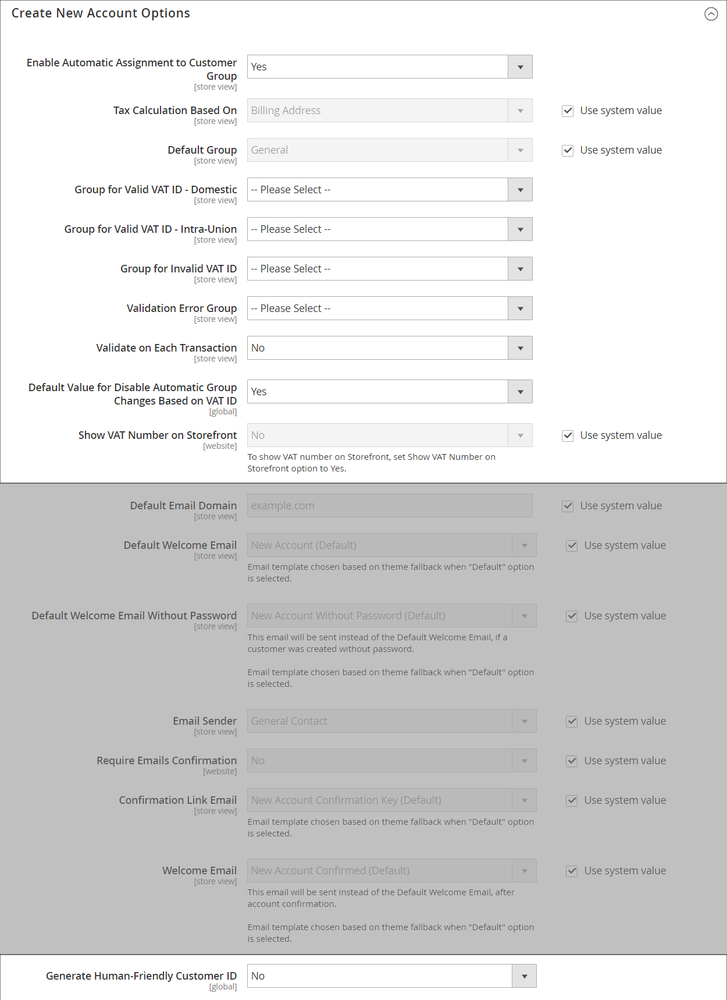

# TVA (taxe sur la valeur ajoutée)

Certains pays imposent une taxe sur la valeur ajoutée, ou TVA, sur les biens et les services. Il peut y avoir différents taux de TVA en fonction de l&#39;étape du processus de fabrication ou de distribution, des matériaux ou des services que vous vendez à vos clients. Vous pouvez appliquer plusieurs taux de TVA pour calculer correctement la taxe due.

Commerce peut être configuré pour facturer une taxe sur la valeur ajoutée basée sur l’adresse du commerçant ou du client, si les deux se trouvent dans le même pays. Les calculs de TVA sont généralement basés sur la destination de l&#39;expédition, plutôt que sur son point d&#39;origine. Dans la plupart des scénarios, un paramètre de configuration qui calcule la TVA en fonction de l’adresse de livraison du client est suffisant.

## Exemples de scénarios

- Pour une entreprise immatriculée à la TVA dans un pays de l&#39;UE qui fournit des biens à un particulier dans un autre pays de l&#39;UE, la TVA est calculée comme une « vente à distance » basée sur la localisation du commerçant.

- Une entreprise aux Pays-Bas qui effectue un achat dans un magasin au Royaume-Uni qui expédie à une adresse au Royaume-Uni est tenue de payer les taux de TVA du Royaume-Uni.

- Pour la vente de [produits téléchargeables](../catalog/product-create-downloadable.md) ou _biens numériques_, le taux de TVA est basé sur la destination d&#39;expédition, plutôt que sur le lieu du marchand. Voir [Lieu de livraison des biens numériques](taxes.md#place-of-supply-for-digital-goods-eu).

>[!TIP]
>
>Certains envois transfrontaliers et B2B ont des exigences fiscales plus complexes. Pour étendre les fonctionnalités natives de votre installation Commerce, pensez à ajouter une solution de gestion fiscale à partir du [Marketplace](https://marketplace.magento.com/extensions/accounting-finance/taxes.html).

## Configurer la TVA

Les instructions suivantes incluent un exemple de procédure pour établir une TVA de 20 % au Royaume-Uni pour les ventes aux clients de détail. Pour les autres taux de taxe et pays, suivez la procédure générale, mais saisissez des informations spécifiques correspondant à votre pays, au taux de TVA, aux types de clients, etc.

>[!NOTE]
>
>Avant de poursuivre, assurez-vous de connaître les règles et règlements qui s&#39;appliquent à la TVA dans votre région.

Dans certaines transactions entre entreprises, la TVA n&#39;est pas perçue. Commerce peut valider l’identifiant de TVA d’un client pour s’assurer que la TVA est correctement évaluée (ou non). Voir [Validation du numéro de TVA](#vat-id-validation).

### Étape 1 : Configurer des classes de taxe client

Le processus de création d’une règle de taxe commence par l’ajout d’un taux de taxe.

1. Dans la barre latérale _Admin_, accédez à **[!UICONTROL Stores]** > _[!UICONTROL Taxes]_>**[!UICONTROL Tax Zones and Rates]**.

   {width="600" zoomable="yes"}

1. Assurez-vous qu&#39;il existe une classe de taxe client appropriée à utiliser avec la TVA.

   Pour cet exemple, assurez-vous qu&#39;il existe une classe de taxe client nommée _Client de détail_. Si cette classe de taxe n&#39;existe pas, cliquez sur **[!UICONTROL Add New Tax Rate]**.

1. Saisissez le **[!UICONTROL Tax Identifier]** de la nouvelle classe de taxe.

   Tous les taux de taxe s&#39;affichent dans le champ _Taux de taxe_ de l&#39;_Informations sur la règle de taxe_ lorsque vous créez des règles de taxe.

1. Pour définir la plage de codes postaux (de / à), cochez la case **[!UICONTROL Zip/Post is Range]**.

1. Choisissez le **[!UICONTROL Country]** auquel le taux de taxe s’applique.

1. Permet d&#39;entrer le **[!UICONTROL Rate Percent]** qui serait utilisé pour le calcul du taux de taxe à l&#39;achat.

1. Cliquez ensuite sur **[!UICONTROL Save Rate]**.

En fonction du taux de taxe envoyé, vous pouvez créer des règles fiscales ultérieures. En l&#39;absence de taux d&#39;imposition, la création de règles fiscales devient impossible.

### Étape 2 : Configurer des classes de taxe sur les produits

1. Dans la barre latérale _Admin_, accédez à **[!UICONTROL Stores]** > _[!UICONTROL Taxes]_>**[!UICONTROL Tax Rules]**.

1. Cliquez sur **[!UICONTROL Add New Tax Rule]**.

1. Développez  la section **[!UICONTROL Additional Settings]** .

   {width="600" zoomable="yes"}

1. Sous _Classe de taxe de produit_, cliquez sur **[!UICONTROL Add New Tax Class]**.

1. Pour ajouter la nouvelle classe à la liste des classes de taxe sur les produits disponibles et créer trois nouvelles classes, saisissez la **[!UICONTROL Name]** de la nouvelle classe de taxe et cliquez sur la coche :

   - `VAT Standard`
   - `VAT Reduced`
   - `VAT Zero`

1. Cliquez sur **[!UICONTROL Save Class]** pour chaque nouvelle classe que vous ajoutez.

1. Cliquez sur **[!UICONTROL Save Rule]**.

### Etape 3 : Paramétrer les zones fiscales et les taux

1. Dans la barre latérale _Admin_, accédez à **[!UICONTROL Stores]** > _[!UICONTROL Taxes]_>**[!UICONTROL Tax Zones and Rates]**.

   Pour cet exemple, vous pouvez supprimer les taux d’imposition américains ou les laisser tels quels.

1. Cliquez sur **[!UICONTROL Add New Tax Rate]**.

   {width="600" zoomable="yes"}

1. Définissez les nouveaux taux comme suit :

   **Norme TVA**

   - Identifiant de taxe : `VAT Standard`
   - Pays et état : `United Kingdom`
   - Pourcentage de taux : `20.00`

   **TVA réduite**

   - Identifiant de taxe : `VAT Reduced`
   - Pays et état : `United Kingdom`
   - Pourcentage de taux : `5.00`

1. Cliquez sur **[!UICONTROL Save Rate]** pour chaque taux.

### Etape 4 : paramétrer les règles fiscales

Une règle de taxe est une combinaison d&#39;une classe de taxe client, d&#39;une classe de taxe produit et d&#39;un taux de taxe.

1. Dans la barre latérale _Admin_, accédez à **[!UICONTROL Stores]** > _[!UICONTROL Taxes]_>**[!UICONTROL Tax Rules]**.

1. Ajoutez de nouvelles règles fiscales comme suit :

   **Norme TVA**

   - Nom : `VAT Standard`
   - Classe de taxe client : `Retail Customer`
   - Classe de taxe du produit : `VAT Standard`
   - Taux de taxe : `VAT Standard Rate`

   **Tva Réduite**

   - Nom : `VAT Reduced`
   - Classe de taxe client : `Retail Customer`
   - Classe de taxe du produit : `VAT Reduced`
   - Taux de taxe : `VAT Reduced Rate`

1. Cliquez sur **[!UICONTROL Save Rule]** pour chaque taux.

### Étape 5 : appliquer des classes de taxe aux produits

1. Dans la barre latérale _Admin_, accédez à **[!UICONTROL Catalog]** > **[!UICONTROL Manage Products]**.

1. Ouvrez un produit de votre catalogue en mode d’édition.

1. Sur la page _Général_, recherchez l’option **[!UICONTROL Tax Class]** et sélectionnez la **[!UICONTROL VAT Class]** qui s’applique au produit.

1. Cliquez ensuite sur **[!UICONTROL Save]**.

   {width="600" zoomable="yes"}

## Descriptions des champs

### Informations sur le magasin

Commerce utilise les paramètres de configuration [Informations de la boutique](../configuration-reference/general/general.md#store-information) suivants pour calculer la TVA en fonction des informations du commerçant.

**[!UICONTROL VAT Number]** - Numéro de taxe sur la valeur ajoutée attribué au commerçant.

**[!UICONTROL Validate VAT Number]** - [validation TVA](#vat-id-validation) confirme que le numéro de TVA correspond à l’enregistrement correspondant dans la base de données [Commission européenne](https://ec.europa.eu/taxation_customs/vies/).

### Informations sur le client

Commerce utilise les champs suivants pour calculer la TVA en fonction [informations sur le client](../customers/account-dashboard-account-information.md)).

#### Informations sur le compte

**[!UICONTROL Tax/VAT Number]** - Le cas échéant, numéro de taxe ou numéro de taxe sur la valeur ajoutée attribué au client.

#### Adresses

**[!UICONTROL VAT Number]** - Le cas échéant, numéro de TVA associé à une adresse de facturation ou d’expédition spécifique du client. Pour la vente de [biens numériques](taxes.md#place-of-supply-for-digital-goods-eu)) au sein de l&#39;UE, le montant de la TVA est basé sur la destination d&#39;expédition.

### Compte client

Commerce utilise les [paramètres de configuration client](../customers/account-options-new.md) suivants pour calculer la TVA.

**[!UICONTROL Show VAT Number on Storefront]** - Détermine si le champ Numéro de TVA client est inclus dans le Carnet d&#39;adresses disponible dans le compte client.

**[!UICONTROL Default Value for Disable Automatic Group Changes Based on VAT ID]** - Le numéro de TVA est un identifiant interne du numéro de TVA du client lorsqu&#39;il est utilisé dans la validation de la TVA. Lors de la validation de la TVA, Commerce confirme que le numéro correspond à la base de données [Commission européenne](https://ec.europa.eu/taxation_customs/vies/). Les clients peuvent être automatiquement affectés à l’un des quatre groupes de clients par défaut en fonction des résultats de la validation.

## Validation du numéro de TVA

_Validation des identifiants de TVA_ calcule automatiquement la taxe requise pour les transactions B2B qui ont lieu dans l’Union européenne (UE), en fonction des paramètres régionaux du commerçant et du client. Commerce effectue la validation du numéro de TVA à l’aide des services web du serveur [Commission européenne](https://ec.europa.eu/taxation_customs/vies/).

>[!NOTE]
>
>Les règles fiscales liées à la TVA n’ont aucune incidence sur les autres règles fiscales et n’empêchent pas l’application d’autres règles fiscales. Une seule règle fiscale peut être appliquée à la fois.

- La TVA est facturée si le commerçant et le client se trouvent dans le même pays de l&#39;UE.
- La TVA n&#39;est pas facturée si le commerçant et le client se trouvent dans des pays de l&#39;UE différents, et les deux parties sont des entités commerciales enregistrées dans l&#39;UE.

L’administrateur du magasin crée plusieurs groupes de clients par défaut qui peuvent être automatiquement affectés au client lors de la création du compte, de la création ou de la mise à jour de l’adresse et du passage en caisse. Il en résulte que des règles fiscales différentes sont utilisées pour les ventes intra-pays (domestiques) et intra-UE.

>[!IMPORTANT]
>
>Si vous vendez des produits virtuels ou téléchargeables, qui ne nécessitent pas d&#39;expédition, le taux de TVA du pays de localisation d&#39;un client doit être utilisé pour les ventes intra-union et domestiques. Créez des règles fiscales individuelles supplémentaires pour les classes de taxe de produit qui correspondent aux produits virtuels.

### Workflow d’enregistrement des clients

Si la validation du numéro de TVA est activée, après l&#39;enregistrement, il est proposé à chaque client de saisir son numéro de TVA. Toutefois, seuls les acheteurs qui sont des clients TVA enregistrés sont censés remplir ce champ.

Une fois qu’un client a spécifié le numéro de TVA et d’autres champs d’adresse et choisi de les enregistrer, le système enregistre l’adresse et envoie la demande de validation du numéro de TVA au serveur de la Commission européenne. En fonction des résultats de la validation, l’un des groupes par défaut est affecté à un client. Ce groupe peut être modifié si un client ou un administrateur modifie le numéro de TVA de l&#39;adresse par défaut ou modifie l&#39;adresse par défaut dans son intégralité. Parfois, le groupe peut être modifié temporairement (le changement de groupe est émulé) lors d’une extraction d’une page.

Si cette option est activée, vous pouvez remplacer la validation des identifiants de TVA pour des clients individuels en cochant la case sur la page _[!UICONTROL Customer Information]_.

### Workflow de passage en caisse

Si la validation de la TVA d&#39;un client est effectuée lors du passage en caisse, l&#39;identifiant de demande de TVA et la date de demande de TVA sont enregistrés dans la section Historique des commentaires de la commande.

Le comportement du système concernant la validation du numéro de TVA et la modification du groupe de clients pendant le passage en caisse dépend de la configuration des paramètres Valider pour chaque mouvement et Désactiver la modification automatique de groupe. Cette section décrit la mise en œuvre de la fonctionnalité Validation des identifiants de TVA pour le passage en caisse sur le serveur frontal.

Si le client utilise Google Express Checkout, PayPal Express Checkout ou une autre méthode de paiement externe, le paiement est entièrement effectué du côté de la passerelle de paiement externe. Pour ce scénario, le paramètre _Valider sur chaque transaction_ ne peut pas être appliqué et le groupe de clients ne peut pas changer pendant le passage en caisse.

{width="550" zoomable="yes"}

### Configurer la validation du numéro de TVA

Pour configurer la validation du numéro de TVA, vous devez d&#39;abord configurer les groupes de clients nécessaires et créer les classes, taux et règles de taxe associés. Ensuite, activez la validation du numéro de TVA pour le magasin et effectuez la configuration.

Les exemples suivants montrent comment les classes et les taux de taxe sont utilisés pour la validation du numéro individuel d&#39;identification de TVA. Consultez les exemples, puis suivez les instructions pour configurer les classes de taxe et les règles nécessaires pour votre magasin.

#### Exemple : règles fiscales minimales requises pour la validation du numéro individuel d&#39;identification de TVA

| #1 de la règle fiscale |  |
|--- |--- |
| Classe de taxe client | Les classes de taxe client doivent inclure :  Une classe pour les clients domestiques. Classe  A pour les clients dont les identifiants de TVA sont incorrectement formatés.Classe  A pour les clients dont la validation du numéro de TVA a échoué. |
| Classe de taxe du produit | Les classes de taxe de produit doivent inclure une classe pour les produits de tous types, à l’exception des produits groupés et virtuels. |
| Taux d&#39;imposition | Le taux de taxe doit inclure le taux de TVA du pays du commerçant. |

{style="table-layout:auto"}

| #2 de la règle fiscale |   |
|--- |--- |
| Classe de taxe client | Une classe pour les clients intra-union. |
| Classe de taxe du produit | Une classe pour les produits de tous types, sauf virtuels. |
| Taux d&#39;imposition | Taux de TVA pour tous les pays de l&#39;UE, à l&#39;exception du pays du commerçant. Actuellement, ce taux est de 0 %. |

{style="table-layout:auto"}

| #3 de la règle fiscale | (Requis pour les produits virtuels et téléchargeables) |
|--- |--- |
| Classe de taxe client | Les classes de taxe client doivent inclure :  Une classe pour les clients domestiques  Une classe pour les clients dont le numéro de TVA n&#39;est pas valide Une classe pour les clients pour lesquels la validation du numéro de TVA a échoué |
| Classe de taxe du produit | Une classe pour les produits virtuels. |
| Taux d&#39;imposition | Taux de TVA du pays du commerçant. |

{style="table-layout:auto"}

| #4 de la règle fiscale | (Requis pour les produits virtuels et téléchargeables) |
|--- |--- |
| Classe de taxe client | Une classe pour les clients intra-union. |
| Classe de taxe du produit | Une classe pour les produits virtuels. |
| Taux d&#39;imposition | Taux de TVA pour tous les pays de l&#39;UE, à l&#39;exception du pays du commerçant. Actuellement, ce taux est de 0 %. |

{style="table-layout:auto"}

#### Etape 1 : Créer des groupes de clients liés à la TVA

La validation des ID TVA affecte automatiquement l&#39;un des quatre groupes de clients par défaut aux clients en fonction des résultats de la validation des ID TVA :

- National
- Intra-UE
- Identifiant de TVA non valide
- Erreur de validation

Vous pouvez créer des groupes de clients pour la validation du numéro de TVA ou utiliser des groupes existants, s&#39;ils sont conformes à votre logique commerciale. Lors de la configuration de la validation du numéro de TVA, vous devez affecter par défaut chacun des groupes de clients créés pour les clients disposant des résultats de validation du numéro de TVA appropriés.

#### Etape 2 : créer des classes, taux et règles liés à la TVA

Chaque règle fiscale est définie par trois entités :

- Classes d&#39;impôts client
- Classes de taxe sur les produits
- Taux d&#39;imposition

Créez les [règles fiscales](tax-rules.md) pour utiliser efficacement la validation des identifiants de TVA.

- Les règles fiscales incluent les taux de taxe et les [classes de taxe](tax-class.md).
- Les classes de taxe sont affectées aux [groupes de clients](../customers/customer-groups.md).

#### Étape 3 : activer et configurer la validation du numéro de TVA

1. Dans la barre latérale _Admin_, accédez à **[!UICONTROL Stores]** > _[!UICONTROL Settings]_>**[!UICONTROL Configuration]**.

1. Si nécessaire, définissez la **[!UICONTROL Store View]** de la configuration.

1. Dans le panneau de gauche, développez **[!UICONTROL Customers]** et choisissez **[!UICONTROL Customer Configuration]**.

1. Développez  la section **[!UICONTROL Create New Account Options]** .

   Dans l&#39;exemple suivant, les paramètres généraux du client qui ne sont pas liés à la validation de la TVA sont sombres.

   {width="600" zoomable="yes"}

1. Définissez **[!UICONTROL Enable Automatic Assignment to Customer Group]** sur `Yes` et renseignez les champs suivants selon vos besoins.

   - **[!UICONTROL Default Group]**
   - **[!UICONTROL Default Value for Disable Automatic Group Changes Based on VAT ID]**
   - **[!UICONTROL Show VAT Number on Storefront]**

1. Cliquez ensuite sur **[!UICONTROL Save Config]**.

#### Étape 4 : Définissez votre numéro de TVA et le pays de votre lieu

1. Dans le panneau de gauche, développez **[!UICONTROL General]** et choisissez **[!UICONTROL General]** en dessous.

1. Développez  la section **[!UICONTROL Store Information]** .

   {width="600" zoomable="yes"}

1. Sélectionnez votre **[!UICONTROL Country]**.

1. Saisissez votre **[!UICONTROL VAT Number]** et cliquez sur **[!UICONTROL Validate VAT Number]**.

   Le résultat s’affiche immédiatement.

1. Cliquez ensuite sur **[!UICONTROL Save Config]**.

#### Étape 5 : vérifier la liste des pays membres de l&#39;UE

1. Sur la page de configuration _Général_, développez  dans la section **[!UICONTROL Countries Options]**.

   {width="600" zoomable="yes"}

1. Dans la liste **[!UICONTROL European Union Countries]**, vérifiez que chaque pays membre de l&#39;UE est sélectionné.

   Pour modifier le paramètre par défaut, décochez la case **Utiliser des valeurs système**. Maintenez la touche Ctrl (PC) ou Commande (Mac) enfoncée et cliquez sur chaque pays à ajouter ou à supprimer.

1. Cliquez ensuite sur **[!UICONTROL Save Config]**.
