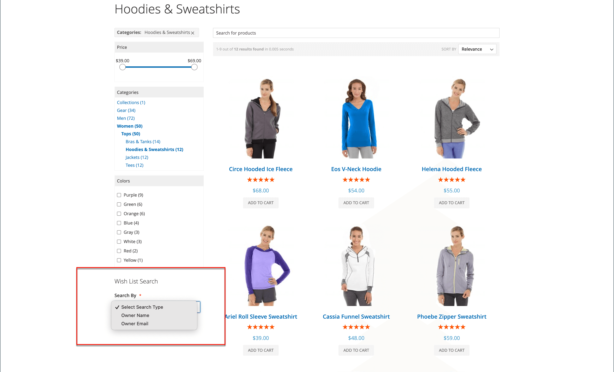

# Configuration des listes de souhaits

La configuration de liste de souhaits active les listes de souhaits et détermine le modèle d’e-mail et l’expéditeur des e-mails utilisés lorsqu’une liste de souhaits est partagée.

## Activer la fonctionnalité de liste de souhaits

1. Dans la barre latérale _Admin_, accédez à **[!UICONTROL Stores]** > _[!UICONTROL Settings]_>**[!UICONTROL Configuration]**.

1. Dans le panneau de gauche, développez **[!UICONTROL Customers]** et choisissez **[!UICONTROL Wish List]**.

1. Développez  la section **[!UICONTROL General Options]** et procédez comme suit :

   {width="600" zoomable="yes"}

   - Activez **[!UICONTROL Enabled]** sur `Yes`, ce qui active le module de liste de souhaits pour le magasin.

   -  (Adobe Commerce uniquement) Basculez le **[!UICONTROL Enable Multiple Wish Lists]** sur `Yes`, ce qui permet aux clients de créer et de gérer plusieurs listes de souhaits.

   -  (Adobe Commerce uniquement) Pour limiter le nombre de listes de souhaits que les clients peuvent avoir associées à leur compte, saisissez une valeur pour **[!UICONTROL Number of Multiple Wish Lists]**.

   - Basculez **[!UICONTROL Show in Sidebar]** sur `Yes` pour afficher les listes de souhaits dans la barre latérale.

1. Développez  la section **[!UICONTROL Share Options]** et procédez comme suit :

   {width="600" zoomable="yes"}

   - Définissez la **[!UICONTROL Email Sender]** sur le contact du magasin qui doit apparaître comme l’expéditeur du message. Options : contact général, représentant commercial, service clientèle, e-mail personnalisé.

   - Définissez les **[!UICONTROL Email Template]** à utiliser lorsqu’un client partage une liste de souhaits.

   - Pour limiter le nombre total d’e-mails qu’un client peut envoyer, saisissez une valeur **[!UICONTROL Max Emails Allowed to be Sent]**. La valeur par défaut est de 10 et la valeur maximale autorisée est de 10 000.

   - Pour limiter la taille du message, saisissez une valeur pour **[!UICONTROL Email Text Length Limit]**. La valeur par défaut est 255.

1. Développez  la section **[!UICONTROL My Wish List Link]** et définissez **[!UICONTROL Display Wish List Summary]** sur l’une des options suivantes :

   - `Display number of items in wish list`
   - `Display item quantities`

   {width="600" zoomable="yes"}

1. Cliquez ensuite sur **[!UICONTROL Save Config]**.

## Ajouter une recherche de liste de souhaits

 (Adobe Commerce uniquement)

Toute liste de souhaits publique peut être trouvée à l’aide du widget Recherche de liste de souhaits [Wish List](../content-design/widgets.md). Le widget permet à un client de rechercher par le nom ou l’adresse e-mail du propriétaire de la liste de souhaits. Les clients du magasin peuvent rechercher des listes de souhaits appartenant à d’autres clients, les afficher et commander des produits auprès d’eux ou ajouter les produits à leurs propres listes de souhaits. Si un article est acheté à partir d&#39;une liste de souhaits publique par un autre client, il n&#39;est pas supprimé de la liste de souhaits originale. Le widget _Recherche de liste de souhaits_ peut être ajouté à n’importe quelle page de votre boutique pour faciliter la recherche de listes de souhaits d’amis et de membres de votre famille.

{width="700" zoomable="yes"}

1. Dans la barre latérale _Admin_, accédez à **[!UICONTROL Content]** > _[!UICONTROL Elements]_>**[!UICONTROL Widgets]**.

1. Dans le coin supérieur droit, cliquez sur **[!UICONTROL Add Widget]**.

1. Dans l’onglet _[!UICONTROL Settings]_, procédez comme suit :

   - Définissez **[!UICONTROL Type]** sur `Wish List Search`.

   - Définissez **[!UICONTROL Design Theme]** sur le thème du magasin dans lequel la liste de souhaits est ajoutée.

   - Cliquez sur **[!UICONTROL Continue]**.

1. Effectuez les _[!UICONTROL Storefront Properties]_&#x200B;suivantes :

   - Saisissez le **[!UICONTROL Widget Title]**.

   - Définissez **[!UICONTROL Assign to Store Views]** sur l’affichage ou le site web où le widget doit être utilisé.

   - Par **[!UICONTROL Sort Order]**, saisissez un nombre pour déterminer l’emplacement du widget dans son conteneur.

     `0` = premier (par défaut), `1` = deuxième, `2` = troisième, etc.

1. Dans la section _[!UICONTROL Layout Updates]_, cliquez sur **[!UICONTROL Add Layout Update]**&#x200B;et définissez l’**[!UICONTROL Display on]**&#x200B;sur l’une des options suivantes :

   - _[!UICONTROL Categories]_

      - `Anchor Categories`
      - `Non-Anchor Categories`

   - _[!UICONTROL Products]_

      - `All Product Type`
      - `Simple Product`
      - `Virtual Product`
      - `Bundle Product`
      - `Configurable Product`
      - `Downloadable Product`
      - `Gift Card`
      - `Grouped Product`

   - _[!UICONTROL Generic Page]_

      - `All Pages`
      - `Specified Page`
      - `Page Layouts`

1. Dans la liste **[!UICONTROL Container]**, choisissez la zone de la mise en page où elle doit être placée.

   {width="700" zoomable="yes"}

1. Dans le panneau de gauche, choisissez **[!UICONTROL Widget Options]**.

1. Définissez **[!UICONTROL Quick Search Form Types]** sur l’une des options suivantes :

   - `All Forms` - Les clients peuvent effectuer une recherche selon tous les paramètres disponibles.
   - `Owner Name` - Les clients peuvent rechercher des listes de souhaits par nom de propriétaire.
   - `Owner Email` - Les clients peuvent rechercher des listes de souhaits par adresse e-mail du propriétaire.

   >[!NOTE]
   >
   >Les adresses d’expédition ne sont pas incluses dans les listes de souhaits.

1. Configurez les propriétés de widget restantes selon vos besoins, en suivant les [instructions](../content-design/widget-create.md) standard.

1. Cliquez ensuite sur **[!UICONTROL Save]**.

1. À l’invite, actualisez tous les caches non valides.
