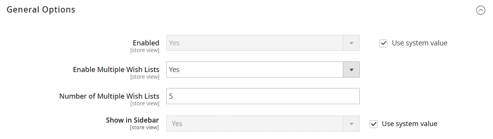

# Configurer des listes de souhaits

La configuration de la liste de souhaits active les listes de souhaits et détermine le modèle d’email et l’expéditeur des emails utilisés lors du partage d’une liste de souhaits.

## Activer la fonctionnalité de liste de souhaits

1. Sur la barre latérale _Admin_, accédez à **[!UICONTROL Stores]** > _[!UICONTROL Settings]_>**[!UICONTROL Configuration]**.

1. Dans le panneau de gauche, développez **[!UICONTROL Customers]** et choisissez **[!UICONTROL Wish List]**.

1. Développez la section  de **[!UICONTROL General Options]** et procédez comme suit :

   {width="600" zoomable="yes"}

   - Basculez de **[!UICONTROL Enabled]** vers `Yes`, ce qui active le module de liste de souhaits pour le magasin.

   -  (Adobe Commerce uniquement) Basculez **[!UICONTROL Enable Multiple Wish Lists]** vers `Yes`, ce qui permet aux clients de créer et de gérer plusieurs listes de souhaits.

   -  (Adobe Commerce uniquement) Pour limiter le nombre de listes de souhaits que les clients peuvent avoir associées à leur compte, saisissez la valeur **[!UICONTROL Number of Multiple Wish Lists]**.

   - Basculez de **[!UICONTROL Show in Sidebar]** vers `Yes`, qui affiche les listes de souhaits dans la barre latérale.

1. Développez la section  de **[!UICONTROL Share Options]** et procédez comme suit :

   {width="600" zoomable="yes"}

   - Définissez le **[!UICONTROL Email Sender]** sur le contact du magasin qui doit apparaître comme l’expéditeur du message. Options : contact général, représentant commercial, service clientèle, courrier électronique personnalisé.

   - Définissez le **[!UICONTROL Email Template]** à utiliser lorsqu’un client partage une liste de souhaits.

   - Pour limiter le nombre total d&#39;emails qu&#39;un client peut envoyer, saisissez une valeur **[!UICONTROL Max Emails Allowed to be Sent]**. La valeur par défaut est 10 et la valeur maximale autorisée est de 10 000.

   - Pour limiter la taille du message, saisissez la valeur **[!UICONTROL Email Text Length Limit]**. La valeur par défaut est 255.

1. Développez  de la section **[!UICONTROL My Wish List Link]** et définissez **[!UICONTROL Display Wish List Summary]** sur l’une des options suivantes :

   - `Display number of items in wish list`
   - `Display item quantities`

   {width="600" zoomable="yes"}

1. Une fois l’opération terminée, cliquez sur **[!UICONTROL Save Config]**.

## Ajouter une recherche de liste de souhaits

 (Adobe Commerce uniquement)

Vous trouverez n’importe quelle liste de souhaits publics à l’aide du widget de recherche de liste de souhaits [. ](../content-design/widgets.md) Le widget permet à un client de rechercher par nom ou adresse électronique du propriétaire de la liste de souhaits. Les clients de la boutique peuvent trouver des listes de souhaits qui appartiennent à d’autres clients, les consulter et leur commander des produits, ou ajouter les produits à leurs propres listes de souhaits. Si un article est acheté à partir d’une liste de souhaits publique par un autre client, il n’est pas supprimé de la liste de souhaits d’origine. Le widget _Recherche de liste de souhaits_ peut être ajouté à n’importe quelle page de votre boutique afin que les clients puissent facilement trouver les listes de souhaits des amis et des membres de leur famille.

{width="700" zoomable="yes"}

1. Sur la barre latérale _Admin_, accédez à **[!UICONTROL Content]** > _[!UICONTROL Elements]_>**[!UICONTROL Widgets]**.

1. Dans le coin supérieur droit, cliquez sur **[!UICONTROL Add Widget]**.

1. Dans l&#39;onglet _[!UICONTROL Settings]_, procédez comme suit :

   - Définissez **[!UICONTROL Type]** sur `Wish List Search`.

   - Définissez **[!UICONTROL Design Theme]** sur le thème du magasin où la liste de souhaits est ajoutée.

   - Cliquez sur **[!UICONTROL Continue]**.

1. Procédez comme suit :_[!UICONTROL Storefront Properties]_

   - Saisissez le **[!UICONTROL Widget Title]**.

   - Définissez **[!UICONTROL Assign to Store Views]** sur la vue ou le site web sur lequel le widget doit être utilisé.

   - Pour **[!UICONTROL Sort Order]**, saisissez un nombre pour déterminer le positionnement du widget dans son conteneur.

     `0` = premier (par défaut), `1` = second, `2` = troisième, etc.

1. Dans la section _[!UICONTROL Layout Updates]_, cliquez sur **[!UICONTROL Add Layout Update]**et définissez **[!UICONTROL Display on]**sur l’une des options suivantes :

   - _[!UICONTROL Categories]_

      - `Anchor Categories`
      - `Non-Anchor Categories`

   - _[!UICONTROL Products]_

      - `All Product Type`
      - `Simple Product`
      - `Virtual Product`
      - `Bundle Product`
      - `Configurable Product`
      - `Downloadable Product`
      - `Gift Card`
      - `Grouped Product`

   - _[!UICONTROL Generic Page]_

      - `All Pages`
      - `Specified Page`
      - `Page Layouts`

1. Dans la liste **[!UICONTROL Container]**, sélectionnez la zone de mise en page où elle doit être placée.

   {width="700" zoomable="yes"}

1. Dans le panneau de gauche, choisissez **[!UICONTROL Widget Options]**.

1. Définissez **[!UICONTROL Quick Search Form Types]** sur l’une des options suivantes :

   - `All Forms` - Les clients peuvent effectuer une recherche selon tous les paramètres disponibles.
   - `Owner Name` - Les clients peuvent rechercher des listes de souhaits par nom de propriétaire.
   - `Owner Email` - Les clients peuvent rechercher des listes de souhaits par adresse électronique du propriétaire.

   >[!NOTE]
   >
   >Les adresses de livraison ne sont pas incluses dans les listes de souhaits.

1. Configurez les propriétés du widget restantes si nécessaire, en suivant les [instructions](../content-design/widget-create.md) standard.

1. Une fois l’opération terminée, cliquez sur **[!UICONTROL Save]**.

1. Lorsque vous y êtes invité, actualisez tous les caches non valides.
