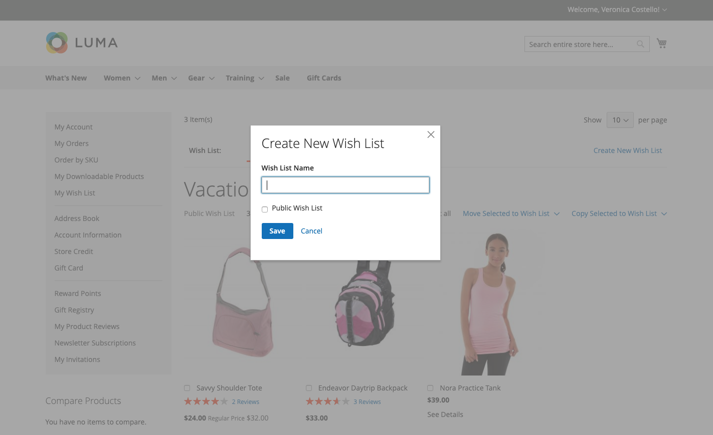
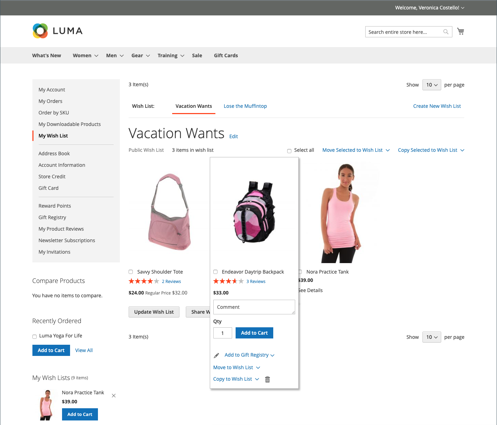
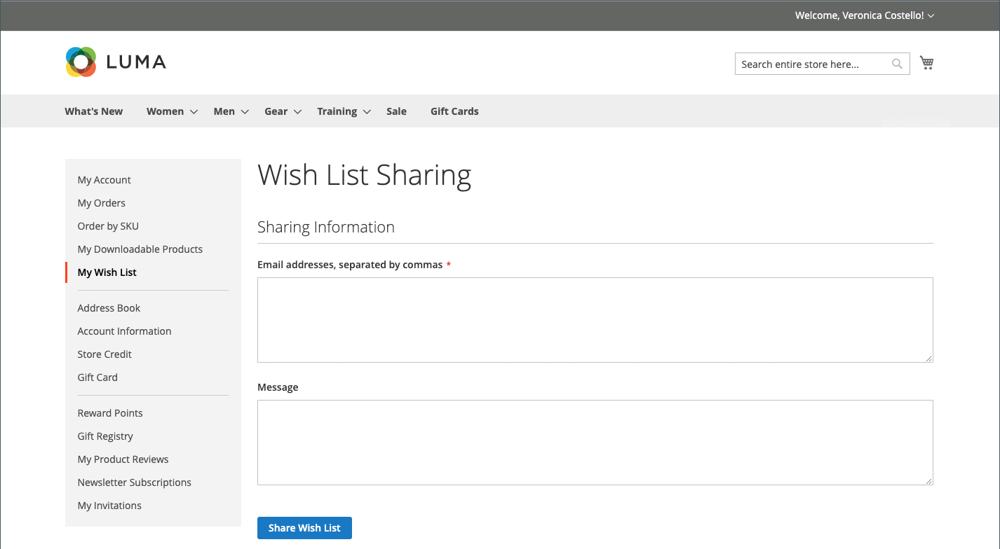
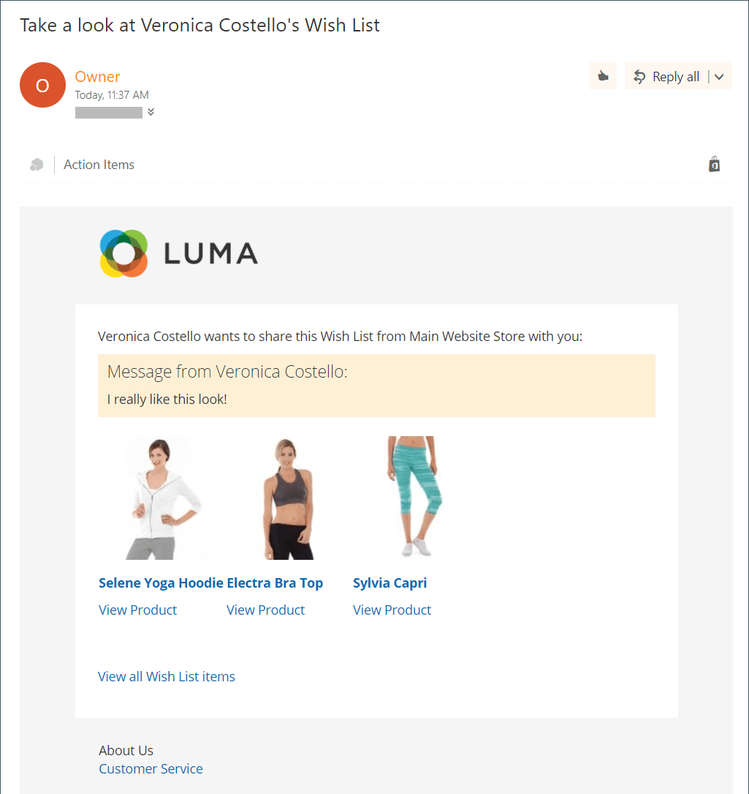

# Expérience storefront de liste de souhaits

Une liste de souhaits est un moyen pratique pour les clients de rappeler des produits qu&#39;ils aiment, mais qu&#39;ils ne sont pas prêts à acheter. Les articles d’une liste de souhaits peuvent être partagés avec d’autres personnes ou ajoutés au panier. Si le client possède plusieurs listes de souhaits, le nom de la liste de souhaits actuelle s’affiche en haut de la page. Les clients peuvent gérer leurs listes de souhaits depuis le tableau de bord de leur compte. Les administrateurs de boutique peuvent également aider les clients à gérer leurs listes de souhaits à partir de l’administrateur.

{width="700" zoomable="yes"}

 Adobe Commerce prend en charge l’utilisation de plusieurs listes de souhaits par compte client.

 La base de code Magento Open Source prend en charge l’utilisation d’une seule liste de souhaits par compte client.

## Créer une liste de souhaits

 (Adobe Commerce uniquement)

En storefront, un client peut créer une liste de souhaits à partir du tableau de bord de son compte, d’une page produit, d’une page catalogue et du panier.

### Méthode 1 : à partir d’un compte client

1. Dans la barre latérale du tableau de bord de son compte, le client choisit **[!UICONTROL My Wish List]**.

1. Dans le coin supérieur droit, clique sur **[!UICONTROL Create New Wish List]**.

1. Saisissez le Nom de la liste de souhaits.

1. Pour permettre à d’autres personnes de voir leur liste de souhaits, coche la case **[!UICONTROL Public Wish List]** .

   >[!NOTE]
   >
   >La principale différence entre les listes de souhaits `Public` et `Private` est que les listes de souhaits privées ne sont pas [consultables](wishlist-configuration.md#add-wish-list-search) par le biais des listes de souhaits.

1. Cliquez ensuite sur **[!UICONTROL Save]**.

   {width="700" zoomable="yes"}

### Méthode 2 : à partir de la page du catalogue

1. Depuis le storefront, le client accède à la page du catalogue qui contient le produit qu’il souhaite ajouter à une liste de souhaits.

1. Survolez le produit avec la souris.

1. Le client clique sur la flèche en regard de l’icône _Ajouter à la liste de souhaits_ et sélectionne la **[!UICONTROL Create New Wish List]**.

1. Saisit le nom de la liste de souhaits.

1. Pour permettre à d’autres personnes de voir leur liste de souhaits, coche la case **[!UICONTROL Public Wish List]** .

1. Une fois l’opération terminée, cliquez sur **[!UICONTROL Save]**.

### Méthode 3 : à partir de la page des détails du produit

1. Depuis le storefront, le client accède à la page des détails du produit qu&#39;il souhaite ajouter à une liste de souhaits.

1. Clique sur la flèche en regard de **[!UICONTROL Add to Wish List]** et sélectionne **[!UICONTROL Create New Wish List]**.

1. Entre dans le **[!UICONTROL Wish List Name]**.

1. Pour permettre à d’autres personnes de voir leur liste de souhaits, coche la case **[!UICONTROL Public Wish List]** .

1. Une fois l’opération terminée, cliquez sur **[!UICONTROL Save]**.

   {width="700" zoomable="yes"}

### Méthode 4 : à partir du panier

1. Le client ouvre la page de **[!UICONTROL Shopping Cart]**.

1. Sous l’élément, cliquez sur la flèche en regard de **[!UICONTROL Move to Wishlist]** et choisissez **[!UICONTROL Create New Wish List]**.

1. Entre dans le **[!UICONTROL Wish List Name]**.

1. Pour permettre à d’autres personnes de voir leur liste de souhaits, coche la case **[!UICONTROL Public Wish List]** .

1. Une fois l’opération terminée, cliquez sur **[!UICONTROL Save]**.

{width="700" zoomable="yes"}

## Mettre à jour la liste des produits

1. Dans la liste de souhaits, le client pointe vers le produit pour afficher les options.

1. Pour ajouter un **[!UICONTROL Comment]** sur le produit, entrez le texte dans la case en dessous du prix.

   {width="700" zoomable="yes"}

1. Pour modifier la sélection d’options de produit, cliquez sur **[!UICONTROL Edit]** et procédez comme suit :

   - Met à jour les options de la page des détails du produit.
   - Effectue un clic sur **[!UICONTROL Update Wish List]**.

## Ajouter un produit de liste de souhaits au panier

1. Dans la liste de souhaits, le client pointe vers le produit que vous souhaitez ajouter.

1. Met à jour le **[!UICONTROL Qty]** et modifie les autres options selon les besoins.

1. Effectue un clic sur **[!UICONTROL Add to Cart]**.

## Partager la liste de souhaits

1. Le client clique sur **[!UICONTROL Share Wishlist]**.

1. Saisit l’adresse e-mail de chaque personne qui doit recevoir la liste de souhaits, séparée par une virgule.

1. Ajoute un **[!UICONTROL Message]** à inclure dans l’email.

1. Effectue un clic sur **[!UICONTROL Share Wish List]**.

   {width="700" zoomable="yes"}

   Le message est envoyé à partir de votre [contact de boutique](../getting-started/store-details.md#store-email-addresses) principal et comprend une image miniature de chaque produit, avec des liens vers votre boutique.

   {width="500" zoomable="yes"}

## Modifier les listes de souhaits

Les clients peuvent modifier leur liste de souhaits de plusieurs façons à partir du tableau de bord de leur compte.

### Déplacer des éléments vers une autre liste

 (Adobe Commerce uniquement)

1. Le client coche la case de chaque élément à déplacer.

1. Clique **[!UICONTROL Move Selected to Wish List]** et effectue l’une des opérations suivantes :

   - Choisit une liste de souhaits existante.
   - Effectue un clic sur **[!UICONTROL Create New Wish List]**.

### Copier des éléments dans une autre liste

 (Adobe Commerce uniquement)

1. Sélectionne la case à cocher de chaque élément à déplacer.

1. Clique **[!UICONTROL Copy Selected to Wish List]** et effectue l’une des opérations suivantes :

   - Choisit une liste de souhaits existante.
   - Effectue un clic sur **[!UICONTROL Create New Wish List]**.

## Supprimer une liste de souhaits

 (Adobe Commerce uniquement)

1. Le client ouvre la liste de souhaits à supprimer.

1. Effectue un clic sur **[!UICONTROL Delete Wish List]**.

1. Lorsque vous êtes invité à confirmer, cliquez sur **[!UICONTROL OK]**.

>[!IMPORTANT]
>
>Cette action est irréversible.

## Transférer les articles de la liste de souhaits vers le panier

Pour transférer tous les articles de la liste de souhaits dans le panier, le client clique sur **[!UICONTROL Add All to Cart]**.

Pour ajouter un seul élément, le client effectue les opérations suivantes :

1. Pointez sur l’article et saisissez le **[!UICONTROL Qty]** qu’il souhaite ajouter au panier.

1. Effectue un clic sur **[!UICONTROL Add to Cart]**.

## Rechercher une liste de souhaits du client

Si le widget [Recherche de liste de souhaits](wishlist-configuration.md#add-wish-list-search) est inclus dans les pages de votre boutique, les clients peuvent effectuer une recherche par le nom ou l’adresse e-mail du propriétaire de la liste de souhaits.

1. Dans le widget de recherche Liste de souhaits , le client sélectionne une option de recherche.

1. Saisit le nom ou l’adresse e-mail du propriétaire de la liste de souhaits et clique sur **[!UICONTROL Search]**.

   La page _Recherche de liste de souhaits_ s’ouvre et toutes les listes de souhaits correspondantes s’affichent dans la section des résultats de la recherche.

   >[!NOTE]
   >
   >Seules les listes de souhaits publiques sont affichées dans les résultats de recherche ; les listes de souhaits privées des clients ne sont pas visibles publiquement.

1. Pour afficher la liste des éléments de la liste de souhaits, cliquez sur **[!UICONTROL View]**.

   Le nom du propriétaire et la date de la dernière mise à jour sont affichés pour chaque liste de souhaits.

1. Pour ajouter un produit à son panier, le client coche la case située sous le produit et clique sur **[!UICONTROL Add to Cart]**.

   Vous pouvez également ajouter à la vôtre des éléments que vous aimez figurant dans la liste de souhaits d’un autre client.
