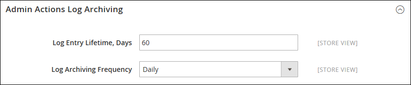
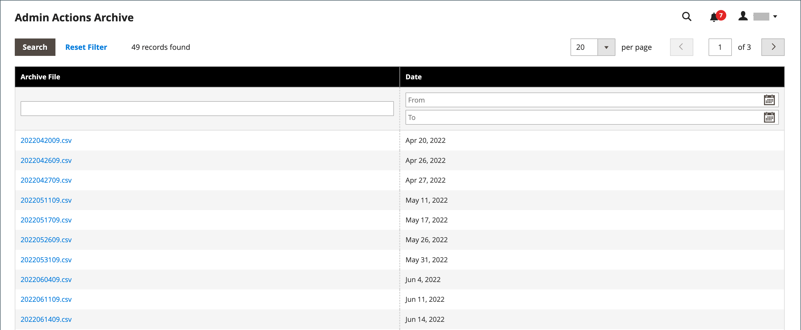

# Archive du journal des actions

{{ee-feature}}

L’archive Admin [actions](action-log.md) répertorie les fichiers journaux CSV stockés sur le serveur.

[!BADGE PaaS uniquement]{type=Informative url="https://experienceleague.adobe.com/fr/docs/commerce/user-guides/product-solutions" tooltip="S’applique uniquement aux projets Adobe Commerce on Cloud (infrastructure PaaS gérée par Adobe) et aux projets On-premise."} dans la configuration, vous pouvez spécifier la durée pendant laquelle les entrées de journal sont stockées et la fréquence à laquelle elles sont archivées. Par défaut, le nom de fichier inclut la date actuelle au format ISO : `yyyyMMddHH`

>[!NOTE]
>
>L’archivage des journaux nécessite la configuration d’une tâche [cron](cron.md).

## Configuration de l’archive du journal

badgePaas : label=« PaaS uniquement » type=« Informative » url=« https://experienceleague.adobe.com/fr/docs/commerce/user-guides/product-solutions » tooltip=« S’applique aux projets Adobe Commerce sur Cloud (infrastructure PaaS gérée par Adobe) et aux projets On-Premise uniquement. »

1. Dans la barre latérale _Admin_, accédez à **[!UICONTROL Stores]** > _[!UICONTROL Settings]_>**[!UICONTROL Configuration]**.

1. Dans le panneau de gauche, développez **[!UICONTROL Advanced]** et choisissez **[!UICONTROL System]**.

1. Développez  la section **[!UICONTROL Admin Actions Log Archiving]** et définissez les options suivantes :

   - **[!UICONTROL Log Entry Lifetime, Days]** — Entrez le nombre de jours pendant lesquels vous souhaitez conserver les entrées de journal dans la base de données avant de les supprimer.
   - **[!UICONTROL Log Archiving Frequency]** — Définissez sur `Daily`, `Weekly` ou `Monthly`.

   {width="600" zoomable="yes"}

   Pour obtenir la liste détaillée des paramètres de configuration, voir [Archivage du journal des actions d’administration](../configuration-reference/advanced/system.md) dans la _Référence de configuration_.

1. Cliquez ensuite sur **[!UICONTROL Save Config]**.

## Afficher l’archive

Dans la barre latérale _Admin_, accédez à **[!UICONTROL System]** > _[!UICONTROL Actions Logs]_>**[!UICONTROL Archive]**.

{width="600" zoomable="yes"}
