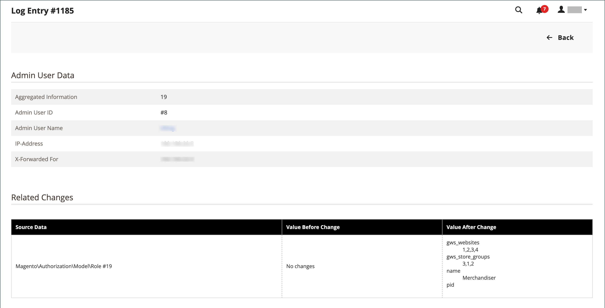

# Rapport Journaux d’actions

{{ee-feature}}

Le rapport _Journaux d’action_ affiche un enregistrement détaillé de toutes les actions d’administration activées pour la journalisation. Chaque enregistrement est horodaté et enregistre l’adresse IP et le nom de l’utilisateur. Le détail du journal comprend les données utilisateur de l’administrateur et les modifications associées qui ont été apportées pendant l’action.

Les actions que vous souhaitez afficher dans le rapport doivent être activées dans l’écran [Journalisation des actions d’administration](action-log.md) des paramètres du magasin. Si le type d’action est coché (activé), ces types d’actions d’administration sont affichés dans le rapport Journaux d’actions .

Le rapport peut être filtré à l&#39;aide des options de chaque colonne. Vous pouvez définir une option de filtre unique ou des options de filtre pour plusieurs colonnes afin que le rapport répertorie les actions spécifiques. Vous pouvez également exporter des données de rapport au format CSV ou XML Excel.

Le rapport Journaux d’action comprend les informations suivantes :

- **[!UICONTROL Time]** - Date et heure auxquelles l’action a eu lieu
- **[!UICONTROL Action Group]** - Affiche le type d’action, correspond aux actions activées sur l’écran _Journalisation des actions d’administration_ dans les paramètres de votre magasin.
- **[!UICONTROL Action]** - Affiche l’action consignée
- **[!UICONTROL IP Address]** - Affiche l’adresse IP de la machine sur laquelle l’action a été effectuée.
- **[!UICONTROL Username]** - Affiche l’ID de connexion de l’utilisateur qui a exécuté l’action
- **[!UICONTROL Result]** - Affiche le succès ou l’échec de l’action de l’utilisateur
- **[!UICONTROL Full Action Name]** - Affiche le nom de l’action principale
- **[!UICONTROL Details]** - Affiche la catégorie d’action du serveur principal
- **[!UICONTROL Full Details]** - Affiche tous les détails consignés de l’action d’administration

## Affichage du rapport Journaux d’actions

1. Sur la barre latérale _Admin_, accédez à **[!UICONTROL System]** > _[!UICONTROL Actions Logs]_>**[!UICONTROL Report]**.

   {width="600" zoomable="yes"}

1. Pour afficher tous les détails d’une action d’administration répertoriée, cliquez sur **[!UICONTROL View]**.

   {width="600" zoomable="yes"}

## Filtrage du rapport Journaux d’actions

Vous pouvez définir les champs des options de filtrage, puis cliquer sur **[!UICONTROL Search]** pour restreindre les actions affichées.

Pour effacer les options de filtre et revenir au rapport complet, cliquez sur **[!UICONTROL Reset Filter]**.

{width="600" zoomable="yes"}

| Champ | description |
|--- |--- |
| [!UICONTROL Time] | Dans **[!UICONTROL From]**, cliquez pour sélectionner une date du calendrier dynamique afin de définir la date de début du filtre. Dans **[!UICONTROL To]**, cliquez pour sélectionner une date pour définir la date de fin du filtre. |
| [!UICONTROL Action Group] | Choisissez un groupe d’actions. |
| [!UICONTROL Action] | Sélectionnez une action. |
| [!UICONTROL IP Address] | Saisissez l’adresse IP de la machine utilisée pour une action. |
| [!UICONTROL Username] | Sélectionnez un nom d’utilisateur. La valeur par défaut est `All Users`. |
| [!UICONTROL Result] | Sélectionnez Réussite ou Échec. |
| [!UICONTROL Full Action Name] | Entrez le texte de la recherche à faire correspondre dans le champ. |
| [!UICONTROL Details] | Entrez le texte de la recherche à faire correspondre dans le champ. |

{style="table-layout:auto"}

## Exportation du rapport Journaux d’actions

1. Pour **[!UICONTROL Export to]**, choisissez un format d’exportation :

   - `CSV` - Fichier de valeur séparé par des virgules contenant des données de texte brut
   - `Excel XML` - Format de données de feuille de calcul XML

1. Cliquez sur **[!UICONTROL Export]**.

   Le fichier généré est automatiquement enregistré dans le dossier désigné pour les téléchargements.

   {width="200"}
