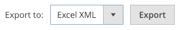

# Rapport Journaux d’action

{{ee-feature}}

Le rapport _Journaux d’actions_ affiche un enregistrement détaillé de toutes les actions d’administration activées pour la journalisation. Chaque enregistrement est horodaté et enregistre l’adresse IP et le nom de l’utilisateur. Les détails du journal incluent les données utilisateur de l’administrateur et les modifications associées qui ont été effectuées lors de l’action.

Les actions que vous souhaitez afficher dans le rapport doivent être activées dans l’écran [Journalisation des actions d’administration](action-log.md) dans les paramètres du magasin. Si le type d’action est coché (activé), ces types d’actions d’administration s’affichent dans le rapport Journaux d’actions .

Le rapport peut être filtré à l’aide des options de chaque colonne. Vous pouvez définir une seule option de filtre ou définir des options de filtre pour plusieurs colonnes afin d’affiner le rapport pour répertorier des actions spécifiques. Vous pouvez également exporter des données de rapport au format CSV ou XML Excel.

Le rapport Journaux d’action contient les informations suivantes :

- **[!UICONTROL Time]** - Date et heure auxquelles l’action s’est produite
- **[!UICONTROL Action Group]** : affiche le type d’action en corrélation avec les actions activées sur l’écran _Journalisation des actions d’administration_ dans les paramètres de votre boutique.
- **[!UICONTROL Action]** - Affiche l’action consignée
- **[!UICONTROL IP Address]** : affiche l’adresse IP de la machine sur laquelle l’action a été effectuée
- **[!UICONTROL Username]** : affiche l’ID de connexion de l’utilisateur qui a exécuté l’action
- **[!UICONTROL Result]** : affiche le succès ou l’échec de l’action de l’utilisateur ou de l’utilisatrice
- **[!UICONTROL Full Action Name]** : affiche le nom de l’action du serveur principal
- **[!UICONTROL Details]** : affiche la catégorie d’actions du serveur principal.
- **[!UICONTROL Full Details]** : affiche tous les détails consignés de l’action d’administration.

## Afficher le rapport Journaux d’actions

1. Dans la barre latérale _Admin_, accédez à **[!UICONTROL System]** > _[!UICONTROL Actions Logs]_>**[!UICONTROL Report]**.

   {width="600" zoomable="yes"}

1. Pour afficher les détails complets d’une action d’administration répertoriée, cliquez sur **[!UICONTROL View]**.

   {width="600" zoomable="yes"}

## Filtrer le rapport Journaux d’actions

Vous pouvez définir les champs d’options de filtrage, puis cliquer sur **[!UICONTROL Search]** pour affiner les actions affichées.

Pour effacer les options de filtrage et revenir au rapport complet, cliquez sur **[!UICONTROL Reset Filter]**.

{width="600" zoomable="yes"}

| Champ | description |
|--- |--- |
| [!UICONTROL Time] | Dans **[!UICONTROL From]**, cliquez pour sélectionner une date dans le calendrier dynamique afin de définir la date de début du filtre. Dans **[!UICONTROL To]**, cliquez sur pour sélectionner une date afin de définir la date de fin du filtre. |
| [!UICONTROL Action Group] | Choisissez un groupe d&#39;actions. |
| [!UICONTROL Action] | Choisissez une action. |
| [!UICONTROL IP Address] | Entrez l&#39;adresse IP de la machine utilisée pour une action. |
| [!UICONTROL Username] | Choisissez un nom d’utilisateur. La valeur par défaut est `All Users`. |
| [!UICONTROL Result] | Choisissez Succès ou Échec. |
| [!UICONTROL Full Action Name] | Saisissez le texte de la recherche à faire correspondre dans le champ. |
| [!UICONTROL Details] | Saisissez le texte de la recherche à faire correspondre dans le champ. |

{style="table-layout:auto"}

## Exporter le rapport Journaux d’actions

1. Par **[!UICONTROL Export to]**, choisissez un format d’exportation :

   - `CSV` - Fichier de valeurs séparées par des virgules contenant des données en texte brut
   - `Excel XML` - Format de données de feuille de calcul XML

1. Cliquez sur **[!UICONTROL Export]**.

   Le fichier généré est automatiquement enregistré dans le dossier désigné pour les téléchargements.

   {width="200"}
