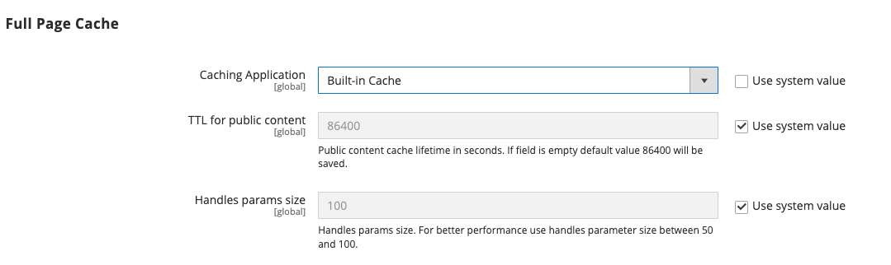

# Gestion du cache

Le système de gestion du cache d’Adobe Commerce et de Magento Open Source permet d’améliorer facilement les performances de votre site. Chaque fois qu’une actualisation du cache est nécessaire, une notification s’affiche avec un lien vers la page [!UICONTROL Cache Management] pour terminer l’actualisation.

{width="500"}

La page _[!UICONTROL Cache Management]_&#x200B;affiche le statut de chaque cache principal et de la balise qui lui est associée. Les grands boutons situés dans le coin supérieur droit peuvent être utilisés pour vider le cache ou l’espace de stockage dans le cache « Tout compris ». Au bas de la page, des boutons supplémentaires vous permettent de vider le cache des images de produits du catalogue et le cache JavaScript/CSS.

>[!IMPORTANT]
>
>Lorsque des entités de catalogue sont modifiées, cela peut affecter d’autres pages et invalider plusieurs caches simultanément. Lorsque vous examinez la page de gestion du cache, vous pouvez voir les éléments non valides qui doivent être actualisés lorsqu’ils n’ont _&#x200B;**été modifiés directement**&#x200B;_. Par exemple, cette invalidation se produit lorsque vous modifiez un produit du catalogue affecté à une catégorie ou lorsque vous modifiez une règle de produit associée.

Après avoir effacé un cache, actualisez toujours votre navigateur pour vous assurer que vous pouvez voir les fichiers les plus récents. L’effacement du cache de Commerce n’efface pas le cache du navigateur web. Vous devrez peut-être vider la mémoire cache du navigateur pour afficher le contenu mis à jour.

Des informations techniques supplémentaires sur la mise en cache d’Adobe Commerce sont disponibles à partir de la [ présentation du cache ](https://developer.adobe.com/commerce/frontend-core/guide/caching/){:target="_blank"} dans le _Guide de développement du front-end de Commerce_.

Accédez à la page _[!UICONTROL Cache Management]_&#x200B;en effectuant l’une des opérations suivantes :

- Cliquez sur le lien **[!UICONTROL Cache Management]** dans le message au-dessus de l’espace de travail.
- Dans la barre latérale _Admin_, accédez à **[!UICONTROL System]** > _[!UICONTROL Tools]_>**[!UICONTROL Cache Management]**.

{width="700" zoomable="yes"}

## Bonnes pratiques de mise en cache

La réindexation et la mise en cache ont des objectifs différents dans Commerce. [Index](index-management.md) suivez les informations de la base de données pour améliorer les performances de recherche, accélérer la récupération des données pour les vitrines, etc. Les caches enregistrent les données chargées, les images, les formats, etc. pour améliorer les performances de chargement et d’accès au storefront.

- Videz toujours le cache après l’installation des extensions/modules. Vous pouvez installer une ou plusieurs extensions, puis vider le cache.
- Videz le cache après l’installation de Commerce. Pour les nouvelles installations, vous devez également procéder à la réindexation.
- Videz le cache après la mise à niveau d’une version d’Open Source ou de Commerce vers une autre.
- Lors du vidage des caches, tenez compte du type de cache et planifiez le vidage en dehors des heures de pointe. Par exemple, choisissez une heure à laquelle peu de clients utilisent le site, comme tard dans la nuit ou tôt le matin. L’effacement des types de cache pendant la demande de pointe peut augmenter la charge sur l’administrateur et entraîner l’arrêt du site jusqu’à la fin de l’opération.
- Lors de la [réindexation](index-management.md), il n’est pas nécessaire de vider le cache.

## Ressources du rôle de gestion du cache

Vous pouvez attribuer l’accès à des actions de maintenance de cache spécifiques aux utilisateurs par rôle, y compris les options d’affichage, de basculement et de vidage des caches. Adobe recommande d’activer les actions de vidage uniquement pour les utilisateurs de niveau administrateur. Donner accès à toutes les fonctionnalités de gestion du cache peut avoir un impact sur les performances de votre storefront.

{width="600" zoomable="yes"}

Pour plus d’informations sur l’affectation de ressources pour accorder l’accès aux comptes utilisateur d’administration, voir [Ressources de rôle](permissions-user-roles.md#role-resources). Les ressources suivantes contrôlent l’accès aux outils de gestion du cache :

- [!UICONTROL Clean Cache Actions]

   - [!UICONTROL Flush Cache Storage]
   - [!UICONTROL Flush Magento Cache]

- [!UICONTROL Cache Type Management]

   - [!UICONTROL Toggle Cache Type]
   - [!UICONTROL Refresh Cache Type]

- [!UICONTROL Additional Cache Management]

   - [!UICONTROL Catalog Images Cache]
   - [!UICONTROL Flush Js/Css]
   - [!UICONTROL Flush Static Files]

## Actualiser les caches spécifiques

1. Pour chaque cache à actualiser, cochez la case au début de la ligne.

1. Définissez **[!UICONTROL Actions]** sur `Refresh`, puis cliquez sur **[!UICONTROL Submit]**.

## Effectuer une actualisation en masse

1. Pour sélectionner un groupe de caches, définissez **[!UICONTROL Mass Actions]** sur l’une des valeurs suivantes :

   - `Select All`
   - `Select Visible`

1. Cochez la case de chaque cache à actualiser.

1. Définissez **[!UICONTROL Actions]** sur `Refresh`, puis cliquez sur **[!UICONTROL Submit]**.

## Videz le cache d’images du produit.

1. Sous _[!UICONTROL Additional Cache Management]_, cliquez sur **[!UICONTROL Flush Catalog Images Cache]**&#x200B;pour effacer les fichiers image de produit prégénérés.

   Le message `Image cache was cleaned` s’affiche en haut de l’espace de travail.

1. Effacez le cache de votre navigateur.

## Videz le cache JavaScript/CSS.

1. Sous _[!UICONTROL Additional Cache Management]_, effacez les fichiers Javascript et CSS qui ont été fusionnés en un seul fichier en cliquant sur **[!UICONTROL Flush JavaScript/CSS Cache]**.

   Le message `The JavaScript/CSS cache has been cleaned` s’affiche en haut de l’espace de travail.

1. Effacez le cache de votre navigateur.

## Vider à l’aide de la ligne de commande

Les administrateurs système et les développeurs ayant accès au serveur d’applications Commerce peuvent également gérer la configuration du cache et du cache à partir de la ligne de commande à l’aide de l’interface de ligne de commande Commerce. Voir [ Gestion du cache ](https://experienceleague.adobe.com/fr/docs/commerce-operations/configuration-guide/cli/manage-cache#clean-and-flush-cache-types){:target="_blank"} dans le _Guide de configuration_.

## Contrôles

| Contrôle | Description |
|---------------------------|------------------------------------------------------------------------------------------------------------------------------------------------------------------------------------------------------------------------------------------------------------------------------------------------------------------------------------------------------------|
| [!UICONTROL Mass Actions] | Coche la case de plusieurs caches. Options :  **[!UICONTROL Select All]**— Coche la case de tous les caches. **&#x200B; Tout désélectionner &#x200B;**— Décoche la case de tous les caches. **[!UICONTROL Select Visible]** : coche la case de tous les caches visibles.  **[!UICONTROL Unselect Visible]**— Décoche la case de tous les caches visibles. |
| [!UICONTROL Actions] | Détermine l&#39;action à appliquer à tous les caches sélectionnés. Options :  **[!UICONTROL Enable]**— Active tous les caches sélectionnés. **[!UICONTROL Disable]** — Désactive tous les caches sélectionnés.  **[!UICONTROL Refresh]**— Actualise tous les caches sélectionnés. |
| [!UICONTROL Submit] | Applique l’action à tous les caches sélectionnés. |

{style="table-layout:auto"}

### Boutons

| Bouton | Description |
|-----------------------------------------|----------------------------------------------------------------------------------------------------------------------------------------------------------------------------------------------------------------------------------------|
| [!UICONTROL Flush Magento Cache] | Supprime tous les éléments du cache Commerce par défaut (`var/cache`) en fonction des balises Commerce associées. |
| [!UICONTROL Flush Cache Storage] | Supprime tous les éléments du cache, quelle que soit la balise Commerce. Si votre système utilise un autre emplacement de cache, tous les fichiers mis en cache utilisés par d’autres applications sont supprimés dans le processus. |
| [!UICONTROL Flush Catalog Images Cache] | Supprime toutes les images de catalogue automatiquement redimensionnées et filigranées stockées dans `media/catalog/product/cache`. Si les images récemment chargées ne sont pas reflétées dans le catalogue, essayez de vider le catalogue et d’actualiser votre navigateur. |
| [!UICONTROL Flush JavaScript/CSS Cache] | Supprime la copie fusionnée des fichiers JavaScript et CSS du cache. Si des modifications récentes apportées à la feuille de style ou à JavaScript ne sont pas répercutées dans le magasin, essayez de vider le cache JavaScript/CSS et d’actualiser votre navigateur. |
| [!UICONTROL Flush Static Files Cache] | Supprime les fichiers de vue prétraités et les fichiers statiques. |

{style="table-layout:auto"}

### Caches

La page [!UICONTROL Cache Management] répertorie les types de cache que vous pouvez gérer à partir de l’administration avec leur statut actuel. Cette section décrit les types de cache par défaut pris en charge par Adobe Commerce. Les colonnes _Balise de cache_ et _ID de cache_ décrivent les valeurs utilisées dans le code de l’application Commerce :

- `cache_type_id` définit l’identifiant unique d’un type de cache.

- `%CACHE_TYPE_TAG%` définit la balise unique à utiliser dans la définition de la portée du type de cache.

Les développeurs et les intégrateurs système utilisent ces valeurs pour configurer et gérer la mise en cache lors de la personnalisation ou de l’intégration à Adobe Commerce, par exemple pour développer des intégrations à l’aide des API GraphQL.

[!BADGE PaaS uniquement]{type=Informative url="https://experienceleague.adobe.com/fr/docs/commerce/user-guides/product-solutions" tooltip="S’applique uniquement aux projets Adobe Commerce on Cloud (infrastructure PaaS gérée par Adobe) et aux projets On-premise."} Le `cache_type_id` est également utilisé pour la gestion du cache à partir de la ligne de commande du serveur d’applications à l’aide de l’interface de ligne de commande Commerce. Par exemple, ` bin/magento cache:status config` affiche le statut actuel du cache de configuration.

>[!NOTE]
>
>Les développeurs et les intégrateurs système peuvent personnaliser et étendre le système de gestion du cache de Commerce pour prendre en charge les modules et intégrations personnalisés. Pour plus d’informations, consultez [Configuration de la mise en cache](https://experienceleague.adobe.com/fr/docs/commerce-operations/configuration-guide/cache/caching-overview) dans le _Guide de configuration d’Adobe Commerce_.

<!-- prettier-ignore -->

#### Détails de la liste de cache

| Cache | Description | Balise de cache | ID du cache |
|-------|------------|----------|----------|
| [!UICONTROL Configuration] | Commerce collecte la configuration XML de tous les modules, la fusionne et enregistre le résultat fusionné dans le cache. **[!UICONTROL System]**- `config.xml`,`local.xml` **[!UICONTROL Module]** - `config.xml`  Ce cache contient également les paramètres spécifiques au magasin stockés dans le système de fichiers et la base de données. Nettoyez ou videz ce type de cache après avoir modifié les fichiers de configuration. | `CONFIG` | `config` |
| [!UICONTROL Layouts] | Dispositions de page compilées, c’est-à-dire les composants de disposition de tous les composants. Nettoyez ou videz ce type de cache après avoir modifié les fichiers de disposition. | `LAYOUT_GENERAL_CACHE_TAG` | `layout` |
| [!UICONTROL Blocks HTML output] | Fragments de page HTML par bloc Nettoyez ou videz ce type de cache après avoir modifié le calque d’affichage. | `BLOCK_HTML` | `block_html` |
| [!UICONTROL Collections Data] | Fichiers de données de collection qui stockent les résultats des requêtes de base de données. Si nécessaire, Commerce nettoie automatiquement ce cache, mais les développeurs tiers peuvent placer n’importe quelle donnée de n’importe quel segment du cache. Nettoyez ou videz ce type de cache si votre module personnalisé utilise une logique qui entraîne des entrées de cache que Commerce ne peut pas nettoyer. | `COLLECTION_DATA` | `collections` |
| [!UICONTROL Reflections] | Efface les données de réflexion de l’interface API, généralement générées pendant l’exécution. | `REFLECTION` | `reflection` |
| `Database DDL operations` | Schéma de la base. Si nécessaire, Commerce nettoie automatiquement ce cache, mais les développeurs tiers peuvent placer n’importe quelle donnée de n’importe quel segment du cache. Nettoyez ou videz ce type de cache après avoir apporté des modifications personnalisées au schéma de base de données. (En d’autres termes, il s’agit de mises à jour que Commerce ne fait pas lui-même.) Une façon de mettre à jour automatiquement le schéma de base de données est d’utiliser la commande setup:db-schema:upgrade de Magento. | `DB_DDL` | `db_ddl` |
| [!UICONTROL Compiled Config] | Résultats de la compilation de code. | `COMPILED_CONFIG` | `compiled_config` |
| [!UICONTROL Webhooks Response Cache] | Met en cache les réponses aux requêtes webhook. Pour plus d’informations, consultez le [guide des Webhooks](https://developer.adobe.com/commerce/extensibility/webhooks/release-notes/#enhancements-2) dans la documentation du développeur de Commerce. | `WEBHOOKS_RESPONSE` | `webhooks_response` |
| [!UICONTROL EAV types and attributes] | Met en cache la déclaration des types d’entités pour les métadonnées liées aux attributs de valeur d’attribut d’entité (EAV). Les attributs incluent les étiquettes de magasin, les liens vers le code PHP associé, le rendu des attributs, les paramètres de recherche, etc. En règle générale, il n’est pas nécessaire de nettoyer ou de vider ce type de cache. | `EAV` | `eav` |
| [!UICONTROL Customer Notification] | Notifications temporaires qui apparaissent dans l’interface utilisateur d’. | `CUSTOMER_NOTIFICATION` | `customer_notification` |
| [!UICONTROL GraphQL Query Resolver Results] | Met en cache les résultats des résolveurs de requêtes GraphQL pour les entités client, page CMS, bloc CMS et galerie de médias produit. Gardez ce cache activé pour améliorer les performances de GraphQL. | `GRAPHQL_QUERY_RESOLVER_RESULT` | `graphql_query_resolver_result` |
| [!UICONTROL Integrations Configuration] | Fichier de configuration de l&#39;intégration. Nettoyez ou videz ce cache après avoir modifié ou ajouté des intégrations. | `INTEGRATION` | `config_integration` |
| [!UICONTROL Integrations API Configuration] | Configuration des API d’intégration compilée pour les intégrations de magasin. | `INTEGRATION_API_CONFIG` | `config_integration_api` |
| [!UICONTROL Admin UI SDK Cache] | Met en cache les personnalisations pour l’administrateur. Voir [Configuration et test d’administration](https://developer.adobe.com/commerce/extensibility/admin-ui-sdk/configuration/) dans le _Guide SDK de l’interface utilisateur d’administration_. | `ADMIN_UI_SDK` | `admin_ui_sdk` |
| [!UICONTROL Page Cache] | Mise en cache complète de la page. | `FPC` | `full_page` |
| [!UICONTROL Target Rule] | Index de règle cible | `TARGET_RULE` | `target_rule` |
| [!UICONTROL Web Services Configuration] | Mise en cache de la structure de l’API Web. | `WEBSERVICE` | `config_webservice` |
| [!UICONTROL Translations] | Fichiers de traduction. | `TRANSLATE` | `translate` |

{style="table-layout:auto"}

## Mise en cache de toutes les pages

Adobe Commerce et Magento Open Source utilisent la mise en cache complète des pages sur le serveur pour afficher rapidement les pages de catégories, de produits et de CMS. La mise en cache de toutes les pages améliore le temps de réponse et réduit la charge sur le serveur. Sans mise en cache, chaque page peut avoir besoin d’exécuter des blocs de code et de récupérer des informations de la base de données. Toutefois, lorsque la mise en cache de toutes les pages est activée, une page entièrement générée peut être lue directement à partir du cache.

>[!NOTE]
>
>Il est recommandé de n’utiliser le [cache de vernis](https://varnish-cache.org/){:target="_blank"} que dans un environnement de production.

Le contenu mis en cache peut être utilisé pour traiter les requêtes provenant de types de visites similaires. Par conséquent, les pages présentées à un visiteur occasionnel peuvent différer des pages présentées à un client. À des fins de mise en cache, chaque visite est l’un des trois types suivants :

- `Non-sessioned` - Pendant une visite sans session, l’acheteur consulte les pages, mais n’interagit pas avec le magasin. Le système met en cache le contenu de chaque page consultée et les diffuse à d’autres acheteurs non connectés.
- `Sessioned` - Lors d’une visite en session, un ID de session est attribué aux acheteurs qui interagissent avec le magasin. Les interactions incluent des activités telles que la comparaison de produits ou l’ajout de produits au panier. Les pages mises en cache générées au cours de la session ne sont utilisées que par cet acheteur au cours de la session.
- `Customer` - Les sessions client sont créées pour les clients qui se connectent et font des achats à l’aide de leur compte enregistré. Au cours de la session, les clients peuvent recevoir des offres spéciales, des promotions et des prix en fonction du groupe de clients qui leur est affecté.

Pour obtenir des informations techniques, consultez les sections [Configurer et utiliser le vernis](https://experienceleague.adobe.com/docs/commerce-operations/configuration-guide/cache/varnish/config-varnish.html?lang=fr){:target="_blank"} et [Utiliser Redis pour la page Commerce et le cache par défaut](https://experienceleague.adobe.com/docs/commerce-operations/configuration-guide/cache/redis/redis-pg-cache.html?lang=fr){:target="_blank"} dans le _Guide de configuration_.

**_Pour configurer le cache de pages complètes, procédez comme suit_**

1. Dans la barre latérale _Admin_, accédez à **[!UICONTROL Stores]** > _[!UICONTROL Settings]_>**[!UICONTROL Configuration]**.

1. Dans le panneau de gauche, développez **[!UICONTROL Advanced]** et choisissez **[!UICONTROL System]**.

1. Développez  la section **[!UICONTROL Full Page Cache]** .

   {width="600" zoomable="yes"}

1. Définissez **[!UICONTROL Caching Application]** sur l’une des options suivantes :

   - `Built-in Application`
   - `Varnish Caching`

1. Pour définir le délai d’expiration du cache de page, saisissez le **[!UICONTROL TTL for public content]** . (La valeur par défaut est `86400`)

1. Pour spécifier le nombre maximal de [handles de mise en page](https://developer.adobe.com/commerce/frontend-core/guide/layouts/#layout-handles) à traiter sur le point d’entrée HTTP [`{BASE-URL}/page_cache/block/esi`](https://experienceleague.adobe.com/docs/commerce-operations/configuration-guide/cache/use-varnish-esi.html?lang=fr), saisissez le **[!UICONTROL Handles param size]** . Limiter la taille peut améliorer la sécurité et les performances. (La valeur par défaut est `100`)

1. Si vous utilisez le vernis, complétez la section **[!UICONTROL Varnish Configuration]** comme suit :

   - **[!UICONTROL Access list]** - Saisissez les adresses IP qui peuvent purger la configuration du vernis pour générer un fichier de configuration. Séparez les entrées multiples par une virgule. La valeur par défaut est `localhost`.

   - **[!UICONTROL Backend host]** - Saisissez l’adresse IP de l’hôte principal qui génère les fichiers de configuration. La valeur par défaut est `localhost`.

   - **[!UICONTROL Backend port]** - Identifiez le port principal utilisé pour générer les fichiers de configuration. La valeur par défaut est : `8080`.

   - **[!UICONTROL Grace period]** - Spécifiez le nombre de secondes à utiliser comme période de grâce pour générer les fichiers de configuration. Voir [Configuration avancée du vernis](https://experienceleague.adobe.com/docs/commerce-operations/configuration-guide/cache/config-varnish-advanced.html?lang=fr) dans le _Guide de configuration_.

   - Pour exporter la configuration sous la forme d’un fichier `varnish.vcl`, cliquez sur le bouton correspondant à la version de vernis que vous utilisez.

   {width="600" zoomable="yes"}

1. Cliquez ensuite sur **[!UICONTROL Save Config]**.
