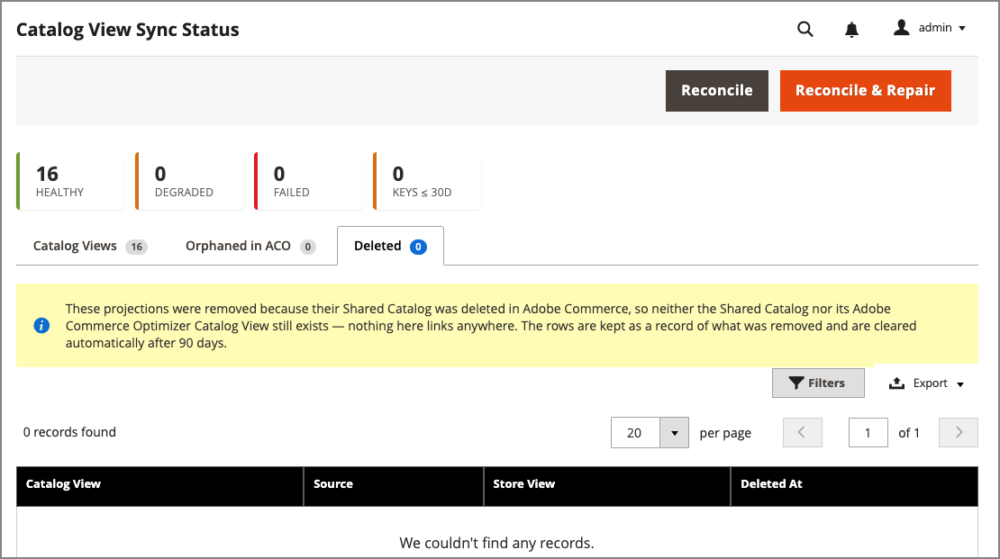

# Surveillance du statut de synchronisation de la vue Catalogue

Utilisez la page État de synchronisation des vues du catalogue pour surveiller la synchronisation et résoudre les problèmes liés aux vues du catalogue qui ont été projetées vers Adobe Commerce Optimizer. Pour chaque catalogue partagé personnalisé, le [!DNL Adobe Commerce Optimizer Connector for B2B] crée une vue de catalogue pour chaque vue de magasin dans la portée du site web du catalogue partagé. Chaque vue de catalogue est configurée avec une politique d’assortiment, son catalogue lié et la clé publique utilisée pour valider les jetons à accès restreint. Adobe Commerce conserve les métadonnées de vue de catalogue correspondantes, y compris la clé privée et l’ID de catalogue des prix par défaut.

>[!NOTE]
>
>Pour suivre le statut de synchronisation des flux de données du catalogue, utilisez la page [[!UICONTROL Data Feed Sync Status]](data-feed-sync-status.md).

## Audience et disponibilité {#audience}

[!BADGE PaaS uniquement]{type=Informative url="https://experienceleague.adobe.com/en/docs/commerce/user-guides/product-solutions" tooltip="S’applique uniquement aux projets d’infrastructure cloud et locaux d’Adobe Commerce."}

La page [!UICONTROL Catalog View Sync Status] est disponible pour Adobe Commerce on Cloud Infrastructure et les commerçants sur site qui utilisent des catalogues partagés B2B avec l’intégration [!DNL Adobe Commerce Optimizer Connector for B2B]. La page est installée et activée automatiquement lorsque l’extension du connecteur est installée.

## Accès à la page État de la synchronisation de la vue Catalogue {#access-catalog-view-sync-status-page}

Dans la zone d’administration, accédez à **[!UICONTROL System]** > **[!UICONTROL Data Transfer]** > **[!UICONTROL Catalog View Sync Status]**.

{width="600" zoomable="yes"}

La page comporte trois onglets :

- **[!UICONTROL Catalog Views]** : vues de catalogue créées par le connecteur, avec intégrité de synchronisation pour chacune. Voir [Résumé de l’état de synchronisation de la vue Catalogue](#catalog-view-sync-status-summary).
- **[!UICONTROL Orphaned in ACO]** : entités qui existent dans les [!DNL Adobe Commerce Optimizer] sans source de [!DNL Adobe Commerce] correspondante. Voir [&#x200B; Orphelin dans l’onglet ACO &#x200B;](#orphaned-in-aco-tab).
- **[!UICONTROL Deleted]**—Enregistrement de projections de vues de catalogue supprimé car leur catalogue partagé a été supprimé. Voir [Onglet Supprimé](#deleted-tab).

## Synthèse de l’état de synchronisation de la vue Catalogue {#catalog-view-sync-status-summary}

Les cartes récapitulatives en haut de la page indiquent le nombre de vues de catalogue dans chaque état d’intégrité, ainsi qu’un nombre de clés d’accès restreint expirant dans les 30 jours :

| Carte | Description |
| --- | --- |
| **Sain** | Vues catalogue sans dérive détectée. |
| **Dégradé** | Vues catalogue avec dérive réparable. |
| **Échec** | Vues de catalogue qui n’ont jamais été créées ou qui ont été supprimées directement dans [!DNL Adobe Commerce Optimizer]. |
| **Clés ≤ 30D** | Clés d’accès restreint expirant dans les 30 jours. |

La grille répertorie une ligne par vue de catalogue :

| Champ | Description |
| --- | --- |
| **Vue Catalogue** | Identifiant de la vue de catalogue projetée dans [!DNL Adobe Commerce Optimizer]. |
| **&#x200B;**&#x200B;| Catalogue partagé à partir duquel la vue de catalogue a été projetée. Sélectionnez le lien pour ouvrir le catalogue partagé dans Admin. |
| **Vue Boutique** | Vue de magasin représentée par la vue de catalogue. |
| **Entreprises** | Nombre de sociétés actuellement liées à cette vue de catalogue. |
| **Statut** | L’intégrité globale de la synchronisation de la vue du catalogue. Voir [Valeurs de l’état de synchronisation](#sync-status-values). |
| **Politique** | Indique si la stratégie d&#39;assortiment affectée à cette vue de catalogue correspond à votre configuration de [!DNL Adobe Commerce]. |
| **Prix catalogue** | Indique si le catalogue affecté à cette vue de catalogue correspond à votre configuration de [!DNL Adobe Commerce]. |
| **Clé d’accès** | Indique si une clé d’accès restreint est liée à cette vue de catalogue. |
| **La clé expire** | La date d’expiration de la clé d’accès restreint de la vue du catalogue et le nombre de jours restants. |
| **Dérive** | Type de dérive détectée, le cas échéant. |
| **Dernier rapproché** | Date à laquelle le processus de réconciliation a vérifié cette vue de catalogue pour la dernière fois. |
| **Action** | **[!UICONTROL View details]** ouvre la page Détails du statut de synchronisation des vues du catalogue pour afficher le statut actuel, la dérive, les clés d’accès et les événements récents. **[!UICONTROL Open in ACO admin]** ouvre la page de détails de la vue de catalogue dans [!DNL Adobe Commerce Optimizer] Studio. **[!UICONTROL Copy ID]** copie l’ID de vue de catalogue à des fins de référence. Voir [Réconcilier et réparer la dérive](#reconcile-and-repair-drift). |

## Valeurs de statut de synchronisation {#sync-status-values}

| Statut | Signification |
| --- | --- |
| **Sain** | Aucune dérive détectée. La vue de catalogue, la politique, le catalogue de prix et les clés correspondent à votre configuration [!DNL Adobe Commerce]. |
| **Dégradé** | Une dérive a été détectée et peut être réparée ; par exemple, une politique ou un catalogue de prix a été modifié directement en [!DNL Adobe Commerce Optimizer]. |
| **Échec** | La vue Catalogue n’a jamais été créée ou a été supprimée directement dans [!DNL Adobe Commerce Optimizer]. |
| **En attente** | La vue Catalogue n&#39;a pas encore été réconciliée ou attend sa première projection. |
| **Retrait** | Le catalogue partagé a été supprimé en [!DNL Adobe Commerce] et la vue de catalogue est comprise dans sa période de grâce de suppression. |
| **Supprimé** | La projection de la vue du catalogue a été supprimée après sa période de grâce. Il est conservé sous forme d’enregistrement dans l’onglet [!UICONTROL Deleted] pendant 90 jours. |
| **Orphelin** | La vue ou la clé de catalogue existe dans [!DNL Adobe Commerce Optimizer] mais n’a pas de source de [!DNL Adobe Commerce] correspondante. Voir [&#x200B; Orphelin dans l’onglet ACO &#x200B;](#orphaned-in-aco-tab). |

### Configurer la période de grâce des suppressions {#configure-the-deletion-grace-period}

La période de grâce de suppression spécifie la période de conservation des données pour les vues de catalogue et les données associées après la suppression du catalogue partagé associé. La valeur par défaut est de 7 jours.
Une fois la fenêtre expirée, toutes les données sont supprimées.

#### Modifier le paramètre de conservation des données

1. Ouvrez l’Administration des [!DNL Adobe Commerce].

1. Dans le menu **[!UICONTROL Stores]**, sélectionnez **[!UICONTROL Configuration]** > **[!UICONTROL Services]** > **[!UICONTROL ACO Catalog View Sync]** > **[!UICONTROL Deletion]** > **[!UICONTROL Deletion Grace Period (days)]**.

1. Mettez à jour la valeur **[!UICONTROL Deletion Grace Period (days)]** selon les besoins.

   Pour supprimer une projection ACO de vue de catalogue immédiatement après la suppression d’un catalogue partagé, définissez cette valeur sur `0`.

1. Sélectionnez **[!UICONTROL Save Config]**.

Pour plus d&#39;informations, consultez [Services > ACO Catalog View Sync](../configuration-reference/services/aco-catalog-view-sync.md) pour connaître tous les paramètres de synchronisation et de réconciliateur de dérive disponibles.

## Réconcilier et réparer les différences de configuration {#reconcile-and-repair-drift}

[!DNL Adobe Commerce] est la source faisant autorité pour la projection de catalogue partagé B2B. La réconciliation compare votre configuration [!DNL Adobe Commerce] à celle de [!DNL Adobe Commerce Optimizer] et signale ou corrige toutes les différences.

>[!IMPORTANT]
>
>Les modifications apportées directement en [!DNL Adobe Commerce Optimizer] à une vue de catalogue, une politique, un catalogue de prix ou une clé gérée par un connecteur ne sont pas la source principale de vérité. La réconciliation les signale comme des différences de configuration et, lorsque vous les réparez, les rétablit pour qu’elles correspondent à [!DNL Adobe Commerce]. Effectuez les modifications de configuration dans [!DNL Adobe Commerce], et non dans [!DNL Adobe Commerce Optimizer]. La réparation ne supprime pas les politiques que vous avez ajoutées manuellement avec celle gérée par le connecteur.

Utilisez les boutons au niveau de la page pour réconcilier les éléments suivants :

- **[!UICONTROL Reconcile]** : vérifie les différences de configuration et met à jour l&#39;état de synchronisation sans apporter de modifications aux [!DNL Adobe Commerce Optimizer].

- **[!UICONTROL Reconcile & Repair]** : vérifie les différences de configuration et restaure automatiquement la configuration attendue pour les différences réparables.

  La sélection de **[!UICONTROL Reconcile & Repair]** envoie une demande de réconciliation asynchrone et renvoie avant l’exécution de la réparation. Un message de confirmation indique que le statut s’actualise sous peu, mais la page ne se recharge pas automatiquement. Patientez jusqu’à la fin du traitement, puis actualisez la grille pour vérifier le résultat.

Utilisez le menu **[!UICONTROL Action]** sur une ligne pour :

- **[!UICONTROL View details]** : ouvrez la page Détails du statut de synchronisation de la vue du catalogue pour afficher le statut actuel, la dérive, les clés d&#39;accès et les événements récents.
- **[!UICONTROL Open in ACO admin]** : ouvre la page des détails de la vue du catalogue dans [!DNL Adobe Commerce Optimizer] Studio.
- **[!UICONTROL Copy ID]** : copie l&#39;ID de vue de catalogue pour référence.

## Orphelin dans l&#39;onglet ACO {#orphaned-in-aco-tab}

L’onglet **[!UICONTROL Orphaned in ACO]** répertorie les vues de catalogue et les clés d’accès restreint qui existent dans [!DNL Adobe Commerce Optimizer], mais qui n’ont pas de source de [!DNL Adobe Commerce] correspondante (par exemple, les entités créées manuellement dans [!DNL Adobe Commerce Optimizer] Studio plutôt que par le connecteur). Ces entités ne peuvent pas apparaître dans la grille principale, car il n’existe aucun enregistrement [!DNL Adobe Commerce] pour les comparer.

{width="600" zoomable="yes"}

| Champ | Description |
| --- | --- |
| **Type** | Catégorie de l&#39;entité orpheline : [!UICONTROL Catalog View] ou [!UICONTROL Access Key]. |
| **ID ACO** | Identifiant de l’entité en [!DNL Adobe Commerce Optimizer]. |
| **Détail** | Contexte supplémentaire sur l’entité, tel que sa politique. |
| **Première Vue** | Lorsque la réconciliation a détecté cette entité pour la première fois. |
| **Action** | Sélectionnez **[!UICONTROL Copy ID]** pour copier l’identifiant de l’entité. Utilisez l’ID copié pour localiser et supprimer l’entité des vues de catalogue [!DNL Adobe Commerce Optimizer] Studio. |

>[!NOTE]
>
>Cet onglet est de type rapport uniquement. La réconciliation ne supprime jamais les entités orphelines. Supprimez-les directement dans [!DNL Adobe Commerce Optimizer] Studio si elles ne sont plus nécessaires.

## Onglet supprimé {#deleted-tab}

L’onglet **[!UICONTROL Deleted]** répertorie les projections des vues du catalogue qui ont été supprimées car leur catalogue partagé a été supprimé dans [!DNL Adobe Commerce]. Étant donné que le catalogue partagé et sa vue de catalogue n’existent plus, ces lignes ne sont liées à aucun emplacement. Elles ne sont conservées que pour consigner ce qui a été supprimé.

{width="600" zoomable="yes"}

| Champ | Description |
| --- | --- |
| **Vue Catalogue** | Identifiant de la vue de catalogue supprimée. |
| **&#x200B;**&#x200B;| Catalogue partagé qui a été supprimé. |
| **Vue Boutique** | Vue de magasin représentée par la vue de catalogue. |
| **Supprimé Le** | Lorsque la projection a été supprimée. |

Les lignes de cet onglet sont effacées automatiquement après 90 jours.

## Limites connues

- Il n’existe aucun indicateur visuel dans [!DNL Adobe Commerce Optimizer] Studio qui distingue les vues de catalogue gérées par connecteur de celles créées manuellement. Utilisez cette page, et non l’interface utilisateur d’[!DNL Adobe Commerce Optimizer] Studio, pour déterminer ce que gère le connecteur .
- La colonne **[!UICONTROL ACO ID]** de l’onglet **[!UICONTROL Orphaned in ACO]** identifie une vue de catalogue, une politique ou une clé d’accès, et non un identifiant unique. Le nom des colonnes peut faire l’objet de modifications.

>[!MORELIKETHIS]
>
> - [Gérer la configuration des vues de catalogue](/help/b2b/catalog-views-manage.md) — Examiner les vues de catalogue à partir du catalogue partagé ou du compte d’entreprise
> - [Statut de synchronisation des flux de données](data-feed-sync-status.md)
> - [Services > ACO Catalog View Sync](../configuration-reference/services/aco-catalog-view-sync.md) — Configurez les périodes de grâce de suppression et de création et le réconciliateur de dérive
> - [Gestion des clés d’accès restreint](restricted-access-keys.md) — Gérez les clés dont l’expiration fait surface sur cette page
> - [Surveillance de la synchronisation des vues de catalogue pour les catalogues partagés B2B](https://experienceleague.adobe.com/en/docs/commerce/aco-optimizer-connector/manage-sync/catalog-view-sync/catalog-view-sync-status) dans le guide du connecteur Adobe Commerce Optimizer **
> - [Vues de catalogue privé](https://experienceleague.adobe.com/en/docs/commerce/optimizer/setup/private-catalog-view)
> - [Clés d’accès limitées](https://experienceleague.adobe.com/en/docs/commerce/optimizer/setup/restricted-access-keys)
