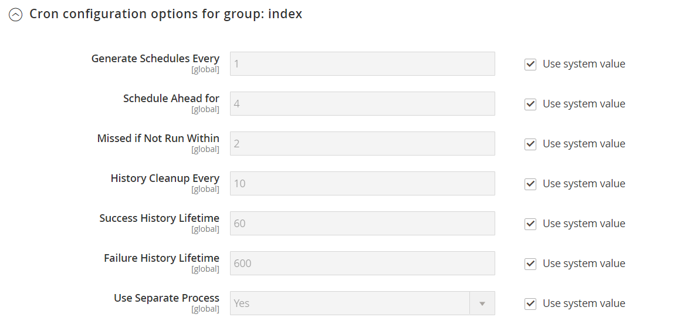

# Cron (tâches planifiées)

Adobe Commerce et Magento Open Source effectuent certaines opérations selon le calendrier en exécutant régulièrement un script. Vous pouvez contrôler l’exécution et la planification des tâches cron Commerce à partir de l’Administration. Les opérations de magasin qui s’exécutent selon un planning cron incluent, sans s’y limiter, les suivantes :

- [E-mail](email-communications.md)
- [Règles de prix de catalogue](../merchandising-promotions/price-rules-catalog.md)
- [Newsletters](../merchandising-promotions/newsletters.md)
- [Génération du plan de site XML](../merchandising-promotions/sitemap-xml.md)
- [Mises à jour des taux de change](../stores-purchase/currency-update.md)
- [Inventory management](../inventory-management/introduction.md)

>[!IMPORTANT]
>
>Les services Commerce doivent être installés dans crontab pour que les composants principaux et certaines extensions tierces fonctionnent comme prévu. Pour plus d’informations sur l’installation des services sur crontab _[&#128279;](https://experienceleague.adobe.com/docs/commerce-operations/installation-guide/next-steps/configuration.html) consultez les instructions du_ Guide d’installation.

En outre, vous pouvez configurer les éléments suivants pour qu’ils s’exécutent selon un planning cron :

- Commander des mises à jour et une réindexation de la grille système
- Durée de vie du paiement en attente

Assurez-vous que les [URL de base](../stores-purchase/store-urls.md) du magasin sont correctement définies, de sorte que les URL générées lors des opérations cron soient correctes. Pour Adobe Commerce sur les infrastructures cloud, consultez la section [Configurer des tâches cron](https://experienceleague.adobe.com/docs/commerce-cloud-service/user-guide/configure/app/properties/crons-property.html) dans le guide _Commerce sur les infrastructures cloud_. Pour On-Premise, voir [Configurer et exécuter l’icône](https://experienceleague.adobe.com/docs/commerce-operations/configuration-guide/cli/configure-cron-jobs.html) dans le _Guide de configuration_.

## Configuration de cron

1. Dans la barre latérale _Admin_, accédez à **[!UICONTROL Stores]** > _[!UICONTROL Settings]_>**[!UICONTROL Configuration]**.

1. Dans le panneau de gauche, développez **[!UICONTROL Advanced]** et choisissez **[!UICONTROL System]**.

1. Développez  la section **[!UICONTROL Cron]** .

   {width="600" zoomable="yes"}

1. Définissez les paramètres suivants pour les groupes **[!UICONTROL Index]** et **[!UICONTROL Default]**.

   Les paramètres sont les mêmes dans chaque section.

   - **[!UICONTROL Generate Schedules Every]** - Définit la fréquence de génération du planning (en minutes). Les plannings sont stockés dans la base de données.
   - **[!UICONTROL Schedule Ahead for]** - Définit la durée d’avance planifiée des tâches cron (en minutes). Par exemple, si ce paramètre est défini sur `10` et que la commande cron s’exécute, les tâches cron sont planifiées pour les 10 prochaines minutes.
   - **[!UICONTROL Missed if not Run Within]** - Définit la durée (en minutes) utilisée pour déterminer un traitement manqué. Si la tâche cron n’est pas exécutée à l’heure planifiée et que le temps spécifié s’écoule, elle ne peut pas être exécutée et son statut est défini sur `Missed`.
   - **[!UICONTROL History Cleanup Every]** - Définit la durée (en minutes) pendant laquelle l&#39;historique des tâches terminées est effacé de la base de données.
   - **[!UICONTROL Success History Lifetime]** - Définit la durée (en minutes) pendant laquelle l’historique des tâches cron avec un statut `Successful` reste dans la base de données.
   - **[!UICONTROL Failure History Lifetime]** - Définit la durée (en minutes) pendant laquelle l’historique des tâches cron avec un statut `Error` reste dans la base de données.
   - **[!UICONTROL Use Separate Process]** - Définit si toutes les tâches cron du groupe sont exécutées dans un processus système distinct. Options : `Yes` / `No`

   {width="600" zoomable="yes"}

1. Cliquez ensuite sur **[!UICONTROL Save Config]**.
