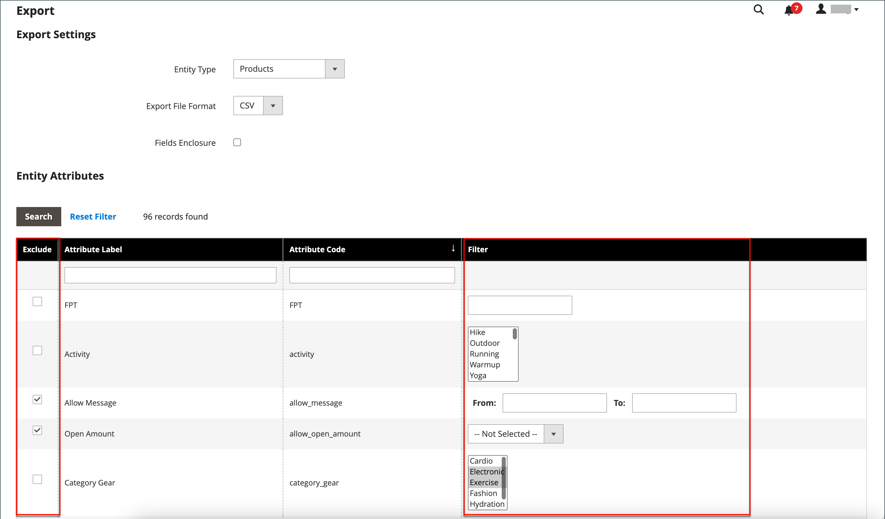

# Exporter les données

La meilleure façon de vous familiariser avec la structure de votre base de données consiste à exporter les données et à les ouvrir dans une feuille de calcul. Une fois que vous vous êtes familiarisé avec le processus, vous pouvez l’utiliser comme un moyen efficace de gérer de grandes quantités d’informations.

Les caractères spéciaux, tels que le signe égal, supérieur et inférieur à, les guillemets simples et doubles, la barre oblique inverse, la barre verticale et les esperluettes, peuvent entraîner des problèmes lors du transfert de données. Pour garantir que ces caractères spéciaux sont correctement interprétés, ils peuvent être marqués comme une _séquence d’échappement_. Par exemple, si les données incluent une chaîne de texte telle que `code="str"`, `code="str2"`, placer le texte entre guillemets doubles garantit que les guillemets doubles d’origine sont compris comme faisant partie des données : `"code="str""`. Lorsque le système rencontre un double ensemble de guillemets doubles, il comprend que l&#39;ensemble externe de guillemets doubles entoure les données réelles.

L&#39;export de données est une opération asynchrone qui s&#39;exécute en arrière-plan afin que vous puissiez continuer à travailler dans l&#39;Admin sans attendre la fin de l&#39;opération. Le système affiche un message lorsque la tâche est terminée.

## Critères d’exportation

Les filtres d’exportation sont utilisés pour spécifier les données à exporter dans le fichier, en fonction de la valeur de l’attribut. En outre, vous pouvez spécifier les données d’attribut à inclure ou à exclure de l’exportation.

{width="600" zoomable="yes"}

### Exporter les filtres

Vous pouvez utiliser des filtres pour déterminer les SKU à inclure dans le fichier d’exportation. Par exemple, si vous saisissez une valeur dans le filtre Pays de fabrication, le fichier CSV exporté inclut uniquement les produits fabriqués dans ce pays.

Le type de filtre correspond au type de données. Pour les champs de date, vous pouvez choisir la date à partir de l’icône Calendrier . Voir [Types d’entrée d’attribut](../catalog/attributes-input-types.md) pour plus d’informations.

Le format de la date est déterminé par le [paramètre régional](../getting-started/store-details.md#locale-options).

Pour inclure uniquement les enregistrements ayant une valeur spécifique, comme un SKU, saisissez la valeur dans le champ Filtrer . Certains champs tels que Prix, Poids et Définir le produit comme nouveau comportent une plage de valeurs de/à.

### Exclure les attributs

La case à cocher de la première colonne est utilisée pour exclure les attributs du fichier d’exportation. Si un attribut est exclu, la colonne associée dans les données d’exportation est incluse, mais vide.

| Exclure | Filtre | Résultat |
|--- |--- |--- |
|  | Non | Le fichier exporté contient chaque attribut pour tous les enregistrements existants. |
|  | Oui | Le fichier d’exportation contient chaque attribut avec uniquement les enregistrements autorisés par le filtre. |
|  | Non | Le fichier d’exportation n’inclut pas la colonne de l’attribut exclu, mais inclut tous les enregistrements existants. |
|  | Oui | Le fichier d’exportation n’inclut pas la colonne de l’attribut exclu et contient uniquement les enregistrements autorisés par le filtre. |

{style="table-layout:auto"}

## Exporter les données

1. Dans la barre latérale _Admin_, accédez à **[!UICONTROL System]** > _[!UICONTROL Data Transfer]_>**[!UICONTROL Export]**.

1. Dans la section _Paramètres d’exportation_, définissez **[!UICONTROL Entity Type]** sur l’une des options suivantes :

   - `Advanced Pricing`
   - `Products`
   - `Customer Finances`
   - `Customers Main File`
   - `Customer Addresses`
   - `Stock Sources`

   {width="600" zoomable="yes"}

1. Acceptez le **[!UICONTROL Export File Format]** par défaut de CSV.

1. Si vous souhaitez placer des caractères spéciaux susceptibles d’être trouvés dans les données sous la forme d’une _séquence d’échappement_, cochez la case **[!UICONTROL Fields Enclosure]**.

1. Si nécessaire, modifiez l’affichage des attributs d’entité.

   Par défaut, la section Attributs d’entité répertorie tous les attributs disponibles par ordre alphabétique. Vous pouvez utiliser les contrôles de liste [list](../getting-started/admin-grid-controls.md) standard pour rechercher des attributs spécifiques et trier la liste. Les contrôles Filtre de recherche et de réinitialisation contrôlent l’affichage de la liste, mais n’ont aucun effet sur la sélection des attributs à inclure dans le fichier d’exportation.

   {width="600" zoomable="yes"}

1. Pour filtrer les données exportées en fonction de la valeur d’attribut, procédez comme suit :

   - Pour n&#39;exporter que les enregistrements ayant des valeurs d&#39;attribut spécifiques, saisissez la valeur requise dans la colonne **[!UICONTROL Filter]**. L’exemple suivant exporte uniquement un SKU spécifique.

   - Pour omettre un attribut de l’exportation, cochez la case **[!UICONTROL Exclude]** au début de la ligne. Par exemple, pour n’exporter que les colonnes `sku` et `image`, cochez la case de tous les autres attributs. La colonne apparaît dans le fichier d’exportation, mais sans aucune valeur.

1. Faites défiler la page vers le bas et cliquez sur **[!UICONTROL Continue]** dans le coin inférieur droit.

   Une fois la tâche terminée, le fichier est traité dans une file d’attente des messages (assurez-vous que la tâche cron est en cours d’exécution). Le fichier exporté est enregistré dans le `var/export/ folder`. Pour plus d’informations sur la file d’attente des messages, voir [Gérer les files d’attente des messages](https://experienceleague.adobe.com/docs/commerce-operations/configuration-guide/message-queues/manage-message-queues.html) dans le _Guide de configuration_.

   Vous pouvez enregistrer ou ouvrir le fichier CSV exporté sous la forme d’une feuille de calcul, puis modifier les données et les importer à nouveau dans votre boutique.

   >[!NOTE]
   >
   >Par défaut, tous les fichiers exportés se trouvent dans le dossier `<Magento-root-directory>/var/export` . Si le module de stockage distant est activé, tous les fichiers exportés se trouvent dans le dossier `<remote-storage-root-directory>/import_export/export`.

## Résolution des problèmes liés aux ressources

Pour obtenir de l’aide sur la résolution des problèmes d’exportation des données, consultez les articles suivants de la base de connaissances de la prise en charge de Commerce :

- [Le fichier .csv des produits exportés n’apparaît pas](https://experienceleague.adobe.com/docs/commerce-knowledge-base/kb/troubleshooting/miscellaneous/exported-products-.csv-file-does-not-appear.html)
