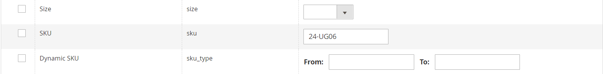

# Importer les prix de niveau

Plutôt que de saisir manuellement les [prix de niveau](../catalog/product-price-tier.md) pour chaque produit, il peut être plus efficace d’[importer](data-import.md) les données de prix. Avant de commencer, créez un exemple de fichier de données de prix de niveau exportées que vous pouvez utiliser comme modèle.

{width="700" zoomable="yes"}

## Étape 1 : Exporter les données de prix de niveau

L’exemple suivant exporte les données de tarification de niveau pour un seul produit. Vous pouvez ensuite utiliser les données exportées comme modèle pour les importations en bloc de données de prix de niveau . Pour en savoir plus sur l&#39;exportation de données de tarification avancée, voir [Données de tarification avancée](data-attributes-product.md#advanced-pricing-attributes).

{width="600" zoomable="yes"}

1. Dans la barre latérale _Admin_, accédez à **[!UICONTROL System]** > _[!UICONTROL Data Transfer]_>**[!UICONTROL Export]**.

1. Sous _[!UICONTROL Export Settings]_, définissez **[!UICONTROL Entity Type]**&#x200B;sur `Advanced Pricing`.

1. Dans la grille de **[!UICONTROL Entity Attributes]**, faites défiler l’écran jusqu’aux attributs de SKU et procédez comme suit :

   - Pour les prix de niveau basés sur un pourcentage de remise, saisissez le SKU de chaque produit à exporter, séparé par une virgule.

     {width="600" zoomable="yes"}

   - Pour les prix de niveau basés sur un montant fixe, saisissez le SKU de chaque produit.

   - Faites défiler vers le bas et cliquez sur **[!UICONTROL Continue]**.

1. Recherchez le fichier d’exportation à l’emplacement de téléchargement de votre navigateur web et ouvrez le fichier.

   {width="600" zoomable="yes"}

**_Données de prix de niveau exportées_**

Les colonnes suivantes sont incluses dans les données exportées :

- `sku`
- `tier_price_website`
- `tier_price_customer_group`
- `tier_price_qty`
- `tier_price`
- `tier_price_value_type`

Vous utilisez les données exportées comme modèle pour importer les données de prix de niveau .

## Etape 2 : Mise à jour des données

1. Mettez à jour les données de prix de niveau pour chaque produit, si nécessaire.

   Tous les produits sans mise à jour des prix du niveau peuvent être supprimés du fichier CSV. Il n’est pas nécessaire de réimporter des produits qui n’ont pas été modifiés.

1. **[!UICONTROL Save]** le fichier CSV mis à jour.

>[!NOTE]
>
>La taille d’un fichier d’importation ne peut pas dépasser 2 Mo.

## Étape 3 : importer les données mises à jour

1. Dans la barre latérale _Admin_, accédez à **[!UICONTROL System]** > _[!UICONTROL Data Transfer]_>**[!UICONTROL Import]**.

1. Sous _Paramètres d’importation_, définissez **[!UICONTROL Entity Type]** sur `Advanced Pricing`.

1. Définissez **[!UICONTROL Import Behavior]** sur `Add/Update`.

1. Sous **[!UICONTROL File to Import]**, cliquez sur **[!UICONTROL Choose File]** et sélectionnez le fichier que vous souhaitez importer depuis votre répertoire .

1. Dans le coin supérieur droit, cliquez sur **[!UICONTROL Check Data]**.

1. Si le fichier est valide, cliquez sur **[!UICONTROL Import]**.

   Sinon, corrigez chaque problème avec les données répertoriées dans le message, puis réessayez d’importer le fichier.
