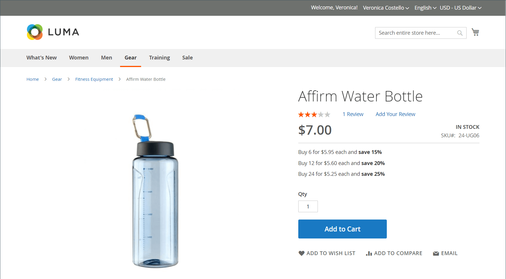

# Prix du niveau d&#39;import

Plutôt que de saisir [prix de détail](../catalog/product-price-tier.md) manuellement pour chaque produit, il peut être plus efficace de [import](data-import.md) les données de tarification. Avant de commencer, créez un fichier d’exemple de données de prix de niveau exporté que vous pouvez utiliser comme modèle.

{width="700" zoomable="yes"}

## Etape 1 : exporter les données de prix du niveau

L’exemple suivant exporte les données de niveau de prix pour un seul produit. Vous pouvez ensuite utiliser les données exportées comme modèle pour les imports en masse de données de prix de niveau. Pour en savoir plus sur l’exportation de données de tarification avancées, voir [Données de tarification avancées](data-attributes-product.md#advanced-pricing-attributes).

{width="600" zoomable="yes"}

1. Activé _Administration_ barre latérale, accédez à  **[!UICONTROL System]** > _[!UICONTROL Data Transfer]_>**[!UICONTROL Export]**.

1. Sous _[!UICONTROL Export Settings]_, définit **[!UICONTROL Entity Type]**to `Advanced Pricing`.

1. Dans le **[!UICONTROL Entity Attributes]** grille, faites défiler l’écran jusqu’aux attributs de SKU et procédez comme suit :

   - Pour les prix de niveau basés sur un pourcentage de réduction, saisissez le SKU de chaque produit à exporter, séparé par une virgule.

     {width="600" zoomable="yes"}

   - Pour les prix de niveau basés sur un montant fixe, saisissez le SKU de chaque produit.

   - Faites défiler la page vers le bas et cliquez sur **[!UICONTROL Continue]**.

1. Recherchez le fichier d’exportation à l’emplacement des téléchargements de votre navigateur web et ouvrez-le.

   {width="600" zoomable="yes"}

**_Données de prix du niveau exporté_**

Les colonnes suivantes sont incluses dans les données exportées :

- `sku`
- `tier_price_website`
- `tier_price_customer_group`
- `tier_price_qty`
- `tier_price`
- `tier_price_value_type`

Vous utilisez les données exportées comme modèle pour importer des données de prix de niveau.

## Etape 2 : mettre à jour les données

1. Mettez à jour les données de prix de niveau pour chaque produit, si nécessaire.

   Tous les produits sans mise à jour des prix de niveau peuvent être supprimés du fichier CSV. Il n’est pas nécessaire de réimporter des produits qui n’ont pas changé.

1. **[!UICONTROL Save]** fichier CSV mis à jour.

>[!NOTE]
>
>La taille d’un fichier d’importation ne peut pas dépasser 2 Mo.

## Etape 3 : Importer les données mises à jour

1. Activé _Administration_ barre latérale, accédez à **[!UICONTROL System]** > _[!UICONTROL Data Transfer]_>**[!UICONTROL Import]**.

1. Sous _Paramètres d’importation_, définit **[!UICONTROL Entity Type]** to `Advanced Pricing`.

1. Définir **[!UICONTROL Import Behavior]** to `Add/Update`.

1. Sous **[!UICONTROL File to Import]**, cliquez sur **[!UICONTROL Choose File]** et sélectionnez le fichier que vous avez préparé à importer à partir de votre répertoire.

1. Dans le coin supérieur droit, cliquez sur **[!UICONTROL Check Data]**.

1. Si le fichier est valide, cliquez sur **[!UICONTROL Import]**.

   Dans le cas contraire, corrigez chaque problème avec les données répertoriées dans le message, puis essayez de réimporter le fichier.
