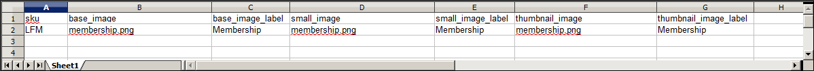

# Importation d’image de produit

Plusieurs images de produit de chaque type peuvent être importées dans Adobe Commerce et Magento Open Source et associées à un produit spécifique. Le chemin d’accès et le nom de fichier de chaque image de produit sont saisis dans le fichier CSV et les fichiers image à importer sont chargés vers le chemin d’accès correspondant sur le serveur Commerce ou le serveur externe.

Commerce crée sa propre structure de répertoires pour les images de produit organisées par ordre alphabétique. Lorsque vous exportez des données de produit avec des images existantes dans un fichier CSV, vous pouvez voir le chemin d’accès alphabétisé devant le nom de fichier de chaque image. Cependant, lorsque vous importez de nouvelles images, il n’est pas nécessaire de spécifier un chemin d’accès, car Commerce gère automatiquement la structure de répertoires. Veillez toutefois à saisir le chemin d’accès relatif au répertoire d’importation avant le nom de fichier de chaque image à importer.

Pour télécharger des images, vous devez disposer des informations de connexion et des autorisations correctes pour accéder au dossier Commerce sur le serveur. Avec les informations d’identification correctes, vous pouvez utiliser n’importe quel utilitaire SFTP pour télécharger les fichiers de votre ordinateur sur le serveur.

Avant d’essayer d’importer de nombreuses images, passez en revue les étapes de la méthode d’importation que vous souhaitez utiliser, puis exécutez le processus avec quelques produits. Une fois que vous aurez compris comment cela fonctionne, vous serez certain d’importer de grandes quantités d’images.

>[!IMPORTANT]
>
>Il est recommandé d’utiliser un programme qui prend en charge le codage UTF-8 pour modifier les fichiers CSV, tels que Notepad++. Microsoft® Excel insère des caractères supplémentaires dans l’en-tête de colonne du fichier CSV, ce qui peut empêcher l’importation des données dans Commerce.

## Méthode 1 : importation d’images à partir du serveur local

1. Sur le serveur Commerce, téléchargez les fichiers image dans la variable `var/import/images` ou un sous-dossier, tel que `var/import/images/product_images`. Il s’agit du dossier racine par défaut pour l’importation d’images de produit.

   ```terminal
   <Magento root folder>/var/import/images
   ```

   >[!NOTE]
   >
   Prise en main d’Adobe Commerce et de Magento Open Source `2.3.2` , chemin spécifié dans la variable **[!UICONTROL Images File Directory]** concatène pour l’importation dans le répertoire de base des images - `<Magento-root-folder>/var/import/images`. Pour les versions antérieures d’Adobe Commerce et de Magento Open Source, vous pouvez utiliser un dossier différent sur le serveur Commerce, à condition que le chemin d’accès au dossier soit spécifié pendant le processus d’importation.

1. Dans les données CSV, saisissez le nom de chaque fichier image à importer sur la ligne appropriée, en `sku`, et dans la colonne appropriée en fonction du type d’image (`base_image`, `small_image`, `thumbnail_image`, ou `additional_images`).

   >[!NOTE]
   >
   Pour les images du dossier d’importation par défaut (`var/import/images`), n’incluez pas le chemin d’accès avant le nom du fichier dans les données CSV.

   Le fichier CSV ne doit inclure que la variable `sku` et les colonnes de l’image associée.

   {width="600" zoomable="yes"}

1. Suivez les instructions de la section [import](data-import.md) les données.

1. Après avoir sélectionné le fichier à importer, saisissez le chemin relatif suivant : **[!UICONTROL Images File Directory]**.

   ```terminal
   var/import/images
   ```

   {width="600" zoomable="yes"}

   >[!TIP]
   >
   Laisser _[!UICONTROL Images File Directory]_vide pour utiliser la variable `<Magento-root-folder>/var/import/images` répertoire . Il s’agit du répertoire de base des images d’importation par défaut, à partir de la version 2.3.2 d’Adobe Commerce et de Magento Open Source.

   Si vous importez plusieurs images pour une seule `sku`, insérez les images dans une colonne nommée `additional_images` (ajoutez la colonne si elle n’est pas déjà ajoutée), séparés par des virgules. Exemple : `image02.jpg,image03.jpg`

## Méthode 2 : importation d’images à partir d’un serveur externe

1. Téléchargez les images à importer dans le dossier désigné sur le serveur externe.

1. Dans les données CSV, saisissez l’URL complète de chaque fichier image dans la colonne appropriée par type d’image (`base_image`, `small_image`, `thumbnail_image`, ou `additional_images`).

   ```terminal
   https://example.com/images/image.jpg
   ```

1. Suivez les instructions de la section [import](data-import.md) les données.

## Méthode 3 : importation d’images avec stockage à distance

1. Dans le module de stockage à distance, téléchargez les fichiers image dans la `var/import/images` ou un sous-dossier, tel que `var/import/images/product_images`. Il s’agit du dossier racine par défaut pour l’importation d’images de produit.

   ```terminal
   <remote-storage-root-folder>/var/import/images
   ```

   >[!NOTE]
   >
   Prise en main d’Adobe Commerce et de Magento Open Source `2.3.2` , chemin spécifié dans la variable _[!UICONTROL Images File Directory]_concatène pour l’importation dans le répertoire de base des images : `<remote-storage-root-folder>/var/import/images`. Pour les versions antérieures d’Adobe Commerce et de Magento Open Source, vous pouvez utiliser un dossier différent sur le serveur Commerce tant que le chemin d’accès au dossier est spécifié pendant le processus d’importation.

1. Dans les données CSV, saisissez le nom de chaque fichier image à importer sur la ligne appropriée, en `sku`, et dans la colonne appropriée en fonction du type d’image (`base_image`, `small_image`, `thumbnail_image`, ou `additional_images`).

   >[!NOTE]
   >
   Pour les images du dossier d’importation par défaut (`var/import/images`), n’incluez pas le chemin d’accès avant le nom du fichier dans les données CSV.

   Le fichier CSV ne doit inclure que la variable `sku` et les colonnes de l’image associée.

   {width="600" zoomable="yes"}

1. Suivez les instructions de la section [import](data-import.md) les données.

1. Après avoir sélectionné le fichier à importer, saisissez le chemin relatif suivant : **[!UICONTROL Images File Directory]**.

   ```terminal
   var/import/images/product_images
   ```

   >[!TIP]
   >
   Laissez le champ _[!UICONTROL Images File Directory]_vide pour utiliser la variable `<Magento-root-folder>/var/import/images` répertoire . Il s’agit du répertoire de base des images d’importation par défaut, à partir de la version 2.3.2 d’Adobe Commerce et de Magento Open Source.

   Si vous importez plusieurs images pour une seule `sku`, insérez les images dans une colonne nommée `additional_images` (ajoutez la colonne si elle n’est pas déjà ajoutée), séparés par des virgules : `image02.jpg,image03.jpg`

Pour plus d’informations sur l’activation et la gestion du module de stockage à distance, voir [Configuration du stockage à distance](https://experienceleague.adobe.com/docs/commerce-operations/configuration-guide/storage/remote-storage/remote-storage.html) dans le _Guide de configuration_.

>[!NOTE]
>
L’importation d’images de produit n’entraîne pas le redimensionnement de l’image. Les images de produit sont redimensionnées sur l’interface par `pub/get.php`. Assurez-vous que la variable `pub/get.php` fonctionne correctement ; dans le cas contraire, les images ne peuvent pas être redimensionnées.
