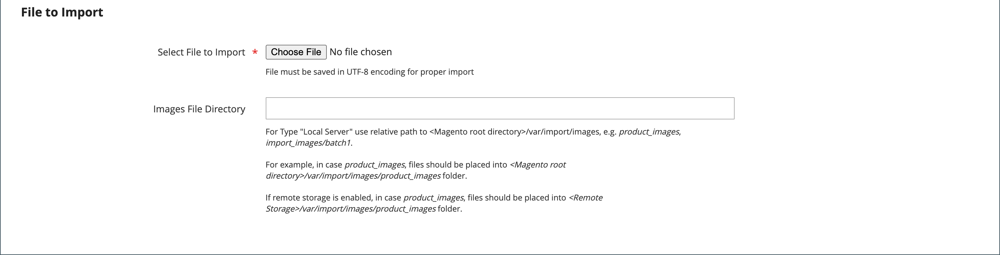

# Import d’images de produit

Plusieurs images de produit de chaque type peuvent être importées dans Adobe Commerce et Magento Open Source et associées à un produit spécifique. Le chemin d’accès et le nom de fichier de chaque image de produit sont saisis dans le fichier CSV et les fichiers d’image à importer sont chargés dans le chemin d’accès correspondant sur le serveur Commerce ou un serveur externe.

Commerce crée sa propre structure de répertoires pour les images de produit, organisée par ordre alphabétique. Lorsque vous exportez des données de produit avec des images existantes dans un fichier CSV, vous pouvez voir le chemin d’accès par ordre alphabétique avant le nom de fichier de chaque image. Cependant, lorsque vous importez de nouvelles images, vous n’avez pas besoin de spécifier de chemin d’accès, car Commerce gère automatiquement la structure des répertoires. Veillez toutefois à saisir le chemin d’accès relatif au répertoire d’importation avant le nom de fichier de chaque image à importer.

Pour charger des images, vous devez disposer des informations de connexion et des autorisations appropriées pour accéder au dossier Commerce sur le serveur. Avec les informations d’identification correctes, vous pouvez utiliser n’importe quel utilitaire SFTP pour charger les fichiers de votre ordinateur de bureau vers le serveur.

Avant d’essayer d’importer de nombreuses images, passez en revue les étapes de la méthode d’importation que vous souhaitez utiliser, puis exécutez le processus avec quelques produits. Une fois que vous aurez compris comment cela fonctionne, vous serez sûr d’importer de grandes quantités d’images.

>[!IMPORTANT]
>
>Il est recommandé d’utiliser un programme qui prend en charge le codage UTF-8 pour modifier les fichiers CSV, tels que le Bloc-notes++. ® Excel insère des caractères supplémentaires dans l’en-tête de colonne du fichier CSV, ce qui peut empêcher la réimportation des données dans Commerce.

## Méthode 1 : import d’images depuis le serveur local

1. Sur le serveur Commerce, chargez les fichiers image dans le dossier `var/import/images` ou dans un sous-dossier, tel que `var/import/images/product_images`. Il s’agit du dossier racine par défaut pour l’importation des images du produit.

   ```
   <Magento root folder>/var/import/images
   ```

   >[!NOTE]
   >
   >À partir de la version Adobe Commerce et Magento Open Source `2.3.2`, le chemin spécifié dans le **[!UICONTROL Images File Directory]** se concatène pour l’importation dans le répertoire de base des images - `<Magento-root-folder>/var/import/images`. Pour les versions antérieures d’Adobe Commerce et de Magento Open Source, vous pouvez utiliser un dossier différent sur le serveur Commerce, à condition que le chemin d’accès au dossier soit spécifié pendant le processus d’importation.

1. Dans les données CSV, saisissez le nom de chaque fichier image à importer sur la ligne appropriée, par `sku`, et dans la colonne appropriée en fonction du type d’image (`base_image`, `small_image`, `thumbnail_image` ou `additional_images`).

   >[!NOTE]
   >
   >Pour les images se trouvant dans le dossier d’importation par défaut (`var/import/images`), n’incluez pas le chemin d’accès précédant le nom de fichier dans les données CSV.

   Le fichier CSV ne doit inclure que la colonne `sku` et les colonnes d’image associées.

   {width="600" zoomable="yes"}

1. Suivez les instructions pour [importer](data-import.md) les données.

1. Après avoir sélectionné le fichier à importer, saisissez le chemin d’accès relatif suivant **[!UICONTROL Images File Directory]**.

   ```
   var/import/images
   ```

   {width="600" zoomable="yes"}

   >[!TIP]
   >
   >Laissez _[!UICONTROL Images File Directory]_&#x200B;vide pour utiliser le répertoire `<Magento-root-folder>/var/import/images`. À partir de la version 2.3.2 d’Adobe Commerce et Magento Open Source, il s’agit du répertoire de base d’importation par défaut des images.

   Si vous importez plusieurs images pour une même `sku`, insérez les images dans une colonne intitulée `additional_images` (ajoutez la colonne si ce n’est pas déjà fait), séparée par des virgules. Exemple : `image02.jpg,image03.jpg`

## Méthode 2 : Importer des images depuis un serveur externe

1. Chargez les images à importer dans le dossier désigné sur le serveur externe.

1. Dans les données CSV, saisissez l’URL complète de chaque fichier image dans la colonne appropriée par type d’image (`base_image`, `small_image`, `thumbnail_image` ou `additional_images`).

   ```
   https://example.com/images/image.jpg
   ```

1. Suivez les instructions pour [importer](data-import.md) les données.

## Méthode 3 : Importer des images avec stockage à distance

1. Dans le module de stockage étendu, chargez les fichiers image dans le dossier `var/import/images` ou dans un sous-dossier, tel que `var/import/images/product_images`. Il s’agit du dossier racine par défaut pour l’importation des images du produit.

   ```bash
   <remote-storage-root-folder>/var/import/images
   ```

   >[!NOTE]
   >
   >À partir de la version Adobe Commerce et Magento Open Source `2.3.2`, le chemin spécifié dans le _[!UICONTROL Images File Directory]_&#x200B;se concatène pour être importé dans le répertoire de base des images : `<remote-storage-root-folder>/var/import/images`. Pour les versions antérieures d’Adobe Commerce et de Magento Open Source, vous pouviez utiliser un dossier différent sur le serveur Commerce à condition que le chemin d’accès au dossier soit spécifié pendant le processus d’importation.

1. Dans les données CSV, saisissez le nom de chaque fichier image à importer sur la ligne appropriée, par `sku`, et dans la colonne appropriée en fonction du type d’image (`base_image`, `small_image`, `thumbnail_image` ou `additional_images`).

   >[!NOTE]
   >
   >Pour les images se trouvant dans le dossier d’importation par défaut (`var/import/images`), n’incluez pas le chemin d’accès précédant le nom de fichier dans les données CSV.

   Le fichier CSV ne doit inclure que la colonne `sku` et les colonnes d’image associées.

   {width="600" zoomable="yes"}

1. Suivez les instructions pour [importer](data-import.md) les données.

1. Après avoir sélectionné le fichier à importer, saisissez le chemin d’accès relatif suivant **[!UICONTROL Images File Directory]**.

   ```
   var/import/images/product_images
   ```

   >[!TIP]
   >
   >Laissez le _[!UICONTROL Images File Directory]_&#x200B;vide pour utiliser le répertoire `<Magento-root-folder>/var/import/images`. À partir de la version 2.3.2 d’Adobe Commerce et Magento Open Source, il s’agit du répertoire de base d’importation par défaut des images.

   Si vous importez plusieurs images pour une même `sku`, insérez les images dans une colonne intitulée `additional_images` (ajoutez la colonne si ce n&#39;est pas déjà fait), séparée par des virgules : `image02.jpg,image03.jpg`

Pour plus d’informations sur l’activation et la gestion du module de stockage distant, voir [Configurer le stockage distant](https://experienceleague.adobe.com/docs/commerce-operations/configuration-guide/storage/remote-storage/remote-storage.html?lang=fr) dans le _Guide de configuration_.

>[!NOTE]
>
>L’importation d’images de produit ne lance pas le redimensionnement de l’image. Les images du produit sont redimensionnées sur le front-end par `pub/get.php`. Assurez-vous que votre `pub/get.php` fonctionne correctement ; dans le cas contraire, les images risquent de ne pas être redimensionnées.
