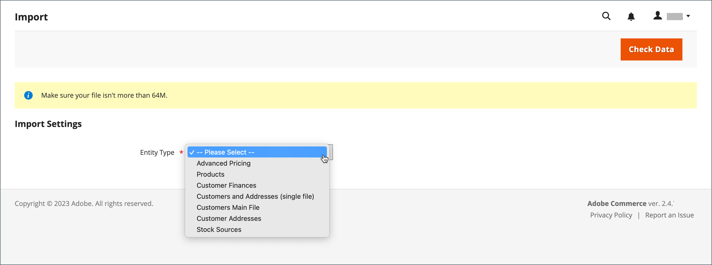

# Importer des données

Les données de tous les types de produits peuvent être importées dans le magasin. En outre, vous pouvez importer des produits, des données de tarification avancées, des données sur les clients, des données sur l’adresse du client et des images de produits. L’import prend en charge les opérations suivantes :

- Ajouter/Mettre à jour
- Remplacer
- Supprimer

## Instructions d’importation

### Nouvelles entités

- Les entités sont ajoutées avec les valeurs d’attribut spécifiées dans le fichier CSV.
- Pour un attribut obligatoire sans valeur par défaut définie, l’entité (la ou les lignes correspondantes) ne peut pas être importée si aucune valeur ou une valeur non valide n’est définie.
- Pour un attribut obligatoire avec une valeur par défaut définie, l’entité (la ou les lignes correspondantes) est importée et la valeur par défaut est définie pour l’attribut s’il n’existe aucune valeur ou si la valeur n’est pas valide.
- Si les données complexes ne sont pas valides, l’entité (la ou les lignes correspondantes) ne peut pas être importée.

### Entités existantes

- Pour les attributs qui ne sont pas des données complexes, les valeurs du fichier d’importation, y compris les valeurs vides pour les attributs non requis, remplacent les valeurs existantes.
- S’il n’existe pas de valeur ou si une valeur n’est pas valide pour un attribut obligatoire, la valeur existante n’est pas remplacée.
- Si les données complexes de l’entité ne sont pas valides, l’entité (la ou les lignes correspondantes) ne peut pas être importée, sauf dans le cas où l’option Supprimer les entités a été sélectionnée dans le menu déroulant Comportement d’importation.

### Données complexes

Si un attribut spécifié dans le fichier d’importation existe et que sa valeur est dérivée d’un ensemble de valeurs défini, les conditions suivantes s’appliquent :

- Si la valeur n’est pas déjà incluse dans l’ensemble de valeurs défini, la ligne peut être importée et une valeur par défaut, si elle est définie, est définie pour l’attribut .
- Si la valeur est déjà incluse dans l’ensemble défini, la ligne correspondante ne peut pas être importée.
- Si le fichier d&#39;import spécifie un nom d&#39;attribut qui n&#39;est pas encore défini dans le système, il n&#39;est pas créé et ses valeurs ne sont pas importées.

### Fichiers non valides

- Un fichier ne peut pas être importé si toutes les lignes ne sont pas valides.
- Une donnée de service non existante ou un nom de données complexe est spécifié dans le fichier d’importation, par exemple une colonne avec un en-tête `_<non-existing name>`.

Le processus d’importation Adobe Commerce peut ne pas reconnaître correctement les fichiers codés en UTF-8 qui utilisent une marque d’ordre d’octet (BOM). Les fichiers contenant une nomenclature peuvent entraîner des problèmes ou des échecs pendant le processus d&#39;importation.

## Opérations d’importation

| Opération | Description |
| --------- | ----------- |
| Ajouter/Mettre à jour | De nouvelles données de produit sont ajoutées aux données de produit existantes pour les entrées existantes dans la base de données. Tous les champs, à l&#39;exception de `sku`, peuvent être mis à jour.  Les nouvelles classes de taxe spécifiées dans les données d&#39;import sont créées automatiquement.  Les nouvelles catégories de produits spécifiées dans le fichier d’importation sont créées automatiquement.  Les nouveaux SKU spécifiés dans le fichier d’importation sont créés automatiquement   **_Remarque :_**&#x200B;Pour les produits, vous pouvez mettre à jour tous les champs, à l’exception de la SKU par le biais d’un import.  **_Important :_** Plusieurs valeurs de champ, telles que des sites web ou des catégories, ne peuvent pas être supprimées à l’aide du comportement d’importation _Ajouter/Mettre à jour_. Ces champs restent dans la base de données après l’importation s’ils ne sont pas répertoriés dans le fichier CSV. |
| Remplacer | Les données de produit existantes sont remplacées par de nouvelles données.  **_Important :_**&#x200B;Soyez prudent lorsque vous remplacez des données, car les données de produit existantes sont effacées et toutes les références dans le système sont perdues.  Si un SKU dans les données d’importation correspond au SKU d’une entité existante, tous les champs, y compris le SKU, sont supprimés et un nouvel enregistrement est créé à l’aide des données CSV. Une erreur se produit si le fichier CSV référence un SKU qui n’existe pas dans la base de données. Vous pouvez Vérifier les données pour afficher les erreurs. |
| Supprimer | Toutes les entités présentes dans la base de données des imports sont supprimées de la base de données.  Supprimer ignore toutes les colonnes des données d’importation, à l’exception de la SKU. Vous pouvez ignorer tous les autres attributs dans les données.  Une erreur se produit si le fichier CSV référence un SKU qui n’existe pas dans la base de données. Vous pouvez Vérifier les données pour afficher les erreurs. |

{style="table-layout:auto"}

## Processus d’importation

La taille du fichier d’importation est déterminée par les paramètres du fichier `php.ini` sur le serveur. Le message système sur la page _Import_ indique la taille limite actuelle. La taille par défaut est de 2 Mo.

Les caractères spéciaux (tels que le signe égal, les symboles supérieur et inférieur à, les guillemets simples et doubles, la barre oblique inverse, la barre verticale et l’esperluette) peuvent entraîner des problèmes lors du transfert des données. Pour s’assurer que ces caractères spéciaux sont correctement interprétés, ils peuvent être marqués comme une _séquence d’échappement_. Par exemple, si les données incluent une chaîne de texte telle que `code="str"`, `code="str2"`, le choix de placer le texte entre guillemets doubles garantit que les guillemets doubles originaux sont compris comme faisant partie des données. Lorsque le système rencontre un jeu de guillemets doubles, il comprend que l’ensemble externe de guillemets doubles renferme les données réelles.

Lors de l’importation de données de produit, de nouvelles données de produit sont ajoutées aux entrées de données de produit existantes dans la base de données. Tous les champs, à l’exception du SKU, peuvent être mis à jour par le biais de l’importation. Toutes les données de produit existantes sont remplacées par les nouvelles données importées. Soyez prudent lorsque vous remplacez des données. Toutes les données de produit existantes sont effacées et toutes les références du système sont perdues.

{width="600" zoomable="yes"}

### Etape 1 : Préparation des données

1. Sur la barre latérale _Admin_, accédez à **[!UICONTROL System]** > _[!UICONTROL Data Transfer]_>**[!UICONTROL Import]**.

1. Sous _Paramètres d’importation_, définissez **[!UICONTROL Entity Type]** sur l’un des paramètres suivants :

   - `Advanced Pricing`
   - `Products`
   - `Customer Finances`
   - `Customers and Addresses`
   - `Customers Main File`
   - `Customer Addresses`
   - `Stock Sources`

1. Cliquez sur **[!UICONTROL Download Sample File]**.

1. Recherchez le fichier d’exportation à l’emplacement des téléchargements de votre navigateur web et ouvrez-le.

   Le fichier d’exemple comprend des en-têtes de colonne avec des données d’espace réservé pour les types de produits.

   {width="600" zoomable="yes"}

1. Examinez la structure du fichier d’exemple et utilisez-le pour préparer votre fichier d’importation CSV, en vous assurant que les en-têtes de colonne sont correctement orthographiés.

1. Vérifiez que la taille du fichier d’importation ne dépasse pas la limite indiquée dans le message.

   {width="600"}

1. Si les données d’importation incluent des chemins d’accès aux images de produit, assurez-vous que les fichiers image ont été chargés à l’emplacement approprié.

   L’emplacement par défaut sur le serveur Commerce est : `pub/media/import`.

   Si les images résident sur un serveur externe, vérifiez que vous disposez de l’URL complète vers le répertoire contenant les images.

### Etape 2 : Choix du comportement d&#39;import

{width="600" zoomable="yes"}

1. Définissez **[!UICONTROL Import Behavior]** sur l’une des options suivantes :

   - `Add/Update` (Pour les produits, vous pouvez mettre à jour tous les champs à l’exception de SKU par le biais d’un import.)
   - `Replace`
   - `Delete`

1. Pour déterminer ce qui se produit lorsqu’une erreur se produit lors de l’import de données, sélectionnez l’une des options suivantes :

   - `Stop on Error`
   - `Skip error entries`

1. Pour **[!UICONTROL Allowed Errors Count]**, saisissez le nombre d’erreurs qui peuvent se produire avant l’annulation de l’importation.

   La valeur par défaut est 10.

1. Acceptez la valeur par défaut d’une virgule (`,`) pour **[!UICONTROL Field separator]**.

1. Acceptez la valeur par défaut d’une virgule (`,`) pour **[!UICONTROL Multiple value separator]**.

   Dans un fichier CSV, une virgule est le séparateur par défaut. Pour utiliser un autre caractère, assurez-vous que les données du fichier CSV correspondent au caractère que vous avez spécifié.

1. Acceptez la valeur par défaut `_EMPTY_VALUE_` pour **[!UICONTROL Empty attribute value constant]**.

1. Si vous souhaitez placer dans les données des caractères spéciaux comme _séquence d’échappement_, cochez la case **[!UICONTROL Fields Enclosure]** .

### Étape 3 : identification du fichier d’importation

{width="600" zoomable="yes"}

1. Cliquez sur **[!UICONTROL Choose File]** pour sélectionner le fichier à importer.

1. Recherchez le fichier CSV que vous avez préparé à importer, puis cliquez sur **[!UICONTROL Open]**.

1. Pour **[!UICONTROL Images File Directory]**, saisissez le chemin relatif de l’emplacement sur le serveur Commerce où sont stockées les images téléchargées.

   Par exemple : `product_images`.

   >[!NOTE]
   >
   >À partir de la version Adobe Commerce et Magento Open Source `2.3.2`, le chemin spécifié dans _[!UICONTROL Images File Directory]_&#x200B;concatène pour l’importation dans le répertoire de base des images : `<Magento-root-folder>/var/import/images`. Par exemple, placez les fichiers `product_images` dans le dossier `<Magento-root-directory>/var/import/images/product_images`. Le répertoire de base des images d&#39;import peut être configuré dans le fichier `\Magento\ImportExport\etc\config.xml`. Si le module de stockage à distance est activé, importez les fichiers dans le dossier `<remote-storage-root-directory>/var/import/images/product_images`.

   Pour en savoir plus sur l&#39;import d&#39;images de produit, voir [Importation d&#39;images de produit](data-import-product-images.md).

### Etape 4 : Vérification des données d&#39;import

1. Dans le coin supérieur droit, cliquez sur **[!UICONTROL Check Data]**.

1. Patientez quelques instants avant que le processus de validation soit terminé.

   Si les données d&#39;import sont valides, le message suivant s&#39;affiche :

   {width="600"}

1. Si le fichier est valide, cliquez sur **[!UICONTROL Import]**.

   Dans le cas contraire, corrigez chaque problème avec les données répertoriées dans le message, puis essayez de réimporter le fichier.

1. Le processus d&#39;import se poursuit jusqu&#39;à la fin des données, sauf si une erreur s&#39;est produite.

   Si un message d’erreur s’affiche dans les résultats de validation, corrigez le problème dans les données et importez à nouveau le fichier.

   {width="600"}

   Un message s’affiche lorsque l’importation est terminée.

## Historique des imports

Commerce conserve un enregistrement des données importées dans votre boutique, notamment la date et l’heure de début, l’utilisateur, l’heure d’exécution et un lien vers le fichier importé. Le _temps d’exécution_ correspond à la durée du processus d’importation.

**_Pour afficher l&#39;historique des imports :_**

Sur la barre latérale _Admin_, accédez à **[!UICONTROL System]** > _[!UICONTROL Data Transfer]_>**[!UICONTROL Import History]**.

{width="600" zoomable="yes"}

>[!NOTE]
>
>Par défaut, les fichiers d’historique d’importation se trouvent dans le dossier `<Magento-root-directory>/var/import_history` . Si le module de stockage distant est activé, les fichiers d’historique d’importation se trouvent dans le dossier `<remote-storage-root-directory>/import_export/import_history` .

| Champ | Description |
|--- |--- |
| [!UICONTROL ID] | Numéro interne utilisé pour désigner un transfert. |
| [!UICONTROL Start Date & Time] | Date et heure précises auxquelles le transfert a eu lieu. |
| [!UICONTROL User] | Le client qui a effectué le transfert. |
| [!UICONTROL Imported file] | Lien de téléchargement du fichier importé. |
| [!UICONTROL Error file] | Le fichier d’erreur correspondant. |
| [!UICONTROL Execution Time] | Intervalle horaire du processus d’importation. |
| [!UICONTROL Summary] | Nombre d’éléments créés, mis à jour et supprimés ou message d’erreur. |

{style="table-layout:auto"}

Pour télécharger le fichier _Imported/Error_, cliquez sur **[!UICONTROL Download]**.
