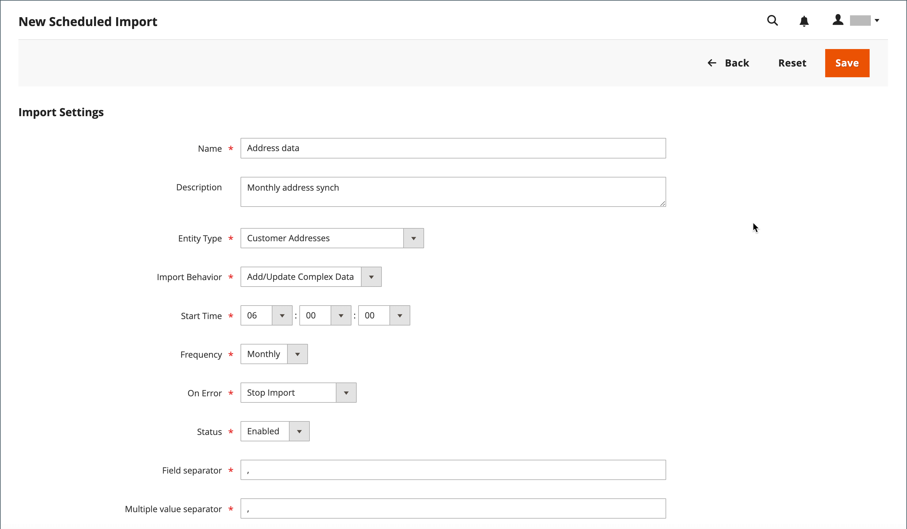

# Import et export planifiés

{{ee-feature}}

Les imports et exports planifiés peuvent être exécutés tous les jours, toutes les semaines ou tous les mois. Les fichiers à importer ou exporter peuvent résider sur des serveurs Adobe Commerce locaux ou sur des serveurs FTP distants. L’import/export planifié est implémenté par défaut et ne nécessite pas de configuration supplémentaire. Toutes les importations et exportations planifiées sont gérées par le planificateur de tâches cron.

## Accéder à l’import/export planifié

1. Dans la barre latérale _Admin_, accédez à **[!UICONTROL System]** > _[!UICONTROL Data Transfer]_>**[!UICONTROL Scheduled Imports/Exports]**.

   {width="700" zoomable="yes"}

1. Pour créer une tâche d’importation ou d’exportation planifiée, cliquez sur le bouton approprié et suivez les instructions correspondant au type de tâche planifiée.

   - [Ajouter une exportation planifiée](#schedule-an-export)
   - [Ajouter une importation planifiée](#schedule-an-import)

1. Lorsque l’enregistrement est enregistré, la tâche apparaît dans la grille de _[!UICONTROL Scheduled Import/Export]_.

   >[!NOTE]
   >
   >Lorsque vous créez ou mettez à jour une importation/exportation planifiée, cela entraîne une modification de la configuration du système. Après l’enregistrement, veillez à adresser l’avis d’invalidation du cache qui s’affiche en haut de la page Admin et à vider le cache afin d’appliquer le planning nouveau ou mis à jour.

1. [!BADGE PaaS uniquement]{type=Informative url="https://experienceleague.adobe.com/fr/docs/commerce/user-guides/product-solutions" tooltip="S’applique uniquement aux projets Adobe Commerce on Cloud (infrastructure PaaS gérée par Adobe) et aux projets On-premise."} Après chaque traitement planifié, une copie du fichier est placée dans le répertoire `var/log/import_export` du serveur local Adobe Commerce.

   Les détails de chaque opération ne sont pas écrits dans le journal. Si une erreur se produit, une notification est envoyée concernant la tâche d’importation/exportation ayant échoué, avec une description de l’erreur.

## Planification d’un import

Pour le format de fichier d&#39;import et les types d&#39;entités d&#39;import disponibles, le processus d&#39;import planifié est similaire au processus d&#39;import manuel :

- Le fichier d’importation doit être au format .CSV
- Vous pouvez importer des données sur les produits et les clients

L’avantage de l’utilisation de l’importation planifiée est que vous pouvez importer automatiquement un fichier de données plusieurs fois après avoir spécifié les paramètres d’importation et planifier une seule fois.

Les détails de chaque opération d’importation ne sont pas écrits dans un journal, mais en cas d’échec, vous recevez un e-mail _Échec de l’importation_ avec une description de l’erreur. Le résultat de la dernière tâche d’importation planifiée s’affiche dans la colonne Dernier résultat de la page Importation/exportation planifiée .

[!BADGE PaaS uniquement]{type=Informative url="https://experienceleague.adobe.com/fr/docs/commerce/user-guides/product-solutions" tooltip="S’applique uniquement aux projets Adobe Commerce on Cloud (infrastructure PaaS gérée par Adobe) et aux projets On-premise."} Après chaque opération d’import, une copie du fichier d’import est placée dans le répertoire `var/log/import_export` sur le serveur sur lequel Adobe Commerce ou Magento Open Source est déployé. La date et l’heure, le marqueur de l’entité importée (produits ou clients) et le type de l’opération (dans ce cas, importation) sont ajoutés au nom du fichier d’importation.

Après chaque tâche d’importation planifiée, une opération de réindexation est automatiquement effectuée. Sur le front-end, les modifications apportées aux descriptions et aux autres informations textuelles sont reflétées une fois que les données mises à jour sont envoyées dans la base de données, et les modifications de prix ne sont reflétées qu’après l’opération de réindexation.

### Étape 1 : définition des paramètres d’importation

1. Dans la barre latérale _Admin_, accédez à **[!UICONTROL System]** > _[!UICONTROL Data Transfer]_>**[!UICONTROL Scheduled Import/Export]**.

1. Dans le coin supérieur droit, cliquez sur **[!UICONTROL Add Scheduled Import]**.

1. Définissez les options de planification et d’importation :

   - **[!UICONTROL Name]** — Saisissez un nom pour l&#39;importation planifiée.

   - **[!UICONTROL Description]** — Saisissez une brève description qui explique l&#39;objectif de l&#39;importation et son utilisation.

   - **[!UICONTROL Entity Type]** — Définissez l&#39;une des options suivantes :

      - `Products`
      - `Advanced Pricing`
      - `Customers and Addresses (single file)`
      - `Customer Addresses`
      - `Customer Finances`
      - `Customers Main File`
      - `Stock Sources`

   - **[!UICONTROL Import Behavior]** — Définissez l&#39;une des options suivantes :

      - `Add/Update Complex Data` — Ajoute ou met à jour de nouvelles données complexes aux données complexes existantes pour les entrées existantes dans la base de données. Il s’agit de la valeur par défaut.
      - `Replace` — Écrit sur le complexe existant pour les entités existantes dans la base de données.
      - `Delete Entities` — Supprime les entrées existantes dans la base de données.
      - `Custom Action` - Personnalise les entités existantes dans la base de données.

     >[!NOTE]
     >
     >Pour les types d&#39;entités _[!UICONTROL Advanced Pricing]_,_[!UICONTROL Products]_, _[!UICONTROL Customers and Addresses (single file)]_&#x200B;et&#x200B;_[!UICONTROL Stock Sources]_, les comportements d&#39;import suivants s&#39;affichent : `Add/Update`, `Replace` et `Delete`. Pour les types d’entités _Finances client_, _Fichier principal des clients_ et _Clients et adresses_, les comportements d’importation suivants s’affichent : `Add/Update Complex Data`, `Delete Entities` et `Custom Action`.

   - **[!UICONTROL Start Time]** — Définit sur l&#39;heure, la minute et la seconde où l&#39;importation doit commencer.

   - **[!UICONTROL Frequency]** — Définissez l&#39;une des options suivantes : `Daily`, `Weekly` ou `Monthly`

   - **[!UICONTROL On Error]** - Définissez l’une des options suivantes : `Stop Import` ou `Continue Processing`

   - **[!UICONTROL Status]** : pour activer l&#39;importation planifiée, définissez sur `Enabled`.

   - **[!UICONTROL Field Separator]** — Saisissez le caractère utilisé pour séparer les champs dans le fichier d&#39;importation. Le caractère par défaut est une virgule.

   - **[!UICONTROL Multiple Value Separator]** — Saisissez le caractère utilisé pour séparer plusieurs valeurs dans un champ.

   {width="600" zoomable="yes"}

### Étape 2 : remplir les informations sur le fichier d&#39;importation

1. Définissez **[!UICONTROL Server Type]** sur l’une des options suivantes :

   - `Local Server` - Importe les données du même serveur sur lequel Adobe Commerce est installé.
   - `Remote FTP` - Importe les données d’un serveur distant.

   {width="600" zoomable="yes"}

   >[!NOTE]
   >
   >Lorsque le module de stockage distant est activé, `Local Server` bascule automatiquement sur `Remote Storage`.

1. Saisissez le **[!UICONTROL File Directory]** d’où provient le fichier d’importation.

   - `Local Server` - Saisissez un chemin d’accès relatif dans l’installation de Commerce. Par exemple, `var/import`. Si le module de stockage distant est configuré, utilisez `import_export/import`.
   - `Remote FTP server` - Saisissez l’URL complète et le chemin d’accès au dossier d’importation sur le serveur distant.

1. Saisissez le **[!UICONTROL File Name]** à importer.

1. Par **[!UICONTROL Images File Directory]**, saisissez le chemin d’accès au répertoire dans lequel les images du produit sont stockées.

   Sur un serveur local, saisissez un chemin d’accès relatif, tel que : `var/import`. Sur un stockage distant, entrez un chemin relatif tel que : `import_export/import` ou `import_export/import/some/dir`.

### Étape 3 : configurer les e-mails ayant échoué à l’importation

{width="600" zoomable="yes"}

1. Définissez **[!UICONTROL Failed Email Receiver]** sur le contact du magasin qui doit recevoir une notification en cas d’erreur lors de l’importation.

1. Définissez **[!UICONTROL Failed Email Sender]** sur le contact du magasin qui apparaît comme expéditeur de la notification.

1. Définissez **[!UICONTROL Failed Email Template]** sur le modèle utilisé pour la notification.

1. Par **[!UICONTROL Send Failed Email Copy To]**, saisissez l’adresse e-mail de la personne qui doit recevoir une copie de la notification.

   Séparez plusieurs adresses e-mail par une virgule.

1. Définissez **[!UICONTROL Failed Email Copy Method]** sur l’une des options suivantes :

   - `Bcc` - Envoie une copie de courtoisie invisible de la notification d’échec de l’importation. Le nom et l’adresse du destinataire sont inclus dans la distribution e-mail d’origine, mais masqués de la vue.
   - `Separate Email` - Envoie une copie de la notification d’échec d’importation dans un e-mail distinct.

1. Cliquez ensuite sur **[!UICONTROL Save]**.

   La nouvelle tâche d’importation planifiée est ajoutée à la liste sur la page _[!UICONTROL Scheduled Import/Export]_. À partir de cette page, vous pouvez l’exécuter immédiatement à des fins de test et de modification. Le fichier d’import est validé avant l’exécution de chaque traitement d’import.

>[!NOTE]
>
>Lorsque vous créez ou mettez à jour une importation/exportation planifiée, cela entraîne une modification de la configuration du système. Après l’enregistrement, veillez à adresser l’avis d’invalidation du cache qui s’affiche en haut de la page Admin et à vider le cache afin d’appliquer le planning nouveau ou mis à jour.

### Descriptions des champs

#### [!UICONTROL Import Settings]

| Champ | Description |
| ----- | ----------- | 
| [!UICONTROL Name] | Nom de l’importation. Permet de le distinguer si de nombreuses importations planifiées différentes sont créées. |
| [!UICONTROL Description] | (Facultatif) Vous pouvez saisir une description. |
| [!UICONTROL Entity Type] | Définit les données à importer. |
| [!UICONTROL Import Behavior] | Définit la manière dont les données complexes sont traitées si les entités importées existent dans la base de données. Les données complexes relatives aux produits incluent les catégories, les sites web, les options personnalisées, les prix par niveau, les produits associés, les ventes incitatives, les ventes croisées et les données de produits associées. Les données complexes pour les clients incluent les adresses . Options :  **[!UICONTROL Add/Update Complex Data]**- Les nouvelles données complexes sont ajoutées ou mises à jour dans les données complexes existantes pour les entrées existantes dans la base de données. Il s’agit de la valeur par défaut. **[!UICONTROL Add/Update]** - Les nouvelles données sont ajoutées aux entrées existantes dans la base de données. Tous les champs sauf `sku` peuvent être mis à jour pour les produits. Toutes les valeurs de champ multiples qui ne sont pas répertoriées dans le fichier CSV, telles que des catégories ou des sites web, restent dans la base de données après l’importation. **[!UICONTROL Replace]**- Les données complexes existantes pour les entités existantes sont remplacées. **[!UICONTROL Delete Entities]** - Si des entités importées existent dans la base de données, elles sont supprimées de la base de données. **[!UICONTROL Custom Action]**- Les entités complexes existantes sont personnalisées pendant le processus d’importation. |
| [!UICONTROL Start Time] | Définissez l’heure, les minutes et les secondes de début de l’importation. |
| [!UICONTROL Frequency] | Définissez la fréquence d’exécution de l’importation. Options : `Daily` / `Weekly` / `Monthly` |
| [!UICONTROL On Error] | Définissez le comportement du système en cas d’erreur lors de la validation du fichier. Options: **Arrêter l&#39;importation** — Le fichier n&#39;est pas importé si des erreurs sont détectées pendant la validation. Il s’agit de la valeur par défaut. **Poursuivre le traitement** - Si des erreurs sont détectées lors de la validation, mais que l’importation est possible, le fichier est importé. |
| [!UICONTROL Status] | L’importation est activée par défaut. Vous pouvez le suspendre en définissant le Statut sur `Disabled`. |
| [!UICONTROL Field Separator] | Détermine le caractère utilisé pour séparer les champs. Valeur par défaut : `,` (virgule) |
| [!UICONTROL Multiple Value Separator] | Détermine le caractère utilisé pour séparer plusieurs valeurs dans un champ. Valeur par défaut : `,` (virgule) |

{style="table-layout:auto"}

#### [!UICONTROL Import File Information]

| Champ | Description |
| ----- | ----------- | 
| [!UICONTROL Server Type] | Vous pouvez effectuer une importation à partir d’un fichier sur le serveur sur lequel Commerce est déployé (sélectionnez `Local Server`) ou à partir du serveur FTP distant (sélectionnez `Remote FTP`). Si vous sélectionnez _[!UICONTROL Remote FTP]_, des options supplémentaires pour les informations d’identification et les paramètres de transfert de fichiers s’affichent. Si le module de stockage distant est activé, `Local Server` type passe automatiquement à `Remote Storage`. |
| [!UICONTROL File Directory] | Indiquez le répertoire dans lequel se trouve le fichier d’importation. Si Type de serveur est défini sur _[!UICONTROL Local Server]_, spécifiez le chemin d’accès relatif au répertoire d’installation de Commerce. Par exemple : `var/import` ou `import_export/import` pour le stockage distant. |
| [!UICONTROL File Name] | Indiquez le nom du fichier d’importation. |
| [!UICONTROL Images File Directory] | Saisissez le chemin d’accès au répertoire dans lequel les images du produit sont stockées. Pour un serveur local, entrez un chemin relatif. Par exemple : `var/import` ou `import_export/import` pour le stockage distant. |

{style="table-layout:auto"}

#### [!UICONTROL Import Failed Emails]

| Champ | Description |
| ----- | ----------- | 
| [!UICONTROL Failed Email Receiver] | Indiquez l’adresse e-mail à laquelle une notification par e-mail (e-mail d’échec de l’importation) est envoyée en cas d’échec de l’importation. |
| [!UICONTROL Failed Email Sender] | Indiquez l’adresse e-mail utilisée comme expéditeur de l’e-mail d’échec de l’importation. |
| [!UICONTROL Failed Email Template] | Sélectionnez un modèle pour l’e-mail d’échec de l’importation. Par défaut, seule l’option Échec de l’importation (Modèle par défaut à partir des paramètres régionaux est disponible. Les modèles personnalisés peuvent être créés sous _[!UICONTROL System]_>_[!UICONTROL Transactional Emails]_. |
| [!UICONTROL Send Failed Email Copy To] | Adresse e-mail à laquelle est envoyée une copie de l’e-mail d’échec d’importation. |
| [!UICONTROL Send Failed Email Copy Method] | Sélectionnez la méthode d’envoi de copie pour l’e-mail d’échec d’importation. |

{style="table-layout:auto"}

## Planifier une exportation

L’exportation planifiée est similaire à une exportation manuelle [Exportation](data-export.md) dans le format de fichier d’exportation disponible et les types d’entités pouvant être exportées :

- Vous pouvez exporter au format CSV
- Vous pouvez exporter des données de produit et de client

L’avantage de l’utilisation de l’exportation planifiée est que vous pouvez exporter des données plusieurs fois automatiquement, après avoir spécifié les paramètres d’exportation, et planifier une seule fois.

Les détails de chaque exportation ne sont pas écrits dans un journal, mais en cas d’échec, vous recevez un e-mail Échec de l’exportation , qui contient la description de l’erreur. Le résultat de la dernière tâche d’exportation s’affiche dans la colonne Dernier résultat de la page Importation/exportation planifiée .

[!BADGE PaaS uniquement]{type=Informative url="https://experienceleague.adobe.com/fr/docs/commerce/user-guides/product-solutions" tooltip="S’applique uniquement aux projets Adobe Commerce on Cloud (infrastructure PaaS gérée par Adobe) et aux projets On-premise."} Après chaque exportation, le fichier d’exportation est placé à l’emplacement défini par l’utilisateur et une copie est effectuée dans le répertoire `var/log/import_export` sur le serveur sur lequel Adobe Commerce ou Magento Open Source est déployé. La date et l’heure, ainsi que le marqueur de l’entité exportée (produits ou clients) et le type de l’opération (dans ce cas, exportation) sont ajoutés au nom du fichier d’exportation.

### Étape 1 : définition des paramètres d’exportation

1. Dans la barre latérale _Admin_, accédez à **[!UICONTROL System]** > _[!UICONTROL Data Transfer]_>**[!UICONTROL Scheduled Import/Export]**.

1. Dans le coin supérieur droit, cliquez sur **[!UICONTROL Add Scheduled Export]** et procédez comme suit :

   - Saisissez un **[!UICONTROL Name]** pour l’exportation planifiée.

   - Saisissez un bref **[!UICONTROL Description]** qui explique l’objectif de l’exportation et la manière dont elle doit être utilisée.

   - Définissez **[!UICONTROL Entity Type]** sur l’une des options suivantes :

      - `Advanced Pricing`
      - `Products`
      - `Customer Financing`
      - `Customers Main File`
      - `Customer Addresses`
      - `Stock Sources`

     La section _[!UICONTROL Entity Attributes]_&#x200B;au bas de la page est mise à jour pour refléter le type d’entité sélectionné.

   - Définissez **[!UICONTROL Start Time]** sur l’heure, la minute et la seconde auxquelles l’exportation doit commencer.

   - Définissez **[!UICONTROL Frequency]** sur l’une des options suivantes :

      - `Daily`
      - `Weekly`
      - `Monthly`

1. Pour activer l’exportation planifiée, définissez **[!UICONTROL Status]** sur `Enabled`.

1. Acceptez `CSV` comme **[!UICONTROL File Format]** par défaut.

   {width="600" zoomable="yes"}

### Étape 2 : remplir les informations sur le fichier d&#39;exportation

1. Définissez **[!UICONTROL Server Type]** sur l’une des options suivantes :

   - `Local Server` - Pour enregistrer le fichier d’exportation sur le serveur sur lequel Commerce est installé.
   - `Remote FTP` — Pour enregistrer le fichier d&#39;export sur un serveur distant.

   {width="600" zoomable="yes"}

   >[!NOTE]
   >
   >Lorsque le module de stockage distant est activé, le `Local Server` passe automatiquement à `Remote Storage`.

1. Par **[!UICONTROL File Directory]**, renseignez le répertoire d&#39;enregistrement du fichier d&#39;export comme suit :

   - Par **[!UICONTROL Local Server]**, saisissez un chemin d’accès relatif dans l’installation de Commerce, tel que `var/export`. Si le module de stockage distant est configuré, utilisez `import_export/export`.
   - Par **[!UICONTROL Remote FTP server]**, saisissez l’URL complète et le chemin d’accès au dossier cible sur le serveur de destination.

1. Si le serveur _[!UICONTROL Remote FTP]_&#x200B;est sélectionné, saisissez les informations d’identification de connexion au serveur et sélectionnez les paramètres supplémentaires :

   - Par **[!UICONTROL FTP Host[:Port]]**, saisissez l’adresse de l’hôte FTP distant.
   - Par **[!UICONTROL User Name]**, saisissez le nom d’utilisateur utilisé pour accéder au serveur distant.
   - Par **[!UICONTROL Password]**, saisissez le mot de passe du compte de nom d’utilisateur fourni.
   - Par **[!UICONTROL File Mode]**, choisissez `Binary` ou `ASCII`.
   - Par **[!UICONTROL Passive Mode]**, choisissez `No` ou `Yes`.

### Étape 3 : Configurer les e-mails d’échec d’exportation

1. Définissez **[!UICONTROL Failed Email Receiver]** sur le contact du magasin qui doit recevoir la notification si une erreur se produit lors de l’exportation.

1. Définissez **[!UICONTROL Failed Email Sender]** sur le contact du magasin qui apparaît comme expéditeur de la notification.

1. Définissez **[!UICONTROL Failed Email Template]** sur le modèle utilisé pour la notification.

1. Par **[!UICONTROL Send Failed Email Copy To]**, saisissez l’adresse e-mail de la personne qui doit recevoir une copie de la notification.

   Pour plusieurs adresses e-mail, séparez-les par une virgule.

1. Définissez **[!UICONTROL Failed Email Copy Method]** sur l’une des options suivantes :

   - `Bcc` - Envoie une copie de courtoisie invisible. Le nom et l’adresse du destinataire sont inclus dans la distribution e-mail d’origine, mais sont masqués de la vue.
   - `Separate Email` — Envoie la copie sous forme d&#39;e-mail séparé.

### Etape 4 : sélection des attributs de l&#39;entité

1. Dans la section _[!UICONTROL Entity Attributes]_, choisissez les attributs à inclure dans les données d’exportation.

   - Pour filtrer les données d’exportation par valeur d’attribut, saisissez la valeur d’attribut dans la colonne _[!UICONTROL Filter]_.
   - Pour exclure des produits ou des clients avec certaines valeurs d’attribut, saisissez les valeurs des attributs à exclure, puis cochez la case dans la colonne Ignorer .

1. Cliquez ensuite sur **[!UICONTROL Save]**.

   La nouvelle tâche d’exportation planifiée est ajoutée à la liste sur la page _[!UICONTROL Scheduled Import/Export]_. À partir de cette page, vous pouvez l’exécuter immédiatement, la tester et la modifier.

>[!NOTE]
>
>Lorsque vous créez ou mettez à jour une importation/exportation planifiée, cela entraîne une modification de la configuration du système. Après l’enregistrement, veillez à adresser l’avis d’invalidation du cache qui s’affiche en haut de la page Admin et à vider le cache afin d’appliquer le planning nouveau ou mis à jour.

### Descriptions des champs

#### [!UICONTROL Export Settings]

| Champ | Description |
| ----- | ----------- | 
| [!UICONTROL Name] | Nom de l’exportation. Permet de le distinguer si de nombreuses exportations planifiées différentes sont créées. |
| [!UICONTROL Description] | (Facultatif) Description de l’exportation planifiée. |
| [!UICONTROL Entity Type] | Identifie les données à exporter. Une fois la sélection effectuée, les attributs d&#39;entité apparaissent ci-dessous. Options : `Advanced Pricing` / `Products` / `Customer Finances` / `Customers Main File` / `Customer Addresses` / `Stock Sources` |
| [!UICONTROL Start Time] | Définissez l’heure, les minutes et les secondes de début de l’exportation. |
| [!UICONTROL Frequency] | Définissez la fréquence d’exécution de la tâche d’exportation. Options : `Daily` / `Weekly` / `Monthly` |
| [!UICONTROL Status] | Une nouvelle exportation planifiée est activée par défaut. Vous pouvez le suspendre en définissant Statut sur Désactivé. Options : `Enabled` / `Disabled` |
| [!UICONTROL File Format] | Sélectionnez le format du fichier d’exportation. Actuellement, seule l’option `.CSV` est disponible. |

{style="table-layout:auto"}

#### [!UICONTROL Export Settings Information]

| Champ | Description |
| ----- | ----------- | 
| [!UICONTROL Server Type] | Détermine l’emplacement du fichier d’exportation. Options: **Serveur local** — Place le fichier d&#39;exportation sur le serveur sur lequel Commerce est déployé. Si le module de stockage distant est activé, `Local Server` passe à `Remote Storage`. **FTP distant** — Place le fichier d&#39;export sur un serveur distant. Des options supplémentaires pour les informations d’identification et les paramètres de transfert de fichiers s’affichent. |
| [!UICONTROL File Directory] | Indiquez le répertoire dans lequel le fichier d’exportation est placé. Si _[!UICONTROL Server Type]_&#x200B;est défini sur `Local Server`, spécifiez le chemin relatif au chemin d’installation de Commerce. Par exemple, `var/export` ou `import_export/export` pour le stockage distant. |

{style="table-layout:auto"}

#### [!UICONTROL Export Failed Emails]

| Champ | Description |
| ----- | ----------- | 
| [!UICONTROL Failed Email Receiver] | Indiquez l’adresse e-mail à laquelle une notification par e-mail (e-mail d’échec de l’exportation) est envoyée si l’exportation échoue. |
| [!UICONTROL Failed Email Sender] | Spécifiez l’adresse e-mail utilisée comme expéditeur d’e-mail en échec d’exportation. |
| [!UICONTROL Failed Email Template] | Sélectionnez un modèle pour l’e-mail d’exportation ayant échoué. Par défaut, seule l’option `Export Failed (Default Template from Locale)` est disponible. |
| [!UICONTROL Send Failed Email Copy To] | Adresse e-mail à laquelle est envoyée une copie de l’e-mail d’exportation ayant échoué. |
| [!UICONTROL Send Failed Email Copy Method] | Spécifiez la méthode d’envoi de copie pour l’e-mail d’échec d’exportation. |

{style="table-layout:auto"}
