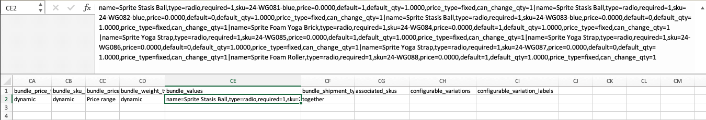
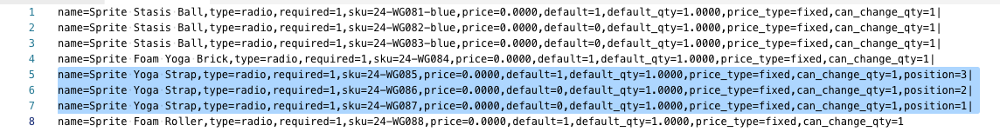

# Importer les produits groupés

Un produit groupé présente une sélection d’articles et permet aux clients de choisir ceux qu’ils souhaitent acheter. Tous les éléments d’un lot existent dans le catalogue sous la forme [Produits simples](../catalog/product-create-simple.md) ou [Produits virtuels](../catalog/product-create-virtual.md). En règle générale, les produits groupés sont créés et mis à jour à partir de l’administrateur. Cependant, vous pouvez également importer des données pour créer un produit groupé ou exporter des produits groupés existants, modifier les données et les réimporter dans le catalogue. Le kit Sprite Yoga Companion est un produit groupé dans les données d’exemple utilisées dans les exemples suivants.

{width="700" zoomable="yes"}

## Modifier l’ordre des éléments du lot

Il existe deux façons de modifier l’ordre des éléments dans un produit groupé.

### Méthode 1 : glisser-déposer

Lorsque vous travaillez avec un produit [Bundle](../catalog/product-create-bundle.md) de l’administrateur, vous pouvez faire glisser et déposer des éléments et des sections jusqu’à leur position.

{width="600" zoomable="yes"}

### Méthode 2 : modification des données de produit

La meilleure façon de comprendre la structure d’un produit groupé est d’exporter le produit et d’examiner les données dans une feuille de calcul. Vous pouvez modifier l’ordre des éléments de l’offre groupée en exportant le produit et en ajoutant un paramètre de position aux données de chaque élément. Les données d’article se trouvent dans la colonne `bundle_values` du produit exporté. Lorsqu’ils sont ouverts dans une feuille de calcul, tous les éléments associés au produit se trouvent dans une seule cellule sous la forme d’une longue chaîne de texte. La colonne `bundle_values` contient les éléments suivants pour chaque élément :

- Nom de la section d’élément
- Contrôle de saisie
- Indicateur d’élément obligatoire
- SKU
- Couleur
- Prix
- Indicateur d’option par défaut
- Quantité par défaut
- Type de prix
- Indicateur de quantité modifiable

#### Étape 1 : exporter le produit groupé

Au cours de cette étape, le kit Sprite Yoga Companion est exporté sous la forme d’un fichier ([CSV](data-csv.md). Vous pouvez utiliser n’importe quel autre produit groupé de votre catalogue.

1. Dans la barre latérale _Admin_, accédez à **[!UICONTROL System]** > _[!UICONTROL Data Transfer]_>**[!UICONTROL Export]**.

1. Sous _Paramètres d’exportation_, définissez **[!UICONTROL Entity Type]** sur `Products`.

1. Dans la liste des attributs de produit, faites défiler l’écran jusqu’à **[!UICONTROL SKU]** et saisissez le SKU du produit groupé que vous souhaitez exporter.

   Le SKU est `24-WG080` pour le produit dans cet exemple.

1. Faites défiler la page jusqu’au bas de la section, puis cliquez sur **[!UICONTROL Continue]**.

1. Dans la colonne _[!UICONTROL Action]_&#x200B;de la grille de&#x200B;_[!UICONTROL File name]_, cliquez sur **[!UICONTROL Select]** et choisissez `Download`.

   Le fichier s’affiche à l’emplacement de téléchargement utilisé par votre navigateur.

#### Étape 2 : modifier les données

1. Ouvrez le fichier CSV téléchargé dans une feuille de calcul.

1. Faites défiler jusqu’à l’extrême droite, jusqu’à ce que vous puissiez voir la colonne `bundle_values`.

   Dans les données `bundle_values`, chaque élément est séparé par une virgule et chaque élément du lot est séparé du suivant par une barre verticale. (Le dernier élément ne se termine pas par une barre verticale.) Les données de lot exportées doivent ressembler à l’exemple suivant :

   {width="600" zoomable="yes"}

1. Pour faciliter la modification, vous pouvez copier les données `bundle_values` et les coller dans un éditeur de texte. Ensuite, ajoutez un saut de ligne après chaque élément, de sorte que chaque élément figure sur une ligne distincte.

1. Après modification des données, supprimez soigneusement les sauts de ligne et collez à nouveau les données modifiées dans la colonne `bundle_values`.

   Dans l&#39;illustration suivante, un paramètre `position=[number]` est ajouté à chaque bracelet de yoga pour modifier l&#39;ordre des articles dans la liste des magasins.

   {width="500" zoomable="yes"}

1. Après modification des données, **[!UICONTROL Save]** le fichier CSV.

#### Étape 3 : importer le produit mis à jour

1. Dans la barre latérale _Admin_, accédez à **[!UICONTROL System]** > _[!UICONTROL Data Transfer]_>**[!UICONTROL Import]**.

1. Sous _[!UICONTROL Import Settings]_, définissez **[!UICONTROL Entity Type]**&#x200B;sur `Products`.

1. Définissez **[!UICONTROL Import Behavior]** sur `Replace`.

   Cette option remplace les données précédentes pour votre produit groupé, plutôt que d’ajouter vos modifications sous forme d’éléments supplémentaires.

1. Faites défiler jusqu’à la section _Fichier à importer_ et cliquez sur **[!UICONTROL Choose File]**.

1. Sélectionnez le fichier CSV que vous avez modifié.

1. Cliquez sur **[!UICONTROL Check Data]** et attendez quelques instants que les données soient vérifiées.

1. Si le fichier est valide, cliquez sur **[!UICONTROL Import]**.

1. Une fois le processus terminé, accédez à **[!UICONTROL System]** > _[!UICONTROL Tools]_>**[!UICONTROL Cache Management]**&#x200B;et cliquez sur **[!UICONTROL Flush Cache Storage]**.

   Cela garantit que le produit mis à jour est immédiatement disponible dans le storefront.
