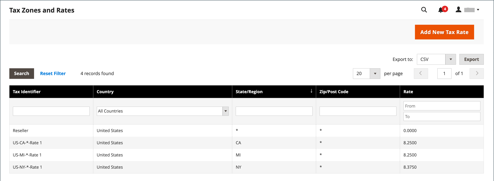

# Mise à jour des données sur les taux d&#39;imposition

Si vous dirigez des entreprises dans plusieurs États et que vous expédiez une grande quantité de produits, la saisie manuelle des taux d’imposition peut prendre beaucoup de temps. Il est plus rapide et plus efficace de télécharger les taux d’imposition par code postal et de les importer dans Commerce. L’exemple suivant montre comment importer un ensemble de taux d’imposition spécifiques à un état téléchargé à partir d’une source approuvée. Avalara fournit [tables de taux d&#39;imposition](https://www.avalara.com/taxrates/en/download-tax-tables.html), que vous pouvez télécharger gratuitement pour chaque code postal aux États-Unis.

>[!NOTE]
>
>Si vous souhaitez automatiser vos ventes et utiliser la conformité fiscale et la création de rapports, vous pouvez trouver des options approuvées par Commerce sur la variable [Partenaires commerciaux](https://solutionpartners.adobe.com/s/directory/?solution=commerce) site.

## Etape 1 : exporter les données sur le taux de taxe de commerce

1. Sur le _Administration_ barre latérale, accédez à **[!UICONTROL System]** > _[!UICONTROL Data Transfer]_>**[!UICONTROL Import/Export Tax Rates]**.

1. Cliquez sur **[!UICONTROL Export Tax Rates]**.

1. Recherchez le fichier à l’emplacement de téléchargement de votre navigateur web.

1. Enregistrez le fichier et ouvrez-le dans une feuille de calcul.

   Cet exemple utilise [!DNL OpenOffice Calc].

   Les données du taux de taxe de commerce exporté comprennent les colonnes suivantes :
   - Code
   - Pays
   - État
   - Code postal
   - Rate
   - Plage à partir de
   - Plage à
   - Une colonne pour chaque vue de magasin

   {width="500" zoomable="yes"}

1. Ouvrez les nouvelles données de taux d’imposition dans une seconde instance de la feuille de calcul afin de les voir côte à côte.

1. Dans les nouvelles données sur les taux d’imposition, prenez note des données supplémentaires sur les taux d’imposition que vous devrez peut-être configurer dans votre magasin avant d’importer les données.

   Par exemple, les données sur le taux d’imposition de la Californie incluent également :

   - `TaxRegionName`
   - `CombinedRate`
   - `StateRate`
   - `CountyRate`
   - `CityRate`
   - `SpecialRate`

   Si vous devez importer des [zones fiscales et taux](../stores-purchase/tax-zones-rates.md), vous devez d’abord les définir à partir de l’administrateur de votre boutique et mettre à jour la variable [règles fiscales](../stores-purchase/tax-rules.md) selon les besoins. Ensuite, exportez les données et ouvrez le fichier dans un éditeur de texte afin qu’il puisse être utilisé à titre de référence. Cependant, pour simplifier cet exemple, nous n&#39;importons que les colonnes standard des taux d&#39;imposition.

## Etape 2 : Préparation des données d&#39;import

Vous avez deux feuilles de calcul ouvertes, côte à côte. L’une contient la structure de fichiers d’exportation Commerce et l’autre contient les nouvelles données de taux de taxe que vous souhaitez importer.

1. Pour créer un lieu de travail dans la feuille de calcul avec les nouvelles données de taux de taxe, insérez autant de colonnes vides à l’extrême droite que nécessaire pour ajouter les données du fichier d’exportation Commerce. Utilisez le couper-coller pour ajouter les données, puis réorganiser les colonnes afin qu’elles correspondent à l’ordre du fichier de données d’exportation Commerce.

1. Renommez les en-têtes de colonne pour qu’ils correspondent aux données d’exportation Commerce.

1. Supprimez toutes les colonnes qui ne comportent aucune donnée.

   Dans le cas contraire, la structure du fichier d’importation doit correspondre aux données d’exportation Commerce d’origine.

1. Avant d’enregistrer le fichier, faites défiler l’écran vers le bas et assurez-vous que les colonnes de taux d’imposition contiennent uniquement des données numériques.

   Tout texte trouvé dans une colonne de taux d&#39;imposition empêche l&#39;import des données.

1. Enregistrez les données préparées au format .CSV .

   Lorsque vous y êtes invité, vérifiez qu’une virgule est utilisée comme délimiteur de champ et que les guillemets doubles sont utilisés comme délimiteur de texte. Cliquez ensuite sur **[!UICONTROL OK]**.

## Etape 3 : Importer les taux de taxe

1. Sur le _Administration_ barre latérale, accédez à **[!UICONTROL System]** > _[!UICONTROL Data Transfer]_>**[!UICONTROL Import/Export Tax Rates]**.

1. Cliquez sur **[!UICONTROL Choose File]** et sélectionnez le fichier de taux de taxe CSV que vous avez préparé à importer.

1. Cliquez sur **[!UICONTROL Import Tax Rates]**.

   L’importation des données peut prendre plusieurs minutes. Une fois le processus terminé, la variable `The tax rate has been imported` s’affiche. Si vous recevez un message d’erreur, corrigez le problème dans les données et réessayez.

1. Sur le _Administration_ barre latérale, accédez à **[!UICONTROL Stores]** > _[!UICONTROL Taxes]_>**[!UICONTROL Tax Zones and Rates]**.

   Les taux importés apparaissent dans la liste.

1. Utilisez les commandes de page pour afficher les nouveaux taux d’imposition.

   {width="600" zoomable="yes"}

1. Exécutez certaines transactions de test dans votre boutique avec des clients provenant de différents codes postaux afin de vous assurer que les nouveaux taux d’imposition fonctionnent correctement.
