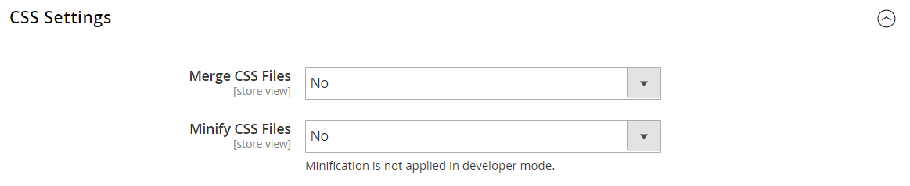

# Outils de développement

Utilisez les outils de développement avancés pour déterminer le mode de compilation lors du développement frontal, créer une liste autorisée d’adresses IP et afficher des conseils sur le chemin du modèle. Il existe également des outils pour apporter facilement des modifications instantanées au texte dans l’interface du storefront et de l’administrateur.

- [Journaux des actions](action-log.md)  (Adobe Commerce uniquement)
- [Flux de développement Frontière](#frontend-development-workflow)
- [Utilisation de signatures de fichier statiques](#static-file-signatures)
- [Optimisation des fichiers de ressources](#optimizing-resource-files)
- [Restrictions du client développeur](#client-restrictions)
- [Conseils sur les chemins de modèle](#template-path-hints)
- [Traduire en ligne](#translate-inline)

## Modes d&#39;opération

Votre instance Adobe Commerce ou Magento Open Source peut être déployée pour être exécutée dans _production_ ou _mode développeur_. Les outils et paramètres de configuration conçus spécifiquement pour les développeurs ne sont accessibles que lorsque le magasin est en cours d’exécution dans _mode développeur_.

Le mode de fonctionnement ne peut être modifié que depuis la ligne de commande du serveur par un utilisateur disposant des autorisations appropriées. Voir [Définir le mode de fonctionnement](https://experienceleague.adobe.com/docs/commerce-operations/configuration-guide/cli/set-mode.html) dans le _Guide de configuration_ pour plus d’informations.

La plupart des rubriques de la documentation marchande s’appliquent à une instance Commerce en mode de production. Toutefois, les paramètres et outils de configuration suivants ne peuvent être utilisés que lorsque l’installation est en mode développeur.

## Workflow de développement Frontière

Le type de workflow de développement Frontend détermine si la compilation Less a lieu côté client ou côté serveur pendant le développement. Moins est une extension de CSS qui comporte des fonctionnalités et des conventions supplémentaires et qui produit du code rationalisé. La compilation less côté client est recommandée pour le développement de thèmes. La compilation côté serveur est le mode par défaut. Les options de workflow de développement ne sont pas disponibles pour les magasins en mode de production.
Voir [Compilation LESS côté client par rapport à côté serveur](https://developer.adobe.com/commerce/frontend-core/guide/css/quickstart/compilation-mode/){:target=&quot;_blank&quot;} dans la documentation destinée aux développeurs Commerce.

>[!NOTE]
>
>La configuration du workflow de développement front-end est disponible dans la section [Mode Développeur](../systems/developer-tools.md#operation-modes) uniquement.

{width="600" zoomable="yes"}

1. Sur le _Administration_ barre latérale, accédez à **[!UICONTROL Stores]** > _[!UICONTROL Settings]_>**[!UICONTROL Configuration]**.

1. Dans le panneau de gauche, développez **[!UICONTROL Advanced]** et choisissez **[!UICONTROL Developer]**.

1. Développer  la valeur **[!UICONTROL Front-end Development Workflow]** .

1. Définir **[!UICONTROL Workflow Type]** à l’une des options suivantes :

   - `Client side less compilation` - La compilation a lieu dans le navigateur à l’aide du paramètre natif `less.js` bibliothèque .
   - `Server side less compilation` - La compilation a lieu sur le serveur à l’aide de la bibliothèque Less PHP. Il s’agit du mode par défaut pour la production.

1. Lorsque vous avez terminé, cliquez sur **[!UICONTROL Save Config]**.

## Signatures de fichiers statiques

L’ajout d’une signature numérique à l’URL des fichiers statiques permet aux navigateurs de détecter si une version plus récente du fichier est disponible. Les fichiers statiques pouvant être suivis avec des signatures numériques incluent JavaScript, CSS, images et polices. La signature est ajoutée au chemin d’accès directement après l’URL de base. Si la signature d’un fichier diffère de ce qui est stocké dans le cache du navigateur, la version la plus récente du fichier est utilisée.

Voir [Signature de contenu statique](https://experienceleague.adobe.com/docs/commerce-operations/configuration-guide/cache/static-content-signing.html){:target=&quot;_blank&quot;} dans la documentation destinée aux développeurs Commerce.

>[!NOTE]
>
>La configuration Paramètres de fichier statique n’est disponible que lorsque vous utilisez [mode développeur](../systems/developer-tools.md#operation-modes).

{width="600" zoomable="yes"}

Pour obtenir la liste détaillée des paramètres de configuration, voir [_Paramètres de fichier statique_](../configuration-reference/advanced/developer.md) dans le _Référence de configuration_.

**_Pour activer les fichiers statiques signés :_**

1. Sur le _Administration_ barre latérale, accédez à **[!UICONTROL Stores]** > _[!UICONTROL Settings]_>**[!UICONTROL Configuration]**.

1. Dans le panneau de gauche, développez **[!UICONTROL Advanced]** et choisissez **[!UICONTROL Developer]**.

1. Développer  la valeur **[!UICONTROL Static Files Settings]** .

1. Définir **[!UICONTROL Sign Static Files]** to `Yes`.

1. Lorsque vous avez terminé, cliquez sur **[!UICONTROL Save Config]**.

## Optimisation des fichiers de ressources

Le temps nécessaire au chargement des fichiers de ressources peut être réduit en fusionnant et en regroupant des fichiers, ainsi qu’en minimisant le code.

- La fusion combine des fichiers distincts du même type dans un seul fichier.
- Le regroupement est une technique qui regroupe des fichiers distincts afin de réduire le nombre de requêtes HTTP requises pour charger une page.
- La minimisation supprime les espaces, les sauts de ligne et les commentaires, mais n’affecte pas la fonctionnalité du code. Comme les fichiers minimisés ne peuvent pas être modifiés, le processus ne doit être appliqué que lorsque vous êtes prêt à passer en production.

Par défaut, Adobe Commerce et Magento Open Source ne fusionnent pas, ne regroupent pas ou ne minimisent pas les fichiers. Le développeur du projet doit donc déterminer les méthodes d’optimisation des fichiers à utiliser.

Voir [Bonnes pratiques relatives aux performances](https://experienceleague.adobe.com/docs/commerce-operations/performance-best-practices/overview.html) pour plus d’informations.

>[!NOTE]
>
>Les fichiers CSS et JavaScript peuvent être optimisés dans [Mode Développeur](../systems/developer-tools.md#operation-modes) uniquement.

| Type de fichier | Opérations prises en charge |
| --------------- | -------------------- |
| Fichiers CSS | `MergeMinify` |
| Fichiers JavaScript | `MergeBundleMinify` |
| Fichiers de modèle | `Minify` |

{style="table-layout:auto"}

**_Pour optimiser les fichiers de ressources :_**

1. Sur le _Administration_ barre latérale, accédez à **[!UICONTROL Stores]** > _[!UICONTROL Settings]_>**[!UICONTROL Configuration]**.

1. Dans le panneau de gauche, développez **[!UICONTROL Advanced]** et choisissez **[!UICONTROL Developer]**.

1. Pour optimiser les fichiers CSS, développez  la valeur **[!UICONTROL CSS Settings]** et procédez comme suit :

   - Définir **[!UICONTROL Merge CSS Files]** to `Yes`.
   - Définir **[!UICONTROL Minify CSS Files]** to `Yes`.

   {width="600" zoomable="yes"}

[_CSS Settings_](../configuration-reference/advanced/developer.md)

1. Pour optimiser les fichiers JavaScript, développez  la valeur **[!UICONTROL JavaScript Settings]** et procédez comme suit :

   - Définir **[!UICONTROL Merge JavaScript Files]** to `Yes`.
   - Définir **[!UICONTROL Minify JavaScript Files]** to `Yes`.

   {width="600" zoomable="yes"}

1. Pour réduire les fichiers de modèle PHTML, développez  la valeur **[!UICONTROL Template Settings]** section et définition **[!UICONTROL Minify Html]** to `Yes`.

   {width="600" zoomable="yes"}

1. Lorsque vous avez terminé, cliquez sur **[!UICONTROL Save Config]**.

## Restrictions du client

Avant d’utiliser un outil tel que [conseils sur les chemins de modèle](#template-path-hints), veillez à ajouter votre adresse IP à la liste autorisée Restrictions du client développeur afin d’éviter de perturber l’expérience d’achat des clients du magasin. Si vous ne connaissez pas votre adresse IP, vous pouvez la rechercher en ligne.

>[!NOTE]
>
>Les restrictions du client développeur peuvent être définies dans [Mode Développeur](../systems/developer-tools.md#operation-modes) uniquement.

Pour obtenir des informations techniques, voir [VCL personnalisée pour autoriser les requêtes](https://experienceleague.adobe.com/docs/commerce-cloud-service/user-guide/cdn/custom-vcl-snippets/fastly-vcl-allowlist.html) dans le _Guide d’infrastructure de Commerce on Cloud_.

**_Pour ajouter votre adresse IP à la liste autorisée :_**

1. Sur le _Administration_ barre latérale, accédez à **[!UICONTROL Stores]** > _[!UICONTROL Settings]_>**[!UICONTROL Configuration]**.

1. Dans le panneau de gauche, développez **[!UICONTROL Advanced]** et choisissez **[!UICONTROL Developer]**.

1. Développer  la valeur **[!UICONTROL Developer Client Restrictions]** .

   {width="600" zoomable="yes"}

1. Pour **[!UICONTROL Allow IPs]**, saisissez votre adresse IP.

   Si un accès est nécessaire à partir de plusieurs adresses IP, séparez chacune d’elles par une virgule.

1. Lorsque vous avez terminé, cliquez sur **[!UICONTROL Save Config]**.

1. Lorsque vous y êtes invité, actualisez les caches non valides.

## Conseils sur le chemin du modèle

Les indicateurs de chemin d’accès aux modèles sont un outil de diagnostic qui ajoute la notation avec le chemin d’accès à chaque modèle utilisé sur la page. Les conseils de chemin de modèle peuvent être activés pour le storefront ou l’administrateur.

>[!NOTE]
>
>Les conseils sur les chemins de modèle peuvent être modifiés dans [mode développeur](../systems/developer-tools.md#operation-modes) uniquement.

Voir [Recherche de modèles, de mises en page et de styles](https://developer.adobe.com/commerce/frontend-core/guide/themes/debug/){:target=&quot;_blank&quot;} dans la documentation destinée aux développeurs Commerce.

{width="700" zoomable="yes"}

### Étape 1 : Ajout de votre adresse IP à la liste autorisée

Avant d’utiliser des conseils sur le chemin d’accès au modèle, ajoutez votre adresse IP au [liste autorisée](#client-restrictions) pour éviter toute interférence avec les clients qui font des achats dans le magasin. Lorsque vous avez terminé, assurez-vous d’effacer le cache de Commerce pour supprimer tous les conseils du magasin.

{width="600" zoomable="yes"}

### Étape 2 : activation des conseils de chemin de modèle

1. Sur le _Administration_ barre latérale, accédez à **[!UICONTROL Stores]** > _[!UICONTROL Settings]_>**[!UICONTROL Configuration]**.

1. Dans le panneau de gauche, développez **[!UICONTROL Advanced]** et choisissez **[!UICONTROL Developer]**.

1. Développer  la valeur **[!UICONTROL Debug]** et procédez comme suit :

   {width="600" zoomable="yes"}

   - Pour activer les conseils de chemin de modèle pour le magasin, définissez **[!UICONTROL Enabled Template Path Hints for Storefront]** to `Yes`.

   - Pour activer les conseils de chemin d’accès au modèle pour le magasin uniquement lorsque l’URL inclut la variable `templatehints` parameter, set **Activation des conseils pour Storefront avec le paramètre d’URL** to `Yes`. Définissez ensuite la valeur du paramètre si nécessaire. La valeur par défaut est `magento`, mais vous pouvez utiliser une valeur personnalisée. Par exemple, si vous définissez la valeur sur `lorem`, vous utiliserez `mymagento.com?templatehints=lorem` pour afficher des conseils sur les modèles.

   - Pour activer les conseils de chemin de modèle pour l’administrateur, définissez **[!UICONTROL Enabled Template Path Hints for Admin]** to `Yes`.

   - Pour inclure les noms des blocs, définissez **[!UICONTROL Add Block Class Type to Hints]** to `Yes`.

1. Lorsque vous avez terminé, cliquez sur **[!UICONTROL Save Config]**.

### Étape 3 : effacement du cache

1. Sur le _Administration_ barre latérale, accédez à **[!UICONTROL System]** > _[!UICONTROL Tools]_>**[!UICONTROL Cache Management]**.

1. Dans le coin supérieur droit, cliquez sur **[!UICONTROL Flush Magento Cache]**.

## Traduire en ligne

Vous pouvez utiliser l’outil Traduire en ligne dans [mode développeur](../systems/developer-tools.md#operation-modes) pour toucher du texte dans l’interface afin de refléter votre voix et votre marque. Lorsque le mode Traduire en ligne est activé, tout texte de la page qui peut être modifié est indiqué en rouge. Il est facile de modifier les libellés de champ, les messages et tout autre texte qui s’affichent dans le storefront et dans l’administrateur. Par exemple, de nombreux thèmes utilisent une terminologie telle que _Mon compte_, _Ma liste de souhaits_, et _Mon tableau de bord_, pour aider les clients à trouver leur chemin. Cependant, il se peut que vous préfériez simplement utiliser les mots _Compte_, _Wishlist_, et _Tableau de bord_.

>[!NOTE]
>
>L’outil Traduire en ligne n’est disponible que lorsque vous utilisez [mode développeur](../systems/developer-tools.md#operation-modes).

Voir [Présentation des traductions](https://developer.adobe.com/commerce/frontend-core/guide/translations/) dans la documentation destinée aux développeurs Commerce.

{width="700" zoomable="yes"}

Si votre boutique est disponible dans plusieurs langues, vous pouvez effectuer des réglages précis sur le texte traduit du paramètre régional. Sur le serveur, le texte de l’interface est conservé dans un fichier CSV distinct pour chaque bloc de sortie et est organisé par paramètres régionaux. Au lieu d’utiliser la variable _Traduire en ligne_ vous pouvez également modifier les fichiers CSV directement sur le serveur. Les fichiers de traduction sont stockés dans `app/code/Magento/<module_name>/i18n/<language_locale>.csv`.

>[!NOTE]
>
>Pour utiliser l’outil Traduire en ligne , votre navigateur doit autoriser les fenêtres contextuelles.

### Étape 1 : désactivation des caches de sortie

1. Sur le _Administration_ barre latérale, accédez à **[!UICONTROL System]** > _[!UICONTROL Tools]_>**[!UICONTROL Cache Management]**.

1. Cochez les cases suivantes :

   - `Blocks HTML output`
   - `Page Cache`
   - `Translations`

1. Définissez la variable **[!UICONTROL Actions]** contrôler à `Disable` et cliquez sur **[!UICONTROL Submit]**.

### Étape 2 : activation de l’outil Traduire en ligne

1. Sur le _Administration_ barre latérale, accédez à **[!UICONTROL Stores]** > _[!UICONTROL Settings]_>**[!UICONTROL Configuration]**.

1. Pour utiliser une vue de magasin spécifique, définissez la variable **[!UICONTROL Store View]** à mettre à jour.

1. Dans le panneau de gauche, développez **[!UICONTROL Advanced]** et choisissez **[!UICONTROL Developer]**.

1. Développer  la valeur **[!UICONTROL Translate Inline]** .

   Effacez la variable **[!UICONTROL Use Website]** au besoin pour modifier ces paramètres.

   La variable _[!UICONTROL Enabled for Admin]_n’est pas disponible lors de la modification d’une vue de magasin spécifique.

   {width="600" zoomable="yes"}

1. Définir **[!UICONTROL Enabled for Storefront]** to `Yes`.

1. Lorsque vous avez terminé, cliquez sur **[!UICONTROL Save Config]**.

1. Lorsque vous y êtes invité, actualisez les caches non valides, mais laissez les caches désactivés tels qu’ils sont pour l’instant.

### Étape 3 : mise à jour du texte

1. Ouvrez votre vitrine dans un navigateur et accédez à la page que vous souhaitez modifier.

   Si nécessaire, utilisez le sélecteur de langue pour modifier la vue du magasin. Chaque chaîne de texte pouvant être traduite est entourée de rouge. Lorsque vous passez la souris sur une zone de texte, une icône de livre (  ) s’affiche.

1. Pour ouvrir la _Traduire_ et procédez comme suit :

   - Si la modification concerne la vue de magasin spécifique, sélectionnez la variable **[!UICONTROL Store View Specific]** .

   - Saisissez la nouvelle **[!UICONTROL Custom]** texte.

1. Lorsque vous avez terminé, cliquez sur **[!UICONTROL Submit]**.

   {width="700" zoomable="yes"}

1. Pour afficher vos modifications dans le magasin, actualisez le navigateur.

1. Répétez cette procédure pour que les éléments du magasin soient modifiés.

### Étape 4 : restauration des paramètres d’origine

1. Revenez à l’administrateur de votre boutique.

1. Sur le _Administration_ barre latérale, accédez à **[!UICONTROL Stores]** > _[!UICONTROL Settings]_>**[!UICONTROL Configuration]**.

1. Définir **[!UICONTROL Store View]** à la vue spécifique qui a été modifiée.

1. Dans le panneau de gauche, développez **[!UICONTROL Advanced]** et choisissez **[!UICONTROL Developer]**.

1. Développer  la valeur **[!UICONTROL Translate Inline]** .

1. Définir **[!UICONTROL Enabled for Frontend]** to `No`.

1. Lorsque vous avez terminé, cliquez sur **[!UICONTROL Save Config]**.

1. Sur le _Administration_ barre latérale, accédez à **[!UICONTROL System]** > _[!UICONTROL Tools]_>**[!UICONTROL Cache Management]**.

1. Cochez la case des caches de sortie suivants qui étaient auparavant désactivés :

   - `Blocks HTML output`
   - `Page Cache`
   - `Translations`

1. Définissez la variable **[!UICONTROL Actions]** contrôler à `Enable` et cliquez sur **[!UICONTROL Submit]**.

1. Lorsque vous y êtes invité, actualisez les caches non valides.

### Étape 5 : Vérification des modifications apportées à votre magasin

Accédez à votre vitrine et examinez chaque page mise à jour pour vous assurer que les modifications sont correctes. Dans cet exemple, `Customer Login` a été remplacé par `Customer Sign In`. Si des modifications ont été apportées à une vue spécifique, utilisez le sélecteur de langue pour passer à la vue correcte.

{width="700" zoomable="yes"}
