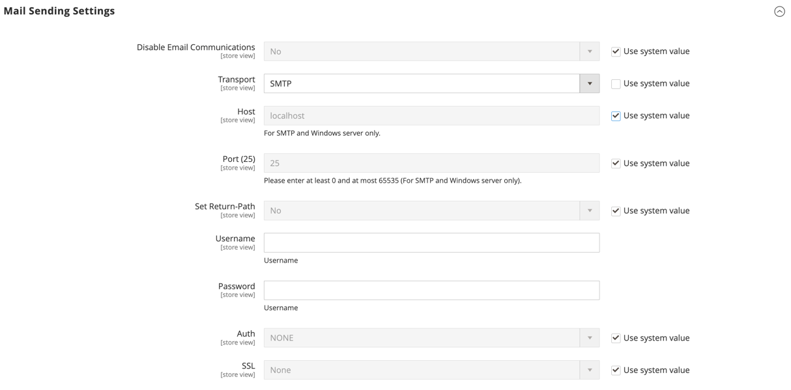

# Configurer les communications par e-mail

Les _Paramètres d’envoi du courrier électronique_ vous permettent d’acheminer les e-mails renvoyés ou les réponses aux e-mails vers une adresse spécifique. Si votre magasin s’exécute sur un serveur SMTP ou Windows, vous pouvez vérifier les paramètres de l’hôte et du port.

>[!IMPORTANT]
>
>**Avis de sécurité** Tous les commerçants doivent immédiatement définir leur configuration d&#39;envoi d&#39;e-mails pour se protéger contre une exploitation potentielle d&#39;exécution de code à distance récemment identifiée. Jusqu’à ce que ce problème soit résolu, il est vivement recommandé d’éviter d’utiliser [!DNL Sendmail] pour les communications par e-mail. Dans l’_[!UICONTROL Mail Sending Settings]_, assurez-vous que_[!UICONTROL Set Return Path]_ est défini sur `No`.

Pour obtenir la liste détaillée des paramètres de configuration, voir [_[!UICONTROL Mail Sending Settings]_](../configuration-reference/advanced/system.md) dans le _Référence de configuration_.

## Configurer les communications par e-mail

1. Dans la barre latérale _Admin_, accédez à **[!UICONTROL Stores]** > _[!UICONTROL Settings]_>**[!UICONTROL Configuration]**.

1. Dans le panneau de gauche, développez **[!UICONTROL Advanced]** et choisissez **[!UICONTROL System]**.

1. Développez  la section **[!UICONTROL Mail Sending Settings]** et procédez comme suit :

   {width="600" zoomable="yes"}

   - Si nécessaire, définissez **[!UICONTROL Disable Email Communications]** sur `No`.

   - Par **[!UICONTROL Transport]**, choisissez le type de transport pour les communications par e-mail à partir du magasin : `Sendmail` ou `SMTP`

   - Si vous utilisez un serveur SMTP ou Windows, vérifiez les paramètres suivants :

      - **[!UICONTROL Host]** - `localhost` ou autre

      - **[!UICONTROL Port (25)]** - `25` ou autre

   - Par **[!UICONTROL Set Return Path]**, choisissez l’une des options suivantes :

      - `No` - (Mesure de sécurité recommandée) Les itinéraires renvoyaient l’e-mail à l’adresse e-mail par défaut du magasin.
      - `Yes` - Achemine l’e-mail renvoyé vers l’adresse e-mail du magasin par défaut.
      - `Specified` - Achemine les e-mails renvoyés vers l’adresse e-mail spécifiée dans **[!UICONTROL Return Path Email]**.

   - Si vous utilisez un serveur SMTP, configurez la connexion :

      - **[!UICONTROL Username]** - Saisissez le nom d’utilisateur pour le serveur SMTP.
      - **[!UICONTROL Password]** - Saisissez le mot de passe pour le login du serveur SMTP.
      - **[!UICONTROL Auth]** - Choisissez le type d’authentification de la connexion au serveur SMTP : `NONE` , `PLAIN` ou `LOGIN`
      - **[!UICONTROL SSL]** - Choisissez le type de vérification pour le certificat de sécurité du serveur : `SSL` ou `TLS`

     {width="600" zoomable="yes"}

1. Dans le panneau de gauche, développez **[!UICONTROL Sales]** et choisissez **[!UICONTROL Sales Emails]**.

1. Développez  la section **[!UICONTROL General Settings]** .

1. Définissez **[!UICONTROL Asynchronous sending]** sur `Enable`.

   {width="600" zoomable="yes"}

   Pour obtenir la liste détaillée des paramètres de configuration, voir [_Paramètres généraux_](../configuration-reference/sales/sales-emails.md) dans le _Référence de configuration_.

1. Cliquez ensuite sur **[!UICONTROL Save Config]**.
