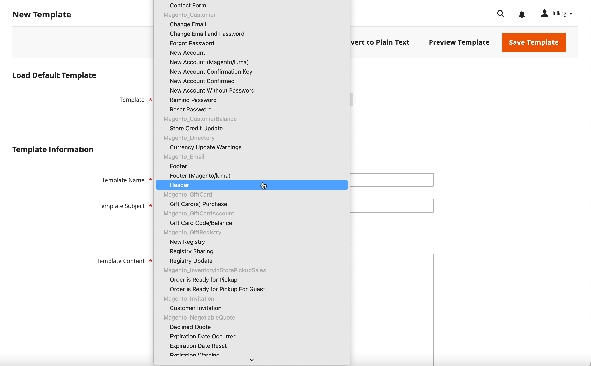
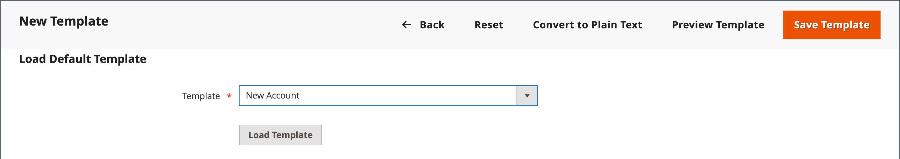
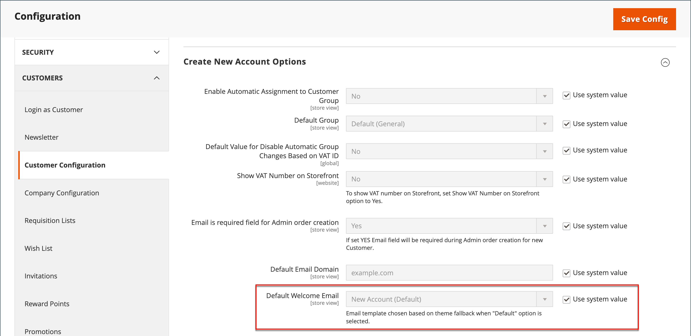

# Personnaliser les modèles d’e-mail

Commerce comprend un modèle d’e-mail par défaut pour la section corps de chaque message envoyé par le système. Le modèle du contenu du corps est combiné avec les modèles d’en-tête et de pied de page pour créer le message complet. Le contenu est formaté avec HTML et CSS et peut être facilement modifié et personnalisé en ajoutant des [variables](variables-predefined.md). Les modèles d’e-mail peuvent être personnalisés pour chaque site web, magasin ou vue de magasin. Si vous utilisez des modèles personnalisés, veillez à mettre à jour la [configuration du système](email-templates.md#configure-email-templates) pour vous assurer que le modèle correct est utilisé. Pour découvrir comment utiliser des instructions conditionnelles lors de la personnalisation du modèle d’e-mail, consultez la [documentation destinée aux développeurs](https://developer.adobe.com/commerce/frontend-core/guide/templates/email/#theme-based-customizations-1).

{width="500" zoomable="yes"}

Les modèles par défaut incluent votre logo et les informations du magasin. Ils peuvent être utilisés sans autre personnalisation. Cependant, la bonne pratique consiste à afficher chaque modèle et à apporter les modifications nécessaires avant de l’envoyer aux clients.

- [Modèle d’en-tête](email-template-custom.md#header-template)
- [Modèle de pied de page](email-template-custom.md#footer-template)
- [Modèles de message](email-template-custom.md#message-templates)

{width="700" zoomable="yes"}

## Informations sur le modèle

| Champ | Description |
| ----- | ----------- |
| [!UICONTROL Template Name] | Nom de votre modèle personnalisé. |
| [!UICONTROL Insert Variable] | Insère une variable dans le modèle à l’emplacement du curseur. |
| [!UICONTROL Template Subject] | L’Objet du modèle apparaît dans la colonne Objet et peut être utilisé pour trier et filtrer les modèles dans la liste. |
| [!UICONTROL Template Content] | Contenu du modèle dans HTML. |
| [!UICONTROL Template Styles] | Toutes les déclarations de style CSS nécessaires pour formater le modèle peuvent être saisies dans la zone de _[!UICONTROL Template Styles]_. |

{style="table-layout:auto"}

## Modèle d’en-tête

Une fois la [configuration](email-templates.md#configure-email-templates) terminée, le modèle d’en-tête d’e-mail inclut votre logo associé à votre boutique. Si vous disposez de connaissances de base d’HTML, vous pouvez facilement utiliser [variables prédéfinies](variables-predefined.md) pour ajouter les informations de contact du magasin à l’en-tête.

### Étape 1. Charger le modèle par défaut

1. Dans la barre latérale _Admin_, accédez à **[!UICONTROL Marketing]** > _[!UICONTROL Communications]_>**[!UICONTROL Email Templates]**.

1. Cliquez sur **[!UICONTROL Add New Template]**.

1. Dans la section **[!UICONTROL Load default template]**, cliquez sur le sélecteur de **[!UICONTROL Template]** et choisissez `Magento_Email` > `Header`.

   {width="600" zoomable="yes"}

1. Cliquez sur **[!UICONTROL Load Template]**.

   Le code HTML et les variables du modèle apparaissent dans le formulaire.

### Étape 2. Personnaliser le modèle

1. Saisissez le **[!UICONTROL Template Name]** de votre en-tête personnalisé.

1. Saisissez un **[!UICONTROL Template Subject]** pour vous aider à organiser les modèles.

   Dans la grille, la liste des modèles peut être triée et filtrée selon la colonne _[!UICONTROL Subject]_.

   {width="600" zoomable="yes"}

1. Dans la zone de **[!UICONTROL Template Content]**, modifiez l’HTML selon vos besoins.

   >[!NOTE]
   >
   >Lorsque vous travaillez dans le code de modèle, veillez à ne pas remplacer tout ce qui est placé entre doubles accolades.

1. Pour insérer une [variable](variables-reference.md), placez le curseur dans le code à l&#39;endroit où vous souhaitez placer la variable et cliquez sur **[!UICONTROL Insert Variable]**.

1. Sélectionnez la variable à insérer.

   {width="600" zoomable="yes"}

   Lorsqu’une variable est sélectionnée, une [&#x200B; balise de balisage &#x200B;](markup-tags.md) est insérée dans le code.

   Bien que les variables Adresse e-mail de la boutique soient celles qui sont le plus souvent incluses dans l’en-tête, vous pouvez saisir le code de n’importe quelle variable système ou [variable personnalisée](variables-custom.md) directement dans le modèle.

1. Si vous devez faire des déclarations CSS, saisissez les styles dans la zone de **[!UICONTROL Template Styles]**.

1. Lorsque vous êtes prêt à passer en revue votre travail, cliquez sur **[!UICONTROL Preview Template]**.

   Apportez les modifications nécessaires au modèle.

1. Cliquez ensuite sur **[!UICONTROL Save Template]**.

   Votre en-tête personnalisé apparaît désormais dans la liste des modèles d’e-mail disponibles.

### Étape 3. Mise à jour de la configuration

1. Dans la barre latérale _Admin_, accédez à **[!UICONTROL Content]** > _[!UICONTROL Design]_>**[!UICONTROL Configuration]**.

1. Dans la grille, recherchez la vue de magasin que vous souhaitez configurer, puis cliquez sur **[!UICONTROL Edit]** dans la colonne _[!UICONTROL Action]_.

1. Faites défiler vers le bas et développez  la section **[!UICONTROL Transactional Emails]** .

1. Choisissez le **[!UICONTROL Header Template]** utilisé par défaut pour les notifications par e-mail.

1. Cliquez ensuite sur **[!UICONTROL Save Config]**.

{width="600" zoomable="yes"}

## Modèle de pied de page

Le pied de page du modèle d’e-mail contient la ligne de fermeture et de signature de l’e-mail. Vous pouvez modifier la fermeture en fonction de votre style et ajouter des informations supplémentaires, telles que le nom et l’adresse de la société sous votre nom.

### Étape 1. Charger le modèle par défaut

1. Dans la barre latérale _Admin_, accédez à **[!UICONTROL Marketing]** > _[!UICONTROL Communications]_>**[!UICONTROL Email Templates]**.

1. Cliquez sur **[!UICONTROL Add New Template]**.

1. Dans la section **[!UICONTROL Load default template]**, cliquez sur le sélecteur de **[!UICONTROL Template]** et choisissez `Magento_Email` > `Footer`.

1. Cliquez sur **[!UICONTROL Load Template]**.

   Le code HTML et les variables du modèle apparaissent dans le formulaire.

### Étape 2. Personnalisation et prévisualisation du modèle

1. Saisissez le **[!UICONTROL Template Name]** de votre pied de page personnalisé.

1. Saisissez un **[!UICONTROL Template Subject]** pour vous aider à organiser les modèles.

   Dans la grille, les modèles peuvent être triés et filtrés selon la colonne _[!UICONTROL Subject]_.

   {width="600" zoomable="yes"}

1. Dans la zone de **[!UICONTROL Template Content]**, modifiez l’HTML selon vos besoins.

   >[!NOTE]
   >
   >Lorsque vous travaillez dans le code de modèle, veillez à ne pas remplacer tout ce qui est placé entre doubles accolades.

1. Pour insérer une [variable](variables-reference.md), placez le curseur dans le code à l&#39;endroit où vous souhaitez placer la variable et cliquez sur **[!UICONTROL Insert Variable]**.

1. Sélectionnez la variable à insérer.

   Lorsqu’une variable est sélectionnée, une [&#x200B; balise de balisage &#x200B;](markup-tags.md) est insérée dans le code.

   Bien que les variables Contact de magasin soient celles qui sont le plus souvent incluses dans le pied de page, vous pouvez saisir le code de n’importe quelle variable système ou [variable personnalisée](variables-custom.md) directement dans le modèle.

1. Si vous devez faire des déclarations CSS, saisissez les styles dans la zone de **[!UICONTROL Template Styles]**.

### Étape 3. Mise à jour de la configuration

1. Dans la barre latérale _Admin_, accédez à **[!UICONTROL Content]** > _[!UICONTROL Design]_>**[!UICONTROL Configuration]**.

1. Dans la grille, recherchez la vue de magasin que vous souhaitez configurer, puis cliquez sur **[!UICONTROL Edit]** dans la colonne _[!UICONTROL Action]_.

1. Faites défiler vers le bas et développez  la section **[!UICONTROL Transactional Emails]** .

1. Choisissez le **[!UICONTROL Footer Template]** utilisé comme pied de page par défaut dans les notifications par e-mail.

1. Cliquez ensuite sur **[!UICONTROL Save Config]**.

{width="600" zoomable="yes"}

## Modèles de message

Le processus de personnalisation du corps de chaque message est le même que pour la personnalisation de l’en-tête ou du pied de page. La seule différence est le modèle de message pour chaque activité ou événement qui déclenche une notification. Vous pouvez utiliser les modèles tels quels ou les personnaliser en fonction de votre voix et de votre marque. Outre le texte du modèle, il existe une large sélection de variables autorisées [prédéfinies](variables-predefined.md) et [personnalisées](variables-custom.md) que vous pouvez créer et incorporer dans le modèle.

### Étape 1. Charger le modèle par défaut

1. Dans la barre latérale _Admin_, accédez à **[!UICONTROL Marketing]** > _[!UICONTROL Communications]_>**[!UICONTROL Email Templates]**.

1. Cliquez sur **[!UICONTROL Add New Template]**.

   {width="600" zoomable="yes"}

1. Procédez comme suit :

   - Sous **[!UICONTROL Load default template]**, choisissez les **[!UICONTROL Template]** à personnaliser.

   - Cliquez sur **[!UICONTROL Load Template]**.

### Étape 2. Personnaliser le modèle

1. Par **[!UICONTROL Template Name]**, saisissez un nom pour votre modèle personnalisé.

1. Si nécessaire, modifiez la **[!UICONTROL Template Subject]**.

   Il s’agit de la première ligne du message, qui est la salutation par défaut. Vous pouvez le laisser tel quel ou saisir quelque chose de plus explicite.

1. Notez le chemin d’accès **[!UICONTROL Currently Used For]** au modèle, qui est le chemin d’accès utilisé pour mettre à jour la configuration.

   {width="600" zoomable="yes"}

1. Dans la zone de **[!UICONTROL Template Content]**, modifiez l’HTML selon vos besoins.

   Le contenu se compose d’une combinaison de balises HTML, de directives CSS, de variables et de texte.

   >[!NOTE]
   >
   >Lorsque vous travaillez dans le code de modèle, veillez à ne pas taper accidentellement le code placé entre doubles accolades.

1. Pour insérer une variable, placez le curseur dans le code à l&#39;endroit où vous souhaitez que la variable apparaisse.

   La sélection des variables varie selon le modèle et inclut des variables autorisées [prédéfinies](variables-predefined.md) et [personnalisées](variables-custom.md), le cas échéant.

1. Cliquez sur **[!UICONTROL Insert Variable]** et sélectionnez la variable à insérer.

   Une commande permettant d’insérer la variable est placée entre accolades et ajoutée au code à l’emplacement du curseur. Par exemple :

   `customVar code=my_custom_variable`

1. Pour effectuer des déclarations CSS, saisissez les styles dans **[!UICONTROL Template Styles]**.

   {width="600" zoomable="yes"}

   >[!NOTE]
   >
   >Les styles personnalisés ne sont appliqués à l’e-mail que si `{{template config_path="design/email/header_template"}}` est présent dans le _[!UICONTROL Template Styles]_. Pour utiliser une page CSS personnalisée sans modèle d’en-tête par défaut, vous devez les fournir ici dans la balise HTML `<style>`.

### Étape 3. Mise à jour de la configuration

Le chemin de navigation _[!UICONTROL Currently Used For]_&#x200B;indique où le modèle est utilisé. Dans cet exemple, la configuration du modèle se trouve sur la page&#x200B;_[!UICONTROL Customer Configuration]_, dans la section _[!UICONTROL Create New Account Options]_&#x200B;et dans le champ&#x200B;_[!UICONTROL Default Welcome Email]_ .

- Page - [!UICONTROL Customer Configuration]
- Section - [!UICONTROL Create New Account Options]
- Champ - [!UICONTROL Default Welcome Email]

1. Dans le chemin de navigation **[!UICONTROL Currently Used For]**, cliquez sur le lien pour ouvrir la page de configuration du modèle.

   {width="600" zoomable="yes"}

1. Développez  la section, puis recherchez le champ du modèle d’e-mail que vous avez personnalisé.

1. Décochez la case **[!UICONTROL Use system value]** , puis cliquez sur le nom de votre modèle personnalisé.

   {width="600" zoomable="yes"}

1. Cliquez ensuite sur **[!UICONTROL Save Config]**.

1. Dans le message situé en haut de l’espace de travail, cliquez sur **[!UICONTROL Cache Management]** et effacez tout cache non valide.

### Étape 4. Prévisualiser et enregistrer le modèle

1. Lorsque vous êtes prêt à passer en revue votre travail, cliquez sur **[!UICONTROL Preview Template]**.

1. Mettez à jour le modèle si nécessaire.

1. Cliquez ensuite sur **[!UICONTROL Save Template]**.

   Votre modèle personnalisé est désormais disponible dans la liste des modèles d’e-mail.
