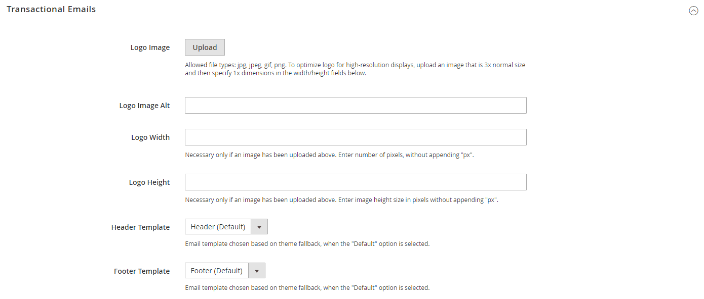

# Modèles d&#39;email

Les modèles de courrier électronique définissent la mise en page, le contenu et la mise en forme des messages automatisés envoyés depuis votre boutique. Elles sont appelées des emails transactionnels, car chacune d’elles est associée à un type spécifique de transaction ou d’événement.

Commerce comprend un ensemble de modèles de courrier électronique réactif qui sont déclenchés par divers événements qui se produisent pendant l’exploitation de votre boutique. Chaque modèle est optimisé pour n’importe quelle taille d’écran et peut être visualisé depuis le bureau, ainsi que sur les tablettes et les appareils mobiles. Il existe divers modèles d’email préparés relatifs aux activités des clients, aux ventes, aux alertes de produit, aux actions d’administration et aux messages système que vous pouvez envoyer. [personnaliser](email-template-custom.md) pour refléter votre marque.

Les courriers électroniques de commerce peuvent être rendus par les clients de messagerie en texte brut et par HTML. Il peut y avoir des différences entre les clients dans la manière dont les courriers électroniques sont rendus.

## Préparer le logo de votre email

Les logos peuvent être enregistrés comme l’un des types de fichiers suivants. Les logos avec arrière-plans transparents peuvent être enregistrés sous la forme de fichiers .GIF ou .PNG.

- JPG/JPEG
- GIF
- PNG

Il existe des dimensions spécifiées dans le modèle d’en-tête. Toutefois, pour garantir un bon rendu de votre logo sur les appareils à haute résolution, l’image chargée doit être trois fois plus grande. En règle générale, l’illustration du logo d’origine est créée sous forme d’image vectorielle, de sorte qu’elle peut être mise à l’échelle sans perte de résolution. L’image peut ensuite être enregistrée dans l’un des formats d’image bitmap pris en charge.

<!-- -->

Pour tirer parti de l’espace vertical limité dans l’en-tête, veillez à recadrer l’image afin d’éliminer tout espace perdu en haut ou en bas. Lors de la modification de l’image, veillez à conserver les proportions du logo, de sorte que la hauteur et la largeur soient redimensionnées proportionnellement.

En règle générale, vous pouvez rendre une image plus petite que l’image d’origine, mais pas plus grande sans perdre de la résolution. La prise d’une petite image et sa mise à l’échelle dans un éditeur de photo réduisent la résolution de l’image. Par exemple, si les dimensions d’affichage du logo sont de 168 pixels de large par 48 pixels de haut dans le modèle d’en-tête, l’image téléchargée doit faire 504 pixels de large par 144 pixels de haut.

| Dimensions du logo | 1 x (taille d’affichage) | 3 x (taille de l’image) |
|----------|----|----|
| Largeur : | 168 px | 504 px |
| Hauteur : | 48 px | 144 px |

{style="table-layout:auto"}

## Configurer des modèles de courrier électronique

La configuration détermine le logo qui apparaît dans le modèle d’en-tête par défaut, ainsi que tout [header](email-template-custom.md#header-template) et [pied de page](email-template-custom.md#footer-template) modèles que vous souhaitez utiliser pour les emails transactionnels envoyés depuis vos magasins.

{width="600" zoomable="yes"}

Pour obtenir la liste détaillée des paramètres de configuration, voir [_Emails transactionnels_](../content-design/configuration.md) dans le _Guide de conception et de contenu_.

## Étape 1. Téléchargement de votre logo

1. Sur le _Administration_ barre latérale, accédez à **[!UICONTROL Content]** > _[!UICONTROL Design]_>**[!UICONTROL Configuration]**.

1. Recherchez la vue de magasin à configurer, puis cliquez sur **[!UICONTROL Edit]** dans le _[!UICONTROL Action]_colonne .

1. Sous _[!UICONTROL Other Settings]_, développer  la valeur **[!UICONTROL Transactional Emails]**.

1. Pour charger votre **[!UICONTROL Logo Image]**, cliquez sur **[!UICONTROL Upload]** et sélectionnez le fichier sur votre système.

1. Pour **[!UICONTROL Logo Image Alt]**, saisissez un texte de remplacement pour identifier l’image.

1. Saisissez le **[!UICONTROL Logo Width]** et **[!UICONTROL Logo Height]** en pixels.

   Saisissez chaque valeur sous la forme d’un nombre, sans le champ `px` abréviation. Ces valeurs se rapportent aux dimensions d’affichage du logo dans l’en-tête, et non à la taille réelle de l’image.

## Étape 2. Sélection de modèles d’en-tête et de pied de page

Si votre boutique contient des modèles d’en-tête et de pied de page personnalisés, ou pour différents magasins, vous pouvez spécifier les modèles utilisés pour chacun d’eux, en fonction des [scope](../getting-started/websites-stores-views.md#scope-settings) de la configuration. Dans le cas contraire, les modèles par défaut sont utilisés. Pour en savoir plus, voir [Personnalisation des modèles de courrier électronique](email-template-custom.md).

1. Choisissez la **[!UICONTROL Header Template]** à utiliser pour tous les emails transactionnels.

1. Choisissez la **[!UICONTROL Footer Template]** à utiliser pour tous les emails transactionnels.

1. Lorsque vous avez terminé, cliquez sur **[!UICONTROL Save Config]**.

## Liste des modèles de courrier électronique

La liste des modèles d&#39;email est organisée par ordre alphabétique par module.

### [!DNL Amazon_Payment]

| Modèle | Chemin de configuration |
|--- |--- |
| `Hard-declined Authorization` | n/a |
| `Soft-declined Authorization` | n/a |

{style="table-layout:auto"}

### [!DNL Magento_Checkout]

| Modèle | Chemin de configuration |
|--- |--- |
| `Payment Failed` | **Page :** [!UICONTROL Sales] > [[!UICONTROL Checkout]](../configuration-reference/sales/checkout.md) **Section :** [!UICONTROL Payment Failed Emails] **Champ :** [!UICONTROL Payment Failed Template] |

{style="table-layout:auto"}

### [!DNL Magento_Company]

 (Disponible avec B2B pour Adobe Commerce uniquement)

| Modèle | Chemin de configuration |
|--- |--- |
| `Assign Company Admin` | **Page :** [!UICONTROL Customers] > [[!UICONTROL Company Configuration]](../configuration-reference/customers/company-configuration.md) **Section :** [!UICONTROL Customer-Related Emails] **Champ :** [!UICONTROL Default 'Assign Company Admin' Email] |
| `Assign Company to Customer` | **Page :** [!UICONTROL Customers] > [Configuration de l’entreprise ](../configuration-reference/customers/company-configuration.md) **Section :** [!UICONTROL Customer-Related Emails]  **Champ :** [!UICONTROL Default 'Assign Company to Customer' Email] |
| `Company Admin Changed to Member` | **Page :** [!UICONTROL Customers] > [[!UICONTROL Company Configuration]](../configuration-reference/customers/company-configuration.md) **Section :** [!UICONTROL Customer-Related Emails] **Champ :** [!UICONTROL Default 'Company Admin Changed To Member' Email] |
| `Company Admin Set Inactive` | **Page :** [!UICONTROL Customers] > [[!UICONTROL Company Configuration]](../configuration-reference/customers/company-configuration.md) **Section :** [!UICONTROL Customer-Related Emails] **Champ :** [!UICONTROL Default 'Customer Status Inactive' Email] |
| `Company Invite` | n/a |
| `Company Registration Request` | **Page :** [!UICONTROL Customers] > [[!UICONTROL Company Configuration]](../configuration-reference/customers/company-configuration.md) **Section :** [!UICONTROL Email Options - Company Registration] **Champ :** [!UICONTROL Default Company Registration Email] |
| `Company Status Active1` | **Page :** [!UICONTROL Customers] > [[!UICONTROL Company Configuration]](../configuration-reference/customers/company-configuration.md) **Section :** [!UICONTROL Company Status Change] **Champ :** [!UICONTROL Default 'Company Status Change To Active 1" Email] |
| `Company Status Active2` | **Page :** [!UICONTROL Customers] > [[!UICONTROL Company Configuration]](../configuration-reference/customers/company-configuration.md) **Section :** [!UICONTROL Company Status Change] **Champ :** [!UICONTROL Default 'Company Status Change To Active 2" Email] |
| `Company Status Blocked` | **Page :** [!UICONTROL Customers] > [[!UICONTROL Company Configuration]](../configuration-reference/customers/company-configuration.md) **Section :** [!UICONTROL Company Status Change] **Champ :** [!UICONTROL Default 'Company Status Change To Blocked" Email] |
| `Company Status Pending Approval` | **Page :** [!UICONTROL Customers] > [[!UICONTROL Company Configuration]](../configuration-reference/customers/company-configuration.md) **Section :** [!UICONTROL Company Status Change] **Champ :** [!UICONTROL Default 'Company Status Change To Pending Approval" Email] |
| `Company Status Rejected` | **Page :** [!UICONTROL Customers] > [[!UICONTROL Company Configuration]](../configuration-reference/customers/company-configuration.md) **Section :** [!UICONTROL Company Status Change] **Champ :** [!UICONTROL Default 'Company Status Change To Rejected" Email] |
| `Customer Status Active` | **Page :** [!UICONTROL Customers] > [[!UICONTROL Company Configuration]](../configuration-reference/customers/company-configuration.md) **Section :** [!UICONTROL Customer-Related Emails] **Champ :** [!UICONTROL Default 'Customer Status Active' Email] |
| `Customer Status Inactive` | **Page :** [!UICONTROL Customers] > [[!UICONTROL Company Configuration]](../configuration-reference/customers/company-configuration.md) **Section :** [!UICONTROL Customer-Related Emails] **Champ :** [!UICONTROL Default 'Company Admin Inactive' Email] |
| `Sales Representative Assigned to Company` | **Page :** [!UICONTROL Customers] > [[!UICONTROL Company Configuration]](../configuration-reference/customers/company-configuration.md) **Section :** [!UICONTROL Customer-Related Emails] **Champ :** [!UICONTROL Default 'Sales Rep Assigned' Email] |

{style="table-layout:auto"}

### [!DNL Magento_CompanyCredit]

 (Disponible avec B2B pour Adobe Commerce uniquement)

| Modèle | Chemin de configuration |
|--- |--- |
| `Credit Limit Allocated` | **Page :** [!UICONTROL Customers] > [[!UICONTROL Company Configuration]](../configuration-reference/customers/company-configuration.md) **Section :** [!UICONTROL Company Credit] **Champ :** [!UICONTROL Allocated Email Template] |
| `Credit Limit Updated` | **Page :** [!UICONTROL Customers] > [[!UICONTROL Company Configuration]](../configuration-reference/customers/company-configuration.md) **Section :** [!UICONTROL Company Credit] **Champ :** [!UICONTROL Updated Email Template] |
| `Credit Reimbursed` | **Page :** [!UICONTROL Customers] > [[!UICONTROL Company Configuration]](../configuration-reference/customers/company-configuration.md) **Section :** [!UICONTROL Company Credit] **Champ :** [!UICONTROL Reimbursed Email Template] |
| `Order Refunded to Company Credit` | **Page :** [!UICONTROL Customers] > [[!UICONTROL Company Configuration]](../configuration-reference/customers/company-configuration.md) **Section :** [!UICONTROL Company Credit] **Champ :** [!UICONTROL Refunded Email Template] |
| `Order Reverted to Company Credit` | **Page :** [!UICONTROL Customers] > [[!UICONTROL Company Configuration]](../configuration-reference/customers/company-configuration.md) **Section :** [!UICONTROL Company Credit] **Champ :** [!UICONTROL Reverted Email Template] |

{style="table-layout:auto"}

### [!DNL Magento_Contact]

| Modèle | Chemin de configuration |
|--- |--- |
| `Contact Form` | **Page :** [!UICONTROL General] > [[!UICONTROL Contacts]](../configuration-reference/general/contacts.md) **Section :** [!UICONTROL Email Options] **Champ :** [!UICONTROL Email Template] |

{style="table-layout:auto"}

### [!UICONTROL Magento_Customer]

| Modèle | Chemin de configuration |
|--- |--- |
| `Change Email` | **Page :** [!UICONTROL Customers] > [[!UICONTROL Customer Configuration]](../configuration-reference/customers/customer-configuration.md) **Section :** [!UICONTROL Account Information Options] **Champ :** [!UICONTROL Change Email Template] |
| Modifier le courrier électronique et le mot de passe | **Page :** [!UICONTROL Customers] > [[!UICONTROL Customer Configuration]](../configuration-reference/customers/customer-configuration.md) **Section :** [!UICONTROL Account Information Options] **Champ :** [!UICONTROL Change Email and Password Template] |
| `Forgot Password` | **Page :** [!UICONTROL Customers] > [[!UICONTROL Customer Configuration]](../configuration-reference/customers/customer-configuration.md) **Section :** [!UICONTROL Password Options] **Champ :** Modèle de courrier électronique oublié |
| `New Account` | **Page :** [!UICONTROL Customers] > [[!UICONTROL Customer Configuration]](../configuration-reference/customers/customer-configuration.md) **Section :** [!UICONTROL Create New Account Options] **Champ :** E-mail de bienvenue par défaut |
| `New Account (Magento/luma)` | **Page :** [!UICONTROL Customers] > [[!UICONTROL Customer Configuration]](../configuration-reference/customers/customer-configuration.md) **Section :** [!UICONTROL Create New Account Options] **Champ :** E-mail de bienvenue par défaut |
| `New Account Confirmation Key` | **Page :** [!UICONTROL Customers] > [[!UICONTROL Customer Configuration]](../configuration-reference/customers/customer-configuration.md) **Section :** [!UICONTROL Create New Account Options] **Champ :** Adresse électronique du lien de confirmation |
| `New Account Confirmed` | **Page :** [!UICONTROL Customers] > [[!UICONTROL Customer Configuration]](../configuration-reference/customers/customer-configuration.md) **Section :** [!UICONTROL Create New Account Options] **Champ :** Courriel de bienvenue |
| `New Account Without Password` | **Page :** [!UICONTROL Customers] > [[!UICONTROL Customer Configuration]](../configuration-reference/customers/customer-configuration.md) **Section :** [!UICONTROL Create New Account Options] **Champ :** Courriel de bienvenue par défaut sans mot de passe |
| `Remind Password` | **Page :** [!UICONTROL Customers] > [[!UICONTROL Customer Configuration]](../configuration-reference/customers/customer-configuration.md) **Section :** [!UICONTROL Password Options] **Champ :** Remplacer le modèle de courrier électronique |
| `Reset Password` | **Page :** [!UICONTROL Customers] > [[!UICONTROL Customer Configuration]](../configuration-reference/customers/customer-configuration.md) **Section :** [!UICONTROL Password Options]  **Champ :** Réinitialiser le modèle de mot de passe |

{style="table-layout:auto"}

### [!DNL Magento_CustomerBalance]

 (Adobe Commerce uniquement)

| Modèle | Chemin de configuration |
|--- |--- |
| `Store Credit Update` | **Page :** [!UICONTROL Customers] > [[!UICONTROL Customer Configuration]](../configuration-reference/customers/customer-configuration.md) **Section :** [!UICONTROL Store Credit Options] **Champ :** [!UICONTROL Store Credit Update Email Template] |

{style="table-layout:auto"}

### [!UICONTROL Magento_Directory]

| Modèle | Chemin de configuration |
|--- |--- |
| `Currency Update Warnings` | **Page :** [!UICONTROL General] > [[!UICONTROL Currency Setup]](../configuration-reference/general/currency-setup.md) **Section :** [!UICONTROL Scheduled Import Settings] **Champ :** [!UICONTROL Error Email Template] |

{style="table-layout:auto"}

### [!UICONTROL Magento_Email]

| Modèle | Chemin de configuration |
|--- |--- |
| `Footer` | n/a |
| `Footer (Magento/luma)` | n/a |
| `Header` | n/a |

{style="table-layout:auto"}

### [!UICONTROL Magento_GiftCard]

 (Adobe Commerce uniquement)

| Modèle | Chemin de configuration |
|--- |--- |
| `Gift Card(s) Purchase` | **Page :** [!UICONTROL Sales] > [[!UICONTROL Gift Cards]](../catalog/product-gift-card-create.md) **Section :** [!UICONTROL Gift Card Email Settings] **Champ :** [!UICONTROL Gift Card Notification Email Template] |

{style="table-layout:auto"}

### [!DNL Magento_GiftCardAccount]

| Modèle | Chemin de configuration |
|--- |--- |
| `Gift Card Code/Balance` | **Page :** [!UICONTROL Sales] > [[!UICONTROL Gift Cards]](../catalog/product-gift-card-create.md) **Section :** [!UICONTROL Email Sent from Gift Card Account Management] **Champ :** [!UICONTROL Gift Card Template] |

{style="table-layout:auto"}

### [!DNL Magento_GiftRegistry]

| Modèle | Chemin de configuration |
|--- |--- |
| `New Registry` | **Page :** [!UICONTROL  Customers] > [[!UICONTROL  Gift Registry]](../configuration-reference/customers/gift-registry.md)  **Section :** [!UICONTROL Owner Notification] **Champ :** [!UICONTROL Email Template] |
| `Registry Sharing` | **Page :** [!UICONTROL  Customers] > [[!UICONTROL  Gift Registry]](../configuration-reference/customers/gift-registry.md)  **Section :** [!UICONTROL Gift Registry Sharing] **Champ :** [!UICONTROL Email Template] |
| `Registry Update` | **Page :** [!UICONTROL  Customers] > [[!UICONTROL  Gift Registry]](../configuration-reference/customers/gift-registry.md)  **Section :** [!UICONTROL Gift Registry Update] **Champ :** [!UICONTROL Email Template] |

{style="table-layout:auto"}

### [!DNL Magento_InventoryInStorePickupSales]

| Modèle | Chemin de configuration |
|--- |--- |
| `Order is Ready for Pickup` | **Page :** [!UICONTROL  Sales] > [[!UICONTROL  Sales Emails]](../configuration-reference/sales/sales-emails.md)  **Section :** [!UICONTROL Order Ready For Pickup in Store] **Champ :** [!UICONTROL Order Ready For Pickup Email Template] |
| `Order is Ready for Pickup For Guest` | **Page :** [!UICONTROL  Sales] > [[!UICONTROL  Sales Emails]](../configuration-reference/sales/sales-emails.md)  **Section :** [!UICONTROL Order Ready For Pickup in Store] **Champ :** [!UICONTROL Order Ready For Pickup Email Template for Guest] |

{style="table-layout:auto"}

### [!DNL Magento_Invitation]

| Modèle | Chemin de configuration |
|--- |--- |
| `Customer Invitation` | **Page :** [!UICONTROL Customers] > [[!UICONTROL Invitation]](../configuration-reference/customers/invitations.md) **Section :** [!UICONTROL Email] **Champ :** [!UICONTROL Customer Invitation Email Template] |

{style="table-layout:auto"}

### [!DNL Magento_NegotiableQuote]

 (Disponible avec B2B pour Adobe Commerce uniquement)

| Modèle | Chemin de configuration |
|--- |--- |
| `Declined Quote` | **Page :** [!UICONTROL  Sales] > [[!UICONTROL  Sales Emails]](../configuration-reference/sales/sales-emails.md)  **Section :** [!UICONTROL Quote] **Champ :** [!UICONTROL Declined Quote Template (to Buyer)] |
| `Expiration Date Reset` | **Page :** [!UICONTROL  Sales] > [[!UICONTROL  Sales Emails]](../configuration-reference/sales/sales-emails.md)  **Section :** [!UICONTROL Quote] **Champ :** [!UICONTROL Expiration Date Reset] | **Page :** [!UICONTROL Sales] > [[!UICONTROL  Sales Emails]](../configuration-reference/sales/sales-emails.md)  **Section :** [!UICONTROL Quote] **Champ :** [!UICONTROL Order Ready For Pickup Email Template] |
| `Expiration Warning` | **Page :** [!UICONTROL  Sales] > [[!UICONTROL  Sales Emails]](../configuration-reference/sales/sales-emails.md)  **Section :** [!UICONTROL Quote] **Champ :** [!UICONTROL Quote Expiration (in 48 hrs)] |
| `Expiration Warning1` | **Page :** [!UICONTROL  Sales] > [[!UICONTROL  Sales Emails]](../configuration-reference/sales/sales-emails.md)  **Section :** [!UICONTROL Quote] **Champ :** [!UICONTROL Quote Expiration (in 24 hrs)] |
| `New Quote` | **Page :** [!UICONTROL  Sales] > [[!UICONTROL  Sales Emails]](../configuration-reference/sales/sales-emails.md)  **Section :** [!UICONTROL Quote] **Champ :** [!UICONTROL New Quote Template (to Seller)] |
| `Updated Quote` | **Page :** [!UICONTROL  Sales] > [[!UICONTROL  Sales Emails]](../configuration-reference/sales/sales-emails.md)  **Section :** [!UICONTROL Quote] **Champ :** [!UICONTROL Updated Quote Template (to Seller)] |

{style="table-layout:auto"}

### [!DNL Magento_Newsletter]

| Modèle | Chemin de configuration |
|--- |--- |
| `Subscription Confirmation` | **Page :** [!UICONTROL Customers] > [[!UICONTROL Newsletter]](../configuration-reference/customers/newsletter.md) **Section :** [!UICONTROL  Subscription Options] **Champ :** [!UICONTROL Confirmation Email Template] |
| `Subscription Success` | **Page :** [!UICONTROL Customers] > [[!UICONTROL Newsletter]](../configuration-reference/customers/newsletter.md) **Section :** [!UICONTROL  Subscription Options] **Champ :** [!UICONTROL Success Email Template] |
| `Unsubscription Success` | **Page :** [!UICONTROL Customers] > [[!UICONTROL Newsletter]](../configuration-reference/customers/newsletter.md) **Section :** [!UICONTROL  Subscription Options] **Champ :** [!UICONTROL Unsubscription Email Template] |

{style="table-layout:auto"}

### [!DNL Magento_ProductAlert]

| Modèle | Chemin de configuration |
|--- |--- |
| `Cron Error Warning` | **Page :** [!UICONTROL Catalog] > [[!UICONTROL Catalog]](../configuration-reference/catalog/catalog.md) **Section :** [!UICONTROL Product Alerts Run Settings] **Champ :** [!UICONTROL Error Email Template] |
| `Price Alert` | **Page :** [!UICONTROL Catalog] > [[!UICONTROL Catalog]](../configuration-reference/catalog/catalog.md) **Section :** [!UICONTROL Product Alerts] **Champ :** [!UICONTROL Price Alert Email Template] |
| `Stock Alert` | **Page :** [!UICONTROL Catalog] > [[!UICONTROL Catalog]](../configuration-reference/catalog/catalog.md) **Section :** [!UICONTROL Product Alerts] **Champ :** [!UICONTROL Stock Alert Email Template] |

{style="table-layout:auto"}

### [!DNL Magento_PurchaseOrder]

| Modèle | Chemin de configuration |
|--- |--- |
| `Approved Purchase Order` | **Page :** [!UICONTROL  Sales] > [[!UICONTROL  Sales Emails]](../configuration-reference/sales/sales-emails.md)  **Section :** [!UICONTROL Purchase Order Approval] **Champ :** [!UICONTROL Approved Purchase Order] |
| `Approved, requires payment` | **Page :** [!UICONTROL  Sales] > [[!UICONTROL  Sales Emails]](../configuration-reference/sales/sales-emails.md)  **Section :** [!UICONTROL Purchase Order Approval] **Champ :** [!UICONTROL Approved, requires payment details (to Buyer)] |
| `Comment added to Purchase Order` | **Page :** [!UICONTROL  Sales] > [[!UICONTROL  Sales Emails]](../configuration-reference/sales/sales-emails.md)  **Section :** [!UICONTROL Purchase Order Approval] **Champ :** [!UICONTROL Comment added to Purchase Order] |
| `Created and Auto-approved Purchase Order` | **Page :** [!UICONTROL  Sales] > [[!UICONTROL  Sales Emails]](../configuration-reference/sales/sales-emails.md)  **Section :** [!UICONTROL Purchase Order Approval] **Champ :** [!UICONTROL Created and Automatically approved Purchase Order (to Buyer)] |
| `Created and automatically approved, requires payment details` | **Page :** [!UICONTROL  Sales] > [[!UICONTROL  Sales Emails]](../configuration-reference/sales/sales-emails.md)  **Section :** [!UICONTROL Purchase Order Approval] **Champ :** [!UICONTROL Created and automatically approved, requires payment details (to Buyer)] |
| `Created and requires Approval Purchase Order` | **Page :** [!UICONTROL  Sales] > [[!UICONTROL  Sales Emails]](../configuration-reference/sales/sales-emails.md)  **Section :** [!UICONTROL Purchase Order Approval] **Champ :** [!UICONTROL Created and requires Approval Purchase Order (to Buyer)] |
| `Error creating Order from Purchase Order` | **Page :** [!UICONTROL  Sales] > [[!UICONTROL  Sales Emails]](../configuration-reference/sales/sales-emails.md)  **Section :** [!UICONTROL Purchase Order Approval] **Champ :** [!UICONTROL Error creating Order from Purchase Order (to Buyer)] |
| `Purchase Order requires Approval` | **Page :** [!UICONTROL  Sales] > [[!UICONTROL  Sales Emails]](../configuration-reference/sales/sales-emails.md)  **Section :** [!UICONTROL Purchase Order Approval] **Champ :** [!UICONTROL Purchase Order requires Approval (to Approver)] |
| `Rejected Purchase Order` | **Page :** [!UICONTROL  Sales] > [[!UICONTROL  Sales Emails]](../configuration-reference/sales/sales-emails.md)  **Section :** [!UICONTROL Purchase Order Approval] **Champ :** [!UICONTROL Rejected Purchase Order (to Buyer)] |

{style="table-layout:auto"}

### [!DNL Magento_Reminder]

 (Adobe Commerce uniquement)

| Modèle | Chemin de configuration |
|--- |--- |
| `Promotion Notification/Reminder` | **Page :** [!UICONTROL Customers] > [[!UICONTROL Promotions]](../configuration-reference/customers/promotions.md) **Section :** [!UICONTROL Automated Email Reminder Rules] **Champ :** [!UICONTROL Reminder Email Sender] |

{style="table-layout:auto"}

### [!DNL Magento_Reward]

 (Adobe Commerce uniquement)

| Modèle | Chemin de configuration |
|--- |--- |
| `Balance Update` | **Page :** [!UICONTROL Customers] > [[!UICONTROL Reward Points]](../configuration-reference/customers/reward-points.md) **Section :** [!UICONTROL Email Notification Settings] **Champ :** [!UICONTROL Balance Update Email] |
| `Points Expiry Warning` | **Page :** [!UICONTROL Customers] > [[!UICONTROL Reward Points]](../configuration-reference/customers/reward-points.md) **Section :** [!UICONTROL Email Notification Settings] **Champ :** [!UICONTROL Reward Points Expiry Warning Email] |

{style="table-layout:auto"}

### [!DNL Magento_Rma]

 (Adobe Commerce uniquement)

| Modèle | Chemin de configuration |
|--- |--- |
| `New RMA` | **Page :** [!UICONTROL  Sales] > [[!UICONTROL  Sales Emails]](../configuration-reference/sales/sales-emails.md)  **Section :** [!UICONTROL  RMA] **Champ :** [!UICONTROL RMA Email Template] |
| `New RMA for Guest` | **Page :** [!UICONTROL  Sales] > [[!UICONTROL  Sales Emails]](../configuration-reference/sales/sales-emails.md)  **Section :** [!UICONTROL  RMA] **Champ :** [!UICONTROL RMA Email Template for Guest] |
| `RMA Admin Comments` | **Page :** [!UICONTROL  Sales] > [[!UICONTROL  Sales Emails]](../configuration-reference/sales/sales-emails.md)  **Section :** [!UICONTROL  RMA Admin Comments] **Champ :** [!UICONTROL RMA Comment Email Template] |
| `RMA Admin Comments for Guest` | **Page :** [!UICONTROL  Sales] > [[!UICONTROL  Sales Emails]](../configuration-reference/sales/sales-emails.md)  **Section :** [!UICONTROL  RMA Admin Comments] **Champ :** [!UICONTROL RMA Comment Email Template for Guest] |
| `RMA Authorization` | **Page :** [!UICONTROL  Sales] > [[!UICONTROL  Sales Emails]](../configuration-reference/sales/sales-emails.md)  **Section :** [!UICONTROL  RMA Authorization] **Champ :** [!UICONTROL RMA Authorization Email Template] |
| `RMA Authorization for Guest` | **Page :** [!UICONTROL  Sales] > [[!UICONTROL  Sales Emails]](../configuration-reference/sales/sales-emails.md)  **Section :** [!UICONTROL  RMA Authorization] **Champ :** [!UICONTROL RMA Authorization Email Template for Guest] |
| `RMA Customer Comments` | **Page :** [!UICONTROL  Sales] > [[!UICONTROL  Sales Emails]](../configuration-reference/sales/sales-emails.md)  **Section :** [!UICONTROL RMA Customer Comments] **Champ :** [!DNL RMA Comment Email Template] |

{style="table-layout:auto"}

### [!DNL Magento_Sales]

| Modèle | Chemin de configuration |
|--- |--- |
| `Credit Memo Update` | **Page :** [!UICONTROL  Sales] > [[!UICONTROL  Sales Emails]](../configuration-reference/sales/sales-emails.md) **Section :** [!UICONTROL Credit Memo Contents] **Champ :** [!UICONTROL Credit Memo Comment Email Template] |
| `Credit Memo Update (Magento/luma)` | **Page :** [!UICONTROL  Sales] > [[!UICONTROL  Sales Emails]](../configuration-reference/sales/sales-emails.md) **Section :** [!UICONTROL Credit Memo Comments] **Champ :** [!UICONTROL Credit Memo Comment Email Template] |
| `Credit Memo Update for Guest` | **Page :** [!UICONTROL  Sales] > [[!UICONTROL  Sales Emails]](../configuration-reference/sales/sales-emails.md) **Section :** [!UICONTROL Credit Memo Comments] **Champ :** [!UICONTROL Credit Memo Comment Email Template for Guest] |
| `Credit Memo Update for Guest (Magento/luma)` | **Page :** [!UICONTROL  Sales] > [[!UICONTROL  Sales Emails]](../configuration-reference/sales/sales-emails.md) **Section :** [!UICONTROL Credit Memo Comments] **Champ :** [!UICONTROL Credit Memo Comment Email Template for Guest] |
| `Invoice Update` | **Page :** [!UICONTROL  Sales] > [[!UICONTROL  Sales Emails]](../configuration-reference/../configuration-reference/sales/sales-emails.md) **Section :** [!UICONTROL Invoice Comments] **Champ :** [!UICONTROL Invoice Comment Email Template] |
| `Invoice Update (Magento/luma)` | **Page :** [!UICONTROL  Sales] > [[!UICONTROL  Sales Emails]](../configuration-reference/sales/sales-emails.md) **Section :** [!UICONTROL Invoice Comments] **Champ :** [!UICONTROL Invoice Comment Email Template] |
| `Invoice Update for Guest` | **Page :** [!UICONTROL  Sales] > [[!UICONTROL  Sales Emails]](../configuration-reference/sales/sales-emails.md) **Section :** [!UICONTROL Invoice Comments] **Champ :** [!UICONTROL Invoice Comment Email Template for Guest] |
| `Invoice Update for Guest (Magento/luma)` | **Page :** [!UICONTROL  Sales] > [[!UICONTROL  Sales Emails]](../configuration-reference/sales/sales-emails.md) **Section :** [!UICONTROL Invoice Comments] **Champ :** [!UICONTROL Invoice Comment Email Template for Guest] |
| `New Credit Memo` | **Page :** [!UICONTROL  Sales] > [[!UICONTROL  Sales Emails]](../configuration-reference/sales/sales-emails.md) **Section :** [!UICONTROL Credit Memo] **Champ :** [!UICONTROL Credit Memo Email Template] |
| `New Credit Memo (Magento/luma)` | **Page :** [!UICONTROL  Sales] > [[!UICONTROL  Sales Emails]]../configuration-reference/sales/sales-emails.md) **Section :** [!UICONTROL Credit Memo] **Champ :** [!UICONTROL Credit Memo Email Template] |
| `New Credit Memo for Guest` | **Page :** [!UICONTROL  Sales] > [[!UICONTROL  Sales Emails]](../configuration-reference/sales/sales-emails.md) **Section :** [!UICONTROL Credit Memo] **Champ :** [!UICONTROL Credit Memo Email Template for Guest] |
| `New Credit Memo for Guest (Magento/luma)` | **Page :** [!UICONTROL  Sales] > [[!UICONTROL  Sales Emails]](../configuration-reference/sales/sales-emails.md) **Section :** [!UICONTROL Credit Memo] **Champ :** [!UICONTROL Credit Memo Email Template for Guest] |
| `New Invoice` | **Page :** [!UICONTROL  Sales] > [[!UICONTROL  Sales Emails]](../configuration-reference/sales/sales-emails.md) **Section :** [!UICONTROL Invoice] **Champ :** [!UICONTROL Invoice Email Template] |
| `New Invoice (Magento/luma)` | **Page :** [!UICONTROL  Sales] > [[!UICONTROL  Sales Emails]](../configuration-reference/sales/sales-emails.md) **Section :** [!UICONTROL Invoice] **Champ :** [!UICONTROL Invoice Email Template] |
| `New Invoice for Guest` | **Page :** [!UICONTROL  Sales] > [[!UICONTROL  Sales Emails]](../configuration-reference/sales/sales-emails.md) **Section :** [!UICONTROL Invoice] **Champ :** [!UICONTROL Invoice Email Template for Guest] |
| `New Invoice for Guest (Magento/luma)` | **Page :** [!UICONTROL  Sales] > [[!UICONTROL  Sales Emails]](../configuration-reference/sales/sales-emails.md) **Section :** [!UICONTROL Invoice] **Champ :** [!UICONTROL Invoice Email Template for Guest] |
| `New Order` | **Page :** [!UICONTROL  Sales] > [[!UICONTROL  Sales Emails]](../configuration-reference/sales/sales-emails.md) **Section :** [!UICONTROL Order] **Champ :** [!UICONTROL New Order Confirmation Template] |
| `New Order (Magento/luma)` | **Page :** [!UICONTROL  Sales] > [[!UICONTROL  Sales Emails]](../configuration-reference/sales/sales-emails.md) **Section :** [!UICONTROL Order] **Champ :** [!UICONTROL New Order Confirmation Template] |
| `New Order for Guest` | **Page :** [!UICONTROL  Sales] > [[!UICONTROL  Sales Emails]](../configuration-reference/sales/sales-emails.md) **Section :** [!UICONTROL Order] **Champ :** [!UICONTROL New Order Confirmation Template for Guest] |
| `New Order for Guest (Magento/luma)` | **Page :** [!UICONTROL  Sales] > [[!UICONTROL  Sales Emails]](../configuration-reference/sales/sales-emails.md) **Section :** [!UICONTROL Order] **Champ :** [!UICONTROL New Order Confirmation Template for Guest] |
| `New Shipment` | **Page :** [!UICONTROL  Sales] > [[!UICONTROL  Sales Emails]](../configuration-reference/sales/sales-emails.md) **Section :** [!UICONTROL Shipment] **Champ :** [!UICONTROL Shipment Email Template] |
| `New Shipment (Magento/luma)` | **Page :** [!UICONTROL  Sales] > [[!UICONTROL  Sales Emails]](../configuration-reference/sales/sales-emails.md) **Section :** [!UICONTROL Shipment] **Champ :** [!UICONTROL Shipment Email Template] |
| `New Shipment for Guest` | **Page :** [!UICONTROL  Sales] > [[!UICONTROL  Sales Emails]](../configuration-reference/sales/sales-emails.md) **Section :** [!UICONTROL Shipment] **Champ :** [!UICONTROL Shipment Email Template for Guest] |
| `New Shipment for Guest (Magento/luma)` | **Page :** [!UICONTROL  Sales] > [[!UICONTROL  Sales Emails]](../configuration-reference/sales/sales-emails.md) **Section :** [!UICONTROL Shipment] **Champ :** [!UICONTROL Shipment Email Template for Guest] |
| `Order Update` | **Page :** [!UICONTROL  Sales] > [[!UICONTROL  Sales Emails]](../configuration-reference/sales/sales-emails.md) **Section :** [!UICONTROL Order Comments] **Champ :** [!UICONTROL Order Comment Email Template] |
| `Order Update (Magento/luma)` | **Page :** [!UICONTROL  Sales] > [[!UICONTROL  Sales Emails]](../configuration-reference/sales/sales-emails.md) **Section :** [!UICONTROL Order Comments] **Champ :** [!UICONTROL Order Comment Email Template] |
| `Order Update for Guest` | **Page :** [!UICONTROL  Sales] > [[!UICONTROL  Sales Emails]](../configuration-reference/sales/sales-emails.md) **Section :** [!UICONTROL Order Comments] **Champ :** [!UICONTROL Order Comment Email Template for Guest] |
| `Order Update for Guest (Magento/luma)` | **Page :** [!UICONTROL  Sales] > [[!UICONTROL  Sales Emails]](../configuration-reference/sales/sales-emails.md) **Section :** [!UICONTROL Order Comments] **Champ :** [!UICONTROL Order Comment Email Template for Guest] |
| `Shipment Update` | **Page :** [!UICONTROL  Sales] > [[!UICONTROL  Sales Emails]](../configuration-reference/sales/sales-emails.md) **Section :** [!UICONTROL Shipment Comments] **Champ :** [!UICONTROL Shipment Comment Email Template] |
| `Shipment Update (Magento/luma)` | **Page :** [!UICONTROL  Sales] > [[!UICONTROL  Sales Emails]](../configuration-reference/sales/sales-emails.md) **Section :** [!UICONTROL Shipment Comments] **Champ :** [!UICONTROL Shipment Comment Email Template] |
| `Shipment Update for Guest` | **Page :** [!UICONTROL  Sales] > [[!UICONTROL  Sales Emails]](../configuration-reference/sales/sales-emails.md) **Section :** [!UICONTROL Shipment Comments] **Champ :** [!UICONTROL Shipment Comment Email Template for Guest] |
| `Shipment Update for Guest (Magento/luma)` | **Page :** [!UICONTROL  Sales] > [[!UICONTROL  Sales Emails]](../configuration-reference/sales/sales-emails.md) **Section :** [!UICONTROL Shipment Comments] **Champ :** [!UICONTROL Shipment Comment Email Template for Guest] |

{style="table-layout:auto"}

### [!DNL Magento_ScheduledImportExport]

 (Adobe Commerce uniquement)

| Modèle | Chemin de configuration |
|--- |--- |
| `Export Failed` | **Page :** [!UICONTROL Advanced] > [[!UICONTROL System]](../configuration-reference/advanced/system.md) **Section :** [!UICONTROL Scheduled Import/Export File History Cleaning] **Champ :** [!UICONTROL Export Failed Template] |
| `File History Clean Failed` | **Page :** [!UICONTROL Advanced] > [[!UICONTROL System]](../configuration-reference/advanced/system.md) **Section :** [!UICONTROL Scheduled Import/Export File History Cleaning] **Champ :** [!UICONTROL Error Email Template] |
| `Import Failed` | **Page :** [!UICONTROL Advanced] > [[!UICONTROL System]](../configuration-reference/advanced/system.md) **Section :** [!UICONTROL Scheduled Import/Export File History Cleaning] **Champ :** [!UICONTROL Import Failed Template] |

{style="table-layout:auto"}

### [!DNL Magento_SendFriend]

| Modèle | Chemin de configuration |
|--- |--- |
| `Send Product Link to Friend` | **Page :** [!UICONTROL Catalog] > [[!UICONTROL Email to a Friend]](../configuration-reference/catalog/email-to-a-friend.md) **Section :** [!UICONTROL Email Templates] **Champ :** [!UICONTROL Select Email Template] |

{style="table-layout:auto"}

### [!DNL Magento_Sitemap]

| Modèle | Chemin de configuration |
|--- |--- |
| `Sitemap Generation Settings` | **Page :** [!UICONTROL Catalog] > [[!UICONTROL XML Sitemap]](../configuration-reference/catalog/xml-sitemap.md) **Section :** [!UICONTROL Generation Settings] **Champ :** [!UICONTROL Error Email Template] |

{style="table-layout:auto"}

### [!DNL Magento_TwoFactorAuth]

| Modèle | Chemin de configuration |
|--- |--- |
| `2FA Configuration Required by User` | n/a |
| `2FA Configuration Required for the Application` | n/a |

{style="table-layout:auto"}

### [!DNL Magento_User]

| Modèle | Chemin de configuration |
|--- |--- |
| `Forgot Admin Password` | **Page :** [!UICONTROL Advanced] > [[!UICONTROL Admin]](../configuration-reference/advanced/admin.md) **Section :** [!UICONTROL Admin User Emails] **Champ :** Modèle de courrier électronique avec mot de passe oublié |
| `User Notification` | **Page :** [!UICONTROL Advanced] > [[!UICONTROL Admin]](../configuration-reference/advanced/admin.md) **Section :** [!UICONTROL Admin User Emails] **Champ :** Modèle de notification utilisateur |
| `New User Notification` | **Page :** [!UICONTROL Advanced] > [[!UICONTROL Admin]](../configuration-reference/advanced/admin.md) **Section :** [!UICONTROL Admin User Emails] **Champ :** [!UICONTROL New User Notification Template] |

{style="table-layout:auto"}

### [!DNL Magento_Wishlist]

| Modèle | Chemin de configuration |
|--- |--- |
| `Magento Wish List Sharing` | **Page :** [!UICONTROL Customers] > [[!UICONTROL Wish List]](../configuration-reference/customers/wishlist.md) **Section :** [!UICONTROL Share Options] **Champ :** [!UICONTROL Email Template] |

{style="table-layout:auto"}
