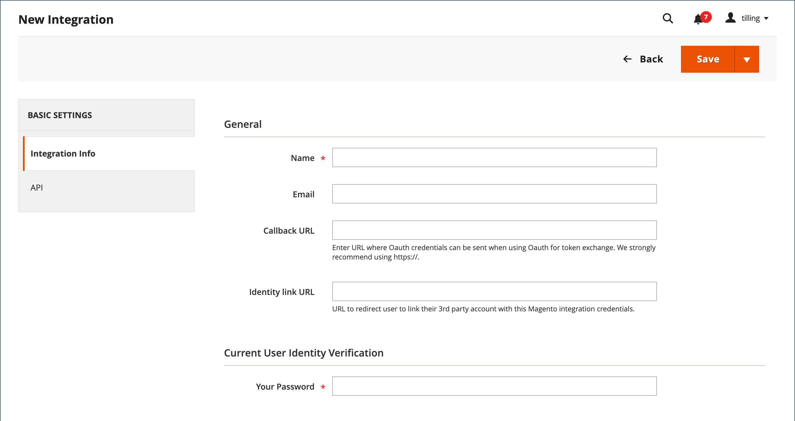
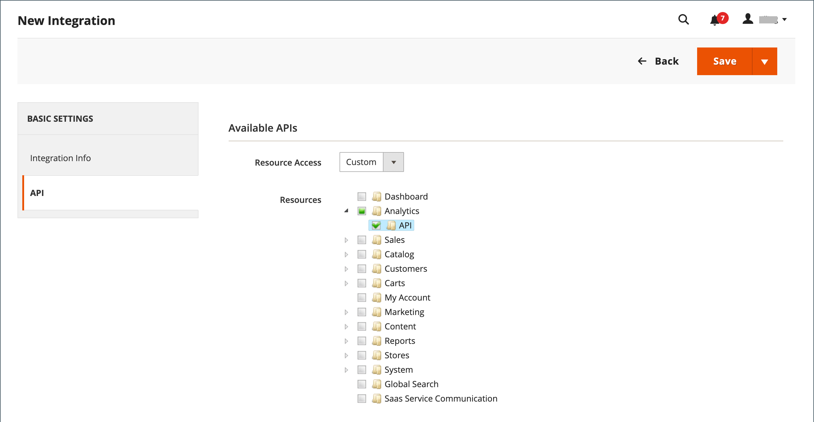

# Intégrations

La définition d’une intégration dans l’administrateur Commerce détermine l’emplacement des informations d’identification OAuth et de l’URL de redirection pour les intégrations tierces, et identifie les ressources d’API disponibles nécessaires à l’intégration. Pour plus d’informations sur le processus d’enregistrement de l’intégration, voir [Authentification basée sur OAuth](https://developer.adobe.com/commerce/webapi/get-started/authentication/gs-authentication-oauth/) dans la documentation destinée aux développeurs Commerce.

{width="700" zoomable="yes"}

## Processus d’intégration

1. **Autoriser l’intégration** - Accédez au **[!UICONTROL System]** > _[!UICONTROL Extensions]_>**[!UICONTROL Integrations]**, recherchez l’intégration appropriée et autorisez-la.
1. **Vérifier et établir la connexion** - Lorsque vous y êtes invité, acceptez l’accès demandé. Si vous êtes redirigé vers un tiers, connectez-vous au système ou créez un compte. Une fois la connexion établie, vous revenez à la page d’intégration.
1. **Recevoir la confirmation de l&#39;intégration autorisée** - Le système envoie une notification indiquant que l’intégration a été autorisée avec succès. Après avoir configuré une intégration et reçu les informations d’identification, il n’est plus nécessaire d’effectuer des appels pour accéder aux jetons ou de demander des jetons.

## Ajout d’une intégration

1. Sur le _Administration_ barre latérale, accédez à **[!UICONTROL System]** > _[!UICONTROL Extensions]_>**[!UICONTROL Integrations]**.

   {width="600" zoomable="yes"}

1. Renseignez les informations d’intégration suivantes :

   - Saisissez le **[!UICONTROL Name]** de l&#39;intégration et du contact **[!UICONTROL Email]** adresse.

   - Saisissez le **[!UICONTROL Callback URL]** où les informations d’identification OAuth peuvent être envoyées lors de l’utilisation d’OAuth pour l’échange de jetons. Utilisation `https://` est vivement recommandé.

   - Saisissez le **[!UICONTROL Identity Link URL]** pour rediriger les utilisateurs vers un compte tiers à l’aide de ces informations d’identification d’intégration Adobe Commerce ou Magento Open Source.

   >[!NOTE]
   >
   > La variable `Integration not secure` le libellé d’avertissement s’affiche à côté de chaque nom d’intégration sur la [!UICONTROL Integrations] en tant que rappel, jusqu’à ce que les URL HTTPS soient enregistrées dans [!UICONTROL Callback URL] et [!UICONTROL Identity Link URL] des champs.

   - Lorsque vous y êtes invité, saisissez votre mot de passe pour confirmer votre identité.

1. Dans le panneau de gauche, choisissez **[!UICONTROL API]** et procédez comme suit :

   - Définir **[!UICONTROL Resource Access]** à l’une des options suivantes :

      - `All`
      - `Custom`

   - Pour un accès personnalisé, cochez la case de chaque ressource nécessaire.

     {width="600" zoomable="yes"}

1. Lorsque vous avez terminé, cliquez sur **[!UICONTROL Save]**.

## Activation d’une intégration

Par défaut, une intégration enregistrée s’affiche sur la grille avec une `Inactive` statut. Pour l’activer, procédez comme suit :

1. Sur le _Administration_ barre latérale, accédez à **[!UICONTROL System]** > _[!UICONTROL Extensions]_>**[!UICONTROL Integrations]**.

1. Recherchez l’intégration que vous venez de créer, puis cliquez sur le bouton **[!UICONTROL Activate]** lien.

1. Dans le coin supérieur droit, cliquez sur **[!UICONTROL Allow]**.

   Cette action affiche les jetons d’intégration pour les extensions. Copiez ces informations dans un emplacement sécurisé et chiffré à utiliser avec votre intégration.

   {width="600" zoomable="yes"}

1. Dans le coin supérieur droit, cliquez sur **[!UICONTROL Done]**.

## Réautoriser une intégration

Pour générer un nouveau jeton d’accès à l’intégration et un nouveau secret de jeton d’accès, réautorisez l’intégration à partir de l’administrateur :

1. Sur le _Administration_ barre latérale, accédez à **[!UICONTROL System]** > _[!UICONTROL Extensions]_>**[!UICONTROL Integrations]**.

1. Recherchez l’intégration avec la méthode **[!UICONTROL Active]** statut.

1. Dans _[!UICONTROL Activate]_, cliquez sur le bouton **[!UICONTROL Reauthorize]**.

1. Cliquez sur **[!UICONTROL Reauthorize]** pour approuver l’accès aux ressources de l’API.

1. Enregistrez les nouveaux jetons d’intégration pour les extensions et cliquez sur **[!UICONTROL Done]**.

## Modification du paramètre de sécurité de l’accès des invités à l’API

Par défaut, le système n’autorise pas l’accès anonyme des invités à CMS, catalogue et autres ressources de magasin. Si vous devez modifier le paramètre, procédez comme suit :

1. Sur le _Administration_ barre latérale, accédez à **[!UICONTROL Stores]** > _[!UICONTROL Settings]_>**[!UICONTROL Configuration]**.

1. Dans le panneau de gauche, développez **[!UICONTROL Services]** et choisissez **[!UICONTROL Magento Web API]**.

1. Développer  la valeur **[!UICONTROL Web API Security Setting]** .

   {width="600" zoomable="yes"}

1. Définir **[!UICONTROL Allow Anonymous Guest Access]** to `Yes`.

1. Lorsque vous avez terminé, cliquez sur **[!UICONTROL Save Config]**.

Pour plus d’informations, voir [Limitation de l’accès aux API web anonymes](https://developer.adobe.com/commerce/webapi/rest/use-rest/anonymous-api-security/) dans la documentation destinée aux développeurs Commerce.

## Suppression d’une intégration

1. Sur le _Administration_ barre latérale, accédez à **[!UICONTROL System]** > _[!UICONTROL Extensions]_>**[!UICONTROL Integrations]**.

1. Recherchez l’intégration existante et cliquez sur l’icône (  ) dans la variable **[!UICONTROL Delete]** colonne .

1. Pour confirmer votre action, cliquez sur **[!UICONTROL OK]**.
