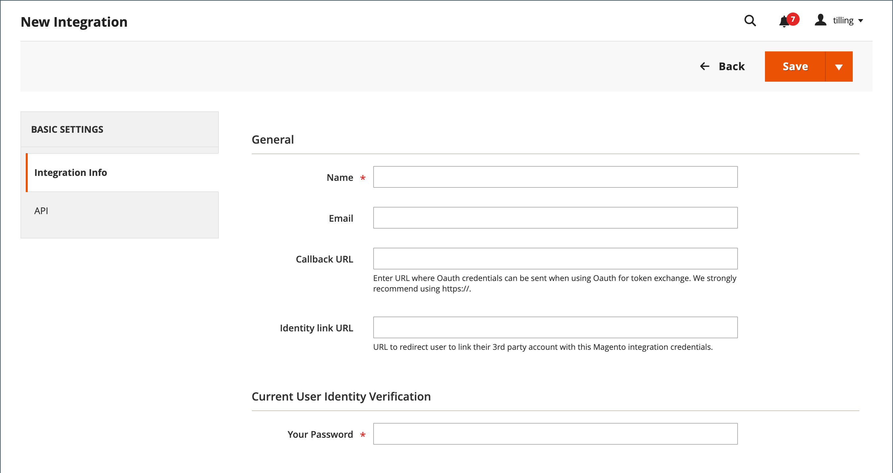

# Intégrations

La définition d’une intégration dans Commerce Admin établit l’emplacement des informations d’identification OAuth et de l’URL de redirection pour les intégrations tierces, et identifie les ressources d’API disponibles qui sont nécessaires à l’intégration. Pour plus d’informations sur le processus d’enregistrement de l’intégration, consultez [Authentification basée sur OAuth](https://developer.adobe.com/commerce/webapi/get-started/authentication/gs-authentication-oauth/) dans la documentation du développeur de Commerce.

{width="700" zoomable="yes"}

## Workflow d’intégration

1. **Autoriser l’intégration** - Accédez à la page **[!UICONTROL System]** > _[!UICONTROL Extensions]_>**[!UICONTROL Integrations]**, recherchez l’intégration appropriée et autorisez.
1. **Vérifier et établir une connexion** - Lorsque vous y êtes invité, acceptez l’accès demandé. S’il est redirigé vers un tiers, connectez-vous au système ou créez un compte. Une fois la connexion établie, vous revenez à la page d’intégration.
1. **Recevoir une confirmation de l’intégration autorisée** - Le système envoie une notification indiquant que l’intégration a été autorisée avec succès. Après avoir configuré une intégration et reçu les informations d’identification, il n’est plus nécessaire d’effectuer des appels pour accéder aux jetons ou les demander.

## Ajout d’une intégration

1. Dans la barre latérale _Admin_, accédez à **[!UICONTROL System]** > _[!UICONTROL Extensions]_>**[!UICONTROL Integrations]**.

   {width="600" zoomable="yes"}

1. Saisissez les informations d’intégration suivantes :

   - Saisissez le **[!UICONTROL Name]** de l’intégration et l’adresse **[!UICONTROL Email]** du contact.

   - Saisissez l’**[!UICONTROL Callback URL]** où les informations d’identification OAuth peuvent être envoyées lors de l’utilisation d’OAuth pour l’échange de jetons. L’utilisation de `https://` est vivement recommandée.

   - Saisissez la **[!UICONTROL Identity Link URL]** de rediriger les utilisateurs vers un compte tiers avec ces informations d’identification d’intégration d’Adobe Commerce ou de Magento Open Source.

   >[!NOTE]
   >
   > Le libellé d’avertissement `Integration not secure` s’affiche à proximité de chaque nom d’intégration sur la grille de [!UICONTROL Integrations] à titre de rappel, jusqu’à ce que les URL HTTPS soient enregistrées dans les champs [!UICONTROL Callback URL] et [!UICONTROL Identity Link URL].

   - Lorsque vous y êtes invité, saisissez votre mot de passe pour confirmer votre identité.

1. Dans le panneau de gauche, choisissez **[!UICONTROL API]** et procédez comme suit :

   - Définissez **[!UICONTROL Resource Access]** sur l’une des options suivantes :

      - `All`
      - `Custom`

   - Pour un accès personnalisé, cochez la case de chaque ressource nécessaire.

     {width="600" zoomable="yes"}

1. Cliquez ensuite sur **[!UICONTROL Save]**.

## Activation d’une intégration

Par défaut, une intégration enregistrée s’affiche sur la grille avec un statut `Inactive` . Pour l’activer, procédez comme suit :

1. Dans la barre latérale _Admin_, accédez à **[!UICONTROL System]** > _[!UICONTROL Extensions]_>**[!UICONTROL Integrations]**.

1. Recherchez l’intégration nouvellement créée et cliquez sur le lien **[!UICONTROL Activate]** .

1. Dans le coin supérieur droit, cliquez sur **[!UICONTROL Allow]**.

   Cette action affiche les jetons d’intégration pour les extensions. Copiez ces informations vers un emplacement sécurisé et chiffré à utiliser avec votre intégration.

   {width="600" zoomable="yes"}

1. Dans le coin supérieur droit, cliquez sur **[!UICONTROL Done]**.

## Réautoriser une intégration

Pour générer un nouveau jeton d’accès à l’intégration et un nouveau secret de jeton d’accès, a réautorisé l’intégration depuis l’administration :

1. Dans la barre latérale _Admin_, accédez à **[!UICONTROL System]** > _[!UICONTROL Extensions]_>**[!UICONTROL Integrations]**.

1. Recherchez l’intégration avec le statut **[!UICONTROL Active]** .

1. Dans _[!UICONTROL Activate]_&#x200B;colonne, cliquez sur le **[!UICONTROL Reauthorize]**.

1. Cliquez sur **[!UICONTROL Reauthorize]** pour approuver l’accès aux ressources de l’API.

1. Enregistrez les nouveaux jetons d’intégration pour les extensions et cliquez sur **[!UICONTROL Done]**.

## Modification du paramètre de sécurité d’accès des invités à l’API

Par défaut, le système n’autorise pas l’accès anonyme des invités à CMS, au catalogue et à d’autres ressources du magasin. Si vous devez modifier le paramètre, procédez comme suit :

1. Dans la barre latérale _Admin_, accédez à **[!UICONTROL Stores]** > _[!UICONTROL Settings]_>**[!UICONTROL Configuration]**.

1. Dans le panneau de gauche, développez **[!UICONTROL Services]** et choisissez **[!UICONTROL Magento Web API]**.

1. Développez  la section **[!UICONTROL Web API Security Setting]** .

   {width="600" zoomable="yes"}

1. Définissez **[!UICONTROL Allow Anonymous Guest Access]** sur `Yes`.

1. Cliquez ensuite sur **[!UICONTROL Save Config]**.

Pour plus d’informations, consultez [Restriction de l’accès aux API web anonymes](https://developer.adobe.com/commerce/webapi/rest/use-rest/anonymous-api-security/) dans la documentation destinée aux développeurs Commerce.

## Suppression d’une intégration

1. Dans la barre latérale _Admin_, accédez à **[!UICONTROL System]** > _[!UICONTROL Extensions]_>**[!UICONTROL Integrations]**.

1. Recherchez l’intégration existante et cliquez sur l’icône (  ) dans la colonne **[!UICONTROL Delete]**.

1. Pour confirmer votre action, cliquez sur **[!UICONTROL OK]**.
