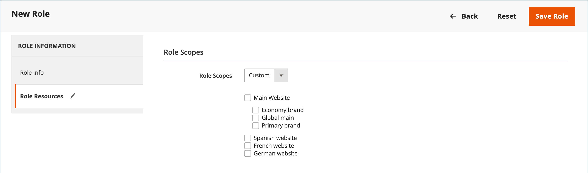

# Rôles utilisateur

Pour accorder à une personne un accès limité à l’administrateur, la première étape consiste à créer un rôle disposant du niveau d’autorisation approprié. Une fois le rôle enregistré, vous pouvez ajouter de nouveaux utilisateurs et attribuer le rôle restreint afin de leur accorder un accès limité à l’administrateur.

{width="600" zoomable="yes"}

## Définition d’un rôle

1. Sur la barre latérale _Admin_, accédez à **[!UICONTROL System]** > _[!UICONTROL Permissions]_>**[!UICONTROL User Roles]**.

1. Dans le coin supérieur droit, cliquez sur **[!UICONTROL Add New Role]**.

1. Suivez les étapes pour définir le rôle :

### Étape 1 : Ajout du nom du rôle

1. Sous _[!UICONTROL Role Information]_, saisissez un **[!UICONTROL Role Name]**&#x200B;descriptif.

1. Sous _[!UICONTROL Current User Identity Verification]_, saisissez votre mot de passe.

   {width="600" zoomable="yes"}

### Etape 2 : affecter des ressources

>[!IMPORTANT]
>
>Lors de l’affectation de ressources, veillez à désactiver l’accès à l’outil Autorisations si vous limitez l’accès pour un rôle donné. Dans le cas contraire, les utilisateurs peuvent modifier leurs propres autorisations.

1. Définissez **[!UICONTROL Role Scopes]** sur l’une des options suivantes :

   - `All`
   - `Custom`

   Si elle est définie sur `Custom` pour une installation multi-site, cochez la case du site web et stockez l’emplacement d’utilisation du rôle.

   {width="600" zoomable="yes"}

   >[!NOTE]
   >
   >Les utilisateurs disposant d’une portée de rôle `Custom` ne peuvent pas créer de sites web et de catégories, affecter des produits à des catégories ou modifier des produits dans une portée _[!UICONTROL All Store Views]_&#x200B;lorsqu’ils sont affectés à des boutiques restreintes. Ces utilisateurs ne peuvent pas non plus effectuer d’autres actions_ global _qui affectent les portées auxquelles ils n’ont pas accès.

1. Sous _[!UICONTROL Roles Resources]_, définissez **[!UICONTROL Resource Access]**&#x200B;sur `Custom`.

1. Dans l’arborescence **[!UICONTROL Resource]**, cochez la case de chaque fonctionnalité d’administration à laquelle le rôle peut accéder.

   Pour créer un rôle d’administrateur avec accès aux paramètres de taxe, sélectionnez les ressources Ventes/Taxe et Système/Taxe . Si vous configurez un site web pour une région qui diffère de votre [point d’origine d’expédition par défaut](../stores-purchase/shipping-settings.md#point-of-origin), vous devez autoriser l’accès aux ressources système/d’expédition pour le rôle . Les paramètres d’expédition déterminent le taux de taxe de magasin utilisé pour les prix du catalogue.

   {width="600" zoomable="yes"}

   La liste des autorisations disponibles peut inclure des options supplémentaires pour les extensions groupées et installées. En sélectionnant l’autorisation la plus élevée pour chaque fonctionnalité, vous attribuez toutes les autorisations disponibles pour l’utilisateur.

   >[!NOTE]
   >
   >Un utilisateur administrateur doit disposer de **[!UICONTROL Sales / Archive]** autorisations pour la portée de son rôle pour voir la commande _[!UICONTROL Invoices]_,_[!UICONTROL Credit Memos]_ et _[!UICONTROL Shipments]_[onglets](../stores-purchase/order-processing.md).

1. Une fois l’opération terminée, cliquez sur **[!UICONTROL Save Role]**.

   Le rôle apparaît désormais dans la grille et peut être affecté à des comptes d’utilisateurs.

## Attribution d’un rôle aux utilisateurs

1. Dans la grille _[!UICONTROL Roles]_, ouvrez l’enregistrement en mode d’édition.

1. Sous _[!UICONTROL Current User Identity Verification]_, saisissez le mot de passe de votre compte utilisateur.

1. Dans le panneau de gauche, choisissez **[!UICONTROL Role Users]**.

   L’option _[!UICONTROL Role Users]_&#x200B;ne s’affiche qu’après l’enregistrement d’un nouveau rôle.

   {width="600" zoomable="yes"}

1. Pour rechercher un enregistrement utilisateur spécifique, procédez comme suit :

   - Saisissez la valeur dans le filtre de recherche en haut d’une colonne et appuyez sur **Entrée**.

   - Lorsque vous êtes prêt à revenir à la liste complète, cliquez sur **[!UICONTROL Reset Filter]**.

1. Cochez la case des utilisateurs auxquels attribuer le rôle.

1. Cliquez sur **[!UICONTROL Save Role]**.

## Modification d’un rôle

1. Sur la barre latérale _Admin_, accédez à **[!UICONTROL System]** > _[!UICONTROL Permissions]_>**[!UICONTROL User Roles]**.

1. Localisez le rôle à l’aide de filtres au-dessus de la grille et cliquez sur le nom du rôle.

1. Apportez les modifications nécessaires.

   Pour plus d’informations sur les paramètres des rôles, consultez les étapes de création d’un rôle utilisateur .

1. Lorsque vous y êtes invité, saisissez votre mot de passe pour confirmer votre identité.

1. Cliquez sur le **[!UICONTROL Save Role]**.

## Suppression d’un rôle

1. Sur la barre latérale _Admin_, accédez à **[!UICONTROL System]** > _[!UICONTROL Permissions]_>**[!UICONTROL User Roles]**.

1. Localisez le rôle à l’aide de filtres au-dessus de la grille et ouvrez-le en mode d’édition.

1. Dans le coin supérieur droit, cliquez sur **[!UICONTROL Delete Role]**.

1. Pour confirmer l’action, cliquez sur **[!UICONTROL OK]**.

## Démonstration des rôles utilisateur

Regardez cette vidéo pour en savoir plus sur la gestion des rôles utilisateur :

>[!VIDEO](https://video.tv.adobe.com/v/343654?quality=12&learn=on)

## Ressources de rôle

L’accès aux ressources suivantes peut être affecté à un rôle personnalisé. Consultez la page liée pour en savoir plus sur les fonctionnalités associées à chaque ressource.

 - Adobe Commerce uniquement

 - Disponible avec Adobe Commerce B2B uniquement

| Ressource |   |   |
| --- | --- | --- |
| [`Dashboard`](../getting-started/admin-dashboard.md) |  |  |
| [`Sales`](../stores-purchase/sales-menu.md) | [`Operations`](../stores-purchase/orders.md) |  |
|  | [`Quotes`](../b2b/quotes.md)   [`Orders`](../stores-purchase/orders.md) [`Invoices`](../stores-purchase/invoices.md) [`Shipments`](../stores-purchase/shipments.md) [`Credit Memos`](../stores-purchase/credit-memos.md) [`Billing Agreements`](../stores-purchase/paypal-billing-agreements.md) [`Returns`](../stores-purchase/returns.md)  [`Transactions`](../stores-purchase/transactions.md) |
|  | [`Archive`](action-log-archive.md)![Adobe Commerce] |  |
|  | [`Shopping Cart Management`](../stores-purchase/cart.md) |  |
| [`Catalog`](../catalog/catalog-menu.md) | [`Category Permissions`](../catalog/categories.md)  |  |
|  | [`Inventory`](../inventory-management/introduction.md) | [`Products`](../catalog/products-list.md) [`Categories`](../catalog/categories.md) |
|  | [`Shared Catalog`](../b2b/catalog-shared-create.md)  | [`Manage Shared Catalog`](../b2b/catalog-shared-manage.md) |
| [`Customers`](../customers/guide-overview.md) | [`All Customers`](../customers/customers-all.md) [`Now Online`](../customers/now-online.md) [`Customer Groups`](../customers/customer-groups.md) [`Segments`](../customers/customer-segments.md)  |  |
|  | [`Login as Customer`](../customers/login-as-customer.md) | `Allow Login as Customer Button` `View Login as Customer Log`  |
|  | [`Companies`](../b2b/account-companies.md)  | [`Manage Companies`](../b2b/account-company-manage.md)  `Add New Company`  `Delete Company`  `Reimburse Balance` |
| [`Carts`](../stores-purchase/shopping-assisted-cart-manage.md) | [`Manage carts`](../stores-purchase/shopping-assisted-cart-manage.md) |  |
| [`My Account`](../customers/account-dashboard-my-account.md) |  |  |
| [`Marketing`](../merchandising-promotions/marketing-menu.md) | [`Promotions`](../merchandising-promotions/marketing-menu.md#uicontrol-promotions) | [`Catalog Price Rule`](../merchandising-promotions/price-rules-catalog.md)  [`Cart Price Rules`](../merchandising-promotions/price-rules-cart.md)  [`Related Products Rules`](../merchandising-promotions/product-related-rules.md) [`Gift Card Accounts`](../stores-purchase/product-gift-card-accounts.md)  |
|  | [`Private Sales`](../merchandising-promotions/events-private-sales.md)  | [`Events`](../merchandising-promotions/event-create.md)  [`Invitations`](../merchandising-promotions/invitations.md) |
|  | `Communications` | [`Email Templates`](email-templates.md)  [`Newsletter Template`](../merchandising-promotions/newsletter-template.md)  [`Newsletter Queue`](../merchandising-promotions/newsletter-queue.md)  [`Newsletter Subscribers`](../merchandising-promotions/newsletter-subscribers.md)  [`Email Reminders`](../merchandising-promotions/email-reminder-rules.md) |
|  | `Sales Channel` | [`Amazon Sales Channel`](https://experienceleague.adobe.com/docs/commerce-channels/amazon/overview.html) |
|  | [`SEO & Search`](../merchandising-promotions/marketing-menu.md#uicontrol-seo--search) | [`Search Terms`](../catalog/search-terms.md)  [`Search Synonyms`](../catalog/search-terms.md#search-synonyms)  [`URL Rewrites`](../merchandising-promotions/url-rewrite-custom.md)  [`Site Map`](../merchandising-promotions/sitemap-xml.md) |
|  | [`User Content`](../merchandising-promotions/product-reviews-moderate.md) | [`All Reviews`](../merchandising-promotions/product-reviews.md)  [`Pending Reviews`](../merchandising-promotions/product-reviews-moderate.md)   |  |
| [`Content`](../content-design/content-menu.md) | [`Elements`](../content-design/content-menu.md#uicontrol-elements)) | [`Pages`](../content-design/pages.md) [`Hierarchy`](../content-design/page-hierarchy.md)  [`Blocks`](../content-design/blocks.md) [`Dynamic Blocks`](../content-design/dynamic-blocks.md)  [`Widgets`](../content-design/widgets.md) [`Media Gallery`](../content-design/media-gallery.md) |  |
|  | [`Design`](../content-design/introduction.md#design) | [`Themes`](../content-design/themes.md) [`Schedule`](../content-design/schedule.md) |  |
|  | [&#128279;](../content-design/content-staging.md)   |  |
| [`Reports`](../getting-started/reports-menu.md) | [`Marketing`](../getting-started/marketing-reports.md) | `Shopping Cart` [`Search Terms`](../catalog/search-terms.md#search-terms-report) `Newsletter Problem Reports` |  |
|  | [`Reviews`](../getting-started/review-reports.md)  |  |
|  | [`Sales`](../getting-started/sales-reports.md) |  |
|  | `System Insights`  | [`Site-Wide Analysis Tool`](https://experienceleague.adobe.com/docs/commerce-operations/tools/site-wide-analysis-tool/access.html) |
|  | [`Customers`](../getting-started/customer-reports.md) [`Products`](../getting-started/product-reports.md) [`Private Sales`](../getting-started/private-sales-reports.md)  [`Statistics`](../getting-started/reports-menu.md#uicontrol-statistics) [`Business Intelligence`](../getting-started/business-intelligence.md) |  |
| [`Stores`](../stores-purchase/stores.md) | [`Settings`](../stores-purchase/stores-menu.md) | [`All Stores`](../stores-purchase/stores.md) [`Configuration`](../configuration-reference/guide-overview.md) [`Terms and Conditions`](../stores-purchase/terms-and-conditions.md) [`Order Status`](../stores-purchase/order-status.md) |  |
|  | [`Inventory`](../inventory-management/sources-stocks.md) | [`Sources`](../inventory-management/sources-manage.md) [`Stocks`](../inventory-management/stocks-manage.md) |  |
|  | [`Taxes`](../stores-purchase/taxes.md) |  |  |
|  | [`Currency`](../stores-purchase/currency.md) | [`Currency Rates`](../stores-purchase/currency-update.md) [`Currency Symbols`](../stores-purchase/currency-configuration.md#step-5-customize-currency-symbols-optional) |  |
|  | [`Attributes`](../catalog/product-attributes.md) | [`Product`](../catalog/attribute-product-create.md) [`Update Attributes`](../catalog/attribute-product-create.md) [`Attribute Set`](../catalog/attribute-sets.md) [`Ratings`](../merchandising-promotions/product-reviews.md#create-custom-ratings) |
|  | [`Other Settings`](../stores-purchase/stores-menu.md) | [`Customer Groups`](../customers/customer-groups.md) |
| [`System`](system-menu.md) | [`Data Transfer`](data-transfer.md) | [`Import`](data-import.md) [`Export`](data-export.md) [`Import/Export Tax Rates`](data-transfer-tax-rates.md) [`Import History`](data-import.md#import-history) |  |
|  | [`Magento Connect`](../getting-started/commerce-marketplace.md) | `Connect Manager` `Package Extensions` |  |
|  | [`Tools`](system-menu.md#tools) | [`Cache Management`](cache-management.md) [`Backups`](backups.md) [`Index Management`](index-management.md) [`Change Indexer Mode`](index-management.md) |  |
|  | [`Permissions`](permissions.md) | [`All Users`](permissions-users-all.md) [`Locked Users`](permissions-users-all.md#locked-users) [`User Roles`](permissions-user-roles.md) |
| [`Action Log`](action-log.md) | [`Report`](action-log.md) [`Archive`](action-log-archive.md) |
|  | [`Other Settings`](system-menu.md) | [`Notifications`](notifications.md) [`Custom Variables`](variables-custom.md) [`Manage Encryption Key`](encryption-key.md) |  |
| [`Global Search`](../getting-started/admin-workspace.md#workspace-search) |  |  |

{style="table-layout:auto"}
