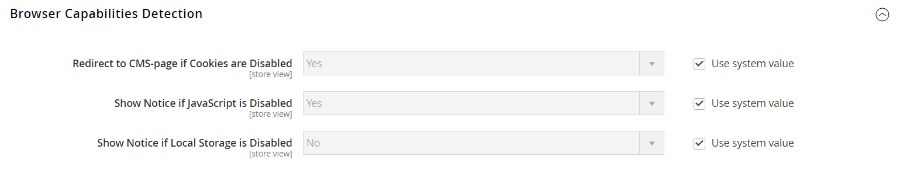

# Détection des fonctionnalités du navigateur

Comme la plupart des sites web et des applications sur Internet, Adobe Commerce et Magento Open Source exigent que le navigateur du visiteur autorise les cookies et JavaScript pour des opérations complètes. Cependant, il arrive parfois que le navigateur d’un utilisateur soit défini sur le paramètre de confidentialité le plus élevé qui empêche les cookies et JavaScript. Votre boutique peut être configurée pour tester les fonctionnalités du navigateur de chaque visiteur et afficher un avis si les paramètres doivent être modifiés.

- Si les paramètres de confidentialité du navigateur interdisent les cookies, vous pouvez configurer le système pour les rediriger automatiquement vers la page [Activer les cookies](../content-design/pages.md#enable-cookies), qui explique comment définir les paramètres recommandés avec la plupart des navigateurs.
- Si les paramètres de confidentialité du navigateur interdisent JavaScript, vous pouvez configurer le système pour afficher le message suivant au-dessus de l’en-tête de chaque page.

Pour obtenir des informations techniques, reportez-vous à la section [Navigateurs pris en charge](https://experienceleague.adobe.com/docs/commerce-operations/installation-guide/system-requirements.html?lang=fr#supported-browsers) du _Guide d’installation_.

## Configuration de la détection des fonctionnalités du navigateur

1. Dans la barre latérale _Admin_, accédez à **[!UICONTROL Stores]** > _[!UICONTROL Settings]_>**[!UICONTROL Configuration]**.

1. Dans le panneau de gauche sous _[!UICONTROL General]_, choisissez **[!UICONTROL Web]**.

1. Développez  la section **[!UICONTROL Browser Capabilities Detection]** et procédez comme suit :

   - Pour afficher des instructions expliquant comment configurer le navigateur afin d’autoriser les cookies, définissez **[!UICONTROL Redirect to CMS-page if Cookies are Disabled]** sur `Yes`.

   - Pour afficher une bannière au-dessus de l’en-tête lorsque JavaScript est désactivé dans le navigateur de l’utilisateur, définissez **[!UICONTROL Show Notice if JavaScript is Disabled]** sur `Yes`.

   - Pour afficher une bannière au-dessus de l’en-tête lorsque le stockage local est désactivé dans le navigateur de l’utilisateur, définissez **[!UICONTROL Show Notice if Local Storage is Disabled]** sur `Yes`.

   {width="600" zoomable="yes"}

1. Cliquez ensuite sur **[!UICONTROL Save Config]**.
