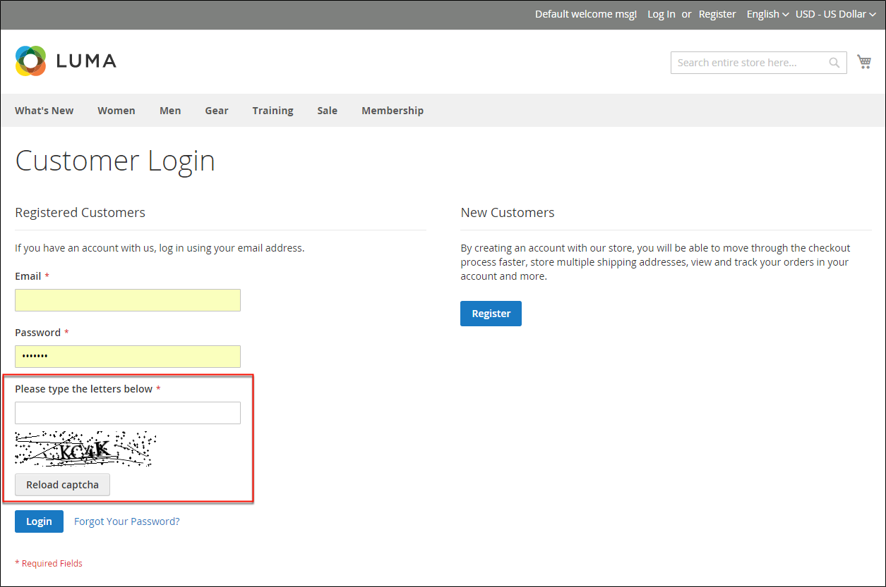
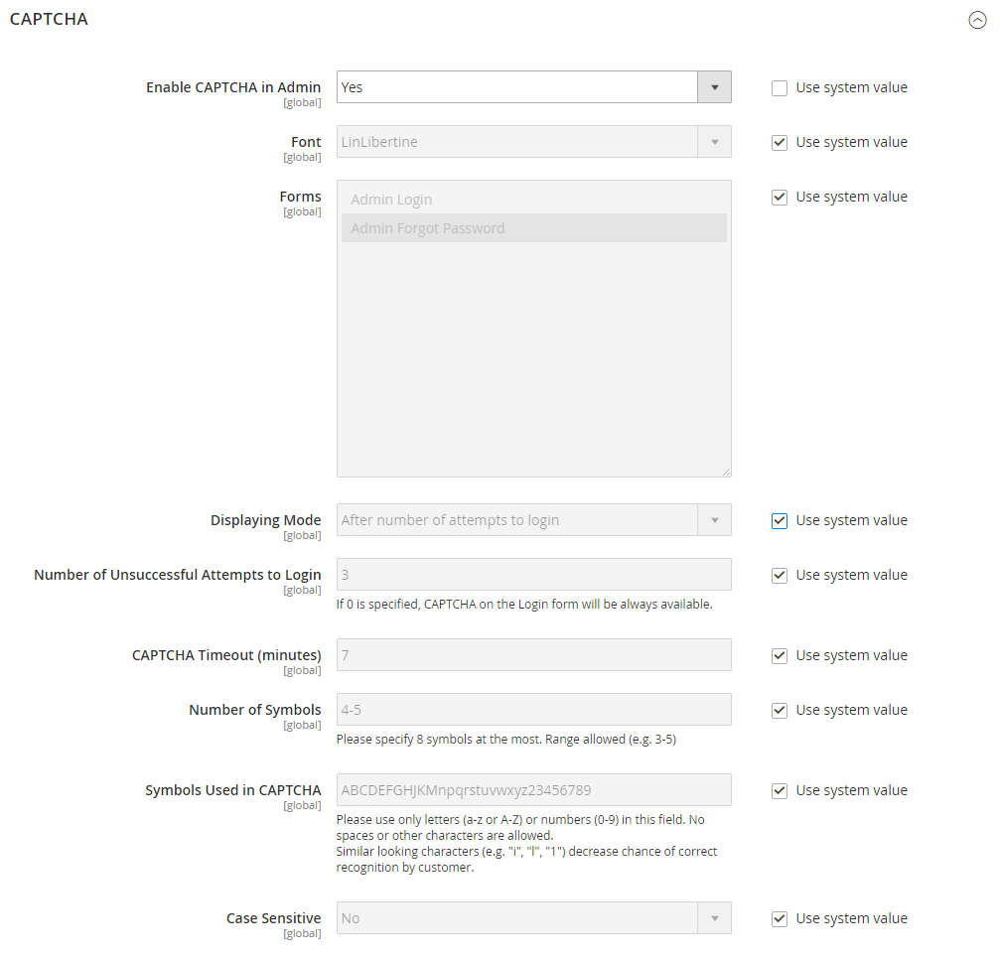

# CAPTCHA

Un CAPTCHA est un appareil visuel qui garantit qu&#39;un être humain, plutôt qu&#39;un ordinateur (ou &quot;robot&quot;), interagit avec le site. CAPTCHA est l&#39;acronyme de _Completely Automated Public Turing test to say Computers and Humans apart_. Il peut être utilisé pour l’accès administrateur et pour diverses actions storefront initiées par les clients enregistrés. Adobe Commerce et Magento Open Source prennent en charge le CAPTCHA standard décrit dans cette rubrique et [Google reCAPTCHA](security-google-recaptcha.md).

Vous pouvez recharger le CAPTCHA autant de fois que nécessaire en cliquant sur l’icône Recharger dans le coin supérieur droit de l’image. Le CAPTCHA est entièrement configurable et peut être défini pour s’afficher à chaque fois ou uniquement après un nombre défini de tentatives de connexion ayant échoué.

{width="700" zoomable="yes"}

## Configuration de CAPTCHA pour l’administrateur

Pour un niveau de sécurité supplémentaire, vous pouvez ajouter un CAPTCHA à la page Admin Se connecter et Mot de passe oublié . Les utilisateurs administrateurs peuvent recharger le CAPTCHA affiché en cliquant sur l’icône _Recharger_  dans le coin supérieur droit de l’image. Le nombre de rechargements est illimité.

{width="300"}

1. Sur la barre latérale _Admin_, accédez à **[!UICONTROL Stores]** > _[!UICONTROL Settings]_>**[!UICONTROL Configuration]**.

1. Dans le panneau de gauche, développez **[!UICONTROL Advanced]** et choisissez **[!UICONTROL Admin]**.

1. Dans le coin supérieur droit, définissez **[!UICONTROL Store View]** sur `Default`.

   Si la [portée](../getting-started/websites-stores-views.md#scope-settings) de votre installation Commerce comprend plusieurs sites web, choisissez les sites web auxquels vous souhaitez appliquer la configuration CAPTCHA.

1. Développez la section  sur **[!UICONTROL CAPTCHA]** .

1. Définissez **[!UICONTROL Enable CAPTCHA in Admin]** sur `Yes`. Renseignez ensuite les autres options comme suit :

   {width="600" zoomable="yes"}

   - Saisissez le nom du **[!UICONTROL Font]** à utiliser pour les symboles CAPTCHA (par défaut : `LinLibertine`).

     Pour ajouter votre propre police, le fichier de police doit se trouver dans le même répertoire que votre installation Commerce et doit être déclaré dans le fichier `config.xml` du module Captcha à l’emplacement `app/code/Magento/Captcha/etc`.

   - Sélectionnez l’un des **[!UICONTROL Forms]** suivants où le CAPTCHA doit être utilisé. Pour sélectionner plusieurs formulaires, maintenez la touche Ctrl (PC) ou Commande (Mac) enfoncée.

      - `Admin Login`
      - `Admin Forgot Password`

   - Définissez **[!UICONTROL Displaying Modes]** sur l’une des options suivantes :

      - `Always` — CAPTCHA est toujours nécessaire pour se connecter à l’administrateur.
      - `After number of attempts to login` — Cette option s’applique uniquement au formulaire de connexion administrateur. Lorsqu’il est sélectionné, le champ _[!UICONTROL Number of Unsuccessful Attempts to Login]_&#x200B;s’affiche. Saisissez le nombre de tentatives de connexion que vous souhaitez autoriser. Une valeur de 0 (zéro) est similaire à la définition du mode d’affichage sur `Always`.

     Pour suivre le nombre de tentatives de connexion infructueuses, chaque tentative de connexion sous une adresse électronique et depuis une adresse IP est comptabilisée. Le nombre maximal de tentatives de connexion autorisées à partir d’une même adresse IP est de 1 000. Cette limitation s’applique uniquement lorsque CAPTCHA est activé.

   - Pour **[!UICONTROL Number of Unsuccessful Attempts to Login]**, saisissez le nombre de fois où l’administrateur peut essayer de se connecter avant l’affichage de CAPTCHA. Si elle est définie sur zéro (`0`), CAPTCHA est toujours requis.

   - Pour **[!UICONTROL CAPTCHA Timeout (minutes)]**, saisissez le nombre de minutes avant l’expiration du CAPTCHA. Lorsque le CAPTCHA expire, l’administrateur doit recharger la page.

   - Saisissez le **[!UICONTROL Number of Symbols]** à afficher dans le CAPTCHA. Jusqu’à huit symboles (`8`) peuvent être utilisés. Pour un nombre variable de symboles qui change avec chaque CAPTCHA, saisissez une plage (par exemple `5-8`).

   - Pour **[!UICONTROL Symbols Used in CAPTCHA]**, saisissez les lettres (a-z et A-Z) et les chiffres (0-9) que vous souhaitez afficher de manière aléatoire dans le CAPTCHA. Les symboles difficiles à distinguer des autres symboles, tels que `i`, `l` ou `1`, ne sont pas inclus dans l’ensemble par défaut des symboles CAPTCHA.

   - Définissez **[!UICONTROL Case Sensitive]** sur `Yes` si vous souhaitez que les administrateurs saisissent les caractères en majuscules ou en minuscules exactement comme indiqué dans le CAPTCHA.

1. Une fois l’opération terminée, cliquez sur **[!UICONTROL Save Config]**.

## Configuration de CAPTCHA pour le storefront

Les clients peuvent être tenus d’entrer un CAPTCHA chaque fois qu’ils se connectent à leurs comptes ou après plusieurs tentatives infructueuses de connexion. De plus, de nombreux formulaires utilisés sur le storefront peuvent être configurés pour exiger une vérification par CAPTCHA.

{width="700" zoomable="yes"}

1. Sur la barre latérale _Admin_, accédez à **[!UICONTROL Stores]** > _[!UICONTROL Settings]_>**[!UICONTROL Configuration]**.

1. Dans le panneau de gauche, développez **[!UICONTROL Customers]** et choisissez **[!UICONTROL Customer Configuration]**.

1. Développez la section  sur **[!UICONTROL CAPTCHA]** .

{width="600" zoomable="yes"}

1. Définissez **[!UICONTROL Enable CAPTCHA on Storefront]** sur `Yes`. Renseignez ensuite les autres options comme suit :

   - Saisissez le nom du **[!UICONTROL Font]** à utiliser pour les symboles CAPTCHA (par défaut : `LinLibertine`).

     Pour ajouter votre propre police, le fichier de polices doit se trouver dans le même répertoire que votre installation Commerce et doit être déclaré dans le fichier `config.xml` du module CAPTCHA.

   - Sélectionnez l’un des **[!UICONTROL Forms]** suivants où le CAPTCHA doit être utilisé. Pour sélectionner plusieurs formulaires, maintenez la touche Ctrl (PC) ou Commande (Mac) enfoncée.

      - `Applying coupon code`
      - `Checkout/Placing Order`
      - `Create user`
      - `Login`
      - `Forgot password`
      - `Contact Us`
      - `Change password`
      - `Share Wishlist Form`
      - `Payflow Pro` (voir l&#39;article [correctif de sécurité](https://experienceleague.adobe.com/docs/commerce-knowledge-base/kb/troubleshooting/payments/paypal-payflow-pro-active-carding-activity.html?lang=fr) _Base de connaissances_ )
      - `Send to Friend Form`  (Magento Open Source uniquement)
      - `Add Gift Card Code`  (Adobe Commerce uniquement)
      - `Create company`  (Disponible avec Adobe Commerce B2B uniquement)

   - Définissez **[!UICONTROL Displaying Mode]** sur l’une des options suivantes :

      - `Always` — CAPTCHA est toujours nécessaire pour accéder aux formulaires sélectionnés.
      - `After number of attempts to login` — Saisissez le nombre de tentatives de connexion avant que CAPTCHA n’apparaisse. Une valeur de 0 (zéro) est similaire à &quot;Toujours&quot;. Lorsque cette option est sélectionnée, le nombre de tentatives de connexion infructueuses s’affiche. Cette option ne s’applique pas au formulaire Mot de passe oublié qui, s’il est activé, affiche toujours le CAPTCHA.

   - Pour **[!UICONTROL Number of Unsuccessful Attempts to Login]**, saisissez le nombre de fois où un client peut se connecter sans succès avant que CAPTCHA n’apparaisse. Si elle est définie sur zéro (`0`), CAPTCHA est toujours utilisé.

   - Pour **[!UICONTROL CAPTCHA Timeout (minutes)]**, saisissez le nombre de minutes avant l’expiration du CAPTCHA. Lorsque le CAPTCHA expire, le client doit recharger la page pour générer un nouveau CAPTCHA.

   - Saisissez le **[!UICONTROL Number of Symbols]** à afficher dans le CAPTCHA. Jusqu’à huit symboles (`8`) peuvent être utilisés. Pour un nombre variable de symboles qui change avec chaque CAPTCHA, saisissez une plage (par exemple `5-8`).

   - Pour **[!UICONTROL Symbols Used in CAPTCHA]**, saisissez les lettres (a-z et A-Z) et les chiffres (0-9) que vous souhaitez afficher de manière aléatoire dans le CAPTCHA. L’ensemble de caractères par défaut ne contient pas de symboles similaires tels que `I` ou `1`. Pour de meilleurs résultats, utilisez des symboles que les utilisateurs peuvent facilement identifier.

   - Définissez **[!UICONTROL Case Sensitive]** sur `Yes` si vous souhaitez que les clients saisissent les caractères en majuscules ou en minuscules exactement comme indiqué dans le CAPTCHA.

1. Une fois l’opération terminée, cliquez sur **[!UICONTROL Save Config]**.
