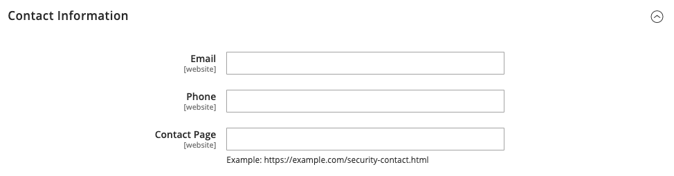

# Signalement des problèmes de sécurité

Le fichier `security.txt` contient des coordonnées et des liens liés à la sécurité que les chercheurs en sécurité peuvent utiliser pour signaler des problèmes de sécurité concernant votre site. Si vos informations de sécurité changent au fil du temps, assurez-vous que les informations du fichier `security.txt` sont à jour.

**_Pour configurer security.txt:_**

1. Dans la barre latérale _Admin_, accédez à **[!UICONTROL Stores]** > _[!UICONTROL Settings]_>**[!UICONTROL Configuration]**.

1. Dans le panneau de gauche sous _[!UICONTROL Security]_, cliquez sur **[!UICONTROL Security.txt]**.

1. Dans la section _[!UICONTROL General]_, définissez **[!UICONTROL Enable]**&#x200B;sur `Yes`.

   {width="600" zoomable="yes"}

1. Sous _[!UICONTROL Contact Information]_, saisissez ce qui suit :

   - Adresse e-mail et numéro de téléphone de la personne qui gère les problèmes de sécurité pour votre boutique.

   - URL de la **[!UICONTROL Contact Page]** de votre boutique. Il peut s’agir d’une liste de contacts de sécurité de magasin ou de votre page _Nous contacter_.

   {width="600" zoomable="yes"}

1. Sous _[!UICONTROL Other Information]_, saisissez ce qui suit :

   - URL de votre clé **[!UICONTROL Encryption]** publique. Par exemple : `https://example.com/pgp-key.txt`

   - URL d’une page **[!UICONTROL Acknowledgments]** dans laquelle les chercheurs en sécurité sont reconnus pour leurs efforts au nom de votre boutique.

   - Votre **[!UICONTROL Preferred Languages]** pour les communications liées à la sécurité. Saisissez le code de langue standard à deux caractères [code de langue](https://en.wikipedia.org/wiki/List_of_ISO_639-1_codes) pour chaque langue prise en charge, en les séparant par une virgule. Par exemple, pour spécifier l’anglais, l’espagnol et le français, saisissez `en, es, fr`. Toutes les langues spécifiées ont la même priorité, quel que soit leur ordre d’apparition.

   - URL d’une page **[!UICONTROL Hiring]** qui répertorie les opportunités d’emploi liées à la sécurité dans votre boutique.

   - URL de votre page de **[!UICONTROL Policy]** de sécurité.

   - URL d’un fichier **[!UICONTROL Signature]** numérique enregistré sur votre serveur. Par exemple : `https://mystore.com/.well-known/security.txt.sig`

   La signature numérique doit être configurée à partir de l’interface de ligne de commande (CLI) du serveur. Pour en savoir plus, voir [Security.txt](https://github.com/magento/security-package/blob/1.0-develop/Securitytxt/README.md) sur GitHub.

   {width="600" zoomable="yes"}

1. Cliquez ensuite sur **[!UICONTROL Save Config]**.
