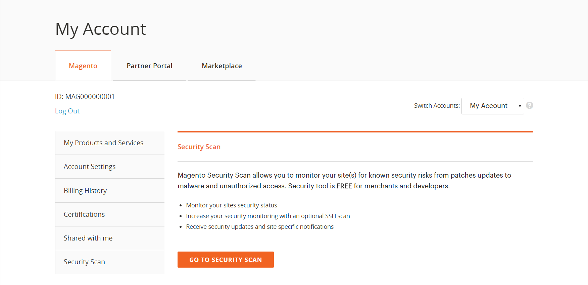
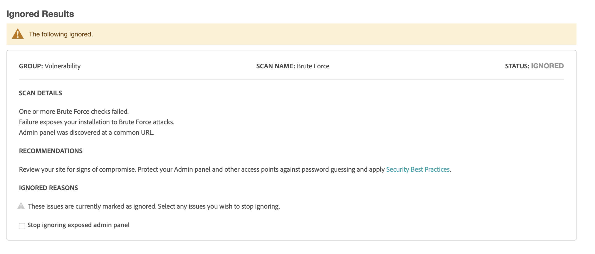

# Analyse de sécurité

Surveillez vos sites Adobe Commerce et Magento Open Source pour détecter les risques de sécurité et les programmes malveillants, et recevez des mises à jour de sécurité et des notifications.

- Obtenez insight pour obtenir le statut de sécurité en temps réel de votre boutique.
- Recevez des suggestions basées sur les bonnes pratiques pour vous aider à résoudre les problèmes.
- Planifiez une analyse de sécurité à exécuter chaque semaine, chaque jour ou à la demande.
- Exécutez plus de 21 000 tests de sécurité pour identifier les logiciels malveillants potentiels.
- Accédez aux rapports de sécurité historiques qui suivent et surveillent la progression de vos sites.
- Accédez au rapport d’analyse qui indique les vérifications réussies et ayant échoué, avec les actions recommandées.

L&#39;outil d&#39;analyse de sécurité est disponible gratuitement depuis le tableau de bord de votre compte [Commerce/Magento](../getting-started/commerce-account-create.md). Pour obtenir des informations techniques, consultez [Configuration de l’outil d’analyse de sécurité](https://experienceleague.adobe.com/fr/docs/commerce-on-cloud/user-guide/launch/overview#set-up-the-security-scan-tool) dans le _Guide de Commerce sur les infrastructures cloud_.

{width="600" zoomable="yes"}

## Exécuter une analyse de sécurité

1. Sur la page d’accueil de Commerce, connectez-vous à votre compte [Commerce/Magento](../getting-started/commerce-account-create.md).

1. Examinez et acceptez les conditions d’utilisation de l’outil Analyse de sécurité.

   1. Dans le panneau de gauche, choisissez **[!UICONTROL Security Scan]**.
   1. Cliquez sur **[!UICONTROL Go to Security Scan]**.
   1. Lisez le **[!UICONTROL Terms and Conditions]**.
   1. Cliquez sur **[!UICONTROL Agree]** pour continuer.

1. Sur la page _[!UICONTROL Monitored Websites]_, cliquez sur **[!UICONTROL +Add Site]**.

   Si vous disposez de plusieurs sites avec des domaines différents, configurez une analyse distincte pour chaque domaine.

   {width="600" zoomable="yes"}

1. Pour vérifier que vous êtes propriétaire du domaine du site en ajoutant un code de confirmation, effectuez l’une des opérations suivantes :

   **Commerce storefront**:

   1. Saisissez les **[!UICONTROL Site URL]** et les **[!UICONTROL Site Name]**.
   1. Cliquez sur **[!UICONTROL Generate Confirmation Code]**.
   1. Cliquez sur **Copier** pour copier votre code de confirmation dans le presse-papiers.

      {width="400" zoomable="yes"}

   1. Connectez-vous à l’administrateur de votre boutique en tant qu’utilisateur disposant de droits d’administrateur complets et procédez comme suit :

      1. Dans la barre latérale _Admin_, accédez à **[!UICONTROL Content]** > _[!UICONTROL Design]_>**[!UICONTROL Configuration]**.
      1. Recherchez votre site dans la liste, puis cliquez sur **[!UICONTROL Edit]**.
      1. Développez  la section **[!UICONTROL HTML Head]** .
      1. Faites défiler jusqu’à **[!UICONTROL Scripts and Style Sheets]** et cliquez dans la zone de texte à la fin de tout code existant. Collez le code de confirmation dans la zone de texte.

         {width="600" zoomable="yes"}

      1. Cliquez ensuite sur **[!UICONTROL Save Configuration]**.

   **PWA storefront**:

   1. Saisissez les **[!UICONTROL Site URL]** et les **[!UICONTROL Site Name]**.

   1. Par **[!UICONTROL Confirmation Code]**, choisissez l’option `META Tag` , puis cliquez sur **[!UICONTROL Generate Code]**.

   1. Cliquez sur **[!UICONTROL Copy]** pour copier la balise META du code de confirmation générée dans le presse-papiers.

      {width="400" zoomable="yes"}

   1. Accédez au répertoire du projet de storefront PWA Studio et procédez comme suit :

      1. Dans le répertoire du projet PWA Studio, accédez à `packages > venia-concept > template.html`.
      1. Ajoutez le code de confirmation copié (la balise META générée) à l’en-tête HTML et enregistrez les modifications.

         {width="600" zoomable="yes"}

      1. Revenez à l’interface de ligne de commande PWA Studio et utilisez yarn pour installer les dépendances de projet et exécuter la commande de création de projet.

         ```sh
         yarn install &&
         yarn build
         ```

      1. *Dans votre projet cloud* créez un dossier `pwa` et copiez le contenu dans le dossier `dist` de votre projet de storefront.

         ```sh
         mkdir pwa && cp -r <path to your storefront project>/dist/* pwa
         ```

      1. Utilisez l’outil d’interface de ligne de commande Git pour évaluer, valider et pousser ces modifications vers votre projet cloud.

         ```sh
         git add . &&
         git commit -m "Added storefront file bundles" &&
         git push origin
         ```

         Une fois le processus de création terminé, les modifications seront déployées sur votre vitrine PWA.

1. Revenez à la page _[!UICONTROL Security Scan]_&#x200B;de votre compte Commerce, puis cliquez sur **[!UICONTROL Verify Confirmation Code]**&#x200B;pour établir la propriété du domaine.

1. Après une confirmation réussie, configurez les options de **[!UICONTROL Set Automatic Security Scan]** pour l’un des types suivants :

   **Scan Weekly (recommandé)** :

   Choisissez les **[!UICONTROL Week Day]**, **[!UICONTROL Time]** et **[!UICONTROL Time Zone]** que l&#39;analyse doit avoir lieu chaque semaine.

   Par défaut, l’analyse est planifiée pour commencer chaque semaine à minuit, le samedi UTC, et se poursuivre jusqu’au début du dimanche.

   {width="500" zoomable="yes"}

   **Scan Daily** :

   Choisissez le **[!UICONTROL Time]** et **[!UICONTROL Time Zone]** que l&#39;analyse doit avoir lieu tous les jours.

   Par défaut, l’analyse est planifiée pour commencer chaque jour à minuit (UTC).

   {width="500" zoomable="yes"}

1. Saisissez l&#39;**[!UICONTROL Email Address]** où vous souhaitez recevoir des notifications d&#39;analyses terminées et de mises à jour de sécurité.

   {width="400" zoomable="yes"}

1. Cliquez ensuite sur **[!UICONTROL Submit]**.

   Une fois la propriété du domaine vérifiée, le site apparaît dans la liste Sites web surveillés de votre compte Commerce.

1. Si vous disposez de plusieurs sites web avec des domaines différents, répétez cette procédure pour configurer une analyse de sécurité pour chacun.

## Gestion des échecs d’analyse

L&#39;outil d&#39;analyse de sécurité vous permet de gérer les échecs d&#39;analyse directement depuis la vue du rapport. Vous pouvez marquer des échecs d&#39;analyse spécifiques comme étant des faux positifs et les exclure de votre score de risque.

### Avantages de la gestion des échecs d’analyse

La gestion des échecs d’analyse vous permet de conserver une vue d’ensemble plus précise de la sécurité de votre boutique en :

- Réduction des faux positifs dans vos rapports de sécurité.
- Se concentrer sur les questions de sécurité pertinentes qui nécessitent une attention particulière.
- maintenir une vue plus claire du véritable statut de sécurité de votre boutique ;
- Suppression de la nécessité de contacter l’assistance pour les faux positifs connus.
- Gagnez du temps en gérant automatiquement les échecs d’analyse que vous avez déjà étudiés.

Les scénarios courants dans lesquels vous pouvez marquer un échec d’analyse comme faux positif incluent :

- Lorsque vous avez déjà appliqué un correctif de sécurité que l&#39;outil de numérisation n&#39;a pas détecté.
- Lorsqu’un problème détecté ne s’applique pas à votre configuration de magasin spécifique.
- Lorsque vous avez mis en place une mesure de sécurité alternative qui répond à cette préoccupation.
- Lorsque l’échec de l’analyse repose sur une configuration que vous avez intentionnellement définie en fonction des besoins de votre entreprise.

### Ignorer les échecs d’analyse

Pour gérer les échecs d’analyse que vous avez identifiés comme des faux positifs, procédez comme suit :

1. Dans la page _[!UICONTROL Monitored Websites]_, cliquez sur **[!UICONTROL View Report]**&#x200B;pour le site à gérer.

1. Dans la vue Rapport, recherchez l&#39;analyse qui a échoué et que vous voulez marquer comme faux positif.

1. Cliquez sur **[!UICONTROL Ignore]** pour identifier l’échec d’analyse spécifique.

   {width="600" zoomable="yes"}

1. Cliquez sur **[!UICONTROL Apply Changes]** pour enregistrer votre sélection.

L’échec d’analyse ignoré passe à la section _[!UICONTROL Ignored Results]_&#x200B;et est exclu de votre score de risque.

### Arrêter d&#39;ignorer les échecs d&#39;analyse

Si vous devez restaurer un échec d&#39;analyse précédemment ignoré dans votre surveillance active, procédez comme suit :

1. Dans la vue Rapport, faites défiler l’écran jusqu’à la section _[!UICONTROL Ignored Results]_.

1. Cliquez sur **[!UICONTROL Stop Ignoring]** pour l’échec d’analyse que vous souhaitez restaurer.

   {width="600" zoomable="yes"}

1. Cliquez sur **[!UICONTROL Apply Changes]** pour enregistrer votre sélection.

L’échec de l’analyse revient à la section _[!UICONTROL Failed Scans]_&#x200B;et est inclus dans votre score de risque.

### Afficher les échecs d&#39;analyse ignorés

Les résultats ignorés apparaissent dans une section distincte du rapport et la note de risque est automatiquement mise à jour pour refléter uniquement les échecs d&#39;analyse actifs. Vous pouvez gérer plusieurs échecs d’analyse à la fois en sélectionnant plusieurs éléments avant d’appliquer des modifications.

{width="600" zoomable="yes"}
