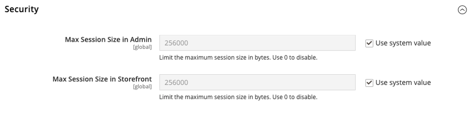
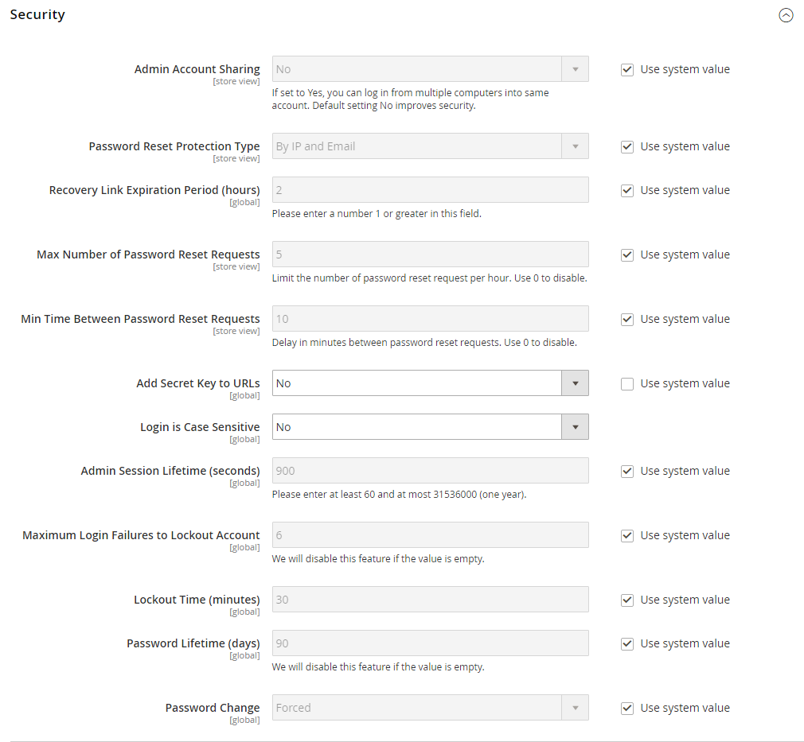

# Gestion des sessions

[La gestion de session](https://cheatsheetseries.owasp.org/cheatsheets/Session_Management_Cheat_Sheet.html) est une bonne pratique anti-déni de service (DoS) pour la sécurité des API. Une session représente le temps qu’un visiteur passe sur votre site et n’est pas lié à la durée pendant laquelle les utilisateurs administrateurs ou les clients sont connectés à leurs comptes.

Une session est une séquence de transactions de requête et de réponse HTTP réseau associées au même utilisateur. Il s’agit d’un moyen d’associer un client (administrateur) à ses données lorsqu’il accède au serveur. Les sessions sont utilisées pour établir des variables, telles que les droits d’accès et les paramètres de localisation, qui s’appliquent à chaque interaction d’un utilisateur avec une application web au cours de la session.

## Taille de session

Utilisez les paramètres de configuration suivants pour limiter la taille maximale de session pour les utilisateurs administrateurs et les visiteurs du storefront :

- **[!UICONTROL Max Session Size in Admin]** : limite la taille maximale des sessions en octets. Utilisez `0` pour désactiver .
- **[!UICONTROL Max Session Size in Storefront]** : limite la taille maximale des sessions en octets. Utilisez `0` pour désactiver .

>[!TIP]
>
>Les deux paramètres sont mesurés en octets et par défaut à `256000` octets (ou 256 Ko).

**_Pour configurer la taille maximale de session :_**

1. Sur la barre latérale _Admin_, accédez à **[!UICONTROL Stores]** > _[!UICONTROL Settings]_>**[!UICONTROL Configuration]**.

1. Dans le panneau de gauche, développez **[!UICONTROL Advanced]** et choisissez **[!UICONTROL System]**.

1. Développez  de la section **[!UICONTROL Security]** pour accéder aux paramètres de session.

   {width="600" zoomable="yes"}

1. Saisissez de nouvelles tailles de session en octets.

   >[!WARNING]
   >
   >La définition d’une valeur trop basse peut entraîner des problèmes. Si vous définissez l’une des options sous la valeur par défaut de 256000 octets, un message d’avertissement s’affiche. Si vous cliquez sur **[!UICONTROL No]**, le système remplace la valeur par `256000`.

1. Cliquez sur **[!UICONTROL Save Config]**.

### Sessions d’administration

Si vous dépassez la taille de session maximale, un message d’erreur s’affiche et le système consigne la contrainte de taille de session dans le répertoire `var/log`.

Si vous n’avez plus accès à l’administrateur après avoir défini la taille de session trop basse, utilisez l’interface en ligne de commande pour réinitialiser la configuration :

```bash
bin/magento config:set system/security/max_session_size_admin 256000
```

### Sessions Storefront

Si vous dépassez la taille de session maximale, aucune erreur ne s’affiche, mais le système consigne la contrainte de taille de session dans le répertoire `var/log`.

## Validation de session

Adobe Commerce et Magento Open Source vous permettent de valider les variables de session en tant que mesure de protection contre les attaques de fixation de session possibles ou les tentatives d’empoisonnement ou de détournement de sessions utilisateur. Les paramètres de validation de session déterminent la manière dont les variables de session sont validées à chaque visite du magasin et si l’ID de session est inclus dans l’URL du magasin.

Pour obtenir des informations techniques, reportez-vous à la section [Utilisation de Redis pour le stockage de session](https://experienceleague.adobe.com/docs/commerce-operations/configuration-guide/cache/redis/redis-session.html) du _Guide de configuration_.

{width="600" zoomable="yes"}

La validation vérifie que les visiteurs sont ceux qu’ils disent être en comparant la valeur des variables de validation aux données de session stockées dans les données `$_SESSION` de l’utilisateur. La validation échoue si les informations ne sont pas transmises comme prévu et que la variable correspondante est vide. Selon les paramètres de validation de session, si une variable de session échoue au processus de validation, la session client se termine immédiatement.

L’activation de toutes les variables de validation peut aider à prévenir les attaques, mais peut également avoir une incidence sur les performances du serveur. Par défaut, la validation de toutes les variables de session est désactivée. Nous vous recommandons de tester les paramètres afin de trouver la meilleure combinaison pour votre installation Adobe Commerce ou Magento Open Source. L’activation de toutes les variables de validation peut s’avérer indûment restrictive, et peut empêcher l’accès aux clients qui ont des connexions Internet qui transitent par un serveur proxy ou qui proviennent de derrière un pare-feu. Pour en savoir plus sur les variables de session et leur utilisation, consultez la documentation d’administration du système pour votre système Linux®.

**_Pour configurer la validation de session :_**

1. Sur la barre latérale _Admin_, accédez à **[!UICONTROL Stores]** > _[!UICONTROL Settings]_>**[!UICONTROL Configuration]**.

1. Dans le panneau de gauche, développez _[!UICONTROL General]_et choisissez **[!UICONTROL Web]**.

1. Développez la section  sur **[!UICONTROL Session Validation Settings]** .

1. Définissez chacune des options de configuration :

   - **[!UICONTROL Validate REMOTE_ADDR]** — Défini sur `Yes` pour vérifier que l’adresse IP d’une requête correspond à ce qui est stocké dans la variable `$_SESSION`.

   - **[!UICONTROL Validate HTTP_VIA]** — Défini sur `Yes` pour vérifier que l’adresse proxy d’une requête entrante correspond à ce qui est stocké dans la variable `$_SESSION`.

   - **[!UICONTROL Validate HTTP_X_FORWARDED_FOR]** — Défini sur `Yes` pour vérifier que l’adresse de transfert d’une requête correspond à ce qui est stocké dans la variable `$_SESSION`.

   - **[!UICONTROL Validate HTTP_USER_AGENT]** — Défini sur `Yes` pour vérifier que le navigateur ou l’appareil utilisé pour accéder au magasin au cours d’une session correspond à ce qui est stocké dans la variable `$_SESSION`.

1. Une fois l’opération terminée, cliquez sur **[!UICONTROL Save Config]**.

## Durée de vie de la session d’administration

Pour des raisons de sécurité, le _Admin_ est initialement défini pour expirer après 900 secondes (15 minutes) d’inactivité du clavier. Vous pouvez ajuster la durée de vie de la session en fonction de votre style de travail.

**_Pour ajuster la durée de vie de la session d’administration :_**

1. Sur la barre latérale _Admin_, accédez à **[!UICONTROL Stores]** > _[!UICONTROL Settings]_>**[!UICONTROL Configuration]**.

1. Faites défiler vers le bas et développez **[!UICONTROL Advanced]** dans le panneau de gauche.

1. Cliquez sur **[!UICONTROL Admin]**.

1. Développez la section  sur _[!UICONTROL Security]_.

1. Pour **[!UICONTROL Admin Session Lifetime (seconds)]**, saisissez le nombre de secondes pendant lesquelles une session reste active avant son expiration.

   {width="600" zoomable="yes"}

1. Une fois l’opération terminée, cliquez sur **[!UICONTROL Save Config]**.## Durée de vie de la session d’administrateur

Pour des raisons de sécurité, le _Admin_ est initialement défini pour expirer après 900 secondes (15 minutes) d’inactivité du clavier. Vous pouvez ajuster la durée de vie de la session en fonction de votre style de travail.

**_Pour ajuster la durée de vie de la session d’administration :_**

1. Sur la barre latérale _Admin_, accédez à **[!UICONTROL Stores]** > _[!UICONTROL Settings]_>**[!UICONTROL Configuration]**.

1. Faites défiler vers le bas et développez **[!UICONTROL Advanced]** dans le panneau de gauche.

1. Cliquez sur **[!UICONTROL Admin]**.

1. Développez la section  _Sécurité_ .

1. Pour **[!UICONTROL Admin Session Lifetime (seconds)]**, saisissez le nombre de secondes pendant lesquelles une session reste active avant son expiration.

   {width="600" zoomable="yes"}

1. Une fois l’opération terminée, cliquez sur **[!UICONTROL Save Config]**.
