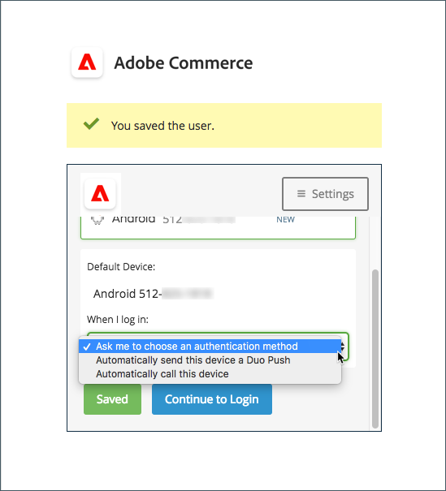

# Configuration de l’authentification à deux facteurs pour les comptes d’utilisateurs

Ces instructions expliquent comment configurer une authentification à deux facteurs lors de votre connexion initiale à Adobe Commerce ou Magento Open Source et comment authentifier votre identité à l’aide des applications et des appareils suivants.

Pour obtenir des instructions complètes, voir [Admin Se connecter](../getting-started/admin-signin.md).

>[!NOTE]
>
>Magasins qui ont activé [!DNL Adobe Identity Management Services] (IMS) l’authentification avec Adobe Commerce natif et Magento Open Source 2FA est désactivée. Les utilisateurs administrateurs connectés à leur instance Commerce avec leurs informations d’identification d’Adobe n’ont pas besoin de se réauthentifier pour de nombreuses tâches d’administration. L’authentification est gérée par Adobe IMS lorsque l’utilisateur administrateur se connecte à sa session en cours. Voir [[!DNL Adobe Identity Management Service] (IMS) Présentation de l’intégration](../getting-started/adobe-ims-integration-overview.md).

## [!DNL Google Authenticator]

### Étape 1 : configuration [!DNL Google Authenticator]

1. Entrez les informations d’identification de votre compte et connectez-vous au _Administration_. Un nouvel écran d’authentification s’affiche avec un code QR.

1. Ouvrez le **[!UICONTROL Google Authenticator]** sur votre appareil mobile.

1. Cliquez sur le signe plus ( **+** ) pour ajouter une entrée et aligner la zone rouge avec le code QR à analyser avec l’appareil photo de votre smartphone.

1. Lorsque votre téléphone reconnaît le code QR et ajoute une entrée, saisissez ce code à 6 chiffres dans la variable _Administration_ **[!UICONTROL Authenticator code]** champ .

1. Lorsque vous avez terminé, cliquez sur **[!UICONTROL Confirm]**.

   {width="300"}

### Étape 2 : connexion avec [!DNL Google Authenticator]

1. Entrez les informations d’identification de votre compte et connectez-vous à Commerce. _Administration_.

   {width="300"}

1. Ouvrir [!DNL Google Authenticator] sur votre périphérique mobile.

1. Lorsque vous y êtes invité, saisissez le code d’authentification à six chiffres.

1. Pour enregistrer l’authentification pour les connexions futures, sélectionnez le **[!UICONTROL Trust this device, do not ask again]** .

1. Lorsque vous avez terminé, cliquez sur **[!UICONTROL Confirm]**.

## [!DNL Duo Security]

[!DNL Duo] offre un essai gratuit et des frais en fonction du nombre d’utilisateurs associés au compte. Suivez leurs [instructions pour configurer votre compte et télécharger l’application](https://duo.com/product/multi-factor-authentication-mfa/duo-mobile-app).

### Étape 1 : configuration [!DNL Duo Security]

1. Entrez les informations d’identification de votre compte et connectez-vous au _Administration_.

1. Lorsque la variable [!DNL Duo] La page Configuration s’affiche, cliquez sur **[!UICONTROL Start setup]** et procédez comme suit :

   {width="300"}

1. Sélectionnez votre appareil.

1. Lorsque vous y êtes invité, saisissez votre numéro de téléphone, puis cliquez sur **[!UICONTROL Continue]**.

   Cet exemple demande votre numéro de téléphone, car nous utilisons un appareil mobile.

1. Lorsque vous y êtes invité à effectuer l’installation [!DNL Duo Mobile] pour votre type de téléphone, cliquez sur **[!UICONTROL I have Duo Mobile]**.

1. Ouvrir [!DNL Duo Mobile] et analyser le code QR pour synchroniser l’authentificateur avec Adobe Commerce. Une coche s’affiche lorsque l’activation est terminée.

1. Pour configurer vos paramètres pour l’appareil, choisissez l’action que vous souhaitez effectuer lorsque vous vous connectez.

   - `Ask me to choose an authenticator method` — Permet à l’utilisateur de sélectionner lors de la connexion et de l’authentification dans le _Administration_.
   - `Automatically send this device a Duo Push` — Envoie un message à votre appareil pour accepter ou refuser l’accès.
   - `Automatically call this device` — Appelle et fournit un code de passe à saisir pour l’accès.

   {width="300"}

### Étape 2 : connexion avec [!DNL Duo Security]

L’exemple suivant illustre les options pour `Ask me to choose an authenticator method`:

1. Lorsque vous y êtes invité, saisissez le _Administration_ informations de connexion.

   {width="300"}

1. Sélectionnez la méthode à utiliser pour l’authentification :

   - `Send Me a Push` — Cliquez pour recevoir une notification push à [!DNL Duo Mobile]. Acceptez de vous authentifier.
   - `Call Me` — Cliquez sur cette option, recevez un appel avec un code et saisissez le code de passe.
   - `Enter a Passcode` — Cliquez sur cette option pour recevoir et saisir un code de passe.

1. Terminez la notification push ou le code pour vous connecter entièrement à la fonction _Administration_.

## [!DNL Authy]

[!DNL Authy] offre leur application et leur service sans frais aux utilisateurs. Suivez leurs instructions pour télécharger et configurer l’application pour votre appareil ou navigateur. Pour en savoir plus, voir la section [[!DNL Authy] documentation](https://authy.com/features/setup/).

### Étape 1 : configuration de l’authentification

1. Entrez les informations d’identification de votre compte et connectez-vous au _Administration_.

   ![[!DNL Authy] enregistrement](./assets/storefront-2fa-authy-auth.png){width="300"}

1. Lorsque vous êtes invité à vous enregistrer auprès de l’instance d’auteur, procédez comme suit :

   - Sélectionnez votre pays.

   - Saisissez votre numéro de téléphone.

   - Sélectionnez la variable **[!UICONTROL Verification method]**: `SMS` ou `Call Me`

   Cliquez sur **[!UICONTROL Continue]**. Un message est envoyé à votre téléphone par SMS ou par un appel.

1. Saisissez le code de vérification que vous recevez, puis cliquez sur **[!UICONTROL Verify]**.

1. Lorsque vous avez terminé, cliquez sur **[!UICONTROL Confirm]**.

   ![[!DNL Authy] code de vérification](./assets/storefront-2fa-authy-verify.png){width="300"}

### Étape 2 : connexion avec [!DNL Authy]

1. Entrez les informations d’identification de votre compte et connectez-vous au _Administration_.

   ![[!DNL Authy] - signature](./assets/storefront-2fa-authy-access.png){width="300"}

1. Choisissez l’une des méthodes suivantes pour vous authentifier :

   - `Use one touch` — Envoie une alerte à votre [!DNL Authy] application. Dans l’application, acceptez l’accès.
   - `Use authy token` — Vous invite à saisir du code provenant de votre [!DNL Authy] application.

1. Si vous rencontrez des difficultés pour vous connecter, choisissez la méthode à utiliser pour recevoir le code. Saisissez ensuite le code que vous recevez pour accéder à la variable _Administration_.

   L’application inclut ces méthodes d’urgence supplémentaires.

   - `Send me a code via SMS` — Un SMS est envoyé au périphérique mobile configuré.
   - `Send me a code via phone call` — L’utilisateur reçoit un appel téléphonique avec un code.

   Votre compte est vérifié et ouvert.

## U2F ([!DNL Yubikey] et autres périphériques)

Suivez les instructions du fournisseur de solution pour configurer votre appareil U2F. Pour plus d’informations, reportez-vous à la documentation du fournisseur, telle que [[!DNL YubiKey]](https://support.yubico.com/hc/en-us/articles/360013790339-Getting-Started-with-Your-YubiKey) par [!UICONTROL Yubico].

1. Entrez les informations d’identification de votre compte et connectez-vous au _Administration_.

   {width="300"}

1. Appuyez sur le bouton de la touche.

   L’authentification se déclenche et ouvre immédiatement la variable _Administration_.

1. Insérez la méthode **[!UICONTROL U2F key]** dans un port USB de votre ordinateur.
